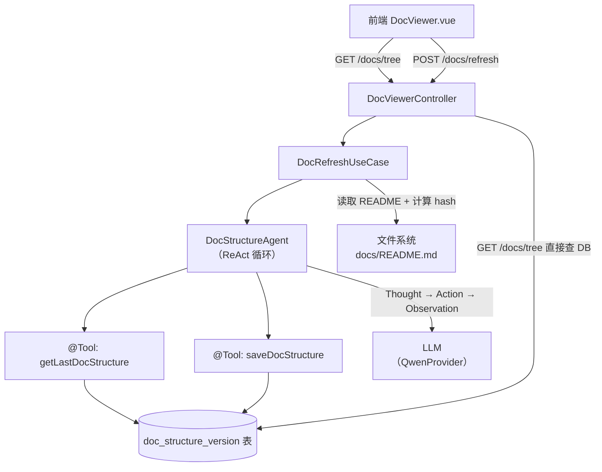
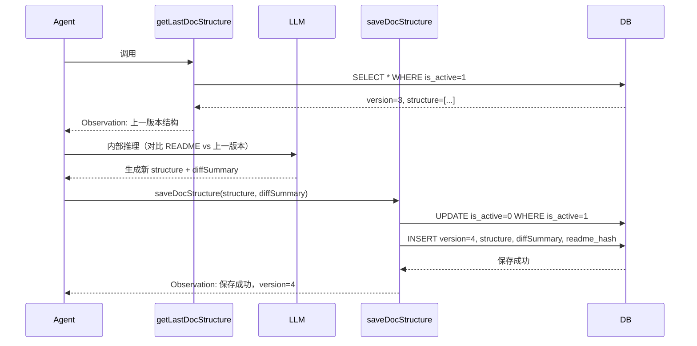
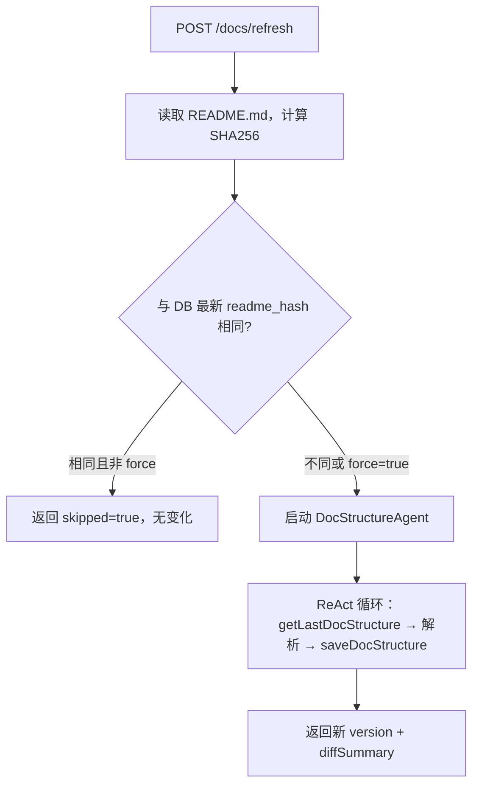

# 功能设计文档 v2.0

## 1. 基本信息

| 项目 | 内容 |
|---|---|
| 功能名称 | 文档浏览器（Doc Viewer）|
| 所属系统 | LLM Orchestration Platform |
| 所属模块 | llm-api / llm-application / llm-infrastructure / llm-frontend |
| 需求来源 | 内部需求 |
| 版本号 | v2.0.0 |
| 对比版本 | v1.0.0（基于文件系统扫描） |

---

## 2. 背景与目标

- **背景**：v1.0 通过文件系统遍历构建目录树，本质是技术目录（物理路径），缺乏语义。`docs/README.md` 是人工维护的文档索引，语义更准确，是构建目录结构的权威来源。
- **核心转变**：目录结构由 **LLM 解析 `docs/README.md`** 生成，而非文件系统扫描。解析结果持久化到数据库，支持版本管理和差异比对。
- **智能体化**：目录更新流程设计为 **Agent ReAct 链路**，LLM 自主调用工具（查询上一版本 → 解析 README → 比对差异 → 保存新版本），而不是硬编码的流程代码。
- **目标**：
  1. 目录结构语义准确，与 README 保持一致
  2. 每次更新有版本记录，可查看历史、可回溯
  3. LLM 解析时携带上一版本结果，保证节点 path 稳定性（避免同一文档每次解析出不同结构）
  4. 工具能力（查询/保存）可复用，符合 MCP/Skill 接入标准

---

## 3. 功能范围

### 3.1 本次包含

- LLM 解析 `docs/README.md` 生成目录结构
- 目录结构版本持久化（DB）
- 版本 diff（新旧结构差异比对，由 LLM 生成 diffSummary）
- Agent 工具：`getLastDocStructure`（查上一版本）、`saveDocStructure`（保存新版本）
- 前端通过 API 加载目录树（来自 DB，不扫描文件系统）
- 文档内容读取（文件系统，带路径安全校验）
- AI 语义检索（Qdrant，可选）
- 手动触发目录更新（`POST /api/v1/docs/refresh`）
- README hash 变更检测（避免无变化时重复解析）

### 3.2 本次不包含

- docs/README.md 文件监听自动触发更新
- 文档编辑/写入
- 权限隔离

### 3.3 后续扩展

- 文件变更监听自动触发 Agent 更新
- 将 `getLastDocStructure` / `saveDocStructure` 注册为 MCP Tool，供其他 Agent 复用
- 目录结构多版本 UI 对比（类 Git diff 视图）
- 服务启动时自动检测 README 变更并触发解析

---

## 4. 核心架构设计

### 4.1 整体架构



### 4.2 目录更新 Agent 链路

目录更新不是硬编码流程，而是由 LLM 驱动的 ReAct 链路：

**System Prompt：**
```
你是文档目录结构分析专家。你有两个工具：
1. getLastDocStructure() — 查询上一次解析的目录结构和版本号
2. saveDocStructure(structure, diffSummary) — 保存新目录结构

任务：根据提供的 README.md 内容，结合上一版本结果，生成最新目录结构并保存。

要求：
- 首先调用 getLastDocStructure 获取上一版本
- 相同 path 的节点保留上一版本的字段值，保持一致性
- 新增节点补充完整字段（path/name/type/category/description）
- 生成简洁的 diffSummary 描述本次变更（如：「新增 2 个文档，删除 1 个文档」）
- 结构确定后调用 saveDocStructure 保存
- 无论如何都必须调用 saveDocStructure，即使无变化（diffSummary 填「无变化」）
```

**User Prompt：**
```
以下是最新的 docs/README.md 内容：
{readme_content}
请分析目录结构并保存。
```

**ReAct 执行轨迹示例：**
```
Thought: 先查询上一次的目录结构，保持节点 path 一致性
Action: getLastDocStructure()
Observation: {"version": 3, "structure": [...], "updatedAt": "2026-03-29"}

Thought: 对比 README 内容，发现新增 doc-viewer-design-v2.md，其余无变化，准备保存
Action: saveDocStructure({"structure": [...], "diffSummary": "新增 doc-viewer-design-v2.md"})
Observation: 保存成功，version=4

Answer: 目录结构已更新至 v4，新增 1 个文档节点。
```

### 4.3 版本一致性设计

**问题**：LLM 每次解析 README 可能对同一文档生成不同的 name/description，导致版本 diff 噪音。

**解决方案**：
- 每个节点的唯一标识为 `path`（文件相对路径），不依赖 LLM 分配的任何 ID
- `getLastDocStructure` 返回完整的上一版本节点列表（含 path → 所有字段的映射）
- System Prompt 明确要求：「相同 path 的节点保留上一版本的 name/description，不要重新生成」
- 这样只有真正新增/删除的节点才会产生 diff，保证版本间的稳定性



---

## 5. 数据模型设计

### 5.1 doc_structure_version 表

```sql
CREATE TABLE doc_structure_version (
    id           BIGINT AUTO_INCREMENT PRIMARY KEY,
    version      INT NOT NULL COMMENT '版本号，从 1 递增',
    structure    JSON NOT NULL COMMENT '目录树 JSON，DocTreeNode[] 序列化',
    diff_summary VARCHAR(500) COMMENT 'LLM 生成的本次变更描述',
    readme_hash  VARCHAR(64) COMMENT 'docs/README.md 内容的 SHA256，用于跳过无变化解析',
    created_at   DATETIME NOT NULL DEFAULT CURRENT_TIMESTAMP,
    is_active    TINYINT(1) NOT NULL DEFAULT 1 COMMENT '是否为当前生效版本，同一时刻只有一条为 1'
) COMMENT='文档目录结构版本表';

CREATE UNIQUE INDEX idx_version ON doc_structure_version(version);
CREATE INDEX idx_is_active ON doc_structure_version(is_active);
```

### 5.2 DocTreeNode 结构（JSON Schema）

```json
{
  "path": "docs/design/doc-viewer-design-v2.md",
  "name": "文档浏览器设计 v2.0",
  "type": "file",
  "category": "design",
  "description": "文档浏览器功能设计，包含 Agent 架构和版本管理方案",
  "children": []
}
```

| 字段 | 类型 | 说明 |
|---|---|---|
| `path` | String | 文件相对路径，节点唯一标识 |
| `name` | String | LLM 生成的语义名称（非文件名） |
| `type` | `file` \| `directory` | 节点类型 |
| `category` | String | 分类（design/guides/dev/sql 等） |
| `description` | String | LLM 生成的一句话描述 |
| `children` | Array | 子节点列表，`type=directory` 时有值 |

---

## 6. 接口设计

### 6.1 接口清单

| 方法 | 路径 | 说明 |
|---|---|---|
| GET | `/api/v1/docs/tree` | 获取当前生效的目录树（查 DB） |
| GET | `/api/v1/docs/content` | 读取指定文档内容（文件系统） |
| GET | `/api/v1/docs/search` | AI 语义检索文档（Qdrant） |
| POST | `/api/v1/docs/refresh` | 触发 Agent 解析 README，更新目录 |
| GET | `/api/v1/docs/versions` | 获取版本历史列表 |
| GET | `/api/v1/docs/versions/{version}` | 获取指定版本目录结构 |

### 6.2 POST /api/v1/docs/refresh

**请求**：无 body，可加 `?force=true` 跳过 hash 检测强制重新解析

**响应**：
```json
{
  "version": 4,
  "diffSummary": "新增 doc-viewer-design-v2.md，无删除",
  "changed": true,
  "skipped": false,
  "elapsedMs": 2340
}
```

**触发逻辑**：


### 6.3 GET /api/v1/docs/versions 响应

```json
{
  "versions": [
    {
      "version": 4,
      "diffSummary": "新增 doc-viewer-design-v2.md",
      "createdAt": "2026-03-30T10:00:00",
      "isActive": true
    },
    {
      "version": 3,
      "diffSummary": "新增 Secretary Agent 设计文档",
      "createdAt": "2026-03-29T09:00:00",
      "isActive": false
    }
  ]
}
```

### 6.4 错误码设计

| HTTP

| HTTP 状态码 | 场景 | 错误信息 |
|---|---|---|
| 200 | 正常 | — |
| 400 | 参数缺失/非法路径 | `path 必填` / `非法路径` |
| 404 | 文件不存在 | `文档不存在: {path}` |
| 409 | 解析进行中 | `目录解析进行中，请稍后` |
| 500 | 文件读取失败/Agent 异常 | `读取文档失败` / `目录解析失败` |
| 503 | Qdrant 不可用 | `检索服务不可用，请确保 Qdrant 已启动` |

---

## 7. 类设计

### 7.1 核心类清单

| 类 | 所属模块 | 职责 |
|---|---|---|
| `DocViewerController` | llm-api | HTTP 入口，6 个端点 |
| `DocRefreshUseCase` | llm-application | 编排 Agent 刷新流程（hash 检测 → 启动 Agent） |
| `DocViewerService` | llm-application | 目录树查询、文档内容读取、版本历史查询 |
| `DocStructureAgent` | llm-infrastructure | ReAct Agent，持有 LLM + 工具注册表 |
| `DocStructureTool` | llm-infrastructure | @Tool Bean：getLastDocStructure + saveDocStructure |
| `DocStructureVersionEntity` | llm-infrastructure | JPA 实体，对应 doc_structure_version 表 |
| `DocStructureVersionRepository` | llm-domain | 仓储接口 |
| `DocStructureVersion` | llm-domain | 领域模型 |
| `DocTreeNode` | llm-domain | 目录树节点模型 |

### 7.2 DocStructureTool 工具定义

```java
@Component
public class DocStructureTool {

    private final DocStructureVersionRepository repository;

    @Tool(name = "getLastDocStructure",
          description = "查询上一次解析的文档目录结构和版本号，用于保持节点 path 一致性")
    public String getLastDocStructure() {
        return repository.findActive()
            .map(v -> toJson(v))
            .orElse("{"version": 0, "structure": [], "message": "首次解析，无历史版本"}");
    }

    @Tool(name = "saveDocStructure",
          description = "保存新的文档目录结构，旧版本自动归档")
    public String saveDocStructure(
            @ToolParam(value = "structure", description = "DocTreeNode[] JSON 数组") String structure,
            @ToolParam(value = "diffSummary", description = "本次变更描述，如无变化填无变化") String diffSummary,
            @ToolParam(value = "readmeHash", description = "README.md 内容的 SHA256") String readmeHash) {
        repository.deactivateAll();
        int newVersion = repository.getMaxVersion() + 1;
        repository.save(DocStructureVersion.builder()
            .version(newVersion)
            .structure(structure)
            .diffSummary(diffSummary)
            .readmeHash(readmeHash)
            .isActive(true)
            .build());
        return "{"success": true, "version": " + newVersion + "}";
    }
}
```

### 7.3 DocRefreshUseCase 流程

```java
public DocRefreshResult refresh(boolean force) {
    String readmeContent = fileReader.readReadme(); // 读取 docs/README.md
    String hash = sha256(readmeContent);

    if (!force) {
        Optional<DocStructureVersion> active = repository.findActive();
        if (active.isPresent() && hash.equals(active.get().getReadmeHash())) {
            return DocRefreshResult.skipped(active.get().getVersion());
        }
    }

    // 启动 Agent
    String userPrompt = "以下是最新的 docs/README.md 内容：
" + readmeContent + "
请分析目录结构并保存。";
    AgentExecutionResult result = docStructureAgent.execute(userPrompt);
    return DocRefreshResult.fromAgentResult(result);
}
```

### 7.4 DocTreeNode 领域模型

```java
package com.exceptioncoder.llm.domain.model;

/**
 * 文档目录树节点
 * 唯一标识为 path（文件相对路径），不依赖 LLM 分配的 ID
 */
public class DocTreeNode {

    /** 文件相对路径，如 "docs/design/doc-viewer-design-v2.md"，节点唯一标识 */
    private String path;

    /** LLM 生成的语义名称（非文件名），如 "文档浏览器设计 v2.0" */
    private String name;

    /** 节点类型：file 或 directory */
    private NodeType type;

    /** 所属分类：design / guides / dev / sql */
    private String category;

    /** LLM 生成的一句话描述 */
    private String description;

    /** 子节点，type=directory 时有值，JSON 序列化/反序列化时不递归以防循环 */
    private List<DocTreeNode> children;

    public enum NodeType {
        FILE, DIRECTORY
    }

    // getters / setters / builder
}
```

### 7.5 DocStructureVersion 领域模型 + 仓储接口

```java
// ============== 领域模型 ==============
package com.exceptioncoder.llm.domain.model;

public class DocStructureVersion {

    private Long id;
    private int version;               // 版本号，从 1 递增
    private String structure;          // DocTreeNode[] JSON 序列化字符串
    private String diffSummary;        // LLM 生成的本次变更描述
    private String readmeHash;         // SHA256(README.md)，用于跳过无变化解析
    private LocalDateTime createdAt;
    private boolean isActive;         // 是否为当前生效版本
}

// ============== 仓储接口（domain 层） ==============
package com.exceptioncoder.llm.domain.repository;

public interface DocStructureVersionRepository {

    /** 查询当前生效版本（is_active=1） */
    Optional<DocStructureVersion> findActive();

    /** 查询指定版本 */
    Optional<DocStructureVersion> findByVersion(int version);

    /** 查询所有版本（按 version 降序） */
    List<DocStructureVersion> findAll();

    /** 保存新版本（写入前先调用 deactivateAll） */
    void save(DocStructureVersion version);

    /** 将所有版本置为非活跃（is_active=0） */
    void deactivateAll();

    /** 获取最大版本号（无数据返回 0） */
    int getMaxVersion();
}
```

### 7.6 DocViewerService（核心方法区分）

DocViewerService 三个方法的读写来源完全不同，需要明确区分：

```java
package com.exceptioncoder.llm.application.service;

public class DocViewerService {

    private final DocStructureVersionRepository versionRepository;
    private final DocSearchRepository docSearchRepository;  // Qdrant
    private final ResourceLoader resourceLoader;

    // -------- ① 目录树：读 DB（当前生效版本的 JSON） --------
    public List<DocTreeNode> getDocTree() {
        return versionRepository.findActive()
            .map(v -> parseJson(v.getStructure(), DocTreeNode[].class))
            .orElseThrow(() -> new IllegalStateException("目录树未初始化，请先调用 /docs/refresh"));
    }

    // -------- ② 文档内容：读文件系统（classpath:docs/{path}）--------
    // 重点：内容来自文件系统，不从 DB 获取
    public DocContent getContent(String path) {
        validatePath(path); // 路径安全校验

        // path 格式为 "docs/design/doc-viewer-design-v2.md"
        // resourceLoader 加载 "classpath:docs/design/doc-viewer-design-v2.md"
        String resourcePath = "classpath:" + path;
        Resource resource = resourceLoader.getResource(resourcePath);

        if (!resource.exists()) {
            throw new IllegalArgumentException("文档不存在: " + path);
        }

        try (InputStream is = resource.getInputStream()) {
            String content = new String(is.readAllBytes(), StandardCharsets.UTF_8);
            return new DocContent(path, extractFileName(path), content, content.length());
        } catch (IOException e) {
            throw new RuntimeException("读取文档失败: " + e.getMessage(), e);
        }
    }

    // -------- ③ AI 语义检索：Qdrant 向量检索 --------
    public DocSearchResult searchDocs(String keyword, int topK) {
        if (!docSearchRepository.isHealthy()) {
            throw new IllegalStateException("检索服务不可用，请确保 Qdrant 已启动");
        }
        return docSearchRepository.search(keyword, topK > 0 ? topK : 5);
    }

    // -------- 辅助：路径安全校验 --------
    private void validatePath(String path) {
        if (path == null || path.isBlank()) {
            throw new IllegalArgumentException("path 参数不能为空");
        }
        if (!path.startsWith("docs/")) {
            throw new IllegalArgumentException("非法路径：仅支持 docs/ 目录下的文件");
        }
        if (path.contains("..")) {
            throw new IllegalArgumentException("非法路径：禁止路径穿越");
        }
        if (!path.endsWith(".md")) {
            throw new IllegalArgumentException("仅支持 .md 文件");
        }
    }
}
```

> **关键区分**：目录结构和文档内容是两回事。前者（`getDocTree`）由 LLM 解析 README.md 生成并存储在 DB；后者（`getContent`）实时从文件系统读取，始终反映文件的最新内容，不存在"内容版本"的概念。

### 7.7 DocViewerController（6 个端点）

```java
package com.exceptioncoder.llm.api.controller;

@RestController
@RequestMapping("/api/v1/docs")
public class DocViewerController {

    private final DocViewerService docViewerService;
    private final DocRefreshUseCase docRefreshUseCase;
    private final DocStructureVersionRepository versionRepository;

    // GET /docs/tree — 获取当前目录树（来自 DB）
    @GetMapping("/tree")
    public ApiResponse<List<DocTreeNode>> getTree() {
        return ApiResponse.ok(docViewerService.getDocTree());
    }

    // GET /docs/content?path=docs/design/xxx.md — 读取文档内容（来自文件系统）
    @GetMapping("/content")
    public ApiResponse<DocContent> getContent(@RequestParam String path) {
        return ApiResponse.ok(docViewerService.getContent(path));
    }

    // GET /docs/search?keyword=xxx — AI 语义检索（Qdrant）
    @GetMapping("/search")
    public ApiResponse<DocSearchResult> search(
            @RequestParam String keyword,
            @RequestParam(defaultValue = "5") int topK) {
        return ApiResponse.ok(docViewerService.searchDocs(keyword, topK));
    }

    // POST /docs/refresh — 触发 Agent 解析 README
    @PostMapping("/refresh")
    public ApiResponse<DocRefreshResult> refresh(
            @RequestParam(defaultValue = "false") boolean force) {
        log.info("触发文档目录刷新: force={}", force);
        return ApiResponse.ok(docRefreshUseCase.refresh(force));
    }

    // GET /docs/versions — 获取版本历史
    @GetMapping("/versions")
    public ApiResponse<List<VersionSummary>> getVersions() {
        return ApiResponse.ok(
            versionRepository.findAll().stream()
                .map(v -> new VersionSummary(v.getVersion(), v.getDiffSummary(),
                        v.getCreatedAt(), v.isActive()))
                .collect(Collectors.toList())
        );
    }

    // GET /docs/versions/{version} — 获取指定版本目录结构
    @GetMapping("/versions/{version}")
    public ApiResponse<DocStructureVersion> getVersion(@PathVariable int version) {
        return ApiResponse.ok(
            versionRepository.findByVersion(version)
                .orElseThrow(() -> new IllegalArgumentException("版本不存在: " + version))
        );
    }

    // 统一响应体
    public record ApiResponse<T>(int code, String message, T data) {
        public static <T> ApiResponse<T> ok(T data) {
            return new ApiResponse<>(200, "success", data);
        }
    }

    // 版本摘要（/versions 接口返回）
    public record VersionSummary(int version, String diffSummary,
            LocalDateTime createdAt, boolean isActive) {}
}
```

### 7.8 DocStructureAgent 构建方式

DocStructureAgent 是持有 LLM + 工具注册表的 ReAct Agent，使用现有基础设施组装：

```java
package com.exceptioncoder.llm.infrastructure.agent;

@Component
public class DocStructureAgent {

    private final LLMProvider llmProvider;           // QwenProvider / OllamaProvider
    private final ToolScanner toolScanner;            // 扫描所有 @Tool Bean
    private final List<Tool> tools;                  // 注册表中的 DocStructureTool

    public DocStructureAgent(
            LLMProvider llmProvider,
            @Autowired ToolRegistry toolRegistry) {   // ToolRegistry = toolScanner 结果
        this.llmProvider = llmProvider;
        this.tools = toolRegistry.getTools(
            tool -> tool.getName().equals("getLastDocStructure")
                 || tool.getName().equals("saveDocStructure")
        );
    }

    /**
     * 执行 ReAct 循环
     * 1. 构造带 System Prompt 的消息
     * 2. LLM 生成下一步（Thought + Action）
     * 3. 调用对应 Tool，回填 Observation
     * 4. 重复直到 LLM 返回 Answer
     */
    public AgentExecutionResult execute(String userPrompt) {
        List<ChatMessage> messages = new ArrayList<>();
        messages.add(new SystemMessage(SYSTEM_PROMPT));
        messages.add(new UserMessage(userPrompt));

        for (int i = 0; i < MAX_ITERATIONS; i++) {
            ChatCompletion result = llmProvider.chat(messages);
            String assistantReply = result.getContent();

            messages.add(new AssistantMessage(assistantReply));

            // 解析 Tool Call（格式由 LLM 输出决定，通常是 JSON）
            Optional<ToolCall> toolCall = parseToolCall(assistantReply);
            if (toolCall.isEmpty()) {
                // LLM 返回了最终答案（不再调用工具）
                return AgentExecutionResult.done(assistantReply);
            }

            // 执行 Tool
            ToolCall tc = toolCall.get();
            String observation = executeTool(tc.getName(), tc.getArgs());
            messages.add(new UserMessage("Observation: " + observation));
        }

        throw new RuntimeException("Agent 执行超时：超过最大迭代次数");
    }
}
```

### 7.9 README 文件读取器（含 SHA256 计算）

```java
package com.exceptioncoder.llm.infrastructure.file;

@Component
public class ReadmeFileReader {

    private final ResourceLoader resourceLoader;

    /**
     * 读取 classpath:docs/README.md 内容
     * @return README 文件原文内容
     * @throws FileNotFoundException README.md 不存在时抛出
     */
    public String readReadme() throws IOException {
        Resource resource = resourceLoader.getResource("classpath:docs/README.md");
        if (!resource.exists()) {
            throw new FileNotFoundException("docs/README.md 不存在，请确认文件已创建");
        }
        try (InputStream is = resource.getInputStream()) {
            return new String(is.readAllBytes(), StandardCharsets.UTF_8);
        }
    }

    /**
     * 计算 README.md 内容的 SHA256
     * 用于检测文件是否变更，避免无变化时重复解析
     */
    public String computeHash(String content) {
        try {
            MessageDigest digest = MessageDigest.getInstance("SHA-256");
            byte[] hash = digest.digest(content.getBytes(StandardCharsets.UTF_8));
            return Hex.encodeHexString(hash);
        } catch (NoSuchAlgorithmException e) {
            throw new RuntimeException("SHA-256 算法不可用", e);
        }
    }
}
```

---

## 8. 数据库变更

```sql
-- 追加到 docs/sql/init-database.sql
CREATE TABLE doc_structure_version (
    id           BIGINT AUTO_INCREMENT PRIMARY KEY,
    version      INT NOT NULL COMMENT '版本号，从 1 递增',
    structure    JSON NOT NULL COMMENT '目录树 JSON',
    diff_summary VARCHAR(500) COMMENT 'LLM 生成的变更描述',
    readme_hash  VARCHAR(64) COMMENT 'docs/README.md SHA256',
    created_at   DATETIME NOT NULL DEFAULT CURRENT_TIMESTAMP,
    is_active    TINYINT(1) NOT NULL DEFAULT 1 COMMENT '当前生效版本标记'
) COMMENT='文档目录结构版本表';

CREATE UNIQUE INDEX idx_doc_structure_version ON doc_structure_version(version);
CREATE INDEX idx_doc_structure_active ON doc_structure_version(is_active);
```

---

## 9. 安全设计

| 项 | 设计 |
|---|---|
| 路径穿越防护 | `path` 必须以 `docs/` 开头，不含 `..`，仅允许 `.md` 文件 |
| README 读取权限 | 仅读取 classpath 下 `docs/README.md`，不暴露其他文件 |
| saveDocStructure 调用 | 仅 Agent 内部调用，不对外暴露 HTTP 端点 |
| LLM Prompt 注入 | README 内容作为用户输入，不拼接到系统指令中 |

---

## 10. 缓存设计

| 内容 | 缓存策略 |
|---|---|
| 当前目录树 | 前端 Pinia store，刷新后重新拉取 |
| 文档内容 | 前端按 path 缓存，首次加载后缓存 |
| 版本历史 | 不缓存，实时查 DB |
| README hash | 每次 refresh 实时计算，不缓存 |

---

## 11. 风险点

| 风险点 | 等级 | 应对 |
|---|---|---|
| LLM 解析 README 结构不稳定 | 中 | System Prompt 明确要求保留上一版本 path，限制随机性 |
| Agent 工具调用顺序不确定 | 中 | System Prompt 强制要求先 getLastDocStructure，再 saveDocStructure |
| Agent 未调用 saveDocStructure | 低 | 设置最大迭代次数兜底，超时后报错，不更新 DB |
| README.md 不存在 | 中 | refresh 接口前置校验，README 不存在直接返回 400 |
| Qdrant 不可用 | 中 | 目录树和文档读取不依赖 Qdrant，仅检索降级返回 503 |

---

## 12. 日志与监控

| 场景 | 日志 |
|---|---|
| 触发刷新 | `log.info("触发文档目录刷新: force={}", force)` |
| hash 未变化跳过 | `log.info("README 未变化，跳过解析: hash={}", hash)` |
| Agent 启动 | `log.info("DocStructureAgent 启动，当前版本={}", lastVersion)` |
| 工具调用 | `log.info("工具调用: {}, 参数={}", toolName, params)` |
| 保存成功 | `log.info("目录结构保存成功: version={}, diff={}", version, diffSummary)` |
| Agent 失败 | `log.error("DocStructureAgent 执行失败", e)` |

---

## 13. 测试要点

| 场景 | 验证点 |
|---|---|
| 首次刷新 | POST /docs/refresh，DB 无数据，Agent 成功生成 version=1 |
| hash 未变化跳过 | 相同 README 连续两次 refresh，第二次返回 skipped=true |
| force=true 强制刷新 | hash 未变化但 force=true，仍触发 Agent 解析 |
| path 一致性 | 同一文档两次解析，path 字段值完全一致 |
| 版本历史查询 | GET /docs/versions，返回所有版本，is_active 只有一条为 true |
| 路径穿越防护 | GET /docs/content?path=../pom.xml，返回 400 |
| Qdrant 不可用降级 | 停止 Qdrant，GET /docs/tree 和 content 仍正常，search 返回 503 |
| Agent 工具调用顺序 | 验证 Agent 一定先调用 getLastDocStructure，再调用 saveDocStructure |

---

## 14. 上线步骤

1. 执行 DDL，创建 `doc_structure_version` 表
2. 确认 `docs/README.md` 存在且内容完整
3. 启动服务
4. `POST /api/v1/docs/refresh` 触发首次解析（观察日志确认 Agent 工具调用正常）
5. `GET /api/v1/docs/tree` 验证目录树返回正确
6. 访问前端 `/doc-viewer`，验证目录树渲染 + 文档内容读取正常
