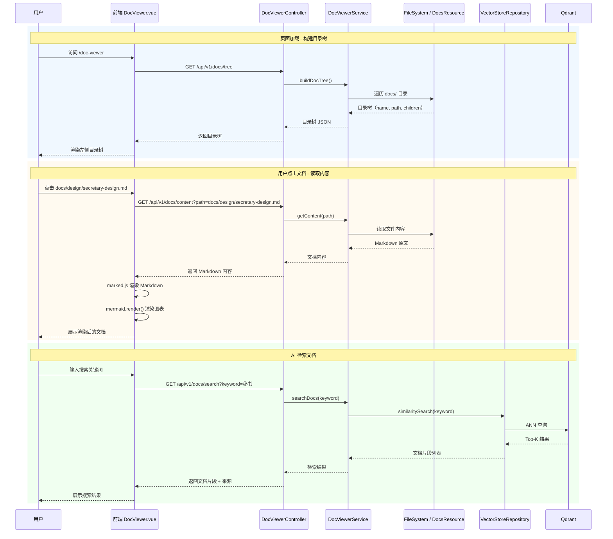
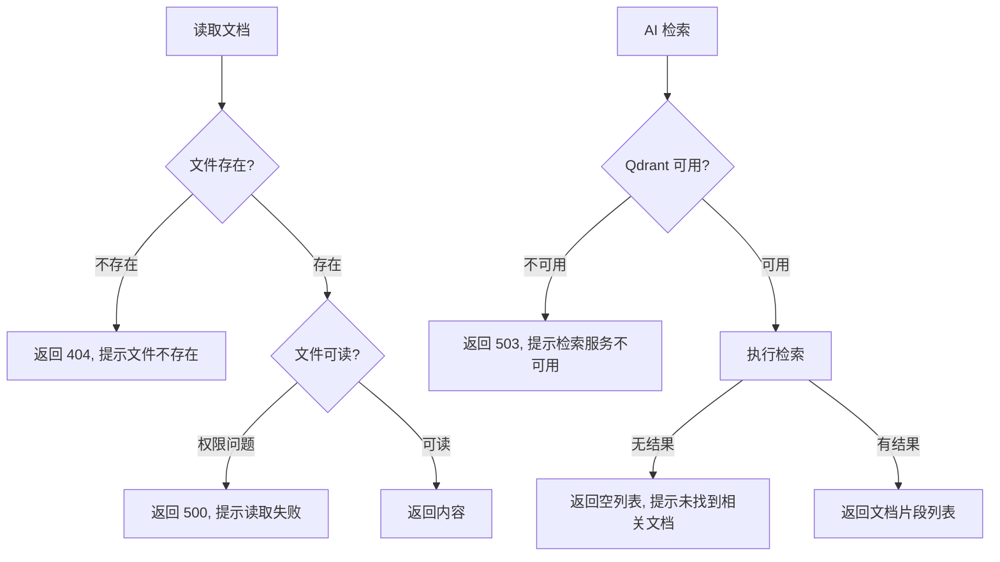
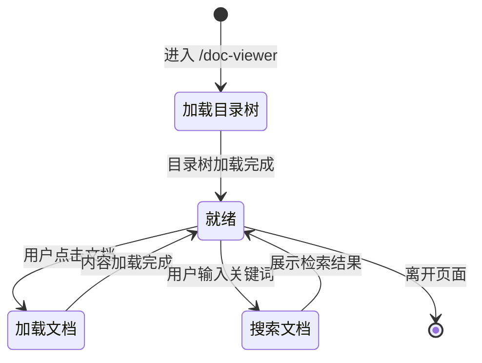
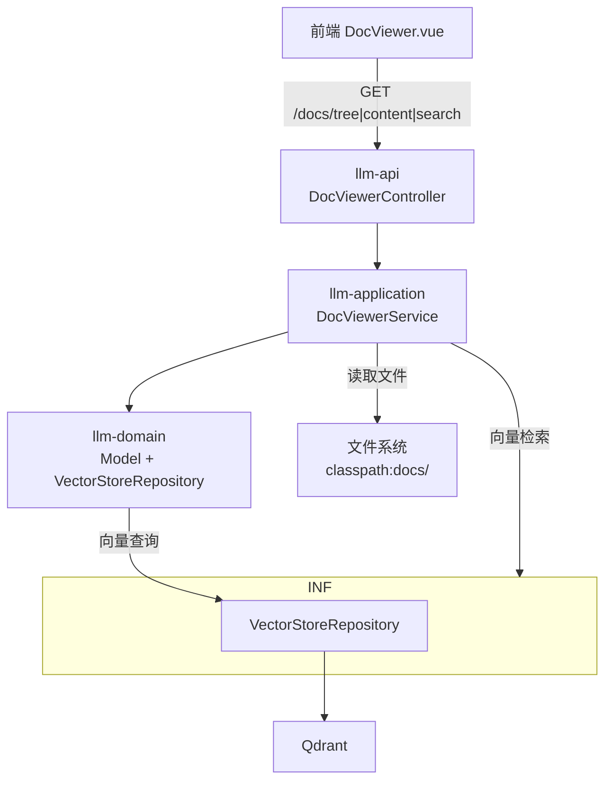
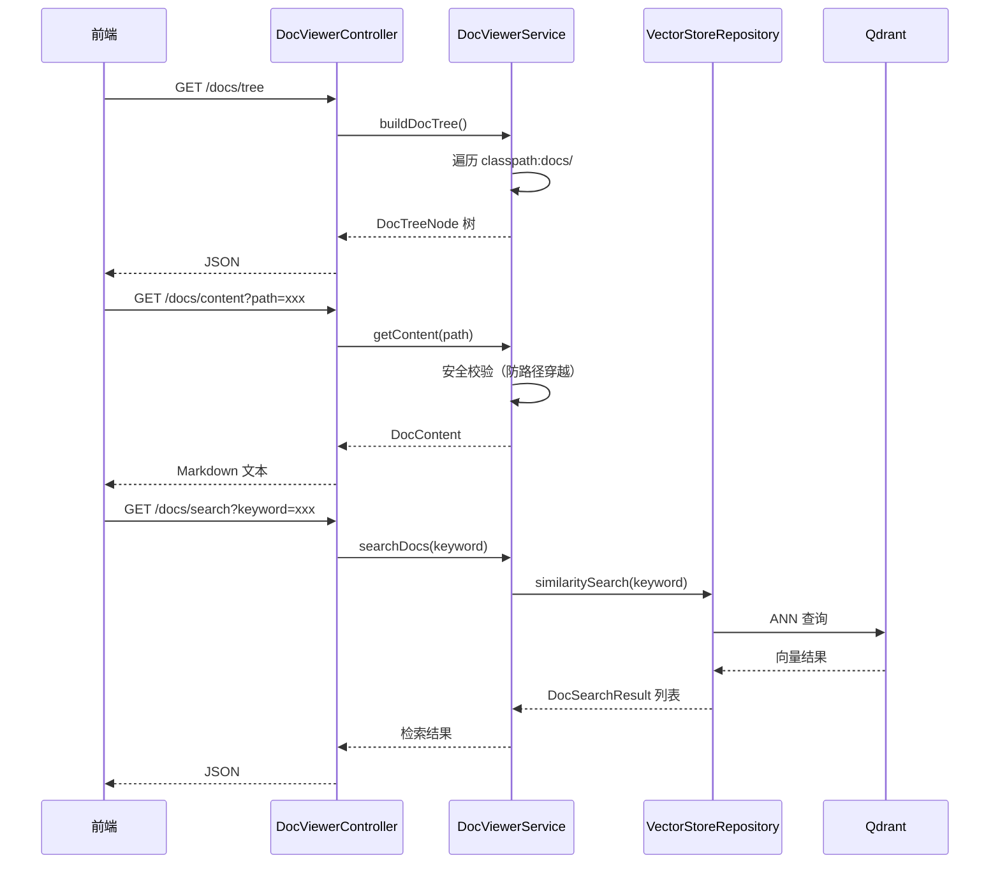

# 功能设计文档

## 1. 基本信息

| 项目 | 内容 |
|---|---|
| 功能名称 | 文档浏览器（Doc Viewer） |
| 所属系统 | LLM Orchestration Platform |
| 所属模块 | llm-api / llm-application / llm-frontend |
| 需求来源 | 内部需求 |
| 负责人 | — |
| 版本号 | v1.0.0 |

---

## 2. 背景与目标

- **背景**：项目 `docs/` 目录已有多份文档（设计文档、使用指南、开发记录、SQL 脚本），但缺乏统一的阅读入口，用户无法方便地浏览和检索。
- **问题**：文档分散在多个 Markdown 文件中，无法全文搜索，且当前前端无 Markdown 渲染能力。
- **目标**：构建一个 AI 驱动的文档浏览器，用户可查看目录结构、点击阅读文档、前端渲染 Markdown（含 Mermaid 图表），并支持 AI 辅助检索文档内容。
- **设计边界**：
  - 仅读取 `docs/` 目录下的 `.md` 文件，不支持其他格式
  - 文档内容通过文件系统读取（classpath 或相对路径），不存入数据库
  - AI 辅助检索基于向量相似度（Qdrant），需 Qdrant 服务可用
  - Mermaid 渲染在浏览器端完成

---

## 3. 功能范围

### 3.1 本次包含

- 文档目录树构建（读取 `docs/` 目录结构）
- 文档内容读取（读取指定 Markdown 文件内容）
- AI 辅助文档检索（基于 Qdrant 向量相似度搜索）
- 前端 Markdown 渲染（含 Mermaid 图表）
- 独立文档浏览器页面

### 3.2 本次不包含

- 文档全文索引构建（需手动触发或定时任务）
- 文档编辑/写入
- 多语言文档切换

### 3.3 后续扩展

- 文档全文索引自动构建（文件变更监听）
- 文档收藏/阅读历史
- 文档目录按分类分组（design/guides/dev/）

---

## 4. 业务流程设计

### 4.1 正常流程



### 4.2 异常流程



### 4.3 状态流转



---

## 5. 接口设计

### 5.1 接口清单

| 方法 | 路径 | 说明 |
|---|---|---|
| GET | `/api/v1/docs/tree` | 获取文档目录树 |
| GET | `/api/v1/docs/content` | 读取指定文档内容 |
| GET | `/api/v1/docs/search` | AI 语义检索文档 |
| POST | `/api/v1/docs/index` | 手动触发文档索引构建 |

### 5.2 请求参数

**GET /api/v1/docs/content**
```
?path=docs/design/secretary-design.md
```

**GET /api/v1/docs/search**
```
?keyword=秘书工具注册&topK=5
```

**POST /api/v1/docs/index**
```
无 body
```

### 5.3 返回参数

**GET /api/v1/docs/tree**
```json
{
  "items": [
    {
      "name": "design",
      "path": "docs/design",
      "type": "directory",
      "children": [
        { "name": "secretary-design.md", "path": "docs/design/secretary-design.md", "type": "file" }
      ]
    },
    { "name": "guides", "path": "docs/guides", "type": "directory", "children": [...] },
    { "name": "dev", "path": "docs/dev", "type": "directory", "children": [...] },
    { "name": "sql", "path": "docs/sql", "type": "directory", "children": [...] }
  ]
}
```

**GET /api/v1/docs/content**
```json
{
  "path": "docs/design/secretary-design.md",
  "name": "secretary-design.md",
  "content": "# 功能设计文档\n\n## 1. 基本信息\n...",
  "size": 12345
}
```

**GET /api/v1/docs/search**
```json
{
  "results": [
    {
      "path": "docs/design/secretary-design.md",
      "name": "secretary-design.md",
      "content": "日程管理（添加、查看、标记完成）",
      "score": 0.92
    }
  ]
}
```

### 5.4 错误码设计

| HTTP 状态码 | 场景 | 错误信息 |
|---|---|---|
| 200 | 正常 | — |
| 400 | 参数缺失 | `path` 必填 |
| 404 | 文件不存在 | `文档不存在: {path}` |
| 500 | 文件读取失败 | `读取文档失败: {error}` |
| 503 | Qdrant 不可用 | `检索服务不可用，请确保 Qdrant 已启动` |

---

## 6. 类设计

### 6.1 分层设计



### 6.2 核心类清单

| 类 | 所属模块 | 职责 |
|---|---|---|
| `DocViewerController` | llm-api | HTTP 入口，4 个端点 |
| `DocViewerService` | llm-application | 目录树构建、文件读取、AI 检索编排 |
| `DocTreeNode` | llm-domain | 目录树节点模型 |
| `DocContent` | llm-domain | 文档内容响应模型 |
| `DocSearchResult` | llm-domain | 检索结果模型 |
| `VectorStoreRepository` | llm-domain | Qdrant 向量操作抽象接口 |
| `QdrantVectorStoreRepository` | llm-infrastructure | Qdrant 实现（复用现有） |

### 6.3 类职责说明

**DocViewerService**
- `buildDocTree()`：遍历 classpath 下 `docs/` 目录，按 `design/guides/dev/sql` 分类构建树
- `getContent(path)`：读取指定文件内容，防止路径遍历攻击（`../` 逃逸）
- `searchDocs(keyword, topK)`：调用 `VectorStoreRepository` 执行向量相似度搜索
- `indexDocs()`：遍历所有 .md 文件，分段 + 向量化，批量写入 Qdrant

**路径安全校验**
读取文件前必须校验：
1. 路径以 `docs/` 开头
2. 不含 `..`（路径穿越）
3. 文件存在且为 `.md` 结尾

### 6.4 类调用关系



---

## 7. 数据库设计

本次**不涉及数据库变更**。文档内容直接从文件系统读取，向量索引存于 Qdrant。

---

## 8. 核心业务规则

| 规则 | 说明 |
|---|---|
| 仅支持 .md 文件 | 其他文件（.sql、.drawio）不在目录树中展示 |
| 路径穿越防护 | `path` 参数必须以 `docs/` 开头，不含 `..` |
| Qdrant 不可用时降级 | 检索接口返回 503，前端提示服务不可用 |
| 索引 ID 格式 | `doc:{path}`，如 `doc:docs/design/secretary-design.md` |
| 向量模型 | 复用现有 `qwen-embedding` 配置 |

---

## 9. 事务与并发控制

- 文档读取无并发问题（只读操作）
- `indexDocs()` 批量写入 Qdrant，单次操作无分布式事务
- 前端并发多个文档读取无问题（HTTP 无状态）

---

## 10. 缓存设计

| 内容 | 缓存策略 | 理由 |
|---|---|---|
| 目录树 | 前端 Pinia store，页面刷新重新拉取 | 目录变更不频繁，缓存价值高 |
| 文档内容 | 前端按路径缓存，首次加载后缓存 | 用户可能反复查看同一文档 |
| 检索结果 | 不缓存，每次实时查询 | 关键词变化频繁 |

---

## 11. 消息与异步设计

- `indexDocs()` 索引构建为同步接口，数据量大时前端显示 loading
- 后续可改为异步：接口返回「索引构建中」，后台线程执行

---

## 12. 下游依赖设计

| 依赖组件 | 用途 | 备注 |
|---|---|---|
| 文件系统 (classpath) | 读取 docs/ 目录下 .md 文件 | 路径校验防止逃逸 |
| Qdrant | 向量索引存储与检索 | 复用现有 `VectorStoreRepository` |
| Spring AI Embeddings | 文本向量化（keyword → embedding） | 复用 `QwenProvider` 或独立 EmbeddingModel |

---

## 13. 安全设计

| 项 | 设计 |
|---|---|
| 路径穿越防护 | 禁止 `..`，只允许 `docs/` 下的 .md 文件 |
| Qdrant 注入 | `keyword` 参数仅作文本查询，不做结构化查询，无注入风险 |
| 文档可见性 | 所有 docs/ 下文档对所有用户可见（当前无权限隔离） |

---

## 14. 日志与监控设计

| 场景 | 日志 |
|---|---|
| 文档读取 | `log.info("读取文档: path={}", path)` |
| 文档读取失败 | `log.warn("读取文档失败: path={}, error={}", path, e.message)` |
| 检索请求 | `log.info("文档检索: keyword={}", keyword)` |
| 索引构建 | `log.info("文档索引构建: total={}", totalFiles)` |
| Qdrant 不可用 | `log.warn("Qdrant 服务不可用，检索功能暂时不可用")` |

---

## 15. 异常处理设计

| 异常场景 | 处理方式 |
|---|---|
| 文件不存在 | 返回 404，提示「文档不存在」 |
| 路径穿越尝试 | 返回 400，提示「非法路径」 |
| 文件读取 IO 异常 | 返回 500，日志记录异常 |
| Qdrant 不可用 | 检索接口返回 503；索引接口返回 500 |
| Markdown 渲染错误 | 前端降级展示原始文本，不阻塞页面 |

---

## 16. 测试要点

| 场景 | 验证点 |
|---|---|
| 目录树 | 访问 `/api/v1/docs/tree`，验证 design/guides/dev/sql 四分类存在 |
| 目录树排除非 .md | 验证 .sql、.drawio 不出现在目录树中 |
| 文档内容读取 | 点击 secretary-design.md，验证 Markdown 原文正确返回 |
| 路径穿越防护 | 请求 `?path=../pom.xml`，验证返回 400 |
| AI 检索 | 输入「秘书」，验证返回相关文档片段 |
| Qdrant 不可用时降级 | 停止 Qdrant，访问检索接口，验证 503 返回 |
| Mermaid 渲染 | 文档含 Mermaid 代码块时，验证图表正确渲染 |
| Markdown 大文档 | 10万字文档加载，验证页面不卡顿（可加虚拟滚动） |

---

## 17. 上线与回滚方案

### 17.1 上线步骤

1. 确认 Qdrant 服务正常运行（`docs/search` 依赖）
2. 启动服务
3. `POST /api/v1/docs/index` 触发首次文档索引构建
4. 访问前端 `/doc-viewer`，验证目录树 + 文档渲染正常
5. 测试 Mermaid 图表渲染正常

### 17.2 回滚方案

- **代码回滚**：回滚 `llm-domain`、`llm-api`、`llm-application`、`llm-frontend` 相关变更
- **Qdrant 索引清理**：DROP collection `doc_vectors`（如需清理）
- **无破坏性变更**：仅新增端点，不修改现有接口，可安全回滚

---

## 18. 风险点与待确认事项

| 风险点 | 等级 | 应对 |
|---|---|---|
| Qdrant 不可用时检索接口 503 | 中 | 前端提示「检索服务不可用」，功能降级，用户仍可浏览文档 |
| Mermaid 渲染在部分浏览器兼容性 | 低 | 已广泛支持，选择最新版 mermaid.js |
| 大文档前端一次性渲染性能 | 低 | 考虑按需加载或虚拟滚动 |
| docs/ 目录结构变更后索引过期 | 中 | 需手动触发 `POST /docs/index`，后续可加文件监听自动重建 |
