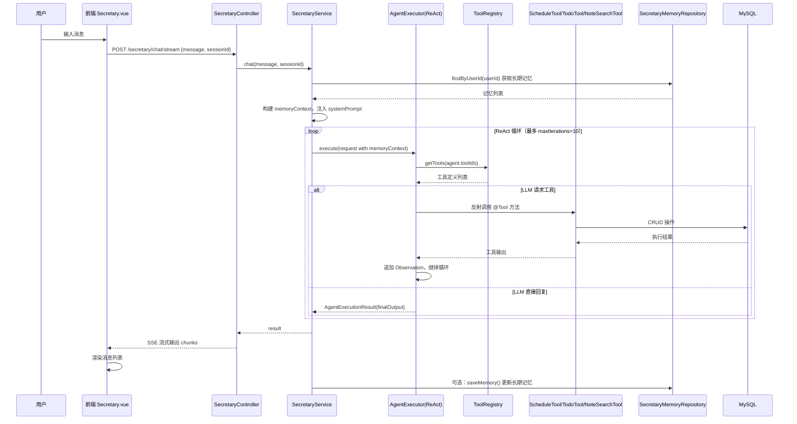
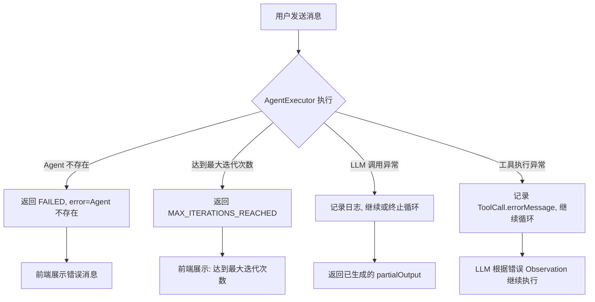
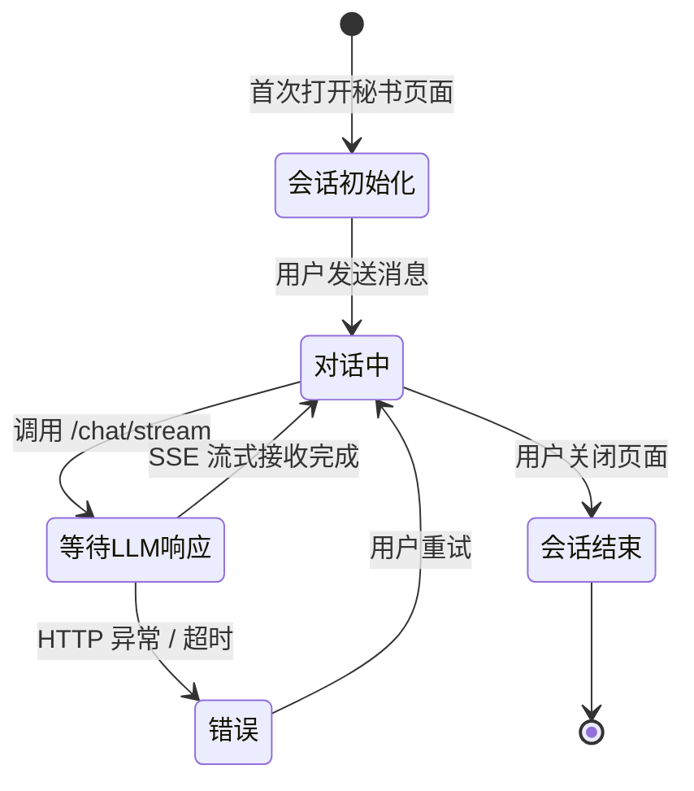
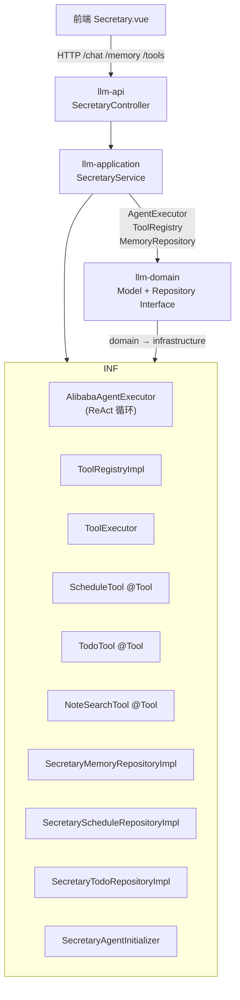
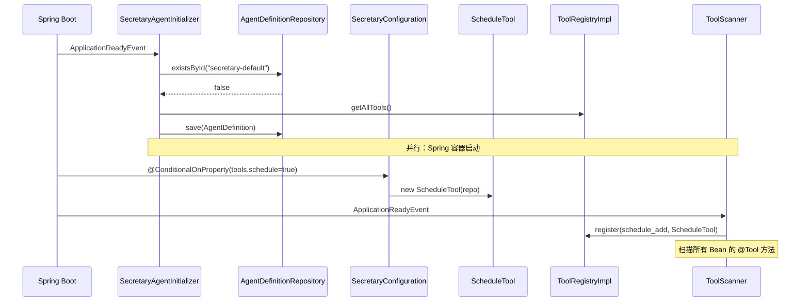

# 功能设计文档

## 1. 基本信息

| 项目 | 内容 |
|---|---|
| 功能名称 | 个人秘书智能体（Secretary Agent） |
| 所属系统 | LLM Orchestration Platform |
| 所属模块 | llm-application / llm-api |
| 需求来源 | 内部需求 |
| 负责人 | — |
| 版本号 | v1.0.0 |

---

## 2. 背景与目标

- **背景**：当前平台缺少一个面向终端用户的智能助手，无法帮助用户管理日程、待办、检索笔记等日常事务，现有 Agent 系统仅面向开发者配置使用。
- **问题**：用户需要一个统一的智能入口，完成日程安排、任务跟踪、知识检索等操作，需要在多个工具间切换。
- **目标**：构建一个具备长期记忆和可插拔工具集的个人秘书智能体，用户通过对话方式管理日程/待办/笔记，前端提供独立秘书页面。
- **设计边界**：
  - 仅服务单用户场景（`userId = default`，后续可扩展多租户）
  - 工具以 `@Tool` Bean 形式注册，通过配置开关控制启用/停用
  - 秘书执行复用现有 `AgentExecutor`（ReAct 循环），不引入新的执行引擎

---

## 3. 功能范围

### 3.1 本次包含

- 秘书对话（SSE 流式 / 非流式）
- 日程管理（添加、查看、标记完成）
- 待办管理（添加、查看、标记完成）
- 笔记检索（复用现有 `NoteSearchTool`）
- 长期记忆（持久化到 DB，每次对话注入 systemPrompt）
- 工具插拔（通过 `application.yml` 开关控制）
- 独立秘书前端页面（左侧工具+记忆面板，右侧对话区）

### 3.2 本次不包含

- 多用户/多租户支持
- 工具启用状态的动态热切换（前端展示但后端仍需重启生效）
- RAG 检索工具（`rag-search` 默认 false）
- 网络搜索工具（`web-search` 默认 false）
- 日程提醒推送（`reminder` 字段已设计但未实现推送逻辑）

### 3.3 后续扩展

- 多用户支持（`userId` 从认证上下文获取）
- 前端工具开关动态生效（刷新 Spring Context 或动态注销 ToolRegistry）
- 日程提醒（定时任务 + 消息推送）
- 网络搜索工具集成
- RAG 知识库检索

---

## 4. 业务流程设计

### 4.1 正常流程



### 4.2 异常流程



### 4.3 状态流转



---

## 5. 接口设计

### 5.1 接口清单

| 方法 | 路径 | 说明 |
|---|---|---|
| POST | `/api/v1/secretary/chat` | 非流式对话 |
| POST | `/api/v1/secretary/chat/stream` | SSE 流式对话 |
| GET | `/api/v1/secretary/memory` | 获取长期记忆列表 |
| POST | `/api/v1/secretary/memory` | 保存记忆条目 |
| DELETE | `/api/v1/secretary/memory` | 清除用户所有记忆 |
| GET | `/api/v1/secretary/tools` | 获取已注册工具列表 |

### 5.2 请求参数

**POST /api/v1/secretary/chat**
```json
{
  "message": "帮我记录明天上午10点的会议",
  "sessionId": "session-1743254400000"
}
```

**POST /api/v1/secretary/memory**
```json
{
  "type": "PREFERENCE",
  "content": "用户偏好早上处理复杂任务"
}
```

### 5.3 返回参数

**POST /api/v1/secretary/chat**
```json
{
  "executionId": "uuid",
  "agentId": "secretary-default",
  "finalOutput": "已为你添加日程：明天上午10点会议",
  "toolCalls": [
    { "toolName": "schedule_add", "inputJson": "...", "output": "日程已添加", "success": true }
  ],
  "iterations": 2,
  "elapsedMs": 3200,
  "status": "SUCCESS"
}
```

**POST /api/v1/secretary/chat/stream**
SSE 格式：
```
data: {"content":"已"}
data: {"content":"为"}
data: {"content":"你"}
...
data: [DONE]
```

### 5.4 错误码设计

| HTTP 状态码 | 场景 | 错误信息 |
|---|---|---|
| 200 | 正常 | — |
| 400 | 请求参数缺失 | `message` 必填 |
| 500 | Agent 执行异常 | 返回 `AgentExecutionResult` with `status=FAILED` |
| 503 | LLM 服务不可用 | Spring AI 抛出的异常 |

---

## 6. 类设计

### 6.1 分层设计



### 6.2 核心类清单

| 类 | 所属模块 | 职责 |
|---|---|---|
| `SecretaryController` | llm-api | HTTP 入口，SSE 流式编排 |
| `SecretaryService` | llm-application | 组装 systemPrompt + 记忆，调用执行器 |
| `SecretaryMemory` | llm-domain | 记忆领域模型 |
| `SecretarySchedule` | llm-domain | 日程领域模型 |
| `SecretaryTodo` | llm-domain | 待办领域模型 |
| `SecretaryMemoryRepository` | llm-domain | 记忆仓储接口 |
| `SecretaryScheduleRepository` | llm-domain | 日程仓储接口 |
| `SecretaryTodoRepository` | llm-domain | 待办仓储接口 |
| `SecretaryMemoryEntity` | llm-infrastructure | 记忆 JPA 实体 |
| `SecretaryMemoryRepositoryImpl` | llm-infrastructure | 记忆仓储实现 |
| `ScheduleTool` | llm-infrastructure | 日程管理 @Tool Bean |
| `TodoTool` | llm-infrastructure | 待办管理 @Tool Bean |
| `SecretaryConfiguration` | llm-infrastructure | 工具插拔 @ConditionalOnProperty |
| `SecretaryAgentInitializer` | llm-infrastructure | 启动时注册 secretary-default Agent |
| `ToolScanner` | llm-infrastructure | 扫描 @Tool Bean 注册到 Registry |

### 6.3 类职责说明

**SecretaryService**
核心编排类。`chat()` 方法：① 查询长期记忆构建 memoryContext → ② 调用 `AgentExecutor.execute()` → ③ 返回结果。不处理流式细节（由 Controller 负责 SSE 分块）。

**ScheduleTool / TodoTool**
工具类，通过 `@Tool` 注解暴露为 LLM 可调用工具。使用构造函数注入对应 Repository。方法签名中的参数使用 `@ToolParam` 描述，供 LLM 理解工具调用格式。

**SecretaryAgentInitializer**
实现 `ApplicationListener<ApplicationReadyEvent>`，在服务启动完成后执行：检查 `secretary-default` Agent 是否已存在，不存在则创建并注册到 `AgentDefinitionRepository`。系统级 Agent 不依赖数据库初始化脚本。

### 6.4 类调用关系



---

## 7. 数据库设计

### 7.1 表设计

```sql
CREATE TABLE secretary_memory (
    id BIGINT AUTO_INCREMENT PRIMARY KEY,
    user_id VARCHAR(100) NOT NULL,
    type VARCHAR(50) NOT NULL,           -- PREFERENCE / SUMMARY / PROFILE
    content TEXT NOT NULL,
    created_at DATETIME DEFAULT CURRENT_TIMESTAMP,
    updated_at DATETIME DEFAULT CURRENT_TIMESTAMP ON UPDATE CURRENT_TIMESTAMP,
    INDEX idx_secretary_memory_user (user_id)
);

CREATE TABLE secretary_schedule (
    id BIGINT AUTO_INCREMENT PRIMARY KEY,
    user_id VARCHAR(100) NOT NULL,
    title VARCHAR(200) NOT NULL,
    description VARCHAR(500),
    start_time DATETIME,
    end_time DATETIME,
    reminder TINYINT(1) NOT NULL DEFAULT 0,
    done TINYINT(1) NOT NULL DEFAULT 0,
    created_at DATETIME DEFAULT CURRENT_TIMESTAMP,
    INDEX idx_secretary_schedule_user (user_id),
    INDEX idx_secretary_schedule_time (start_time)
);

CREATE TABLE secretary_todo (
    id BIGINT AUTO_INCREMENT PRIMARY KEY,
    user_id VARCHAR(100) NOT NULL,
    title VARCHAR(200) NOT NULL,
    priority VARCHAR(20) NOT NULL DEFAULT 'MEDIUM',  -- LOW / MEDIUM / HIGH / URGENT
    due_date DATE,
    done TINYINT(1) NOT NULL DEFAULT 0,
    created_at DATETIME DEFAULT CURRENT_TIMESTAMP,
    INDEX idx_secretary_todo_user (user_id)
);
```

### 7.2 字段说明

**secretary_memory**

| 字段 | 类型 | 说明 |
|---|---|---|
| `id` | BIGINT | 主键 |
| `user_id` | VARCHAR(100) | 用户 ID（当前固定 `default`） |
| `type` | VARCHAR(50) | 记忆类型枚举 |
| `content` | TEXT | 记忆文本内容 |
| `created_at` | DATETIME | 创建时间 |
| `updated_at` | DATETIME | 更新时间 |

**secretary_schedule**

| 字段 | 类型 | 说明 |
|---|---|---|
| `id` | BIGINT | 主键 |
| `user_id` | VARCHAR(100) | 用户 ID |
| `title` | VARCHAR(200) | 日程标题 |
| `description` | VARCHAR(500) | 描述 |
| `start_time` | DATETIME | 开始时间 |
| `end_time` | DATETIME | 结束时间 |
| `reminder` | TINYINT(1) | 是否提醒（预留） |
| `done` | TINYINT(1) | 是否完成 |

**secretary_todo**

| 字段 | 类型 | 说明 |
|---|---|---|
| `id` | BIGINT | 主键 |
| `user_id` | VARCHAR(100) | 用户 ID |
| `title` | VARCHAR(200) | 待办标题 |
| `priority` | VARCHAR(20) | 优先级枚举 |
| `due_date` | DATE | 截止日期 |
| `done` | TINYINT(1) | 是否完成 |

### 7.3 索引设计

| 表 | 索引名 | 字段 | 类型 | 说明 |
|---|---|---|---|---|
| `secretary_memory` | `idx_secretary_memory_user` | `user_id` | B+Tree | 按用户查询记忆 |
| `secretary_schedule` | `idx_secretary_schedule_user` | `user_id` | B+Tree | 按用户查日程 |
| `secretary_schedule` | `idx_secretary_schedule_time` | `start_time` | B+Tree | 时间范围查询 |
| `secretary_todo` | `idx_secretary_todo_user` | `user_id` | B+Tree | 按用户查待办 |

### 7.4 一致性设计

- 记忆数据仅追加（`save`），不涉及事务一致性
- 日程/待办 `save`/`markDone` 操作均为单表写入，无分布式事务风险
- `SecretaryAgentInitializer` 使用 `existsById` 防止重复初始化（幂等设计）

### 7.5 数据量预估

| 表 | 预估数据量 | 说明 |
|---|---|---|
| `secretary_memory` | < 1000 条 | 记忆条目有限，不会快速增长 |
| `secretary_schedule` | < 10000 条 | 按每天 5 条日程估算 5 年 |
| `secretary_todo` | < 5000 条 | 待办完成即保留历史，不删除 |

---

## 8. 核心业务规则

| 规则 | 说明 |
|---|---|
| 日程时间格式 | 输入/输出统一使用 `yyyy-MM-dd HH:mm` |
| 优先级枚举 | 仅接受 `LOW/MEDIUM/HIGH/URGENT`，其他值默认 `MEDIUM` |
| 记忆类型枚举 | `PREFERENCE/SUMMARY/PROFILE`，LLM 决定插入类型 |
| 工具默认启用 | `@ConditionalOnProperty` 配置 `matchIfMissing = true`，不配置则默认启用 |
| Agent ID 固定 | `secretary-default`，初始化器确保幂等 |
| Session ID | 前端每次新建页面生成 `session-{timestamp}`，用于区分会话（当前未持久化） |

---

## 9. 事务与并发控制

- 日程/待办操作均为单表写，无需多表事务
- 每个 `@Tool` 方法执行后自动提交当前事务
- 并发安全：`ConcurrentHashMap` 在 `ToolRegistryImpl` 内部管理，无并发写冲突
- 数据库层面依赖 MySQL 行锁（`findById` + `save` 模式）

---

## 10. 缓存设计

本次**不引入额外缓存**。理由：

- 日程/待办数据量有限，MySQL 直接查询足够
- 长期记忆每次对话前查询一次，数据量小（<1000 条）
- 后续如需优化，可考虑 Caffeine 缓存（`llm-infrastructure` 已引入）

---

## 11. 消息与异步设计

本次**不引入异步消息队列**。SSE 流式输出由 Spring WebFlux `Flux` 在内存中分块返回，无需额外消息中间件。

---

## 12. 下游依赖设计

| 依赖组件 | 用途 | 备注 |
|---|---|---|
| MySQL | 持久化记忆、日程、待办 | 复用现有 datasource 配置 |
| Spring AI Alibaba | LLM 调用（ReAct 循环） | 复用 `LLMConfiguration` |
| ToolRegistry | 工具发现 | 复用现有 Bean 扫描机制 |
| `NoteSearchTool` | 笔记检索 | 复用现有组件 |
| Qdrant（可选） | RAG 向量检索 | `web-search` 默认 false，不强制依赖 |

---

## 13. 安全设计

| 项 | 设计 |
|---|---|
| 认证 | 当前无认证隔离，`userId = default`，后续从 Security Context 提取 |
| SQL 注入 | JPA `findById`/`save` 参数化查询，安全 |
| 输入校验 | `@Tool` 方法参数由 LLM 生成，存在注入风险；当前无额外校验，后续可加 JSON Schema 校验层 |
| SSE 断开 | 前端异常时 `reader.cancel()` 主动断开连接 |

---

## 14. 日志与监控设计

| 场景 | 日志 |
|---|---|
| 对话请求 | `log.info("秘书对话: sessionId={}, input={}", ...)` |
| 日程/待办操作 | 各 `@Tool` 方法内 `log.error` 捕获异常 |
| Agent 执行异常 | `AlibabaAgentExecutor` 内记录 `log.error` |
| 工具注册 | `ToolScanner` 启动时 `log.info("工具扫描完成，共注册 {} 个工具")` |

---

## 15. 异常处理设计

| 异常场景 | 处理方式 |
|---|---|
| `SecretaryScheduleRepositoryImpl.markDone` 找不到 ID | 抛 `IllegalArgumentException`，被 `ScheduleTool` 捕获并返回错误文本 |
| `SecretaryTodoRepositoryImpl.markDone` 同上 | 同上 |
| Agent 执行失败 | 返回 `AgentExecutionResult` with `status=FAILED`，前端展示错误消息 |
| SSE 流中断 | 前端 `catch` 异常，`ElMessage.error()` 提示 |

---

## 16. 测试要点

| 场景 | 验证点 |
|---|---|
| 日程添加 | 发送「帮我记录明天上午10点的会议」，验证 DB 中插入记录 |
| 日程查看 | 发送「查看未来7天日程」，验证返回正确条数 |
| 日程完成 | 发送「标记日程1已完成」，验证 `done=true` |
| 待办添加 | 发送「添加一个高优先级的待办：买书」，验证 DB |
| 待办列表 | 发送「看看我的待办」，验证列表返回 |
| 记忆持久化 | 对话后 `GET /secretary/memory`，验证记忆条数增加 |
| 记忆清除 | `DELETE /secretary/memory`，验证返回空列表 |
| 工具插拔 | `application.yml` 中 `tools.schedule=false`，验证 `GET /secretary/tools` 不包含日程工具 |
| SSE 流式 | 前端观察消息逐字输出，无闪烁 |
| 异常恢复 | 工具执行失败后，Agent 仍能继续对话 |

---

## 17. 上线与回滚方案

### 17.1 上线步骤

1. 执行数据库 DDL（新增 3 张表）
2. 启动服务，观察日志：`秘书 Agent 初始化完成`
3. `GET /api/v1/secretary/tools` 验证工具注册成功
4. 访问前端 `/secretary` 页面完整走查

### 17.2 回滚方案

- **代码回滚**：回滚 `llm-domain`、`llm-infrastructure`、`llm-application`、`llm-api`、`llm-frontend` 相关变更
- **数据库回滚**：DROP 三张表（`secretary_memory`、`secretary_schedule`、`secretary_todo`）
- **无破坏性变更**：仅新增表和模块，不修改现有表结构，可安全回滚

---

## 18. 风险点与待确认事项

| 风险点 | 等级 | 应对 |
|---|---|---|
| LLM 输出格式不稳定，解析工具调用 JSON 失败 | 中 | 当前 `AlibabaAgentExecutor` 有解析容错，失败则跳过该轮 |
| `userId = default` 无多用户隔离 | 中 | 当前面向单用户，后续从 Security Context 获取 |
| SSE 在高并发下占用连接资源 | 低 | Spring WebFlux 非阻塞，影响有限 |
| 工具参数由 LLM 生成，可能含恶意输入 | 低 | 当前无额外校验，后续加 Schema 校验 |
| 日程提醒推送未实现 | 低 | 字段已设计，推送逻辑作为后续扩展项 |
