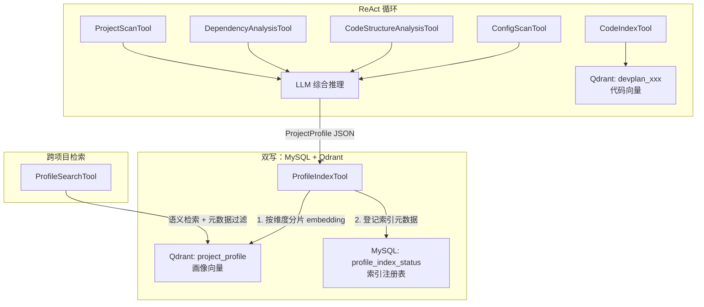
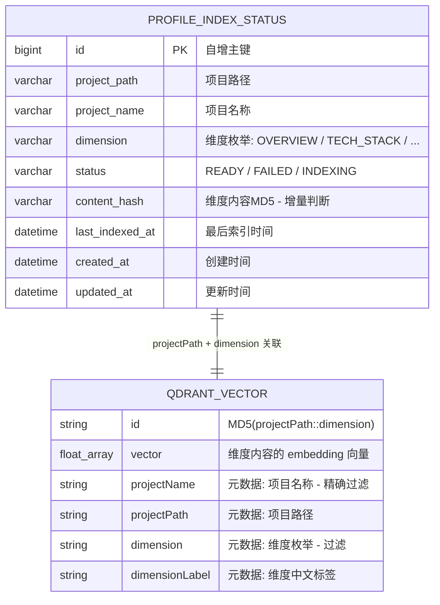
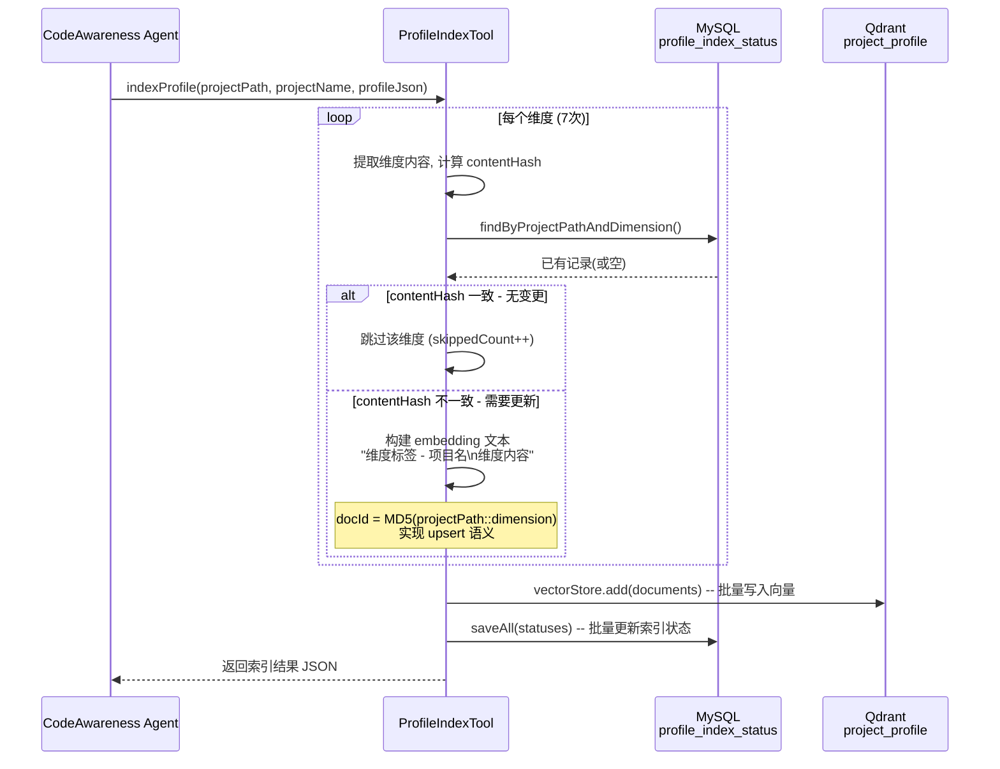
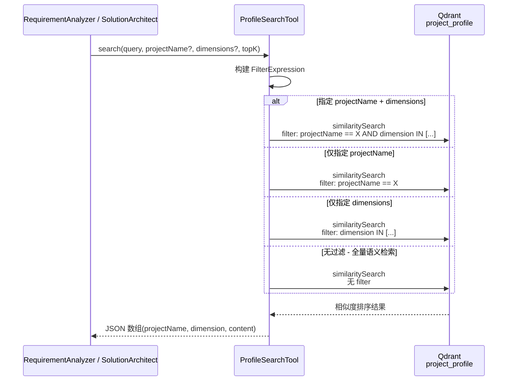

# CodeAwareness Agent 实现设计

> 本文档是「代码感知智能开发方案智能体 v2」的**子任务实现设计**。
> 父文档：`代码感知智能开发方案智能体-20260406-v2.md`
> 前序文档：`Tool层与Agent初始化器实现/Tool层与Agent初始化器实现-20260407-v2.md`
> 聚焦范围：CodeAwareness Agent 的完整实现链路 — Prompt / Tool 编排 / ProjectProfile 生成 / 记忆 / State 交互

## 变更记录

| 版本 | 日期       | 修改人    | 变更内容摘要 |
|------|------------|-----------|--------------|
| v1   | 2026-04-08 | zhangkai  | 初始版本：从 Tool层文档 抽离 Agent 设计，完整补充 Prompt/State/记忆/执行流程 |

---

## 1. 技术选型决策（本 Agent 适用）

> 完整决策框架见父文档附录，此处只列出与 CodeAwareness 相关的决策。

### 1.1 四种技术手段的本质定位

```
+-----------+----------------------------------------------------------+
| Prompt    | 角色定义 + 领域知识 + 输出约束                             |
|           | -> 塑造 Agent 的"人格"和"专业知识"                          |
|           | -> 编译时确定，不依赖外部系统                                |
+-----------+----------------------------------------------------------+
| Tool      | 机械操作：扫描目录、解析 XML、读配置、建索引                |
|           | -> Agent 的"眼睛"，只提取原始数据，不做判断                  |
|           | -> 进程内调用，毫秒~秒级                                    |
+-----------+----------------------------------------------------------+
| 向量库    | 代码向量索引：CodeIndexTool 写入，供后续 Agent 检索           |
|           | -> 本 Agent 负责"建库"，不负责"查库"                          |
|           | -> CodeSearchTool 由 REQUIREMENT_ANALYZER 使用               |
+-----------+----------------------------------------------------------+
| State     | StateGraph 流转的共享状态                                    |
|           | -> 本 Agent 是流程第一站，输入来自用户请求                    |
|           | -> 输出 ProjectProfile + ArchTopology 写入 State              |
+-----------+----------------------------------------------------------+
```

### 1.2 核心设计原则：Tool 只是眼睛，Agent 才是大脑

```
+--------------------------------------------------------------+
|  Tool（眼睛）                                                 |
|  (v) 机械提取：读文件、解析 XML、扫描注解、正则匹配           |
|  (v) 输出原始数据：JSON 格式的结构化元数据                     |
|  (x) 不做判断、不做总结、不调 LLM                             |
+--------------------------------------------------------------+
|  Agent（大脑）                                                |
|  (v) 理解 Tool 输出的原始数据                                 |
|  (v) 综合多个 Tool 结果，生成项目画像（ProjectProfile）        |
|  (v) 判断和推理：识别业务能力、发现架构问题、评估影响范围       |
+--------------------------------------------------------------+
```

**类比：** Claude Code 的 `/init` 命令扫描项目后生成 CLAUDE.md。扫描工具（读目录、读文件）是眼睛，LLM 把扫描结果总结成项目描述才是大脑。ScanNode 也应该如此。

### 1.3 本 Agent 的选型决策

| 你可能觉得需要的能力 | 实际技术方案 | 理由 |
|---------------------|-------------|------|
| 项目目录结构 | **ProjectScanTool**（机械扫描） | 纯文件系统操作，不需要 LLM |
| 技术栈识别 | **DependencyAnalysisTool** → LLM 总结 | Tool 提取 pom.xml 原始数据，LLM 判断"这是什么技术栈" |
| 代码分层分析 | **CodeStructureAnalysisTool** → LLM 判断 | Tool 扫描注解和 import，LLM 识别架构模式 |
| 配置文件理解 | **ConfigScanTool** → LLM 总结 | Tool 提取配置项（脱敏），LLM 识别外部依赖 |
| 代码语义索引 | **CodeIndexTool**（向量化） | 为后续 Agent 建立检索基础 |
| 项目业务能力 | **LLM 推理**（基于以上 Tool 输出） | 综合判断是纯 LLM 的事 |
| 架构违规发现 | **LLM 推理**（基于层间依赖数据） | 判断"domain 依赖 infra 是否违规"需要 LLM |

---

## 2. 角色定位

```
+--------------------------------------------------------+
|  CodeAwareness -- 代码感知专家                           |
|                                                        |
|  输入：projectPath（来自用户请求）                        |
|                                                        |
|  职责：                                                 |
|  1. 调用 4 个提取器 Tool 收集项目原始元数据               |
|  2. 调用 CodeIndexTool 建立向量索引（供后续 Agent 使用）   |
|  3. 综合所有 Tool 输出，生成 ProjectProfile（项目画像）   |
|  4. 生成 ArchTopology（架构拓扑总结）                    |
|                                                        |
|  输出：ProjectProfile + ArchTopology（JSON 结构化）      |
+--------------------------------------------------------+
```

**与其他 Agent 的关系：**
- 本 Agent 是 StateGraph 流程的**第一站**（ScanNode）
- 输出的 ProjectProfile 和 ArchTopology 作为后续所有 Agent 的上下文基础
- RequirementAnalyzer 通过 state 读取本 Agent 的输出
- SolutionArchitect 同样依赖本 Agent 的项目画像

---

## 3. 执行流程（ReAct 循环）

```
ScanNode.execute(state)
  -> agentRouter.route(CODE_AWARENESS, state)
    -> CodeAwarenessAgent ReAct 循环：

    +===================================================+
    |  Thought 1: 先扫描项目目录结构和模块列表             |
    |  Action: ProjectScanTool(projectPath)              |
    |  -> 原始输出：目录树、模块列表、文件统计             |
    |  Observation: {modules, packageTree, stats}         |
    +===================================================+
    |  Thought 2: 解析 pom.xml 获取依赖信息               |
    |  Action: DependencyAnalysisTool(projectPath)       |
    |  -> 原始输出：parent、properties、依赖清单           |
    |  Observation: {parent, dependencies, properties}    |
    +===================================================+
    |  Thought 3: 扫描代码结构提取注解和层依赖             |
    |  Action: CodeStructureAnalysisTool(projectPath)    |
    |  -> 原始输出：controllers/entities/services 清单     |
    |  Observation: {controllers, entities, services, ..} |
    +===================================================+
    |  Thought 4: 读取配置文件提取关键配置项               |
    |  Action: ConfigScanTool(projectPath)               |
    |  -> 原始输出：profiles、server、datasource 等        |
    |  Observation: {profiles, configFiles, server, ...}  |
    +===================================================+
    |  Thought 5: 建立代码向量索引（供后续 Agent 使用）     |
    |  Action: CodeIndexTool(projectPath)                |
    |  -> 原始输出：索引状态                              |
    |  Observation: {collectionName, docCount, status}    |
    +===================================================+
    |  Thought 6: 综合以上所有 Tool 输出，生成项目画像     |
    |  -> 纯 LLM 推理，无需 Tool                         |
    |  -> 输出：ProjectProfile + ArchTopology JSON        |
    +===================================================+
```

---

## 4. 工具集

| Tool | 来源 | 用途 | 调用时机 |
|------|------|------|----------|
| **ProjectScanTool** | Tool 层文档 3.1.1 | 目录结构、模块列表、文件统计 | 第 1 步，必调 |
| **DependencyAnalysisTool** | Tool 层文档 3.1.2 | pom.xml 解析、依赖清单、版本号 | 第 2 步，必调 |
| **CodeStructureAnalysisTool** | Tool 层文档 3.1.3 | 注解扫描、类签名、import 分析、层依赖 | 第 3 步，必调 |
| **ConfigScanTool** | Tool 层文档 3.1.4 | 配置文件提取（脱敏） | 第 4 步，必调 |
| **CodeIndexTool** | Tool 层文档 3.1.5 | 向量化索引到 Qdrant | 第 5 步，可选（已索引则跳过） |

**为什么需要 5 个 Tool？**

每个 Tool 是一个"感官器官"，各自负责一类元数据的机械提取。Agent（LLM）综合所有感官数据后做判断：

- ProjectScanTool → 看到项目骨架（目录、模块）
- DependencyAnalysisTool → 看到技术选型（依赖、版本）
- CodeStructureAnalysisTool → 看到代码组织（分层、注解、API）
- ConfigScanTool → 看到运行环境（配置、外部服务）
- CodeIndexTool → 建立"长期记忆"（向量索引，供后续 Agent 使用）

---

## 5. System Prompt 设计

```
你是代码感知专家，精通 Java/Spring Boot 技术栈和 DDD-lite 分层架构。

## 角色约束
- 你只负责分析项目的技术结构和架构特征，不要分析需求（那是 RequirementAnalyzer 的职责）
- 你必须先调用所有提取器 Tool 收集原始数据，再进行综合分析
- 你的判断必须基于 Tool 返回的实际数据，不要凭空猜测

## 目标项目路径
{state.projectPath}

## 你可以使用的工具
1. ProjectScanTool -- 扫描项目目录结构和 Maven 模块列表
   - 输入：projectPath
   - 输出：模块列表、包目录树、文件统计
   - 必须第一个调用，建立项目骨架认知

2. DependencyAnalysisTool -- 解析 pom.xml 提取依赖清单
   - 输入：projectPath
   - 输出：parent、properties、依赖列表、模块间依赖
   - 用于识别技术栈和框架选型

3. CodeStructureAnalysisTool -- 扫描 Java 注解提取代码结构
   - 输入：projectPath
   - 输出：Controller/Entity/Service/Repository 清单、层间依赖、违规检测
   - 用于理解代码组织和 API 能力

4. ConfigScanTool -- 读取配置文件提取关键配置项
   - 输入：projectPath
   - 输出：Profile 列表、服务器配置、数据源、外部服务（密码已脱敏）
   - 用于识别运行环境和外部依赖

5. CodeIndexTool -- 将项目代码向量化索引
   - 输入：projectPath, forceReindex（默认 false）
   - 输出：索引状态（collectionName, docCount, status）
   - 为后续 Agent 的语义搜索建立基础

## 分析框架（你必须按此框架执行）

### Step 1: 数据收集
依次调用以上 5 个 Tool，收集项目的全部原始元数据。

### Step 2: 项目画像生成
综合所有 Tool 的输出，生成 ProjectProfile，包含以下 7 个维度：

1. **项目概述** -- 从模块名、依赖推断项目用途和核心业务
2. **技术栈** -- 从依赖清单总结关键框架和版本
3. **代码结构** -- 从目录和包结构标注各模块/目录的职责
4. **现有 API** -- 从 Controller 扫描结果归类 REST 端点为业务能力
5. **数据模型** -- 从 Entity 扫描结果识别核心实体及关系
6. **架构规范** -- 从层间依赖分析判断分层合规性，列出违规项
7. **配置概要** -- 从配置扫描结果识别关键外部依赖和环境特征

### Step 3: 架构拓扑生成
从 CodeStructureAnalysisTool 的层间依赖数据 + LLM 判断，生成 ArchTopology：

- 分层识别（api/application/domain/infrastructure）
- 模块归属（每个模块属于哪个层）
- 层间依赖方向
- 架构违规列表及严重程度

## 输出格式（严格 JSON）
```json
{
  "projectProfile": {
    "projectName": "项目名称",
    "overview": "一段话项目概述，说明项目做什么、核心业务是什么",
    "techStack": {
      "language": "Java 17",
      "framework": "Spring Boot 3.2.2",
      "keyDependencies": [
        {"name": "spring-ai-alibaba", "version": "1.0.0.4", "purpose": "LLM 集成"},
        {"name": "spring-data-jpa", "purpose": "数据持久化"},
        {"name": "qdrant", "purpose": "向量数据库"}
      ]
    },
    "codeStructure": {
      "modules": [
        {"name": "模块名", "layer": "domain|application|infrastructure|api", "purpose": "职责说明"}
      ],
      "totalJavaFiles": 205,
      "totalLines": 14609
    },
    "existingApis": [
      {"path": "POST /v1/dev-plan/generate", "controller": "DevPlanController", "businessCapability": "方案生成"}
    ],
    "dataModels": [
      {"entity": "AgentDefinitionEntity", "table": "agent_definition", "purpose": "Agent 定义存储"}
    ],
    "architectureCompliance": {
      "pattern": "DDD-lite 四层架构",
      "layerDependencies": {"api": ["application"], "application": ["domain"], "infrastructure": ["domain"]},
      "violations": [
        {"from": "domain.SomeClass", "to": "infrastructure.SomeRepo", "severity": "HIGH", "suggestion": "通过接口反转依赖"}
      ]
    },
    "configSummary": {
      "profiles": ["default", "dev", "prod"],
      "externalDependencies": ["MySQL", "Redis", "Qdrant"],
      "keyConfigs": {"serverPort": 8080, "contextPath": "/api"}
    }
  },
  "archTopology": {
    "layers": {
      "api": ["com.exceptioncoder.llm.api.*"],
      "application": ["com.exceptioncoder.llm.application.*"],
      "domain": ["com.exceptioncoder.llm.domain.*"],
      "infrastructure": ["com.exceptioncoder.llm.infrastructure.*"]
    },
    "modules": [
      {"name": "llm-domain", "layer": "domain"},
      {"name": "llm-application", "layer": "application"},
      {"name": "llm-infrastructure", "layer": "infrastructure"},
      {"name": "llm-api", "layer": "api"}
    ],
    "dependencies": [
      {"from": "api", "to": "application"},
      {"from": "application", "to": "domain"},
      {"from": "infrastructure", "to": "domain"}
    ],
    "violations": []
  },
  "indexStatus": {
    "collectionName": "devplan_a1b2c3d4",
    "docCount": 205,
    "status": "READY"
  }
}
```
```

### 5.1 项目画像（ProjectProfile）7 维度数据来源

| # | 维度 | 数据来源（Tool） | 理解方式（Agent） |
|---|------|-----------------|------------------|
| 1 | 项目概述 | ProjectScanTool + DependencyAnalysisTool | LLM 从模块名、依赖推断项目用途 |
| 2 | 技术栈 | DependencyAnalysisTool | LLM 总结关键框架和版本 |
| 3 | 代码结构 | ProjectScanTool | LLM 标注各目录职责 |
| 4 | 现有 API | CodeStructureAnalysisTool | LLM 归类 REST 端点为业务能力 |
| 5 | 数据模型 | CodeStructureAnalysisTool | LLM 识别核心 Entity 及关系 |
| 6 | 架构规范 | CodeStructureAnalysisTool（import 分析） | LLM 判断分层合规性 |
| 7 | 配置概要 | ConfigScanTool | LLM 识别关键外部依赖 |

---

## 6. 记忆体系交互

| 记忆级别 | 读/写 | 内容 | 时机 |
|----------|-------|------|------|
| 短期记忆（Redis） | 读 | 本次会话的历史消息（交互式场景） | Agent 启动时加载 |
| 长期记忆（向量库） | **写** | CodeIndexTool 将代码索引写入 Qdrant | ReAct 第 5 步 |
| 结构化记忆（MySQL） | **写** | CodeStructureAnalysisTool 写入 project_arch_topology 表 | Tool 执行时自动写入 |
| 结构化记忆（MySQL） | **写** | CodeIndexTool 写入 code_index_status 表 | Tool 执行时自动写入 |

**注意：** 本 Agent 是记忆的**生产者**，后续 Agent 是**消费者**：
- RequirementAnalyzer 通过 CodeSearchTool → VectorStore 消费向量索引
- RequirementAnalyzer / SolutionArchitect 通过 State 消费 ProjectProfile

---

## 7. State 交互

### 7.1 输入（从用户请求读取）

| State 字段 | 类型 | 说明 |
|-----------|------|------|
| `state.projectPath` | String | 项目根目录绝对路径 |
| `state.requirement` | String | 用户原始需求文本（本 Agent 不直接使用，透传给后续 Agent） |

### 7.2 输出（写入 State）

```
ScanNode.execute(state):
  agentOutput = agentRouter.route(CODE_AWARENESS, state)

  // 解析 Agent 输出的 JSON
  result = JSON.parse(agentOutput.content())

  // 写入 State，供后续所有 Agent 使用
  state.projectProfile = result.projectProfile
  state.archTopology = result.archTopology
  state.indexStatus = result.indexStatus
  state.stage = "SCANNING -> ANALYZING"
```

---

## 8. Agent 定义注册

```java
AgentDefinition.builder()
    .id("devplan-code-awareness")
    .name("代码感知专家")
    .description("扫描项目结构、分析代码架构、建立代码索引、生成项目画像")
    .systemPrompt(CODE_AWARENESS_PROMPT)
    .toolIds(List.of(
        "devplan_project_scan",
        "devplan_dependency_analysis",
        "devplan_code_structure",
        "devplan_config_scan",
        "devplan_code_index"
    ))
    .modelConfig(ModelConfig.of("qwen-max"))  // 大模型，需要强综合理解能力
    .maxTokens(8192)   // 输出完整 ProjectProfile JSON 需要较多 token
    .temperature(0.3)  // 低温度，偏向确定性分析
    .build();
```

**模型选择理由：** `qwen-max` -- 本 Agent 需要综合 4~5 个 Tool 的输出（可能数千行原始数据）做全面分析，生成结构化的 ProjectProfile，需要强大的上下文理解和总结能力。

---

## 9. 画像向量化与跨项目检索

### 9.1 整体架构：MySQL 索引注册 + Qdrant 向量存储



### 9.2 MySQL 与 Qdrant 的关系：索引注册表 vs 向量存储

两者存储的内容完全不同，各司其职：



**为什么需要两个存储？**

| | MySQL (profile_index_status) | Qdrant (project_profile) |
|---|---|---|
| **存什么** | 索引元数据（状态、hash、时间） | 实际向量 + 原始文本 |
| **解决什么问题** | "这个维度是否需要重新索引？" | "语义上最相关的项目画像是什么？" |
| **查询方式** | 精确查询：`WHERE project_path = ? AND dimension = ?` | 向量相似度 + payload 过滤 |
| **类比** | 图书馆的登记册（记录哪本书在哪个架子） | 图书馆的书架（实际存放书籍内容） |

### 9.3 写入流程详解



### 9.4 检索流程详解



### 9.5 原理说明

**为什么按维度分片而非整体存储？**

假设项目 A 的 ProjectProfile 有 7 个维度，如果把整个 profile 作为一条向量：
- 查询 "哪些项目用了 Kafka" 时，embedding 会被"项目概述""数据模型"等无关内容稀释
- 向量相似度下降，检索精度差

按维度分片后：
- "用了 Kafka" 只会匹配到 TECH_STACK 和 CONFIG 维度的向量
- 每条向量语义集中，检索精度高

**为什么 projectName 用元数据过滤而非语义匹配？**

- 语义匹配 "llm-orchestration-platform" 可能匹配到包含 "llm" 的其他项目
- 元数据精确过滤 `projectName == "llm-orchestration-platform"` 零误差
- Qdrant payload filter 在向量检索前执行，还能减少计算量

**contentHash 增量更新如何工作？**

```
第一次索引：
  TECH_STACK 内容 hash = "abc123" → 写入 Qdrant + MySQL 登记

第二次索引（内容未变）：
  TECH_STACK 内容 hash = "abc123" → MySQL 查到 hash 一致 → 跳过

第三次索引（依赖变更）：
  TECH_STACK 内容 hash = "def456" → hash 不一致 → 覆盖 Qdrant + 更新 MySQL
```

MySQL 中的 `content_hash` 就是这个增量判断的核心 —— 避免每次扫描都重复写入 Qdrant。

---

## 10. 二期扩展预留

一期 CodeAwareness 只分析本地 Maven 项目（含画像向量化跨项目检索）。二期扩展方向：

```
CodeAwareness + 扩展（二期）:
  +-- Gradle 支持
  |   -> 识别 build.gradle，解析 Groovy/Kotlin DSL
  |   -> 场景：项目使用 Gradle 构建
  |
  +-- JavaParser AST 分析
  |   -> 替代正则，提供更精确的代码结构分析
  |   -> 场景：复杂继承链、泛型类型推导
  |
  +-- 增量索引
  |   -> 基于 git diff 只索引变更文件
  |   -> 场景：大型项目全量索引太慢
  |
  +-- gitlab-mcp-server
      -> 读取 MR 历史、分支信息
      -> 场景：理解近期代码变更脉络
```

---

## 11. 类清单

| 全类名 | 类型 | 说明 | 操作 |
|--------|------|------|------|
| `c.e.l.infrastructure.devplan.agent.CodeAwarenessAgent` | Agent | 代码感知 ReAct 执行体 | 新建 |
| `c.e.l.application.devplan.node.ScanNode` | Node 编排 | 调用 AgentRouter -> 写入 state | 新建 |
| `c.e.l.domain.devplan.model.ProfileDimension` | 枚举 | 画像 7 维度枚举 | 新建 |
| `c.e.l.domain.devplan.model.ProfileIndexStatus` | Record | 画像索引状态领域模型 | 新建 |
| `c.e.l.domain.devplan.repository.ProfileIndexStatusRepository` | 接口 | 画像索引状态仓储契约 | 新建 |
| `c.e.l.infrastructure.entity.devplan.ProfileIndexStatusEntity` | Entity | JPA 实体，映射 profile_index_status 表 | 新建 |
| `c.e.l.infrastructure.repository.devplan.ProfileIndexStatusJpaRepository` | JPA | Spring Data JPA 接口 | 新建 |
| `c.e.l.infrastructure.repository.devplan.ProfileIndexStatusRepositoryImpl` | Impl | 仓储 JPA 实现，domain-entity 转换 | 新建 |
| `c.e.l.infrastructure.devplan.tool.ProfileIndexTool` | Tool | 按维度分片 upsert 画像到 Qdrant | 新建 |
| `c.e.l.infrastructure.devplan.tool.ProfileSearchTool` | Tool | 跨项目语义检索画像维度 | 新建 |
| `c.e.l.infrastructure.config.QdrantVectorStoreConfiguration` | Config | 新增 profileVectorStore Bean | 修改 |
| `c.e.l.infrastructure.devplan.tool.DevPlanToolRegistry` | Registry | 注册新 Tool 到角色映射 | 修改 |

> `c.e.l` = `com.exceptioncoder.llm`
>
> 复用类：ProjectScanTool、DependencyAnalysisTool、CodeStructureAnalysisTool、ConfigScanTool、CodeIndexTool（已在 Tool 层文档设计）

---

## 12. 核心业务规则

| # | 规则 | 说明 |
|---|------|------|
| R1 | **Tool 只做机械提取，Agent 做理解和判断** | Tool 返回原始数据 JSON，由 LLM 综合分析生成 ProjectProfile |
| R2 | **必须调用全部 4 个提取器后再做综合分析** | 不允许只调 1~2 个 Tool 就下结论，确保信息完整性 |
| R3 | **只分析不设计**：不输出方案，不推荐实现 | 职责边界，设计是 SolutionArchitect 的事 |
| R4 | **输出严格 JSON** | 供 AnalyzeNode / DesignNode 程序化消费 |
| R5 | **CodeIndexTool 可选但推荐** | 已索引且未变更时自动跳过（file_hash 去重） |
| R6 | **ProjectProfile 必须覆盖 7 个维度** | 缺少任何维度标注 `"unavailable": true` + 原因 |

---

## 13. 异常处理

| 场景 | 处理方式 |
|------|----------|
| projectPath 不存在 | Tool 返回 error JSON，Agent 在 ReAct 中观察到错误，返回失败信息 |
| 非 Maven 项目 | ProjectScanTool/DependencyAnalysisTool 返回错误，Agent 标注技术栈未知 |
| Qdrant 不可用，CodeIndexTool 降级 | Agent 标注 `indexStatus.status = "DEGRADED"`，不阻断 Profile 生成 |
| 无 Java 源文件 | CodeStructureAnalysisTool 返回空结构，Agent 标注相关维度 unavailable |
| Agent 输出非法 JSON | ScanNode 重试 1 次，仍失败则标记任务 FAILED |
| 单个 Tool 超时 | Agent 在 ReAct 中跳过该 Tool，对应维度标注 unavailable |

---

## 14. 测试要点

| 测试项 | 类型 | 说明 |
|--------|------|------|
| 完整 ReAct 流程验证 | 集成测试 | 验证 Agent 依次调用 5 个 Tool 并生成 ProfileJSON |
| ProjectProfile 7 维度完整性 | 单元测试 | Mock LLM 输出，验证所有必填字段存在 |
| Tool 降级场景 | 单元测试 | Mock Qdrant 异常，验证 indexStatus = DEGRADED |
| 非 Maven 项目处理 | 单元测试 | 输入无 pom.xml 的目录，验证 Agent 处理 error |
| State 传递完整性 | 集成测试 | 验证 ScanNode -> AnalyzeNode 的 state.projectProfile 传递 |
| 输出 JSON Schema 合法 | 单元测试 | 验证输出可被后续 Agent 的 JSON.parse 正常解析 |
