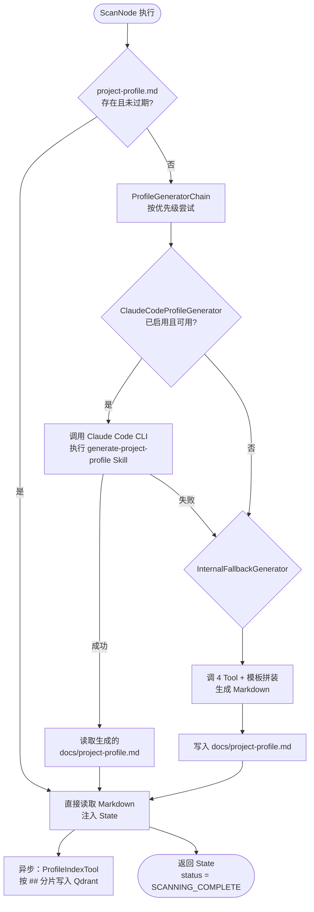
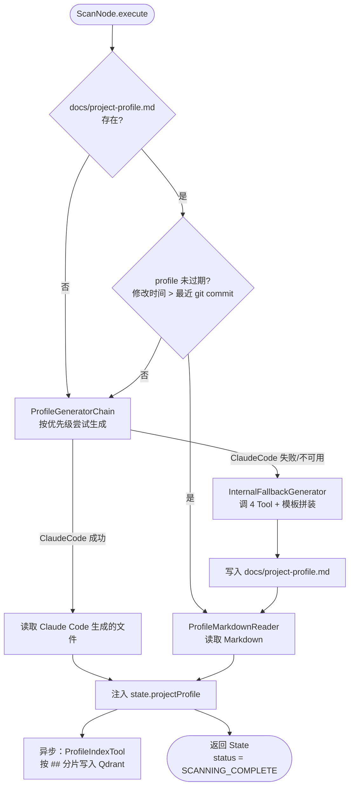

# 代码感知智能体实现设计

> 本文档是「代码感知智能开发方案智能体 v2」的**子任务实现设计**。
> 父文档：`整体方案设计-20260406-v2.md`
> 前序文档：`代码感知智能体实现-20260408-v1.md`

## 变更记录

| 版本 | 日期 | 修改人 | 变更内容摘要 |
|------|------|--------|--------------|
| v1 | 2026-04-08 | zhangkai | 初始版本：从 Tool 层文档抽离，补充 Prompt/State/记忆/执行流程 |
| v2 | 2026-04-11 | zhangkai | **代码感知层重构**：从"实时扫描 + LLM 综合"改为"Skill 生成 Markdown + 平台读取消费"模式，去掉 CodeAwarenessAgent 的 LLM 综合步骤，4 个扫描 Tool 降级为 fallback |

---

## 基本信息

| 项目 | 内容 |
|------|------|
| 功能名称 | 代码感知智能体实现 |
| 所属系统 | llm-orchestration-platform |
| 所属模块 | devplan / infrastructure.devplan.profile |
| 需求来源 | v1 的实时扫描 + LLM 综合模式存在重复造轮子、高延迟、高 Token 消耗问题 |
| 负责人 | zhangkai |
| 版本号 | v2 |

---

## 1. 背景与目标

### 1.1 v2 方案回顾

v2 设计了完整的 4 角色 Agent 协作链路：

```
ScanNode(CODE_AWARENESS Agent) → AnalyzeNode → DesignNode ⇄ ReviewNode
```

其中 ScanNode 的执行流程：
1. 调用 4 个扫描 Tool（ProjectScan + DependencyAnalysis + CodeStructure + ConfigScan）
2. LLM 综合推理，生成 ProjectProfile JSON（7 维度）+ ArchTopology JSON
3. ProfileIndexTool 按维度分片写入 Qdrant

### 1.2 v2 的问题

| 问题 | 影响 |
|------|------|
| **每次请求都实时扫描 + LLM 综合** | 延迟 15-30s，每次消耗 ~8K token |
| **自建扫描器适配成本高** | JavaSpringAnalyzer 只支持 Java Spring，其他语言/框架需要各写一套 |
| **重复造轮子** | 编码工具（Claude Code / Cursor / Windsurf）本身就是最好的代码理解引擎 |
| **LLM 做 JSON→JSON 转换无必要** | 4 个 Tool 的输出已经是结构化数据，模板拼装就够了 |
| **Profile JSON 不可读** | 人无法审查和修正，只能被程序消费 |

### 1.3 v2 目标

**核心思想：代码感知委托给编码工具，平台只消费标准化 Markdown。**

| 目标 | 衡量标准 |
|------|---------|
| 去掉 ScanNode 的 LLM 综合步骤 | ScanNode 不再调用 LLM |
| 代码感知结果可缓存、可复用 | 同一项目重复请求，读文件 < 100ms |
| 语言/框架无关 | 不需要为每种语言写 Analyzer |
| 人可审查修正 | 输出 Markdown，人可直接编辑 |
| 向后兼容 | 4 个扫描 Tool 保留为 fallback |

---

## 2. 新架构设计

### 2.1 架构对比

```
v1 架构：
  Request → ScanNode → Agent(LLM) → 调 4 Tool → LLM 综合 → Profile JSON → Qdrant
                                                              ↓
                                                    AnalyzeNode 消费 JSON

v2 架构：
  缓存命中 → ScanNode → 读 Markdown → 注入 State → AnalyzeNode 消费 Markdown
  缓存未命中 → ScanNode → ProfileGenerator(SPI) → ClaudeCodeProfileGenerator
                                                      ↓
                                               调 Claude Code CLI 执行 Skill
                                                      ↓
                                               生成 project-profile.md
  兜底       → InternalFallbackGenerator → 调 4 Tool + 模板拼装
  异步       → ProfileIndexTool → 按 ## 标题分片 → 写入 Qdrant
```

### 2.2 SPI 分层策略

**核心设计：** `ProfileGenerator` 是 SPI 接口，ScanNode 不关心画像怎么生成，只关心拿到 Markdown。



### 2.3 过期判断策略

```java
private boolean isProfileFresh(Path profilePath, String projectPath) {
    if (!Files.exists(profilePath)) return false;
    // 比较 profile 文件修改时间 vs 最近一次 git commit 时间
    Instant profileTime = Files.getLastModifiedTime(profilePath).toInstant();
    Instant lastCommit = getLastCommitTime(projectPath);
    return profileTime.isAfter(lastCommit);
}
```

**规则：** profile 文件的修改时间晚于项目最近一次 git commit 时间，则视为未过期。

---

## 3. ProfileGenerator SPI 设计

### 3.1 接口定义

```java
/**
 * 项目画像生成器 SPI。
 * 不同实现对应不同的编码工具（Claude Code / Cursor / 内部 Fallback）。
 */
public interface ProfileGenerator {

    /**
     * 生成项目画像 Markdown。
     * @param projectPath 项目根目录绝对路径
     * @return 生成的 Markdown 内容；生成失败返回 empty
     */
    Optional<String> generate(String projectPath);

    /**
     * 当前生成器是否可用（配置已启用 + 外部依赖可达）。
     */
    boolean isAvailable();

    /**
     * 优先级，数值越小优先级越高。
     */
    int order();

    /**
     * 是否基于大模型 CLI 编程工具（如 Claude Code / Cursor）。
     * require-llm-generator=true 时，只有 isLlmBased()=true 的生成器参与 SPI 链。
     * 默认 false（内部 Tool 模板拼装类生成器返回 false）。
     */
    default boolean isLlmBased() {
        return false;
    }
}
```

### 3.2 实现类

| 实现类 | order | 说明 |
|--------|-------|------|
| `ClaudeCodeProfileGenerator` | 10 | **第一版主实现**。调用 Claude Code CLI 执行 `generate-project-profile` Skill |
| `InternalFallbackGenerator` | 99 | 兜底。调用 4 个扫描 Tool + 模板拼装，不经 LLM |

### 3.3 编排器

```java
@Service
public class ProfileGeneratorChain {

    private final List<ProfileGenerator> generators; // 按 order 排序注入
    private final DevPlanProfileProperties properties;

    /**
     * 按优先级依次尝试，第一个成功即返回。
     * 当 require-llm-generator=true 时，跳过 InternalFallbackGenerator，
     * 所有 LLM CLI 生成器失败则直接抛出异常。
     */
    public String generateOrThrow(String projectPath) {
        boolean requireLlm = properties.isRequireLlmGenerator();

        for (ProfileGenerator gen : generators) {
            // 强制模式下跳过非 LLM 生成器（Fallback）
            if (requireLlm && !gen.isLlmBased()) {
                log.info("ProfileGenerator [{}] skipped: require-llm-generator=true",
                    gen.getClass().getSimpleName());
                continue;
            }
            if (!gen.isAvailable()) {
                log.info("ProfileGenerator [{}] skipped: not available", gen.getClass().getSimpleName());
                continue;
            }
            Optional<String> result = gen.generate(projectPath);
            if (result.isPresent()) {
                log.info("Profile generated by [{}]", gen.getClass().getSimpleName());
                return result.get();
            }
            log.warn("ProfileGenerator [{}] failed, trying next", gen.getClass().getSimpleName());
        }

        String msg = requireLlm
            ? "All LLM-based generators failed (require-llm-generator=true, internal fallback disabled): "
            : "All ProfileGenerators failed for: ";
        throw new ProfileGenerationException(msg + projectPath);
    }
}
```

### 3.4 配置项

```yaml
devplan:
  profile:
    # 强制要求通过大模型 CLI 编程工具生成画像
    # true：InternalFallbackGenerator 不参与 SPI 链，所有 LLM CLI 生成器失败时直接报错
    # false（默认）：LLM CLI 生成器失败后回退到内部 Tool 模板拼装
    require-llm-generator: false
    # 画像生成器开关
    generators:
      claude-code:
        enabled: true                              # 是否启用 Claude Code 生成器
        cli-path: claude                            # Claude Code CLI 路径（默认从 PATH 查找）
        timeout-seconds: 300                        # 单次执行超时
        skill-name: generate-project-profile        # 要执行的 Skill 名称
      internal-fallback:
        enabled: true                              # 是否启用内部兜底生成器（require-llm-generator=true 时忽略此项）
    # 缓存策略
    cache:
        freshness-check: git-commit-time           # 过期判断策略：git-commit-time / file-age / always-fresh
        max-age-hours: 24                          # file-age 模式下的最大缓存时长
```

---

## 4. ClaudeCodeProfileGenerator 设计（第一版主实现）

### 4.1 执行原理

通过 `ProcessBuilder` 调用 Claude Code CLI，以非交互模式（`--print`）执行 Skill：

```
claude --print --dangerously-skip-permissions \
  "请执行 generate-project-profile skill，项目路径：{projectPath}"
```

Claude Code 会：
1. 加载 team-standards 插件中的 `generate-project-profile` Skill
2. 按 Skill 定义扫描项目代码
3. 生成 `{projectPath}/docs/project-profile.md`

平台只需等待进程结束，然后读取生成的文件。

### 4.2 实现伪代码

```java
@Component
@ConditionalOnProperty(prefix = "devplan.profile.generators.claude-code", name = "enabled", havingValue = "true")
public class ClaudeCodeProfileGenerator implements ProfileGenerator {

    @Value("${devplan.profile.generators.claude-code.cli-path:claude}")
    private String cliPath;

    @Value("${devplan.profile.generators.claude-code.timeout-seconds:300}")
    private int timeoutSeconds;

    @Value("${devplan.profile.generators.claude-code.skill-name:generate-project-profile}")
    private String skillName;

    @Override
    public Optional<String> generate(String projectPath) {
        try {
            Path profilePath = Path.of(projectPath, "docs", "project-profile.md");

            // 构建 CLI 命令
            ProcessBuilder pb = new ProcessBuilder(
                cliPath,
                "--print",                          // 非交互模式
                "--dangerously-skip-permissions",    // 跳过权限确认（服务端场景）
                "--output-format", "text",
                String.format("请执行 %s skill，分析项目并生成画像文档。项目路径：%s", skillName, projectPath)
            );
            pb.directory(new File(projectPath));     // 工作目录设为项目根目录
            pb.redirectErrorStream(true);

            // 执行并等待
            Process process = pb.start();
            boolean finished = process.waitFor(timeoutSeconds, TimeUnit.SECONDS);

            if (!finished) {
                process.destroyForcibly();
                log.error("Claude Code timed out after {}s for {}", timeoutSeconds, projectPath);
                return Optional.empty();
            }

            if (process.exitValue() != 0) {
                String error = new String(process.getInputStream().readAllBytes());
                log.error("Claude Code exited with code {}: {}", process.exitValue(), error);
                return Optional.empty();
            }

            // 读取生成的文件
            if (Files.exists(profilePath)) {
                return Optional.of(Files.readString(profilePath));
            }

            log.warn("Claude Code completed but project-profile.md not found at {}", profilePath);
            return Optional.empty();

        } catch (Exception e) {
            log.error("ClaudeCodeProfileGenerator failed for {}", projectPath, e);
            return Optional.empty();
        }
    }

    @Override
    public boolean isAvailable() {
        try {
            // 检查 CLI 是否可执行
            Process p = new ProcessBuilder(cliPath, "--version")
                .redirectErrorStream(true)
                .start();
            boolean ok = p.waitFor(5, TimeUnit.SECONDS) && p.exitValue() == 0;
            if (!ok) p.destroyForcibly();
            return ok;
        } catch (Exception e) {
            return false;
        }
    }

    @Override
    public int order() {
        return 10;
    }

    @Override
    public boolean isLlmBased() {
        return true;
    }
}
```

### 4.3 Claude Code CLI 参数说明

| 参数 | 说明 |
|------|------|
| `--print` | 非交互模式，执行完毕直接输出结果到 stdout，不等待用户输入 |
| `--dangerously-skip-permissions` | 跳过所有工具权限确认弹窗（服务端无人值守场景必须） |
| `--output-format text` | 输出纯文本（不含 ANSI 转义码） |
| 工作目录 = `projectPath` | 确保 Claude Code 的文件操作相对路径正确 |

### 4.4 Claude Code 环境要求

| 要求 | 说明 |
|------|------|
| Claude Code CLI 已安装 | `npm install -g @anthropic-ai/claude-code` |
| API Key 已配置 | 环境变量 `ANTHROPIC_API_KEY` 或 `~/.claude/config.json` |
| team-standards 插件已安装 | `claude /plugin install team-standards@team-standards` |
| 网络可达 | Claude Code 需要调用 Anthropic API |

### 4.5 安全考量

| 风险 | 缓解 |
|------|------|
| `--dangerously-skip-permissions` 允许任意文件操作 | 仅在受控的服务端环境使用；Claude Code 默认在 `projectPath` 沙箱内操作 |
| API Key 泄露 | Key 通过环境变量注入，不写入配置文件；日志不输出 Key |
| Prompt 注入 | projectPath 来自系统内部（DevPlanRequest），非用户直接输入 |
| 超时进程残留 | `destroyForcibly()` + 超时后强制回收 |

---

## 5. Skill 规范（外部依赖）

### 5.1 Skill 定义

在 team-standards 插件中新增 `generate-project-profile` Skill，定义 10 维度输出规范：

| # | 维度 | 说明 | 向量化分片单元 |
|---|------|------|---------------|
| 1 | 项目概述 | 项目名、用途、构建工具、语言版本、模块列表 | 是 |
| 2 | 技术栈 | 框架、中间件、版本 | 是 |
| 3 | 项目结构 | 目录树 + 职责说明 | 是 |
| 4 | 分层架构 | 分层模式、依赖方向、违规项 | 是 |
| 5 | 数据模型 | 实体、核心字段、关联关系 | 是 |
| 6 | Service 能力清单 | 公开方法签名 + 说明 | 是 |
| 7 | API 接口 | Method + URL + 入参 + 出参 | 是 |
| 8 | 外部依赖服务 | 服务名、协议、用途 | 是 |
| 9 | 配置概要 | 关键配置项（脱敏） | 是 |
| 10 | 编码约定 | 命名规范、异常处理模式、典型代码片段 | 是 |

### 5.2 与 v1 的 7 维度 ProfileDimension 映射

| v1 ProfileDimension | v2 Markdown 维度 | 变化 |
|---------------------|-----------------|------|
| OVERVIEW | 1. 项目概述 | 保留 |
| TECH_STACK | 2. 技术栈 | 保留 |
| CODE_STRUCTURE | 3. 项目结构 | 保留 |
| API | 7. API 接口 | 保留 |
| DATA_MODEL | 5. 数据模型 | 保留 |
| ARCH_SPEC | 4. 分层架构 | 保留 |
| CONFIG | 9. 配置概要 | 保留 |
| （无） | 6. Service 能力清单 | **新增** |
| （无） | 8. 外部依赖服务 | **新增** |
| （无） | 10. 编码约定 | **新增** |

### 5.3 输出文件

```
{projectPath}/docs/project-profile.md
```

---

## 6. 组件变更清单

### 6.1 删除的组件

| 组件 | 原因 |
|------|------|
| `CodeAwarenessAgent` | 不再需要 LLM 综合推理，ScanNode 通过 SPI 链获取 Markdown |
| `DevPlanAgentConfig.CODE_AWARENESS` 的 system prompt | 不再需要 CODE_AWARENESS 角色的 LLM 指导 |

### 6.2 修改的组件

| 组件 | 变更内容 |
|------|---------|
| `ScanNode` | 重构：缓存命中读文件 → 未命中走 ProfileGeneratorChain |
| `DevPlanState` | 新增 `projectProfile: String`（Markdown 原文），废弃 structure / topology |
| `DevPlanToolRegistry` | CODE_AWARENESS 角色去掉 `profile_index`（改为异步） |
| `ProfileIndexTool` | 输入从 JSON 改为 Markdown，按 `## ` 标题分片 |
| `ProfileDimension` | 7→10 维度（新增 SERVICE_CAPABILITY / EXTERNAL_DEPENDENCY / CODING_CONVENTION） |
| `DevPlanAgentRouterImpl` | CODE_AWARENESS 分支简化，不再构建 LLM 请求 |

### 6.3 新增的组件

| 组件 | 全类名 | 说明 |
|------|--------|------|
| `ProfileGenerator` | `c.e.l.domain.devplan.service.ProfileGenerator` | **SPI 接口**，定义 generate / isAvailable / order |
| `ProfileGeneratorChain` | `c.e.l.infrastructure.devplan.profile.ProfileGeneratorChain` | 编排器，按 order 依次尝试 |
| `ClaudeCodeProfileGenerator` | `c.e.l.infrastructure.devplan.profile.ClaudeCodeProfileGenerator` | 第一版主实现，调 Claude Code CLI |
| `InternalFallbackGenerator` | `c.e.l.infrastructure.devplan.profile.InternalFallbackGenerator` | 兜底，调 4 Tool + 模板拼装 |
| `ProfileMarkdownReader` | `c.e.l.infrastructure.devplan.profile.ProfileMarkdownReader` | 读取 Markdown，按 `## ` 分片为 Map |
| `ProfileGenerationException` | `c.e.l.domain.devplan.exception.ProfileGenerationException` | 所有生成器均失败时抛出 |
| `DevPlanProfileProperties` | `c.e.l.infrastructure.devplan.config.DevPlanProfileProperties` | `@ConfigurationProperties("devplan.profile")` |

> `c.e.l` = `com.exceptioncoder.llm`

### 6.4 保留不变的组件

| 组件 | 说明 |
|------|------|
| `ProjectScanTool` / `DependencyAnalysisTool` / `CodeStructureAnalysisTool` / `ConfigScanTool` | 保留，InternalFallbackGenerator 内部调用 |
| `JavaSpringAnalyzer` | 保留，Fallback 使用 |
| `CodeIndexTool` / `CodeSearchTool` | 保留，代码向量索引独立于画像 |
| `ProfileSearchTool` | 保留，跨项目语义检索 |
| `AnalyzeNode` / `DesignNode` / `ReviewNode` | 保留，下游节点不受影响 |

---

## 7. ScanNode 新流程

### 7.1 执行流程



### 7.2 伪代码

```java
public DevPlanState execute(DevPlanState state) {
    Path profilePath = Path.of(state.projectPath(), "docs", "project-profile.md");
    String markdown;

    if (isProfileFresh(profilePath, state.projectPath())) {
        // 缓存命中
        markdown = markdownReader.readFull(profilePath);
        log.info("Profile cache hit for {}", state.projectPath());
    } else {
        // 缓存未命中，走 SPI 链
        markdown = generatorChain.generateOrThrow(state.projectPath());

        // ClaudeCode 会自己写文件，Fallback 需要手动写
        if (!Files.exists(profilePath)) {
            Files.createDirectories(profilePath.getParent());
            Files.writeString(profilePath, markdown);
        }
        log.info("Profile generated for {}", state.projectPath());
    }

    // 异步向量化（不阻塞）
    asyncExecutor.submit(() -> profileIndexTool.indexFromMarkdown(markdown, state.projectPath()));

    return state.withProjectProfile(markdown)
                .withStatus("SCANNING_COMPLETE");
}
```

---

## 8. ProfileMarkdownReader 设计

### 8.1 职责

读取 `project-profile.md`，按 `## ` 二级标题分片，返回结构化结果。

### 8.2 解析规则

```
## 1. 项目概述     → key: OVERVIEW
## 2. 技术栈       → key: TECH_STACK
## 3. 项目结构     → key: CODE_STRUCTURE
## 4. 分层架构     → key: ARCH_SPEC
## 5. 数据模型     → key: DATA_MODEL
## 6. Service 能力清单 → key: SERVICE_CAPABILITY
## 7. API 接口     → key: API
## 8. 外部依赖服务  → key: EXTERNAL_DEPENDENCY
## 9. 配置概要     → key: CONFIG
## 10. 编码约定    → key: CODING_CONVENTION
```

### 8.3 接口

```java
@Component
public class ProfileMarkdownReader {

    public Map<ProfileDimension, String> parse(String markdown) {
        // 按 "## " 分割，匹配维度编号到 ProfileDimension 枚举
    }

    public String readFull(Path profilePath) {
        return Files.readString(profilePath);
    }
}
```

---

## 9. InternalFallbackGenerator 设计

### 9.1 职责

当 ClaudeCodeProfileGenerator 不可用或失败时，调用 4 个扫描 Tool + 模板拼装生成 Markdown。**不经过 LLM**。

### 9.2 实现

```java
@Component
@ConditionalOnProperty(prefix = "devplan.profile.generators.internal-fallback", name = "enabled", havingValue = "true", matchIfMissing = true)
public class InternalFallbackGenerator implements ProfileGenerator {

    private final ProjectScanTool projectScanTool;
    private final DependencyAnalysisTool dependencyAnalysisTool;
    private final CodeStructureAnalysisTool codeStructureAnalysisTool;
    private final ConfigScanTool configScanTool;

    @Override
    public Optional<String> generate(String projectPath) {
        try {
            var scan = projectScanTool.scan(projectPath);
            var deps = dependencyAnalysisTool.analyze(projectPath);
            var structure = codeStructureAnalysisTool.analyze(projectPath);
            var config = configScanTool.scan(projectPath);

            String markdown = renderMarkdown(scan, deps, structure, config);
            return Optional.of(markdown);
        } catch (Exception e) {
            log.error("InternalFallbackGenerator failed", e);
            return Optional.empty();
        }
    }

    @Override
    public boolean isAvailable() { return true; }

    @Override
    public int order() { return 99; }
}
```

### 9.3 Fallback 的维度覆盖

| 维度 | 覆盖能力 | 说明 |
|------|---------|------|
| 1-4 | 完整 | Tool 能力覆盖 |
| 5. 数据模型 | 部分 | Entity 类和字段可提取，表间关联需 LLM |
| 6. Service 能力 | 部分 | 方法签名可提取，说明需 LLM |
| 7. API 接口 | 完整 | CodeStructureAnalysisTool 已提取 endpoint |
| 8. 外部依赖 | 部分 | 已知服务可检测，自定义服务可能遗漏 |
| 9. 配置概要 | 完整 | ConfigScanTool 覆盖 |
| 10. 编码约定 | 缺失 | 需 LLM 归纳，Fallback 标注"未检测到" |

**结论：** Fallback 覆盖约 70% 维度。推荐使用 Claude Code 生成器获得完整画像。

---

## 10. ProfileIndexTool 改造

### 10.1 变更

输入从 JSON 改为 Markdown，按 `## ` 标题分片写入 Qdrant。

### 10.2 分片策略

```java
public ProfileIndexStatus indexFromMarkdown(String markdown, String projectPath) {
    Map<ProfileDimension, String> dimensions = markdownReader.parse(markdown);

    for (var entry : dimensions.entrySet()) {
        ProfileDimension dim = entry.getKey();
        String content = entry.getValue();
        String contentHash = md5(content);

        if (isHashUnchanged(projectPath, dim, contentHash)) {
            continue;
        }

        String docId = md5(projectPath + "::" + dim.name());
        Document doc = Document.builder()
            .id(docId)
            .content(content)
            .metadata(Map.of(
                "projectName", extractProjectName(projectPath),
                "projectPath", projectPath,
                "dimension", dim.name(),
                "dimensionLabel", dim.label(),
                "contentHash", contentHash
            ))
            .build();

        profileVectorStore.add(List.of(doc));
        updateHashRecord(projectPath, dim, contentHash);
    }
}
```

### 10.3 Collection 设计

与 v1 保持一致：`project_profile`，payload 字段不变。新增 3 个维度枚举值。

---

## 11. ProfileDimension 扩展

```java
public enum ProfileDimension {
    OVERVIEW(1, "项目概述"),
    TECH_STACK(2, "技术栈"),
    CODE_STRUCTURE(3, "项目结构"),
    ARCH_SPEC(4, "分层架构"),
    DATA_MODEL(5, "数据模型"),
    SERVICE_CAPABILITY(6, "Service能力清单"),   // v2 新增
    API(7, "API接口"),
    EXTERNAL_DEPENDENCY(8, "外部依赖服务"),     // v2 新增
    CONFIG(9, "配置概要"),
    CODING_CONVENTION(10, "编码约定");          // v2 新增

    private final int index;
    private final String label;

    public static ProfileDimension fromIndex(int index) {
        return Arrays.stream(values())
            .filter(d -> d.index == index)
            .findFirst().orElse(null);
    }
}
```

---

## 12. DevPlanState 变更

```java
// v1
public record DevPlanState(
    // ...
    ProjectStructure structure,    // JSON 对象
    ArchTopology topology,         // JSON 对象
    // ...
) {}

// v2
public record DevPlanState(
    // ...
    String projectProfile,         // Markdown 原文
    @Deprecated ProjectStructure structure,  // 兼容 Fallback
    @Deprecated ArchTopology topology,       // 兼容 Fallback
    // ...
) {}
```

**迁移策略：** structure / topology 暂时保留。待下游 Node 全部迁移到消费 Markdown 后移除。

---

## 13. 下游 Agent 适配

### 13.1 REQUIREMENT_ANALYZER

```
v1：消费 state.structure + state.topology（JSON）
v2：消费 state.projectProfile（Markdown）
```

system prompt 调整：从 JSON 字段提取 → 从 Markdown 章节提取。

### 13.2 SOLUTION_ARCHITECT

```
v1：消费 state.structure + state.topology + state.impact（JSON）
v2：消费 state.projectProfile（Markdown）+ state.impact（JSON，不变）
```

### 13.3 PLAN_REVIEWER

不受影响，只消费 DevPlanDocument。

---

## 14. 核心业务规则变更

| 规则 | v1 | v2 |
|------|-----|-----|
| R1：Tool 只做机械提取，Agent 做理解 | 保留 | 保留，但 ScanNode 不再触发 Agent |
| R2：必须调用全部 4 个提取器后再综合 | 保留 | 仅 Fallback 场景适用 |
| R3：只分析不设计 | 保留 | 保留 |
| R4：输出严格 JSON | 保留 | 输出为 Markdown，向量化分片后为 JSON |
| R5：CodeIndexTool 可选但推荐 | 保留 | 保留，独立于画像生成 |
| R6：Profile 必须覆盖 7 维度 | 保留 | 扩展为 10 维度，缺失标注"未检测到" |
| **R7（新增）**：Markdown 缓存优先 | — | 优先读 profile.md，过期或缺失走 SPI 链 |
| **R8（新增）**：SPI 链优先外部工具 | — | ClaudeCode(10) → Fallback(99)，按 order 依次尝试 |
| **R9（新增）**：生成器可配置开关 | — | 每个生成器独立 `enabled` 配置项 |
| **R10（新增）**：可强制要求 LLM 生成器 | — | `require-llm-generator=true` 时跳过非 LLM 生成器，全部失败直接报错 |

---

## 15. 异常处理

| 场景 | 处理 |
|------|------|
| profile.md 不存在或已过期 | ProfileGeneratorChain 按优先级尝试生成 |
| ClaudeCode CLI 不存在 | `isAvailable()` 返回 false，跳过，尝试下一个生成器 |
| ClaudeCode 执行超时 | `destroyForcibly()` + 返回 empty，尝试下一个 |
| ClaudeCode 成功但未生成文件 | 返回 empty，尝试下一个 |
| 所有生成器均失败 | 抛出 `ProfileGenerationException`，ScanNode 标记 FAILED |
| `require-llm-generator=true` 且 LLM 生成器全部失败 | 直接抛出异常，**不回退到 InternalFallback**，ScanNode 标记 FAILED |
| profile.md 格式异常（解析失败） | 视为过期，重新走 SPI 链 |
| projectPath 不存在 | 返回 error，status = FAILED |
| Qdrant 不可用 | 画像生成不受影响，indexStatus = DEGRADED |
| git 命令不可用 | 视为过期，走 SPI 链 |

---

## 16. 性能对比

| 指标 | v1 | v2（缓存命中） | v2（ClaudeCode） | v2（Fallback） |
|------|-----|-------------|----------------|--------------|
| ScanNode 延迟 | 15-30s | < 100ms | 30-120s（首次） | 3-5s |
| LLM Token 消耗 | ~8K（自有模型） | 0 | ~50K（Anthropic API） | 0 |
| 维度覆盖 | 7/7 | 10/10 | 10/10 | 7/10 |
| 人可读性 | JSON（差） | Markdown（好） | Markdown（好） | Markdown（好） |
| 编码约定维度 | 无 | 有 | 有 | 缺失 |

**说明：** ClaudeCode 首次生成较慢但画像质量最高（10/10 维度全覆盖）。后续请求走缓存 < 100ms。

---

## 17. 实施计划

| 阶段 | 内容 | 依赖 | 状态 |
|------|------|------|------|
| Phase 1 | team-standards 新增 `generate-project-profile` Skill | 无 | **已完成** |
| Phase 2 | 新增 ProfileGenerator SPI + ProfileGeneratorChain + ProfileMarkdownReader | Phase 1 | 待开发 |
| Phase 3 | 新增 ClaudeCodeProfileGenerator | Phase 2 | 待开发 |
| Phase 4 | 新增 InternalFallbackGenerator | Phase 2 | 待开发 |
| Phase 5 | 改造 ScanNode（SPI 链消费策略） | Phase 2-4 | 待开发 |
| Phase 6 | 改造 ProfileIndexTool（Markdown 分片） | Phase 2 | 待开发 |
| Phase 7 | 扩展 ProfileDimension 枚举（7→10） | Phase 2 | 待开发 |
| Phase 8 | 新增 DevPlanProfileProperties 配置类 | Phase 2 | 待开发 |
| Phase 9 | 适配下游 Agent 的 system prompt | Phase 5 | 待开发 |
| Phase 10 | 废弃 CodeAwarenessAgent | Phase 9 | 待开发 |

---

## 18. 风险点

| 风险 | 概率 | 影响 | 缓解措施 |
|------|------|------|---------|
| Claude Code CLI 未安装或 API Key 未配置 | 中 | 主生成器不可用 | `isAvailable()` 前置检查 + Fallback 兜底 |
| Claude Code 执行时间过长 | 中 | 首次请求延迟高 | 超时控制 + 缓存后续请求走文件读取 |
| 编码工具生成的 Markdown 格式不规范 | 中 | ProfileMarkdownReader 解析失败 | 容错解析 + 视为过期重新生成 |
| Fallback 缺失编码约定维度 | 高 | 方案设计不考虑编码风格 | 明确标注"未检测到"，不阻断流程 |
| `--dangerously-skip-permissions` 安全风险 | 低 | 文件越权操作 | 仅受控服务端环境 + projectPath 来自内部 |
| Anthropic API 费用 | 中 | 每次首次生成消耗 ~50K token | 缓存机制确保只有首次/变更后才调用 |
| profile.md 被人手动破坏格式 | 低 | 解析失败 | 容错解析 + 重新生成 |
