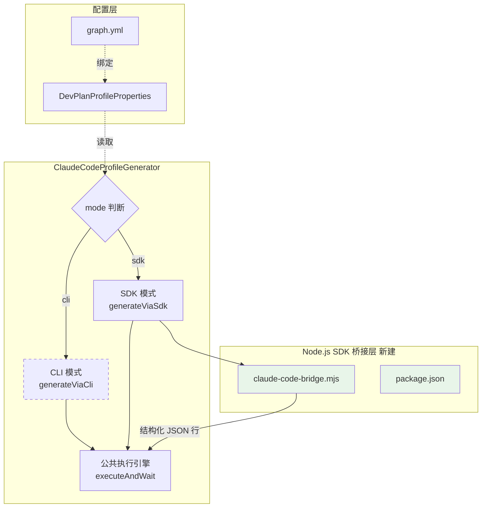
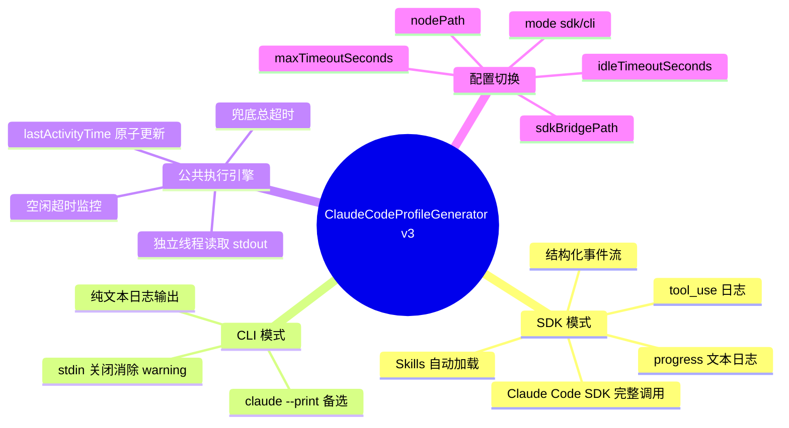
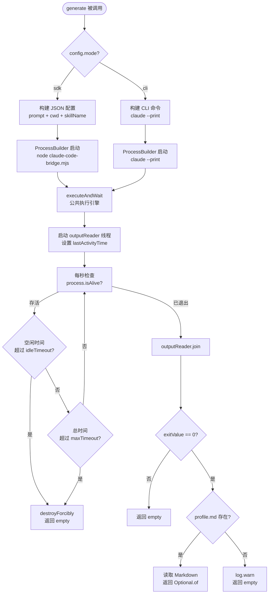
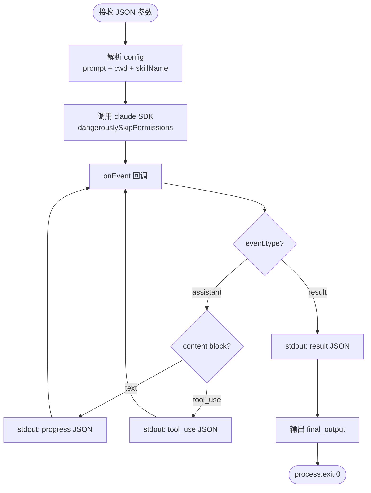
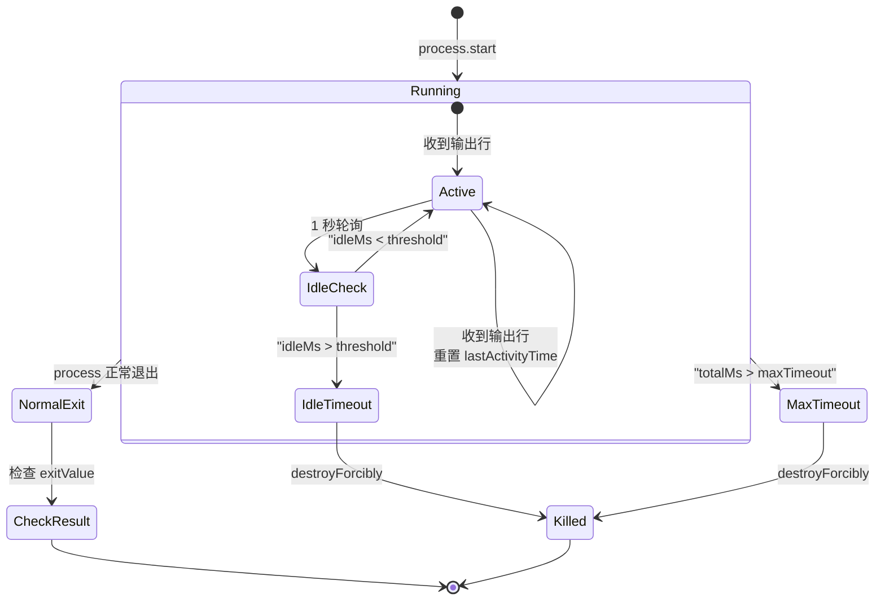
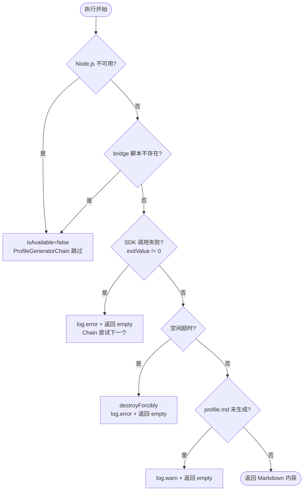
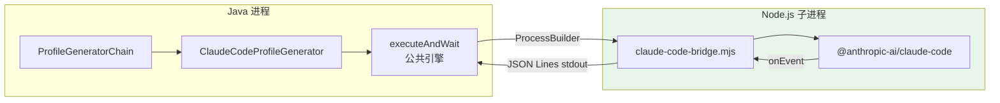
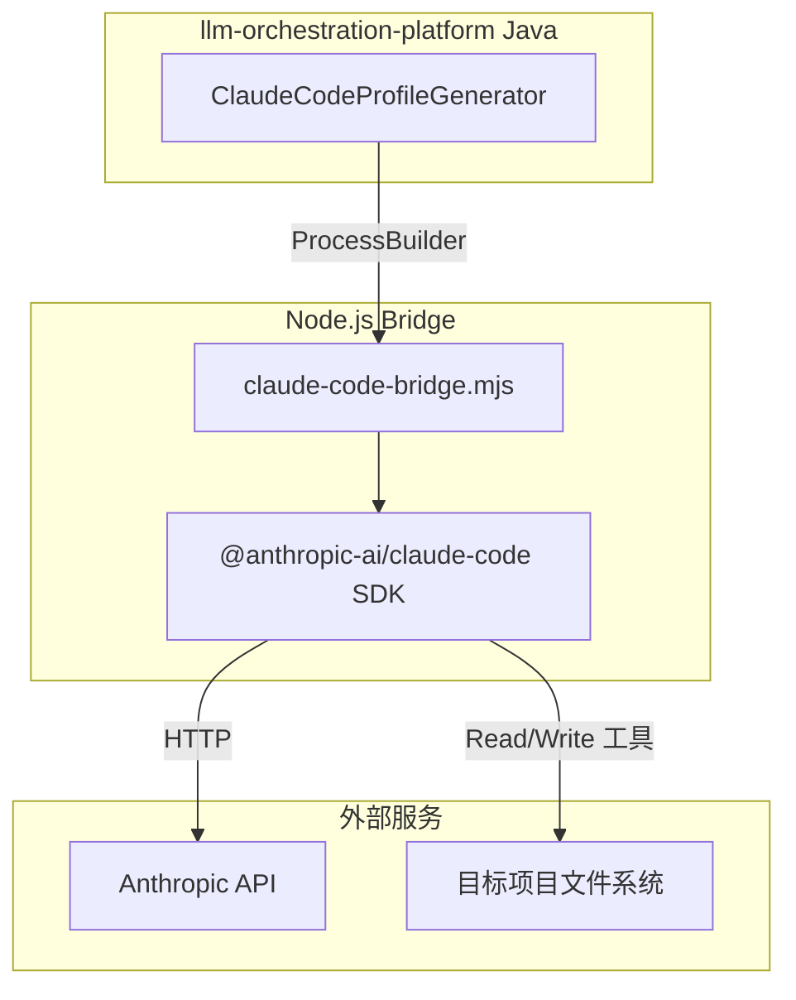

# 代码感知智能体实现设计

> 本文档是「代码感知智能开发方案智能体 v2」的**子任务实现设计**。
> 父文档：`整体方案设计-20260406-v2.md`
> 前序文档：`代码感知智能体实现-20260411-v2.md`

## 变更记录

| 版本 | 日期 | 修改人 | 变更内容摘要 |
|------|------|--------|--------------|
| v1 | 2026-04-08 | zhangkai | 初始版本：从 Tool 层文档抽离，补充 Prompt/State/记忆/执行流程 |
| v2 | 2026-04-11 | zhangkai | 代码感知层重构：SPI 生成器链 + Claude Code CLI 主实现 + 4 Tool 兜底 |
| v3 | 2026-04-12 | zhangkai | **ClaudeCodeProfileGenerator 改造**：SDK 桥接模式替代纯 CLI、空闲超时替代固定总超时、双模式切换、结构化事件流日志 |

---

## 1. 基本信息

| 项目 | 内容 |
|------|------|
| 功能名称 | 代码感知智能体实现（ClaudeCodeProfileGenerator v3 改造） |
| 所属系统 | llm-orchestration-platform |
| 所属模块 | infrastructure.devplan.profile |
| 需求来源 | v2 的 CLI 调用在实际运行中暴露三个工程问题 |
| 负责人 | zhangkai |
| 版本号 | v3 |

---

## 2. 背景与目标

### 2.1 v2 回顾

v2 将代码感知从"实时扫描 + LLM 综合"改为"SPI 生成器链 + Claude Code CLI + 内部 Fallback"，核心调用方式为：

```text
Java ProcessBuilder → claude --print --dangerously-skip-permissions "执行 skill..."
```

### 2.2 v2 的问题

v2 在实际运行中暴露以下问题：

| 问题 | 影响 | 根因 |
|------|------|------|
| **`--print` 模式不加载 Skills** | Claude Code 不知道 skill 内容，只能凭 prompt 文本猜测执行 | `--print` 是轻量单次问答模式，不走完整初始化 |
| **固定 300 秒总超时** | 大项目扫描 10 维度可能需要 5-10 分钟，到时间直接强杀，前面的工作全部白费 | `process.waitFor(300, SECONDS)` 一刀切 |
| **执行期间无日志** | 调用方完全看不到 Claude Code 在做什么，无法区分"正在工作"和"已经卡死" | 原实现不读取子进程 stdout |
| **stdout 缓冲区死锁风险** | 子进程 stdout 写满后阻塞，主线程又在等子进程结束 | 未消费 stdout 流 |
| **stdin 警告** | `--print` 被 ProcessBuilder 调用时报 "no stdin data received in 3s" warning | CLI 设计面向交互终端 |
| **无结构化事件** | 只有纯文本输出，无法区分 tool 调用、进度、错误 | `--print --output-format text` 只输出最终文本 |

### 2.3 v3 目标

| 目标 | 衡量标准 |
|------|---------|
| Skills 完整加载 | Claude Code SDK 调用时 skill 触发词生效 |
| 长时间任务不被误杀 | 有输出就不中断，仅空闲超时才终止 |
| 执行过程可观测 | 日志实时输出 tool 调用、进度文本、耗时统计 |
| 向后兼容 | CLI 模式作为备选保留，通过配置切换 |
| 零 Java 新依赖 | SDK 通过 Node.js 桥接脚本调用，Java 侧仍用 ProcessBuilder |

### 2.4 设计边界

- **本次只改造 `ClaudeCodeProfileGenerator` 和相关配置类**
- 不涉及 SPI 接口变更、ScanNode 流程变更、下游 Agent 适配
- ProfileGeneratorChain / InternalFallbackGenerator / ProfileMarkdownReader 不变

---

## 3. 功能范围

### 3.1 功能模块总览图



### 3.2 能力分解图



### 3.3 功能范围说明

- **本次包含**：SDK 桥接脚本、双模式 Generator、空闲超时机制、配置扩展
- **本次不包含**：SPI 接口变更、ScanNode 改造、Fallback 改造、下游 Agent 适配
- **后续扩展**：SDK 桥接脚本可复用于其他需要调用 Claude Code 的场景

---

## 4. 业务流程设计

### 4.1 正常流程（SDK 模式）



### 4.2 SDK 桥接脚本执行流程



### 4.3 空闲超时 vs 固定超时对比



### 4.4 异常流程



---

## 5. 接口设计

v3 不涉及 HTTP 接口变更。变更范围限于内部类方法，详见第 6 节。

---

## 6. 类设计

### 6.1 分层设计

本次变更只涉及 **infrastructure 层**，不触及 domain / application：

| 层 | 包路径前缀 | 本次变更 |
|----|-----------|---------|
| Infrastructure | `c.e.l.infrastructure.devplan.profile` | 改造 ClaudeCodeProfileGenerator |
| Infrastructure | `c.e.l.infrastructure.devplan.config` | 扩展 DevPlanProfileProperties |
| Scripts | `scripts/` | 新建 Node.js 桥接脚本 |

> `c.e.l` = `com.exceptioncoder.llm`

### 6.2 核心类清单

| 全路径 | 类型 | 变更 | 一句话职责 |
|--------|------|------|-----------|
| `c.e.l.infrastructure.devplan.profile.ClaudeCodeProfileGenerator` | Component | **重构** | 双模式画像生成：SDK 主路径 + CLI 备选，公共空闲超时监控引擎 |
| `c.e.l.infrastructure.devplan.config.DevPlanProfileProperties.ClaudeCode` | Config | **修改** | 新增 mode / nodePath / sdkBridgePath / idleTimeoutSeconds / maxTimeoutSeconds，去掉 timeoutSeconds |
| `scripts/claude-code-bridge.mjs` | Script | **新建** | Node.js 桥接脚本，Java ProcessBuilder 与 Claude Code SDK 之间的协议转换层 |
| `scripts/package.json` | Config | **新建** | 桥接脚本的 npm 依赖声明 |
| `config/dev/graph.yml` | Config | **修改** | 新增 SDK 相关配置项 |

### 6.3 类调用关系



---

## 7. 数据库设计

v3 不涉及数据库变更。

---

## 8. 核心业务规则

v2 规则全部保留（R1-R10），v3 新增：

| 规则 | 说明 |
|------|------|
| **R11（新增）** | SDK 模式为默认推荐模式，CLI 模式作为备选。通过 `mode` 配置项切换 |
| **R12（新增）** | 空闲超时优先于总超时。只要子进程持续有 stdout 输出，就不应中断 |
| **R13（新增）** | 桥接脚本输出格式为 JSON Lines（每行一个 JSON 对象），type 字段区分：progress / tool_use / result / error / final_output |
| **R14（新增）** | `isAvailable()` 根据当前 mode 检查不同依赖：SDK 检查 node + bridge 脚本是否存在，CLI 检查 claude 命令是否可用 |
| **R15（新增）** | `executeAndWait` 是公共方法，SDK 和 CLI 共享进程监控逻辑，不重复实现 |

---

## 9. 事务与并发控制

v3 不涉及事务变更。进程级并发由 ProfileGeneratorChain 的串行调用保证。

---

## 10. 缓存设计

不变，沿用 v2 的 `docs/project-profile.md` 文件缓存 + git-commit-time 过期策略。

---

## 11. 消息与异步设计

不变，沿用 v2 的 ProfileIndexTool 异步向量化。

---

## 12. 下游依赖设计



| 依赖 | 说明 | 失败影响 |
|------|------|---------|
| Node.js runtime | `node` 命令可用 | SDK 模式不可用，可切换 CLI |
| `@anthropic-ai/claude-code` npm 包 | `scripts/` 目录下安装 | SDK 模式不可用 |
| Anthropic API | Claude Code 底层 API | 两种模式均不可用，走 Fallback |
| 目标项目文件系统 | Claude Code 读写项目文件 | 画像生成失败 |

---

## 13. 安全设计

沿用 v2 安全设计，补充：

| 风险 | 缓解 |
|------|------|
| 桥接脚本注入 | JSON 参数做 `escapeJson` 转义，projectPath 来自系统内部 |
| Node.js 子进程权限 | `dangerouslySkipPermissions` 仅在受控服务端环境使用 |
| npm 供应链安全 | `@anthropic-ai/claude-code` 为 Anthropic 官方包，锁定主版本号 |

---

## 14. 日志与监控设计

### 14.1 日志输出

v3 的核心改进之一：

| 模式 | 日志前缀 | 日志内容 |
|------|---------|---------|
| SDK | `[SDK]` | progress 文本、tool 名称 + 输入摘要、result 统计、error 详情 |
| CLI | `[CLI]` | 原始 stdout 逐行输出 |
| 公共 | 无前缀 | 启动信息、空闲超时报警、总超时报警、耗时统计 |

### 14.2 关键监控指标

| 指标 | 来源 |
|------|------|
| 生成耗时 | `System.currentTimeMillis()` 差值 |
| 空闲超时次数 | log.error 计数 |
| 总超时次数 | log.error 计数 |
| 成功率 | 返回 Optional.isPresent 比例 |

---

## 15. 异常处理设计

v2 异常场景全部保留，v3 新增/变更：

| 场景 | 处理 | 变更说明 |
|------|------|---------|
| Node.js 不存在 | `isSdkAvailable()=false`，Chain 跳过 | v3 新增 |
| 桥接脚本不存在 | `isSdkAvailable()=false`，Chain 跳过 | v3 新增 |
| SDK 调用失败（exitValue!=0） | log.error + 返回 empty | v3 新增 |
| 空闲超时 | destroyForcibly + log.error + empty | v3 新增，替代固定超时 |
| 总超时（兜底） | destroyForcibly + log.error + empty | v3 变更：从 300s 调整为 1800s |
| InterruptedException | 重设中断标志 + empty | 不变 |

---

## 16. 测试要点

| 测试项 | 验证内容 |
|--------|---------|
| SDK 模式正常生成 | 启动后日志中出现 `[SDK] progress:` 和 `[SDK] tool:`，最终生成 profile.md |
| CLI 模式正常生成 | 切换 `mode=cli`，日志中出现 `[CLI]`，生成 profile.md |
| 空闲超时触发 | 模拟子进程 120 秒无输出，应被终止 |
| 有输出不超时 | 子进程每 60 秒输出一次，运行 10 分钟不被中断 |
| 兜底总超时触发 | 子进程持续输出，运行 30 分钟后被终止 |
| Node.js 不存在 | `isAvailable()=false`，Chain 跳过 SDK 尝试 Fallback |
| 桥接脚本缺失 | `isAvailable()=false` |
| 配置切换 | 环境变量 `DEVPLAN_CLAUDE_CODE_MODE=cli` 切换到 CLI 模式 |

---

## 17. 上线与回滚方案

### 上线步骤

1. 在部署服务器执行 `cd scripts && npm install` 安装 SDK 依赖
2. 确认 `node --version` 可用（Node.js >= 18）
3. 默认 `mode=sdk`，上线后观察日志中 `[SDK]` 前缀的输出
4. 若 SDK 模式异常，设置 `DEVPLAN_CLAUDE_CODE_MODE=cli` 回退

### 回滚方案

- 配置回退：`mode=cli` 即可回退到 v2 行为
- 代码回退：v3 代码中 CLI 模式逻辑与 v2 一致，回退风险极低

---

## 18. 风险点与待确认事项

| 风险 | 概率 | 影响 | 缓解 |
|------|------|------|------|
| 部署环境无 Node.js | 中 | SDK 模式不可用 | CLI 模式兜底 + Docker 镜像预装 Node.js |
| Claude Code SDK 版本不兼容 | 低 | 桥接脚本报错 | package.json 锁定 `^1` 主版本 |
| 桥接脚本 JSON 解析逻辑简陋 | 低 | 日志中部分字段提取失败 | 仅影响日志可读性，不影响功能 |
| 空闲超时阈值不合理 | 中 | 设太短误杀正常任务，设太长浪费资源 | 默认 120s，可通过环境变量调整 |

### 待确认

- [ ] 生产服务器 Node.js 版本是否满足 >= 18 要求
- [ ] Claude Code SDK `maxTurns: 50` 是否足够覆盖大项目的 10 维度扫描
