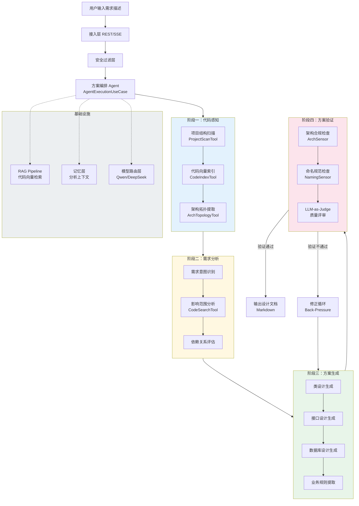
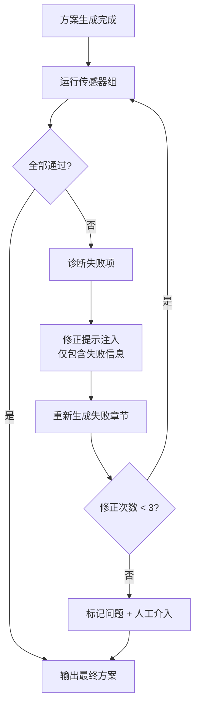
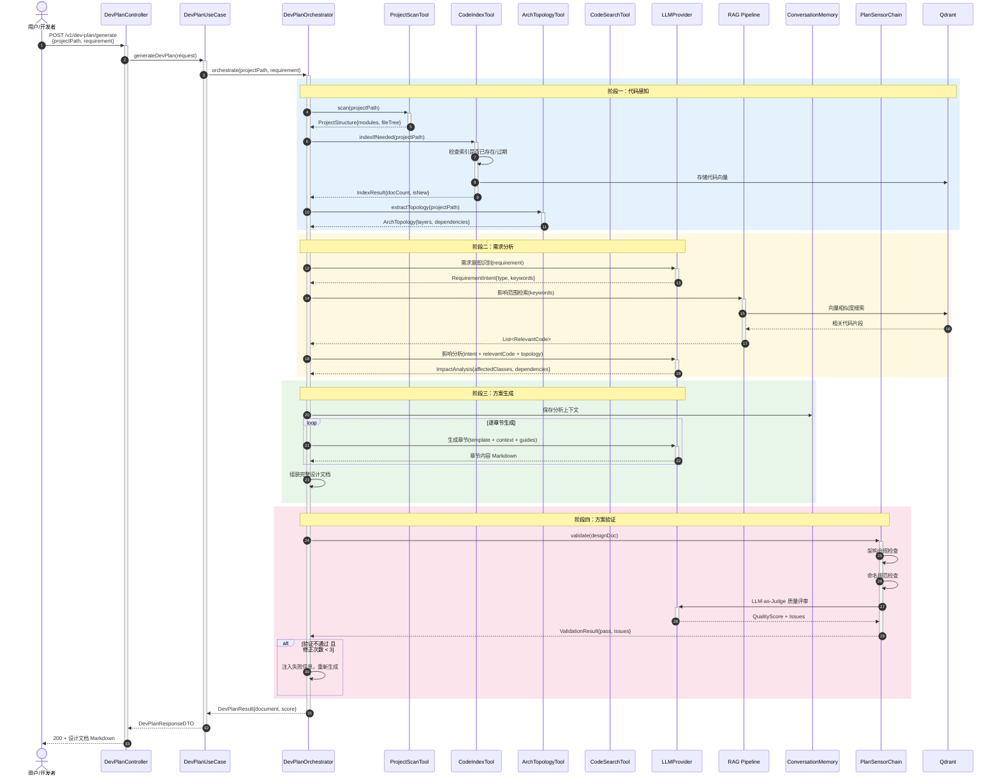
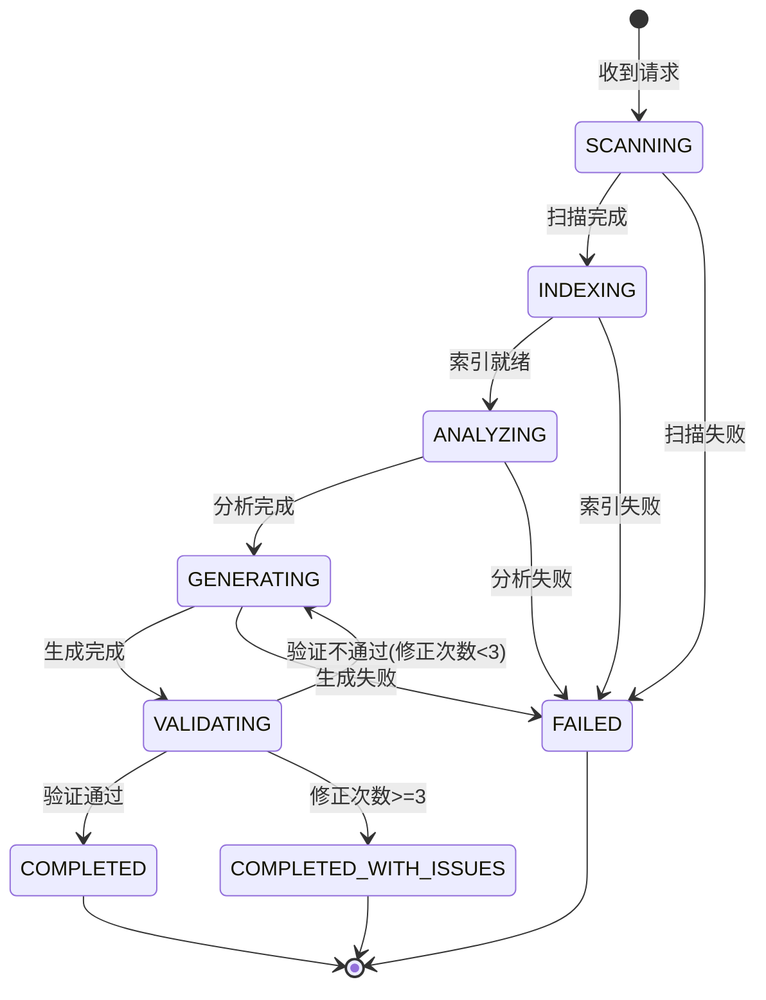

# 功能设计文档

## 变更记录

| 版本 | 日期 | 修改人 | 变更内容摘要 |
|------|------|--------|--------------|
| v1 | 2026-04-06 | zhangkai | 初始版本，定义代码感知智能开发方案智能体完整架构 |

---

## 1. 基本信息

- 功能名称：代码感知智能开发方案智能体（Code-Aware Dev Plan Agent）
- 所属系统：llm-orchestration-platform
- 所属模块：llm-domain / llm-application / llm-infrastructure
- 需求来源：团队需要一个能读取现有项目代码、自动完成需求分析与开发方案生成的智能体，减少人工编写设计文档的重复劳动，提升方案质量和一致性
- 负责人：zhangkai
- 版本号：v1

---

## 2. 背景与目标

### 背景

当前团队在接到新需求后，开发方案编写流程如下：

1. 人工阅读现有代码，理解架构和模块边界
2. 人工评估需求影响范围，确定涉及的类和接口
3. 人工编写设计文档（类设计、接口设计、数据库设计等）
4. 人工评审方案是否符合架构规范

**痛点：**

- **耗时**：理解现有代码 → 评估影响 → 输出方案，往往需要数小时到数天
- **一致性差**：不同开发者产出的方案格式、深度、质量参差不齐
- **遗漏风险**：人工分析容易遗漏隐式依赖、跨模块影响
- **架构漂移**：方案可能违反 DDD 分层规则、命名规范，审查阶段才发现

### 目标

基于「Java 大模型应用组件全景图 v3」的架构体系，构建一个 **代码感知的智能开发方案生成智能体**，实现：

1. **代码感知**：自动索引项目代码，构建结构化知识（文件树、类关系、分层拓扑）
2. **需求分析**：接收自然语言需求描述，自动分析影响范围、涉及模块、依赖关系
3. **方案生成**：按设计文档模板，自动生成类设计、接口设计、数据库设计等完整开发方案
4. **方案验证**：通过驭疆工程层（Harness Engineering）的三维控制体系，验证方案质量

### 设计边界

**本次包含（一期）：**
- 代码索引 Pipeline（项目结构解析、代码向量化、架构拓扑提取）
- 需求分析 Agent（影响范围分析、模块定位、依赖评估）
- 方案生成 Agent（按模板生成设计文档各章节）
- 方案验证 Sensor（架构合规检查、LLM-as-Judge 质量评审）

**本次不包含：**
- 代码自动生成（由方案指导人工或其他 Agent 编码）
- 多项目/多仓库联合分析
- 实时代码变更监听（增量索引）

**后续扩展：**
- 从方案直接生成骨架代码
- 增量索引（Watch 文件变更自动更新向量库）
- 多 Agent 协作：需求分析 Agent → 方案生成 Agent → 代码生成 Agent 流水线

---

## 3. 功能范围

### 3.1 功能模块总览图



### 3.2 四阶段工作流详解

#### 阶段一：代码感知（Code Awareness）

**目标**：将项目代码转化为 Agent 可理解的结构化知识。

| 子环节 | 输入 | 输出 | 实现机制 |
|--------|------|------|----------|
| 项目结构扫描 | 项目根路径 | 文件树 JSON + 模块清单 | 文件系统遍历 + Maven POM 解析 |
| 代码向量索引 | Java 源文件 | 向量化代码片段存入 Qdrant | Apache Tika 读取 → 语义切分 → Embedding → VectorStore |
| 架构拓扑提取 | 源文件 + POM | 分层依赖图（Controller→Service→Repository→Domain） | AST 解析（JavaParser）+ import 分析 |

**关键设计决策：**
- 代码切分粒度：**类级别**（每个 Java 类为一个 Document），类内方法作为 metadata
- 向量化策略：类的 Javadoc + 类签名 + 公开方法签名作为 embedding 文本，完整代码存为 metadata
- 架构拓扑存储：生成 JSON 格式的模块依赖图，缓存在 Redis 中

#### 阶段二：需求分析（Requirement Analysis）

**目标**：理解需求意图，定位影响范围。

| 子环节 | 输入 | 输出 | 实现机制 |
|--------|------|------|----------|
| 需求意图识别 | 自然语言需求 | 结构化意图（CRUD/集成/重构/新领域） | LLM 分类 + Few-shot |
| 影响范围分析 | 意图 + 代码向量库 | 涉及的类清单（全类名）+ 修改类型 | RAG 检索 + LLM 推理 |
| 依赖关系评估 | 涉及类清单 + 架构拓扑 | 上下游依赖链 + 跨模块影响 | 拓扑图遍历 + LLM 补充 |

**ReAct 循环示例：**
```
Thought: 用户要新增"简历解析"功能，需要先了解现有项目结构
Action: ProjectScanTool → 获取模块清单和分层结构
Observation: 项目有 llm-domain/application/infrastructure/api 四层...

Thought: 需要找到与文档解析相关的现有代码
Action: CodeSearchTool("文档解析 OR DocParser OR Tika")
Observation: 找到 DocViewerService, DocContent, DocStructureAgent...

Thought: 需要确认这些类的依赖关系
Action: ArchTopologyTool("DocViewerService")
Observation: DocViewerController → DocViewerService → DocSearchRepository → Qdrant

Thought: 简历解析可复用现有文档处理链路，需新增领域模型和 Service
Final Answer: 影响范围分析报告...
```

#### 阶段三：方案生成（Plan Generation）

**目标**：按设计文档模板逐章节生成方案。

| 生成章节 | 输入依据 | 生成策略 |
|----------|----------|----------|
| 类设计（全类名） | 影响范围 + 现有类结构 + DDD 分层规则 | 参考现有包命名 + 补全新增类 |
| 接口设计 | 需求意图 + 现有 Controller 风格 | 遵循现有 REST 风格 + 请求/响应 DTO |
| 数据库设计 | 领域模型 + 现有表结构 | 新增表/字段 + 索引建议 |
| 核心业务规则 | 需求描述 + 领域约束 | LLM 提炼规则条目 |
| 异常处理 | 业务流程 + 现有异常体系 | 遵循 GlobalExceptionHandler 模式 |

**Prompt 工程 — 前馈引导（Guides）：**

```
## 系统指令（注入 Agent 上下文）

你是一位资深 Java 架构师，正在为 llm-orchestration-platform 项目编写设计文档。

### 架构契约（必须遵守）
1. 分层规则：Controller 只做协议处理 → Application Service 编排用例 → Domain Service 业务规则 → Repository 数据访问
2. 包命名：com.exceptioncoder.llm.{layer}.{module}
3. 类命名：PascalCase，接口无 I 前缀，实现类加 Impl 后缀
4. 全类名要求：所有类必须写完整包路径

### 输出格式约束
按照设计文档模板的章节结构输出，每个章节用 ## 标题分隔。
类设计必须包含全类名表格。
```

#### 阶段四：方案验证（Plan Validation）

**目标**：通过驭疆工程三维控制体系验证方案质量。

| 验证维度 | 传感器类型 | 检查内容 | 实现方式 |
|----------|-----------|---------|----------|
| 架构合规 | 计算型（ms级） | 新增类是否遵循 DDD 分层，依赖方向是否正确 | 规则引擎：解析全类名包路径 → 检查层级关系 |
| 命名规范 | 计算型（ms级） | 类名/方法名/字段名是否符合 PascalCase/camelCase | 正则匹配 |
| 接口一致性 | 计算型（ms级） | 新增 API 风格是否与现有 Controller 一致 | 模式匹配：HTTP Method + 路径模式 |
| 方案完整性 | 推理型（s级） | 设计文档各章节是否完整、无遗漏 | LLM-as-Judge：按 Rubric 评分 |
| 方案可行性 | 推理型（s级） | 方案是否与现有代码兼容、是否过度设计 | LLM-as-Judge：对比现有实现风格 |

**反压修正循环（Back-Pressure）：**



---

## 4. 业务流程设计

### 4.1 正常流程



### 4.2 异常流程

| 异常场景 | 处理方式 |
|----------|----------|
| 项目路径不存在 | 返回 400，提示路径无效 |
| 项目无 Java 源文件 | 返回 400，提示不支持的项目类型 |
| 代码索引超时（>5min） | 中断索引，返回 504，建议缩小扫描范围 |
| LLM 调用失败 | 重试 2 次，仍失败返回 503 |
| 方案验证 3 次未通过 | 标记未通过章节 + 问题描述，仍输出方案供人工修正 |
| 向量库不可用 | 降级为纯 LLM 分析（无 RAG 增强），在结果中标注降级 |

### 4.3 状态流转



---

## 5. 接口设计

### 5.1 接口清单

| 接口 | Method | 路径 | 说明 |
|------|--------|------|------|
| 生成开发方案 | POST | `/v1/dev-plan/generate` | 主接口，接收需求描述，返回完整设计文档 |
| 生成开发方案（流式） | POST | `/v1/dev-plan/generate/stream` | SSE 流式输出，逐章节推送 |
| 索引项目代码 | POST | `/v1/dev-plan/index` | 单独触发代码索引，预热向量库 |
| 查询索引状态 | GET | `/v1/dev-plan/index/status` | 查询指定项目的索引状态 |

### 5.2 请求参数

#### 生成开发方案

| 字段 | 类型 | 必填 | 说明 |
|------|------|------|------|
| projectPath | String | 是 | 项目根路径（绝对路径） |
| requirement | String | 是 | 自然语言需求描述 |
| templateType | String | 否 | 文档模板类型，默认 `STANDARD`，可选 `SIMPLE`（简版） |
| scanDepth | Integer | 否 | 代码扫描深度，默认 `3`（目录层级） |
| forceReindex | Boolean | 否 | 是否强制重建索引，默认 `false` |

#### 索引项目代码

| 字段 | 类型 | 必填 | 说明 |
|------|------|------|------|
| projectPath | String | 是 | 项目根路径 |
| includePatterns | List\<String\> | 否 | 包含的文件模式，默认 `["**/*.java"]` |
| excludePatterns | List\<String\> | 否 | 排除的文件模式，默认 `["**/test/**", "**/target/**"]` |

### 5.3 返回参数

#### 生成开发方案

| 字段 | 类型 | 说明 |
|------|------|------|
| document | String | 完整设计文档（Markdown 格式） |
| impactAnalysis | ImpactAnalysisVO | 影响范围分析结果 |
| impactAnalysis.affectedClasses | List\<String\> | 涉及的全类名列表 |
| impactAnalysis.affectedModules | List\<String\> | 涉及的模块列表 |
| impactAnalysis.dependencyChain | List\<String\> | 上下游依赖链 |
| validationResult | ValidationResultVO | 方案验证结果 |
| validationResult.passed | Boolean | 是否全部通过 |
| validationResult.score | Integer | 质量评分（0-100） |
| validationResult.issues | List\<String\> | 未通过的检查项 |
| metadata | MetadataVO | 执行元数据 |
| metadata.elapsedMs | Long | 总耗时 |
| metadata.tokenUsage | Integer | Token 消耗 |
| metadata.modelUsed | String | 使用的模型 |

### 5.4 错误码设计

| 错误码 | HTTP 状态 | 说明 |
|--------|----------|------|
| 40001 | 400 | 项目路径无效或不存在 |
| 40002 | 400 | 需求描述为空 |
| 40003 | 400 | 不支持的项目类型（无 Java 源文件） |
| 50001 | 503 | LLM 服务不可用 |
| 50002 | 504 | 代码索引超时 |
| 50003 | 500 | 方案生成内部错误 |

### 5.5 请求示例

**请求示例：**

```http
POST /v1/dev-plan/generate
Content-Type: application/json

{
  "projectPath": "/Users/zhangkai/IdeaProjects/llm-orchestration-platform",
  "requirement": "新增简历解析功能：用户上传 PDF/Word 格式简历，系统自动提取结构化信息（姓名、学历、工作经历、技能标签），存储到数据库，并支持按技能标签检索",
  "templateType": "STANDARD",
  "forceReindex": false
}
```

**响应示例（成功）：**

```json
{
  "code": 0,
  "data": {
    "document": "# 功能设计文档\n\n## 变更记录\n...\n\n## 6. 类设计\n### 6.2 核心类清单\n| com.exceptioncoder.llm.domain.model.Resume | Domain | 简历领域模型 | 新建 |\n...",
    "impactAnalysis": {
      "affectedClasses": [
        "com.exceptioncoder.llm.domain.model.Resume",
        "com.exceptioncoder.llm.domain.repository.ResumeRepository",
        "com.exceptioncoder.llm.application.usecase.ResumeParseUseCase",
        "com.exceptioncoder.llm.infrastructure.parser.ResumeParserImpl",
        "com.exceptioncoder.llm.api.controller.ResumeController"
      ],
      "affectedModules": ["llm-domain", "llm-application", "llm-infrastructure", "llm-api"],
      "dependencyChain": [
        "ResumeController → ResumeParseUseCase → ResumeParserImpl → LLMProvider",
        "ResumeController → ResumeParseUseCase → ResumeRepository → MySQL"
      ]
    },
    "validationResult": {
      "passed": true,
      "score": 92,
      "issues": []
    },
    "metadata": {
      "elapsedMs": 45200,
      "tokenUsage": 18500,
      "modelUsed": "qwen-max"
    }
  }
}
```

**响应示例（失败）：**

```json
{
  "code": 40001,
  "message": "项目路径不存在: /invalid/path"
}
```

---

## 6. 类设计

### 6.1 分层设计

| 层 | 包路径前缀 | 职责 |
|----|-----------|------|
| API 层 | `com.exceptioncoder.llm.api.controller` | HTTP 入口，参数校验 |
| API DTO | `com.exceptioncoder.llm.api.dto.devplan` | 请求/响应传输对象 |
| Application 层 | `com.exceptioncoder.llm.application.usecase` | 编排四阶段流程 |
| Domain 层 | `com.exceptioncoder.llm.domain.devplan` | 领域模型、策略接口 |
| Infrastructure - Agent | `com.exceptioncoder.llm.infrastructure.devplan` | Agent 实现、工具实现 |
| Infrastructure - Tool | `com.exceptioncoder.llm.infrastructure.devplan.tool` | 代码感知工具集 |
| Infrastructure - Sensor | `com.exceptioncoder.llm.infrastructure.devplan.sensor` | 方案验证传感器 |

### 6.2 核心类清单

| 全类名 | 类型 | 职责说明 | 是否新建 |
|--------|------|----------|----------|
| **API 层** | | | |
| `com.exceptioncoder.llm.api.controller.DevPlanController` | Controller | 开发方案 REST 接口入口 | 新建 |
| `com.exceptioncoder.llm.api.dto.devplan.DevPlanRequest` | DTO | 生成方案请求参数 | 新建 |
| `com.exceptioncoder.llm.api.dto.devplan.DevPlanResponse` | DTO | 生成方案响应（含文档+分析+验证） | 新建 |
| `com.exceptioncoder.llm.api.dto.devplan.CodeIndexRequest` | DTO | 索引请求参数 | 新建 |
| `com.exceptioncoder.llm.api.dto.devplan.CodeIndexStatusResponse` | DTO | 索引状态响应 | 新建 |
| **Application 层** | | | |
| `com.exceptioncoder.llm.application.usecase.DevPlanUseCase` | UseCase | 编排「代码感知→需求分析→方案生成→方案验证」四阶段 | 新建 |
| **Domain 层** | | | |
| `com.exceptioncoder.llm.domain.devplan.model.ProjectStructure` | Record | 项目结构（模块列表、文件树、POM 信息） | 新建 |
| `com.exceptioncoder.llm.domain.devplan.model.ArchTopology` | Record | 架构拓扑（分层关系、模块依赖图） | 新建 |
| `com.exceptioncoder.llm.domain.devplan.model.RequirementIntent` | Record | 需求意图（类型、关键词、复杂度） | 新建 |
| `com.exceptioncoder.llm.domain.devplan.model.ImpactAnalysis` | Record | 影响分析（涉及类、涉及模块、依赖链） | 新建 |
| `com.exceptioncoder.llm.domain.devplan.model.DevPlanDocument` | Record | 生成的设计文档（各章节内容） | 新建 |
| `com.exceptioncoder.llm.domain.devplan.model.ValidationResult` | Record | 验证结果（是否通过、评分、问题列表） | 新建 |
| `com.exceptioncoder.llm.domain.devplan.model.CodeIndexStatus` | Record | 索引状态（文档数、最后更新时间、状态） | 新建 |
| `com.exceptioncoder.llm.domain.devplan.service.DevPlanOrchestrator` | Interface | 方案编排服务接口（四阶段协调） | 新建 |
| `com.exceptioncoder.llm.domain.devplan.service.PlanSensor` | Interface | 方案验证传感器接口 | 新建 |
| `com.exceptioncoder.llm.domain.devplan.service.PlanGenerator` | Interface | 方案生成器接口 | 新建 |
| **Infrastructure 层 - 编排** | | | |
| `com.exceptioncoder.llm.infrastructure.devplan.DevPlanOrchestratorImpl` | Service 实现 | 基于 ReAct 循环的四阶段编排实现 | 新建 |
| `com.exceptioncoder.llm.infrastructure.devplan.DevPlanAgentDefinition` | Config | Agent 定义（SystemPrompt、工具集、模型配置） | 新建 |
| **Infrastructure 层 - 工具** | | | |
| `com.exceptioncoder.llm.infrastructure.devplan.tool.ProjectScanTool` | @Tool | 项目结构扫描工具 | 新建 |
| `com.exceptioncoder.llm.infrastructure.devplan.tool.CodeIndexTool` | @Tool | 代码向量索引工具（调用 RAG Pipeline） | 新建 |
| `com.exceptioncoder.llm.infrastructure.devplan.tool.ArchTopologyTool` | @Tool | 架构拓扑提取工具（JavaParser AST 分析） | 新建 |
| `com.exceptioncoder.llm.infrastructure.devplan.tool.CodeSearchTool` | @Tool | 代码语义搜索工具（RAG 检索） | 新建 |
| `com.exceptioncoder.llm.infrastructure.devplan.tool.FileReadTool` | @Tool | 文件内容读取工具（指定类的完整代码） | 新建 |
| **Infrastructure 层 - 传感器** | | | |
| `com.exceptioncoder.llm.infrastructure.devplan.sensor.ArchComplianceSensor` | PlanSensor 实现 | 架构分层合规检查（计算型） | 新建 |
| `com.exceptioncoder.llm.infrastructure.devplan.sensor.NamingConventionSensor` | PlanSensor 实现 | 命名规范检查（计算型） | 新建 |
| `com.exceptioncoder.llm.infrastructure.devplan.sensor.LlmJudgeSensor` | PlanSensor 实现 | LLM-as-Judge 质量评审（推理型） | 新建 |
| `com.exceptioncoder.llm.infrastructure.devplan.sensor.PlanSensorChain` | 传感器链 | 按序执行所有传感器，汇总结果 | 新建 |
| **Infrastructure 层 - 生成** | | | |
| `com.exceptioncoder.llm.infrastructure.devplan.generator.TemplatePlanGenerator` | PlanGenerator 实现 | 基于模板的方案生成器（逐章节调用 LLM） | 新建 |
| **现有类（复用/扩展）** | | | |
| `com.exceptioncoder.llm.domain.executor.AgentExecutor` | Interface | Agent 执行器接口 | 复用 |
| `com.exceptioncoder.llm.infrastructure.agent.executor.AlibabaAgentExecutor` | Service 实现 | ReAct 循环实现 | 复用 |
| `com.exceptioncoder.llm.infrastructure.agent.tool.ToolRegistry` → `ToolRegistryImpl` | Registry | 工具注册表 | 复用 |
| `com.exceptioncoder.llm.infrastructure.agent.tool.ToolScanner` | Scanner | 自动发现 @Tool | 复用 |
| `com.exceptioncoder.llm.domain.service.LLMProvider` | Interface | LLM 调用抽象 | 复用 |
| `com.exceptioncoder.llm.infrastructure.provider.LLMProviderRouter` | Router | 模型路由 | 复用 |
| `com.exceptioncoder.llm.domain.repository.VectorStoreRepository` | Interface | 向量存储接口 | 复用 |
| `com.exceptioncoder.llm.infrastructure.vector.QdrantVectorStoreRepository` | Repository | Qdrant 向量存储 | 复用 |
| `com.exceptioncoder.llm.domain.repository.ConversationMemoryRepository` | Interface | 对话记忆接口 | 复用 |

### 6.3 类职责说明

**`DevPlanUseCase#generateDevPlan(DevPlanRequest)`**
编排主流程：校验参数 → 调用 DevPlanOrchestrator → 组装响应 DTO

**`DevPlanOrchestratorImpl#orchestrate(String projectPath, String requirement)`**
核心编排逻辑，串联四阶段：
1. 调用 ProjectScanTool 获取项目结构
2. 调用 CodeIndexTool 确保向量索引就绪
3. 调用 ArchTopologyTool 提取架构拓扑
4. 通过 AgentExecutor（ReAct 循环）驱动需求分析
5. 通过 TemplatePlanGenerator 逐章节生成方案
6. 通过 PlanSensorChain 验证方案，不通过则触发修正循环

**`ProjectScanTool#scan(String projectPath)`**
遍历项目目录，解析 pom.xml 获取模块结构，生成文件树 JSON

**`CodeIndexTool#indexIfNeeded(String projectPath, boolean forceReindex)`**
检查 Qdrant 中是否存在该项目的索引（按 collection 名区分）；若不存在或 forceReindex=true，扫描 Java 文件，按类级别切分，embedding 后写入向量库

**`ArchTopologyTool#extractTopology(String projectPath)`**
使用 JavaParser 解析 Java 源文件 AST，提取 import 关系、注解（@Controller/@Service/@Repository）、继承/实现关系，构建分层依赖图

**`CodeSearchTool#search(String query, int topK)`**
对 Qdrant 向量库执行语义搜索，返回相关代码片段（类签名 + 方法签名 + 所在包）

**`PlanSensorChain#validate(DevPlanDocument)`**
按顺序执行：ArchComplianceSensor → NamingConventionSensor → LlmJudgeSensor
计算型传感器前置（ms 级快速反馈），推理型传感器后置（s 级深度评审）

**`ArchComplianceSensor#check(DevPlanDocument)`**
解析文档中 6.2 节的全类名表格，校验：
- Controller 类在 api 层、Service 在 application/domain 层、Repository 在 domain/infrastructure 层
- 不允许 Controller 直接依赖 Repository
- 不允许 Infrastructure 反向依赖 Application

**`LlmJudgeSensor#check(DevPlanDocument)`**
调用评审模型（可用低成本模型如 qwen-turbo），按 Rubric 评分：
- 完整性（各章节是否填写）：0-25 分
- 一致性（类设计与接口设计是否对应）：0-25 分
- 可行性（是否与现有代码兼容）：0-25 分
- 规范性（命名、格式、全类名）：0-25 分

### 6.4 类调用关系

```
DevPlanController
  → DevPlanUseCase#generateDevPlan(DevPlanRequest)
    → DevPlanOrchestratorImpl#orchestrate(projectPath, requirement)
      → ProjectScanTool#scan(projectPath)             // 阶段一
      → CodeIndexTool#indexIfNeeded(projectPath)       // 阶段一
      → ArchTopologyTool#extractTopology(projectPath)  // 阶段一
      → AgentExecutor#execute(agentDef, messages)      // 阶段二（ReAct 循环）
        → LLMProvider#chat(request)                    //   LLM 推理
        → CodeSearchTool#search(query)                 //   RAG 检索
        → VectorStoreRepository#search(request)        //     Qdrant 查询
      → TemplatePlanGenerator#generate(context)        // 阶段三
        → LLMProvider#chat(request)                    //   逐章节生成
      → PlanSensorChain#validate(document)             // 阶段四
        → ArchComplianceSensor#check(document)         //   计算型（ms）
        → NamingConventionSensor#check(document)       //   计算型（ms）
        → LlmJudgeSensor#check(document)              //   推理型（s）
          → LLMProvider#chat(request)                  //     评审模型调用
```

---

## 7. 数据库设计

### 7.1 表设计

#### 代码索引状态表 `code_index_status`

> 记录各项目的代码索引元数据，避免重复索引。

| 字段 | 类型 | 约束 | 说明 |
|------|------|------|------|
| id | BIGINT | PK, AUTO_INCREMENT | 主键 |
| project_path | VARCHAR(500) | NOT NULL, UNIQUE | 项目绝对路径 |
| collection_name | VARCHAR(100) | NOT NULL | Qdrant 集合名 |
| doc_count | INT | NOT NULL DEFAULT 0 | 已索引文档数 |
| status | VARCHAR(20) | NOT NULL | IDLE / INDEXING / READY / FAILED |
| last_indexed_at | DATETIME | | 最后索引时间 |
| file_hash | VARCHAR(64) | | 源文件目录 hash（用于判断是否需要重建） |
| created_at | DATETIME | NOT NULL DEFAULT CURRENT_TIMESTAMP | 创建时间 |
| updated_at | DATETIME | NOT NULL DEFAULT CURRENT_TIMESTAMP ON UPDATE CURRENT_TIMESTAMP | 更新时间 |

#### 方案生成记录表 `dev_plan_record`

> 记录每次方案生成的请求和结果，供审计和评估使用。

| 字段 | 类型 | 约束 | 说明 |
|------|------|------|------|
| id | BIGINT | PK, AUTO_INCREMENT | 主键 |
| project_path | VARCHAR(500) | NOT NULL | 项目路径 |
| requirement | TEXT | NOT NULL | 原始需求描述 |
| document | LONGTEXT | | 生成的设计文档 |
| impact_analysis | JSON | | 影响分析 JSON |
| validation_score | INT | | 验证评分 |
| validation_issues | JSON | | 验证问题列表 |
| status | VARCHAR(20) | NOT NULL | PROCESSING / COMPLETED / FAILED |
| model_used | VARCHAR(50) | | 使用的模型 |
| token_usage | INT | | Token 消耗 |
| elapsed_ms | BIGINT | | 总耗时 |
| created_at | DATETIME | NOT NULL DEFAULT CURRENT_TIMESTAMP | 创建时间 |

### 7.2 索引设计

```sql
-- code_index_status
CREATE UNIQUE INDEX uk_project_path ON code_index_status(project_path);

-- dev_plan_record
CREATE INDEX idx_project_path ON dev_plan_record(project_path);
CREATE INDEX idx_created_at ON dev_plan_record(created_at);
CREATE INDEX idx_status ON dev_plan_record(status);
```

### 7.3 数据量预估

| 表 | 预估数据量 | 增长速度 |
|----|-----------|----------|
| code_index_status | 10-50 条（按项目数） | 极低 |
| dev_plan_record | 每天 5-20 条 | 低 |

---

## 8. 核心业务规则

1. **代码索引去重规则**：同一 projectPath 只维护一个 Qdrant collection；重复请求先检查 file_hash，未变化则跳过
2. **索引粒度规则**：以 Java 类为最小索引单元，embedding 文本 = 类 Javadoc + 类声明 + 所有 public 方法签名（不含方法体）
3. **架构分层校验规则**：
   - `*.api.controller.*` 只能依赖 `*.application.*`
   - `*.application.*` 可依赖 `*.domain.*`，不可依赖 `*.infrastructure.*`
   - `*.infrastructure.*` 实现 `*.domain.*` 接口
   - 不允许跨层反向依赖
4. **命名规范规则**：
   - Controller 类名必须以 `Controller` 结尾
   - UseCase 类名必须以 `UseCase` 结尾
   - Repository 接口名必须以 `Repository` 结尾
   - 实现类必须以 `Impl` 结尾
5. **全类名必填规则**：类设计章节所有类名必须包含完整包路径，否则验证不通过
6. **修正循环上限**：方案验证失败后最多重新生成 3 次，超过则标记问题交由人工
7. **Token 预算规则**：单次方案生成总 Token 消耗不超过 50,000（含所有 LLM 调用）
8. **传感器执行顺序**：计算型传感器（ms 级）必须先于推理型传感器（s 级）执行

---

## 9. 事务与并发控制

- **代码索引**：采用乐观锁（基于 status 字段），同一项目同时只允许一个索引任务；`IDLE → INDEXING` 使用 CAS 更新
- **方案生成**：无事务要求，每次生成独立记录；记录写入为单条 INSERT，无并发冲突
- **向量库写入**：CodeIndexTool 内部串行写入 Qdrant，避免同一 collection 并发写

---

## 10. 缓存设计

| 缓存项 | 缓存介质 | 过期策略 | 说明 |
|--------|---------|---------|------|
| 项目结构（ProjectStructure） | Caffeine | 10 分钟 | 避免重复文件系统遍历 |
| 架构拓扑（ArchTopology） | Caffeine | 10 分钟 | AST 解析成本高，短期缓存 |
| 索引状态（CodeIndexStatus） | Caffeine | 1 分钟 | 快速判断是否需要重建索引 |

---

## 11. 消息与异步设计

- **流式输出**：`/v1/dev-plan/generate/stream` 使用 SSE（Server-Sent Events），通过 `SseEmitter` 逐章节推送生成结果
- **异步索引**：`/v1/dev-plan/index` 返回后索引任务在后台线程池执行，通过 `/v1/dev-plan/index/status` 轮询状态

---

## 12. 下游依赖设计

| 下游服务 | 调用方式 | 说明 |
|----------|---------|------|
| `com.exceptioncoder.llm.domain.service.LLMProvider#chat(LLMRequest)` | 本地接口 | LLM 推理（需求分析、方案生成、LLM-Judge） |
| `com.exceptioncoder.llm.domain.repository.VectorStoreRepository#search(VectorSearchRequest)` | 本地接口 | RAG 代码检索 |
| `com.exceptioncoder.llm.domain.repository.VectorStoreRepository#store(Document)` | 本地接口 | 代码向量写入 |
| Qdrant HTTP API | HTTP | 向量数据库（通过 QdrantVectorStoreRepository 封装） |

---

## 13. 安全设计

- **路径校验**：projectPath 必须为合法绝对路径，禁止路径遍历（`../`）
- **文件读取限制**：只读取 `.java`、`.xml`、`.properties`、`.yml` 文件，禁止读取 `.env`、密钥文件
- **代码不出域**：代码内容只写入本地 Qdrant，不传输到外部向量库
- **输入安全**：requirement 字段经安全过滤层（L1 DFA + L2 正则），防止 Prompt 注入

---

## 14. 日志与监控设计

| 日志点 | 级别 | 内容 |
|--------|------|------|
| 收到方案生成请求 | INFO | projectPath + requirement 摘要（前 100 字） |
| 各阶段开始/完成 | INFO | 阶段名 + 耗时 |
| LLM 调用 | DEBUG | model + promptTokens + completionTokens |
| 传感器检查结果 | INFO | sensorName + passed + issues |
| 修正循环触发 | WARN | 失败项 + 修正次数 |
| 方案生成完成 | INFO | 总耗时 + 总 Token + 验证评分 |

**监控指标（Micrometer）：**
- `devplan.generate.duration`：方案生成耗时直方图
- `devplan.generate.token.usage`：Token 消耗计数
- `devplan.validation.score`：验证评分分布
- `devplan.correction.count`：修正循环次数

---

## 15. 异常处理设计

| 场景 | 异常类 | 处理方式 |
|------|--------|---------|
| 项目路径不存在 | `IllegalArgumentException` | 返回 40001 |
| Java 源文件未找到 | `UnsupportedProjectException`（新建） | 返回 40003 |
| 索引超时 | `IndexTimeoutException`（新建） | 取消索引任务，返回 50002 |
| LLM 调用异常 | `LLMProviderException`（已有） | 重试 2 次，仍失败返回 50001 |
| 向量库不可用 | `VectorStoreException` | 降级为无 RAG 模式，WARN 日志 |

---

## 16. 测试要点

| 测试类型 | 测试内容 | 优先级 |
|----------|---------|--------|
| 单元测试 | ArchComplianceSensor 规则正确性 | P0 |
| 单元测试 | NamingConventionSensor 规则正确性 | P0 |
| 单元测试 | ProjectScanTool 目录解析（含多模块项目） | P0 |
| 集成测试 | CodeIndexTool 写入 Qdrant + CodeSearchTool 检索验证 | P1 |
| 集成测试 | DevPlanOrchestrator 四阶段端到端（Mock LLM） | P1 |
| E2E 测试 | 对真实项目生成方案，LLM-as-Judge 评分 > 70 | P2 |

---

## 17. 上线与回滚方案

### 上线步骤

1. 执行 DDL：创建 `code_index_status`、`dev_plan_record` 表
2. 部署新版本（包含 DevPlan 全部新增类）
3. 验证：调用 `/v1/dev-plan/index` 对本项目索引
4. 验证：调用 `/v1/dev-plan/generate` 生成一次方案，确认各阶段正常

### 回滚方案

- 代码回滚：回退版本即可，新增的 REST 接口不被前端依赖
- 数据库：两张新表可保留不删；若需清理，DROP TABLE 即可
- 向量库：删除对应 Qdrant collection

---

## 18. 风险点与待确认事项

| 风险 | 影响 | 缓解措施 |
|------|------|---------|
| JavaParser 对 Lombok 生成代码的支持有限 | 架构拓扑提取可能遗漏 Lombok 生成的方法 | 拓扑提取以 import + 注解为主，不依赖方法体解析 |
| 大型项目索引耗时过长 | 首次索引可能超时 | 支持异步索引 + 增量索引（后续扩展） |
| LLM 生成的方案质量波动 | 方案可能不够准确 | 传感器链 + 修正循环 + 人工最终确认 |
| Token 消耗较高 | 成本增加 | Token 预算控制 + 可配置使用低成本模型 |
| 方案验证传感器误报 | 阻塞合理方案 | 传感器规则可配置开关 + 修正循环后仍可输出（带标记） |

---

## 附录 A：与组件全景图 v3 的映射关系

| 全景图组件层 | 本 Agent 使用方式 |
|-------------|------------------|
| **接入层** | REST API（DevPlanController） + SSE 流式输出 |
| **安全过滤层** | 复用现有 L1/L2/L3 过滤 requirement 输入 |
| **Agent 核心层** | 复用 AlibabaAgentExecutor（ReAct 循环），注册 5 个 @Tool |
| **驭疆工程层 - 前馈引导** | SystemPrompt 注入架构契约 + 技能库按需加载（DDD 规范、命名规范） |
| **驭疆工程层 - 反馈传感** | PlanSensorChain：ArchComplianceSensor(计算型) → NamingConventionSensor(计算型) → LlmJudgeSensor(推理型) |
| **驭疆工程层 - 反压验证** | 修正循环：失败 → 仅注入失败信息 → 重新生成 → 最多 3 次 |
| **模型路由层** | 复用 LLMProviderRouter，方案生成用 qwen-max，评审用 qwen-turbo |
| **RAG Pipeline** | 代码向量化（类级别切分 → Embedding → Qdrant） + 语义检索 |
| **记忆持久化层** | 复用 ConversationMemoryRepository 保存分析上下文 |
| **MCP 工具扩展层** | 一期不使用，后续可将 ProjectScanTool 等暴露为 MCP Server |
| **可观测性层** | Micrometer 指标 + 结构化日志 |
| **评估层** | 一期通过 LlmJudgeSensor 内嵌评估；后续独立为 Eval Pipeline |

---

## 附录 B：Prompt 模板设计（核心 Guides）

### B.1 需求分析 System Prompt

```
你是一位资深 Java 架构师，正在分析一个 DDD-lite 分层架构项目的新需求。

## 项目信息
- 基础包：com.exceptioncoder.llm
- 模块：llm-domain / llm-application / llm-infrastructure / llm-api / llm-starter
- 分层规则：Controller(api) → UseCase(application) → Domain Service(domain) → Repository(domain接口, infrastructure实现)

## 你的任务
根据用户的需求描述和检索到的相关代码，分析：
1. 需求类型（CRUD / 集成 / 重构 / 新领域模块）
2. 涉及的现有类（全类名）及修改方式（新建 / 修改 / 复用）
3. 涉及的模块和层级
4. 上下游依赖关系

## 输出格式
以 JSON 格式输出 ImpactAnalysis，包含 affectedClasses、affectedModules、dependencyChain 三个字段。
```

### B.2 方案生成 System Prompt

```
你是一位资深 Java 架构师，正在为项目生成功能设计文档。

## 架构契约（必须遵守）
1. Controller 只做协议处理，不包含业务逻辑
2. UseCase 编排用例，调用领域服务和仓储
3. Domain Service 实现业务规则，不依赖技术细节
4. 所有类名必须使用全类名（含完整包路径），基础包：com.exceptioncoder.llm
5. 命名规范：Controller 以 Controller 结尾，UseCase 以 UseCase 结尾，实现类以 Impl 结尾

## 已有项目结构
{projectStructure}

## 需求分析结果
{impactAnalysis}

## 你的任务
按照设计文档模板，逐章节生成内容。当前生成第 {sectionNumber} 节：{sectionName}。

## 约束
- 不要过度设计，只生成需求明确要求的内容
- 复用现有组件，优先扩展而非新建
- 全类名中的包路径必须遵循现有项目的包结构
```

### B.3 LLM-as-Judge Rubric

```
你是一位代码审查专家，请对以下设计文档进行质量评审。

## 评分维度（每项 0-25 分，总分 100）

### 1. 完整性（0-25）
- 类设计章节是否列出所有涉及的类？
- 接口设计是否包含请求/响应参数？
- 是否有遗漏的章节？

### 2. 一致性（0-25）
- 类设计中的类是否在接口设计中有对应体现？
- 调用关系是否与分层设计一致？
- 全类名的包路径是否一致（同一个类在不同章节中包路径相同）？

### 3. 可行性（0-25）
- 新增类是否与现有代码风格一致？
- 是否存在过度设计（不必要的抽象层）？
- 数据库设计是否合理？

### 4. 规范性（0-25）
- 所有类名是否为全类名？
- 命名是否遵循 PascalCase/camelCase 规范？
- 文档格式是否符合模板要求？

## 输出格式
{
  "completeness": { "score": N, "issues": [] },
  "consistency": { "score": N, "issues": [] },
  "feasibility": { "score": N, "issues": [] },
  "compliance": { "score": N, "issues": [] },
  "totalScore": N,
  "summary": "一句话总结"
}
```
