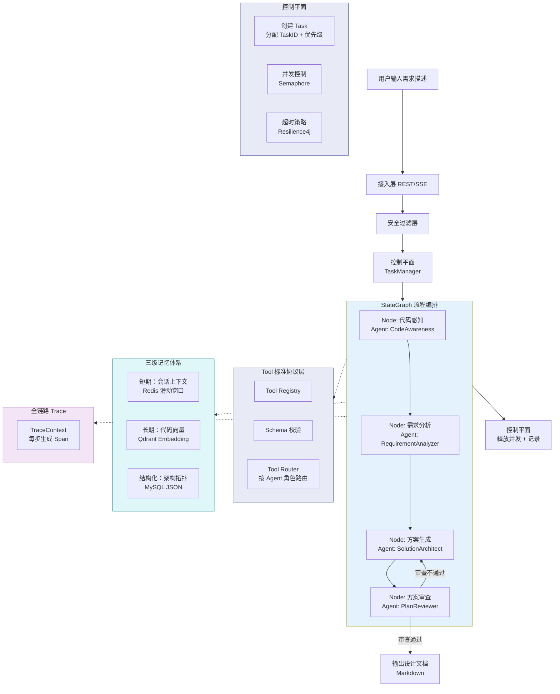
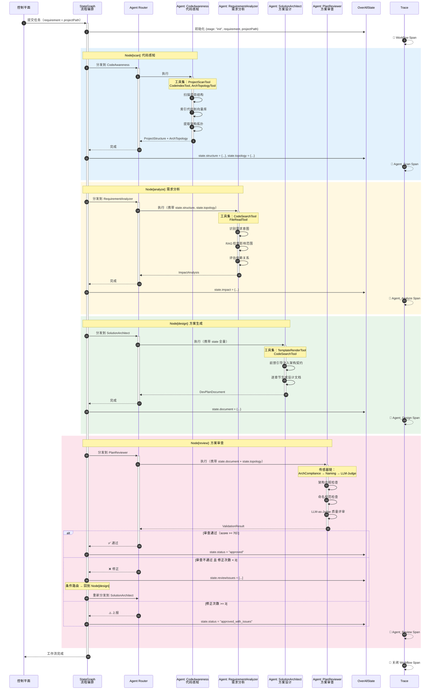
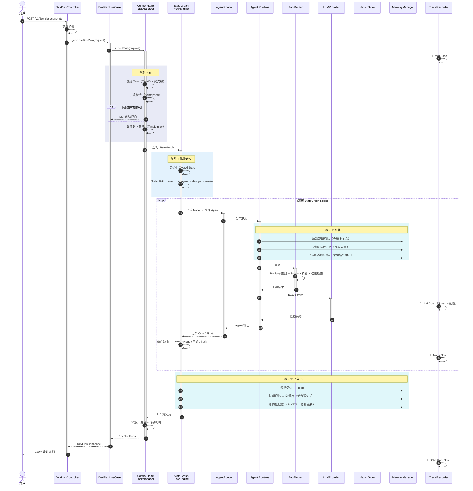
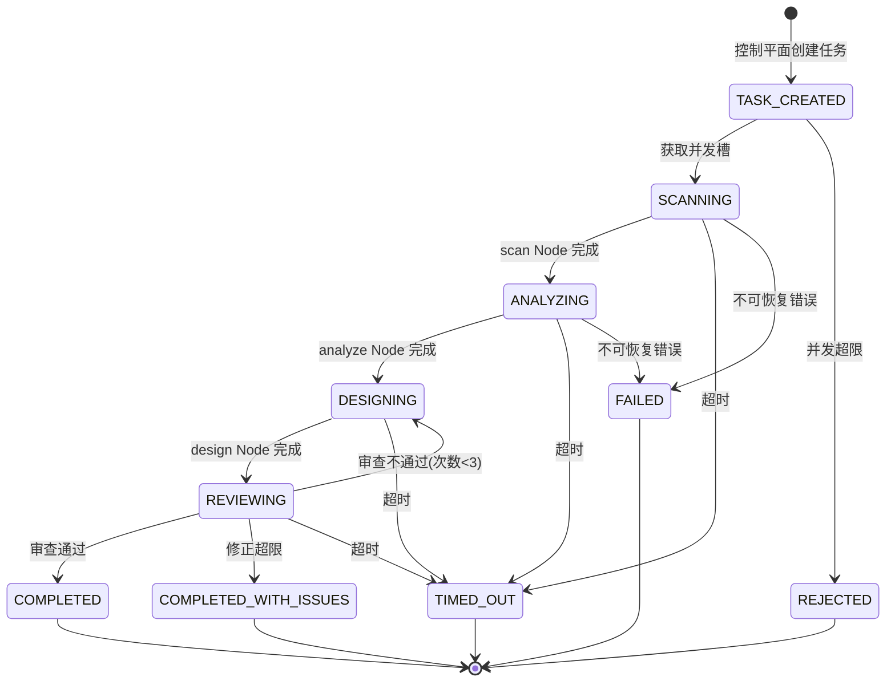

# 功能设计文档

## 变更记录

| 版本 | 日期 | 修改人 | 变更内容摘要 |
|------|------|--------|--------------|
| v1 | 2026-04-06 | zhangkai | 初始版本（基于组件全景图 v3） |
| v2 | 2026-04-06 | zhangkai | 基于全景图 v4 重构：引入控制平面、StateGraph 流程编排、多 Agent 四角色协作、Tool 标准协议层、三级记忆体系、全链路 Trace |
| v2.1 | 2026-04-06 | zhangkai | 修正 DDD 分层：流程编排（StateGraph + Node）移入 Application 层，Infrastructure 只保留技术实现 |

---

## 1. 基本信息

- 功能名称：代码感知智能开发方案智能体（Code-Aware Dev Plan Agent）
- 所属系统：llm-orchestration-platform
- 所属模块：llm-domain / llm-application / llm-infrastructure
- 需求来源：基于组件全景图 v4 架构，构建可控的多 Agent 协作式开发方案生成系统
- 负责人：zhangkai
- 版本号：v2

---

## 2. 背景与目标

### 背景

v1 方案采用单 Agent + 硬编码四阶段串行架构。随着组件全景图升级到 v4，架构能力已从 L2（单 Agent 系统）演进到 L4（可控 AI 工程系统），v1 方案存在以下不足：

1. **单 Agent 上下文膨胀**：一个 Agent 承载分析+设计+生成+验证全部职责，Prompt 过长，质量下降
2. **流程不可控**：硬编码串行无法支持条件分支、并行执行、失败回退
3. **无任务管理**：缺乏并发控制、超时熔断、人工介入能力
4. **工具无治理**：5 个 @Tool 直接注册，无权限管理和 Schema 校验
5. **记忆扁平**：只有会话记忆，缺乏项目级长期记忆和结构化知识

### 目标

基于 v4 全景图，将架构从 L2 升级到 **L4（可控多 Agent 系统）**：

1. **多 Agent 协作**：拆分为 4 个角色 Agent，各司其职，通过 StateGraph 编排
2. **确定性流程**：用 Flow Engine（StateGraph）定义工作流骨架，LLM 只负责各节点内的推理
3. **可控执行**：引入控制平面管理任务生命周期，支持并发限流、超时熔断、人工介入
4. **工具治理**：通过 Tool 标准协议层统一注册、Schema 校验、权限路由
5. **三级记忆**：短期（会话上下文）+ 长期（项目代码向量）+ 结构化（架构拓扑缓存）
6. **全链路可追踪**：每个 Agent、每次工具调用、每次 LLM 推理均生成 Span

### 设计边界

**本次包含（一期 + 二期合并）：**
- 控制平面（TaskManager + 并发控制 + 超时策略）
- StateGraph 流程编排（4 节点 DAG + 条件路由）
- 多 Agent 四角色拆分（分析 / 设计 / 生成 / 审查）
- Tool 标准协议层（Registry + Schema + Router）
- 三级记忆体系（短期 + 长期 + 结构化）
- 全链路 Trace（Span 贯穿）

**本次不包含：**
- 代码自动生成（方案指导人工或后续 Agent 编码）
- 人工介入审批工作流（P3 阶段）
- 多租户隔离
- 动态工作流市场

**后续扩展：**
- Agent 角色可热插拔（从配置加载新角色）
- Supervisor 模式（管理者 Agent 动态调度）
- Handoff 模式（Agent 间主动移交）

---

## 3. 功能范围

### 3.1 功能模块总览图



### 3.2 四角色 Agent 协作模型



### 3.3 各角色 Agent 工具集分配

| Agent 角色 | 职责 | 分配工具集 | Prompt 前馈引导 |
|-----------|------|-----------|----------------|
| **CodeAwareness** | 项目结构扫描、代码索引、架构拓扑提取 | ProjectScanTool, CodeIndexTool, ArchTopologyTool | 项目分析专家 + 输出结构约束 |
| **RequirementAnalyzer** | 需求意图识别、影响范围分析、依赖评估 | CodeSearchTool, FileReadTool | 需求分析专家 + DDD 分层知识 |
| **SolutionArchitect** | 按模板逐章节生成设计文档 | CodeSearchTool, TemplateRenderTool | 架构师 + 架构契约 + 编码规范 |
| **PlanReviewer** | 架构合规、命名规范、LLM-Judge 质量评审 | （无外部工具，内置传感器链） | 评审专家 + Rubric 评分标准 |

---

## 4. 业务流程设计

### 4.1 正常流程



### 4.2 异常流程

| 异常场景 | 处理层 | 处理方式 |
|----------|--------|---------|
| 项目路径不存在 | API 层 | 返回 400，提示路径无效 |
| 并发超限 | 控制平面 | 返回 429，提示排队等待 |
| 任务超时 | 控制平面 | TimeLimiter 触发，取消工作流，返回 504 |
| Agent 执行失败 | Flow Engine | 根据条件路由重试或上报 |
| LLM 调用失败 | Agent Runtime | 重试 2 次，仍失败标记 Node 失败 |
| 方案审查不通过 | Flow Engine | 条件路由回退到 design Node，最多 3 次 |
| 修正超限 | Flow Engine | 标记 `approved_with_issues`，输出带问题标记的方案 |
| 向量库不可用 | Agent Runtime | 降级为无 RAG 模式，在结果中标注 |
| 工具调用权限拒绝 | Tool Router | 记录日志，跳过该工具调用，通知 Agent |

### 4.3 状态流转（OverAllState）



---

## 5. 接口设计

### 5.1 接口清单

| 接口 | Method | 路径 | 说明 |
|------|--------|------|------|
| 生成开发方案 | POST | `/v1/dev-plan/generate` | 主接口，返回完整设计文档 |
| 生成方案（流式） | POST | `/v1/dev-plan/generate/stream` | SSE 流式，按 Node 推送进度 |
| 索引项目代码 | POST | `/v1/dev-plan/index` | 单独触发代码索引预热 |
| 查询索引状态 | GET | `/v1/dev-plan/index/status` | 查询索引状态 |
| 查询任务状态 | GET | `/v1/dev-plan/task/{taskId}` | 查询方案生成任务执行状态 |

### 5.2 请求参数

#### 生成开发方案

| 字段 | 类型 | 必填 | 说明 |
|------|------|------|------|
| projectPath | String | 是 | 项目根路径（绝对路径） |
| requirement | String | 是 | 自然语言需求描述 |
| templateType | String | 否 | 文档模板类型，默认 `STANDARD` |
| forceReindex | Boolean | 否 | 是否强制重建索引，默认 `false` |
| timeoutSeconds | Integer | 否 | 任务超时秒数，默认 `300` |

### 5.3 返回参数

#### 生成开发方案

| 字段 | 类型 | 说明 |
|------|------|------|
| taskId | String | 任务 ID |
| document | String | 完整设计文档（Markdown） |
| impactAnalysis | ImpactAnalysisVO | 影响范围分析 |
| validationResult | ValidationResultVO | 方案验证结果 |
| metadata | MetadataVO | 执行元数据 |
| metadata.traceId | String | 全链路 Trace ID |
| metadata.nodeTimings | Map\<String, Long\> | 各 Node 耗时 |
| metadata.agentTokenUsage | Map\<String, Integer\> | 各 Agent Token 消耗 |
| metadata.totalElapsedMs | Long | 总耗时 |
| metadata.correctionCount | Integer | 修正循环次数 |

#### 查询任务状态

| 字段 | 类型 | 说明 |
|------|------|------|
| taskId | String | 任务 ID |
| status | String | CREATED/QUEUED/RUNNING/COMPLETED/FAILED/TIMED_OUT |
| currentNode | String | 当前执行到的 Node |
| progress | Integer | 进度百分比（0-100） |
| elapsedMs | Long | 已耗时 |

### 5.4 错误码设计

| 错误码 | HTTP 状态 | 说明 |
|--------|----------|------|
| 40001 | 400 | 项目路径无效 |
| 40002 | 400 | 需求描述为空 |
| 40003 | 400 | 不支持的项目类型 |
| 42901 | 429 | 并发超限，请稍后重试 |
| 50001 | 503 | LLM 服务不可用 |
| 50002 | 504 | 任务执行超时 |
| 50003 | 500 | 方案生成内部错误 |

### 5.5 请求示例

**请求示例：**

```http
POST /v1/dev-plan/generate
Content-Type: application/json

{
  "projectPath": "/Users/zhangkai/IdeaProjects/llm-orchestration-platform",
  "requirement": "新增简历解析功能：用户上传 PDF/Word 格式简历，系统自动提取结构化信息（姓名、学历、工作经历、技能标签），存储到数据库，并支持按技能标签检索",
  "templateType": "STANDARD",
  "forceReindex": false,
  "timeoutSeconds": 300
}
```

**响应示例（成功）：**

```json
{
  "code": 0,
  "data": {
    "taskId": "dp-20260406-001",
    "document": "# 功能设计文档\n...",
    "impactAnalysis": {
      "affectedClasses": ["com.exceptioncoder.llm.domain.model.Resume", "..."],
      "affectedModules": ["llm-domain", "llm-application", "llm-infrastructure", "llm-api"],
      "dependencyChain": ["ResumeController → ResumeParseUseCase → ResumeParserImpl → LLMProvider"]
    },
    "validationResult": {
      "passed": true,
      "score": 88,
      "issues": []
    },
    "metadata": {
      "traceId": "abc-123-def-456",
      "nodeTimings": {"scan": 5200, "analyze": 8300, "design": 25000, "review": 6500},
      "agentTokenUsage": {"CodeAwareness": 2100, "RequirementAnalyzer": 4500, "SolutionArchitect": 12000, "PlanReviewer": 3200},
      "totalElapsedMs": 45000,
      "correctionCount": 0
    }
  }
}
```

---

## 6. 类设计

### 6.1 分层设计（v2.1 修正）

> **原则**：Application 编排"做什么"，Domain 定义"是什么 + 规则"，Infrastructure 实现"怎么做"。
> 流程编排（StateGraph 节点定义 + 条件路由）属于用例编排，归入 Application 层。

| 层 | 包路径前缀 | 职责 | 依赖方向 |
|----|-----------|------|---------|
| API 层 | `com.exceptioncoder.llm.api.controller` | HTTP 入口、参数校验 | → Application |
| API DTO | `com.exceptioncoder.llm.api.dto.devplan` | 传输对象 | — |
| Application - 用例 | `com.exceptioncoder.llm.application.usecase` | 顶层用例入口 | → Domain |
| Application - 流程编排 | `com.exceptioncoder.llm.application.devplan` | StateGraph 定义 + Node 编排逻辑 + 条件路由 | → Domain（接口） |
| Domain - 模型 | `com.exceptioncoder.llm.domain.devplan.model` | 领域模型（Record / Enum） | — |
| Domain - 服务接口 | `com.exceptioncoder.llm.domain.devplan.service` | 服务契约（Interface） | — |
| Infra - 控制平面 | `com.exceptioncoder.llm.infrastructure.devplan.control` | 并发控制、超时熔断（Semaphore / TimeLimiter） | ← Domain |
| Infra - 框架适配 | `com.exceptioncoder.llm.infrastructure.devplan.flow` | StateGraph 框架桥接（技术适配） | ← Domain |
| Infra - Agent | `com.exceptioncoder.llm.infrastructure.devplan.agent` | 四角色 Agent（LLM + ReAct 调用） | ← Domain |
| Infra - 工具 | `com.exceptioncoder.llm.infrastructure.devplan.tool` | @Tool 技术实现（JavaParser / 文件系统 / 向量检索） | ← Domain |
| Infra - 传感器 | `com.exceptioncoder.llm.infrastructure.devplan.sensor` | 方案验证（正则 / ArchUnit / LLM-Judge） | ← Domain |
| Infra - 记忆 | `com.exceptioncoder.llm.infrastructure.devplan.memory` | 三级记忆（Redis / Qdrant / MySQL） | ← Domain |
| Infra - 观测 | `com.exceptioncoder.llm.infrastructure.devplan.trace` | Trace Span 记录 | ← Domain |
| Infra - 持久化 | `com.exceptioncoder.llm.infrastructure.devplan.repository` | JPA Repository | ← Domain |

### 6.2 核心类清单

| 全类名 | 类型 | 职责说明 | 是否新建 |
|--------|------|----------|----------|
| **API 层** | | | |
| `com.exceptioncoder.llm.api.controller.DevPlanController` | Controller | REST 接口入口（5 个端点） | 新建 |
| `com.exceptioncoder.llm.api.dto.devplan.DevPlanRequest` | DTO | 生成方案请求 | 新建 |
| `com.exceptioncoder.llm.api.dto.devplan.DevPlanResponse` | DTO | 生成方案响应 | 新建 |
| `com.exceptioncoder.llm.api.dto.devplan.CodeIndexRequest` | DTO | 索引请求 | 新建 |
| `com.exceptioncoder.llm.api.dto.devplan.CodeIndexStatusResponse` | DTO | 索引状态响应 | 新建 |
| `com.exceptioncoder.llm.api.dto.devplan.TaskStatusResponse` | DTO | 任务状态响应 | 新建 |
| **Application 层 — 用例** | | | |
| `com.exceptioncoder.llm.application.usecase.DevPlanUseCase` | UseCase | 顶层入口：提交任务 → 启动流程 → 组装响应 | 新建 |
| **Application 层 — 流程编排（v2.1 从 Infra 移入）** | | | |
| `com.exceptioncoder.llm.application.devplan.DevPlanFlowDefinition` | 流程定义 | StateGraph 定义（4 个 Node + 条件 Edge 连线） | 新建 |
| `com.exceptioncoder.llm.application.devplan.node.ScanNode` | Node 编排 | 调用 AgentRouter(CODE_AWARENESS) → 写入 State | 新建 |
| `com.exceptioncoder.llm.application.devplan.node.AnalyzeNode` | Node 编排 | 调用 AgentRouter(REQUIREMENT_ANALYZER) → 写入 State | 新建 |
| `com.exceptioncoder.llm.application.devplan.node.DesignNode` | Node 编排 | 调用 AgentRouter(SOLUTION_ARCHITECT) → 写入 State | 新建 |
| `com.exceptioncoder.llm.application.devplan.node.ReviewNode` | Node 编排 | 调用 AgentRouter(PLAN_REVIEWER) → 写入 State | 新建 |
| `com.exceptioncoder.llm.application.devplan.ReviewRoutingStrategy` | 路由策略 | 条件路由：score>=70→END / <70且count<3→Design / 否则→END(issues) | 新建 |
| **Domain 层 — 模型** | | | |
| `com.exceptioncoder.llm.domain.devplan.model.DevPlanTask` | Record | 任务实体（taskId, status, priority, timeout） | 新建 |
| `com.exceptioncoder.llm.domain.devplan.model.DevPlanState` | Record | OverAllState（跨 Node 共享的全局状态） | 新建 |
| `com.exceptioncoder.llm.domain.devplan.model.ProjectStructure` | Record | 项目结构 | 新建 |
| `com.exceptioncoder.llm.domain.devplan.model.ArchTopology` | Record | 架构拓扑 | 新建 |
| `com.exceptioncoder.llm.domain.devplan.model.RequirementIntent` | Record | 需求意图 | 新建 |
| `com.exceptioncoder.llm.domain.devplan.model.ImpactAnalysis` | Record | 影响分析 | 新建 |
| `com.exceptioncoder.llm.domain.devplan.model.DevPlanDocument` | Record | 设计文档 | 新建 |
| `com.exceptioncoder.llm.domain.devplan.model.ValidationResult` | Record | 验证结果 | 新建 |
| `com.exceptioncoder.llm.domain.devplan.model.CodeIndexStatus` | Record | 索引状态 | 新建 |
| `com.exceptioncoder.llm.domain.devplan.model.AgentRole` | Enum | Agent 角色（CODE_AWARENESS / REQUIREMENT_ANALYZER / SOLUTION_ARCHITECT / PLAN_REVIEWER） | 新建 |
| `com.exceptioncoder.llm.domain.devplan.model.AgentOutput` | Record | Agent 执行输出（通用） | 新建 |
| **Domain 层 — 服务接口** | | | |
| `com.exceptioncoder.llm.domain.devplan.service.DevPlanTaskManager` | Interface | 任务管理（创建/查询/完成/超时） | 新建 |
| `com.exceptioncoder.llm.domain.devplan.service.DevPlanAgentRouter` | Interface | Agent 路由（按角色分发执行） | 新建 |
| `com.exceptioncoder.llm.domain.devplan.service.PlanSensor` | Interface | 传感器（方案验证） | 新建 |
| `com.exceptioncoder.llm.domain.devplan.service.DevPlanMemoryManager` | Interface | 三级记忆管理 | 新建 |
| `com.exceptioncoder.llm.domain.devplan.repository.CodeIndexStatusRepository` | Interface | 索引状态仓储接口 | 新建 |
| `com.exceptioncoder.llm.domain.devplan.repository.DevPlanRecordRepository` | Interface | 方案记录仓储接口 | 新建 |
| `com.exceptioncoder.llm.domain.devplan.repository.DevPlanTaskRepository` | Interface | 任务仓储接口 | 新建 |
| `com.exceptioncoder.llm.domain.devplan.repository.ProjectArchTopologyRepository` | Interface | 架构拓扑仓储接口 | 新建 |
| **Infrastructure — 控制平面** | | | |
| `com.exceptioncoder.llm.infrastructure.devplan.control.DevPlanTaskManagerImpl` | Service 实现 | 实现 DevPlanTaskManager：Semaphore 并发 + 超时包装 | 新建 |
| `com.exceptioncoder.llm.infrastructure.devplan.control.ConcurrencyController` | Component | Semaphore 并发控制 | 新建 |
| `com.exceptioncoder.llm.infrastructure.devplan.control.TimeoutController` | Component | Future.get(timeout) 超时控制 | 新建 |
| **Infrastructure — 框架适配** | | | |
| `com.exceptioncoder.llm.infrastructure.devplan.flow.StateGraphAdapter` | Adapter | Spring AI Alibaba Graph / 自建 DAG 框架桥接 | 新建 |
| **Infrastructure — Agent 实现** | | | |
| `com.exceptioncoder.llm.infrastructure.devplan.agent.DevPlanAgentRouterImpl` | Service 实现 | 实现 DevPlanAgentRouter：按角色选 Agent → 调 AgentExecutor | 新建 |
| `com.exceptioncoder.llm.infrastructure.devplan.agent.CodeAwarenessAgent` | Agent | 代码感知（LLM + ReAct + 工具集） | 新建 |
| `com.exceptioncoder.llm.infrastructure.devplan.agent.RequirementAnalyzerAgent` | Agent | 需求分析 | 新建 |
| `com.exceptioncoder.llm.infrastructure.devplan.agent.SolutionArchitectAgent` | Agent | 方案生成 | 新建 |
| `com.exceptioncoder.llm.infrastructure.devplan.agent.PlanReviewerAgent` | Agent | 方案审查（内置传感器链） | 新建 |
| `com.exceptioncoder.llm.infrastructure.devplan.agent.DevPlanAgentConfig` | Config | 各角色 Agent 的 AgentDefinition 配置 | 新建 |
| **Infrastructure — 工具** | | | |
| `com.exceptioncoder.llm.infrastructure.devplan.tool.ProjectScanTool` | @Tool | 项目结构扫描 | 新建 |
| `com.exceptioncoder.llm.infrastructure.devplan.tool.CodeIndexTool` | @Tool | 代码向量索引 | 新建 |
| `com.exceptioncoder.llm.infrastructure.devplan.tool.ArchTopologyTool` | @Tool | 架构拓扑提取（JavaParser AST） | 新建 |
| `com.exceptioncoder.llm.infrastructure.devplan.tool.CodeSearchTool` | @Tool | 代码语义搜索（RAG 检索） | 新建 |
| `com.exceptioncoder.llm.infrastructure.devplan.tool.FileReadTool` | @Tool | 文件内容读取 | 新建 |
| `com.exceptioncoder.llm.infrastructure.devplan.tool.TemplateRenderTool` | @Tool | 设计文档模板渲染 | 新建 |
| `com.exceptioncoder.llm.infrastructure.devplan.tool.DevPlanToolRegistry` | Component | Tool 标准协议：注册表 + Schema + 按角色路由 | 新建 |
| **Infrastructure — 传感器** | | | |
| `com.exceptioncoder.llm.infrastructure.devplan.sensor.ArchComplianceSensor` | PlanSensor 实现 | 架构分层合规检查（计算型） | 新建 |
| `com.exceptioncoder.llm.infrastructure.devplan.sensor.NamingConventionSensor` | PlanSensor 实现 | 命名规范检查（计算型） | 新建 |
| `com.exceptioncoder.llm.infrastructure.devplan.sensor.LlmJudgeSensor` | PlanSensor 实现 | LLM-as-Judge 质量评审（推理型） | 新建 |
| `com.exceptioncoder.llm.infrastructure.devplan.sensor.PlanSensorChain` | Component | 传感器链：按序执行，汇总结果 | 新建 |
| **Infrastructure — 记忆** | | | |
| `com.exceptioncoder.llm.infrastructure.devplan.memory.DevPlanMemoryManagerImpl` | Service 实现 | 实现 DevPlanMemoryManager：三级记忆聚合 | 新建 |
| `com.exceptioncoder.llm.infrastructure.devplan.memory.ShortTermMemoryStore` | Component | 短期记忆：Redis 滑动窗口 | 新建 |
| `com.exceptioncoder.llm.infrastructure.devplan.memory.LongTermMemoryStore` | Component | 长期记忆：Qdrant 向量检索 | 新建 |
| `com.exceptioncoder.llm.infrastructure.devplan.memory.StructuredMemoryStore` | Component | 结构化记忆：MySQL 架构拓扑 | 新建 |
| **Infrastructure — 观测** | | | |
| `com.exceptioncoder.llm.infrastructure.devplan.trace.DevPlanTraceRecorder` | Component | Trace 记录器 | 新建 |
| `com.exceptioncoder.llm.infrastructure.devplan.trace.SpanContext` | Record | Span 上下文 | 新建 |
| **Infrastructure — 持久化** | | | |
| `com.exceptioncoder.llm.infrastructure.devplan.repository.JpaCodeIndexStatusRepository` | JPA Repository | 索引状态表实现 | 新建 |
| `com.exceptioncoder.llm.infrastructure.devplan.repository.JpaDevPlanRecordRepository` | JPA Repository | 方案记录表实现 | 新建 |
| `com.exceptioncoder.llm.infrastructure.devplan.repository.JpaDevPlanTaskRepository` | JPA Repository | 任务表实现 | 新建 |
| `com.exceptioncoder.llm.infrastructure.devplan.repository.JpaProjectArchTopologyRepository` | JPA Repository | 架构拓扑表实现 | 新建 |
| **现有类（复用）** | | | |
| `com.exceptioncoder.llm.domain.executor.AgentExecutor` | Interface | Agent 执行器 | 复用 |
| `com.exceptioncoder.llm.infrastructure.agent.executor.AlibabaAgentExecutor` | Service | ReAct 循环 | 复用 |
| `com.exceptioncoder.llm.infrastructure.agent.tool.ToolRegistryImpl` | Registry | 工具注册表 | 复用 |
| `com.exceptioncoder.llm.infrastructure.agent.tool.ToolScanner` | Scanner | 自动发现 @Tool | 复用 |
| `com.exceptioncoder.llm.domain.service.LLMProvider` | Interface | LLM 抽象 | 复用 |
| `com.exceptioncoder.llm.infrastructure.provider.LLMProviderRouter` | Router | 模型路由 | 复用 |
| `com.exceptioncoder.llm.domain.repository.VectorStoreRepository` | Interface | 向量存储 | 复用 |
| `com.exceptioncoder.llm.infrastructure.vector.QdrantVectorStoreRepository` | Repository | Qdrant 实现 | 复用 |

### 6.3 类职责说明

**Application 层 — 流程编排：**

- `DevPlanFlowDefinition#build()` → 定义 StateGraph 节点序列和条件 Edge：
  ```
  START → ScanNode → AnalyzeNode → DesignNode → ReviewNode → END
                                        ↑                |
                                        └── review.failed ─┘ (条件路由)
  ```
- `ScanNode#execute(DevPlanState)` → 调用 `DevPlanAgentRouter.route(CODE_AWARENESS, state)` → 写入 state.structure + state.topology
- `ReviewNode#execute(DevPlanState)` → 调用 `DevPlanAgentRouter.route(PLAN_REVIEWER, state)` → 写入 state.validation
- `ReviewRoutingStrategy#route(DevPlanState)` → score >= 70 → END；< 70 且 count < 3 → DesignNode；否则 → END(with issues)

**Infrastructure — 控制平面：**

- `DevPlanTaskManagerImpl#submitTask(DevPlanRequest)` → 创建 Task、Semaphore 获取槽位 → 返回 DevPlanTask
- `ConcurrencyController#acquire()` → 超限抛 ConcurrencyExceededException
- `TimeoutController#executeWithTimeout(Callable, timeout)` → Future.get(timeout) 包装

**Infrastructure — Agent 实现：**

- `DevPlanAgentRouterImpl#route(AgentRole, DevPlanState)` → 按角色选择 Agent → 注入工具集 + SystemPrompt → 调 AgentExecutor(ReAct)
- 各 Agent 内部：构造 LLM 请求 + 工具注册 + ReAct 循环执行 → 返回 AgentOutput

**Infrastructure — 三级记忆：**

- `DevPlanMemoryManagerImpl#loadContext(taskId)` → 并行加载三级 → 合并
- `ShortTermMemoryStore#getRecentMessages(taskId, windowSize)` → Redis LRANGE
- `LongTermMemoryStore#searchRelevant(query, topK)` → Qdrant 向量检索
- `StructuredMemoryStore#getTopology(projectPath)` → MySQL 查询

### 6.4 类调用关系（v2.1 修正）

```
DevPlanController                                         [API 层]
  → DevPlanUseCase#generateDevPlan(request)               [Application 层]
    → DevPlanTaskManager#submitTask(request)               [Domain 接口]
      ↳ DevPlanTaskManagerImpl                             [Infrastructure 实现]
        → ConcurrencyController#acquire()
    → TimeoutController#executeWithTimeout(
        DevPlanFlowDefinition → 遍历 Node                 [Application 层 — 编排]
          → ScanNode#execute(state)                      [Application 层]
            → DevPlanAgentRouter#route(CODE_AWARENESS)   [Domain 接口]
              ↳ DevPlanAgentRouterImpl                   [Infrastructure 实现]
                → DevPlanMemoryManager#loadContext()     [Domain 接口]
                  ↳ DevPlanMemoryManagerImpl              [Infrastructure：Redis+Qdrant+MySQL]
                → AgentExecutor#execute(agentDef)        [Domain 接口]
                  ↳ AlibabaAgentExecutor                  [Infrastructure：ReAct+LLM]
                    → ProjectScanTool#scan()              [Infrastructure：文件系统]
                    → CodeIndexTool#indexIfNeeded()        [Infrastructure：Qdrant]
                    → ArchTopologyTool#extractTopology()   [Infrastructure：JavaParser]
                    → LLMProvider#chat()                   [Domain 接口 → Infra 实现]
                → DevPlanTraceRecorder#recordSpan()       [Infrastructure：Trace]
          → AnalyzeNode#execute(state)                   [Application 层]
            → DevPlanAgentRouter#route(REQUIREMENT_ANALYZER)
              ↳ RequirementAnalyzerAgent                  [Infrastructure]
                → CodeSearchTool / FileReadTool
          → DesignNode#execute(state)                    [Application 层]
            → DevPlanAgentRouter#route(SOLUTION_ARCHITECT)
              ↳ SolutionArchitectAgent                    [Infrastructure]
                → CodeSearchTool / TemplateRenderTool
          → ReviewNode#execute(state)                    [Application 层]
            → DevPlanAgentRouter#route(PLAN_REVIEWER)
              ↳ PlanReviewerAgent                         [Infrastructure]
                → PlanSensor#validate()                   [Domain 接口]
                  ↳ PlanSensorChain                        [Infrastructure]
                    → ArchComplianceSensor#check()         [Infrastructure：正则/规则]
                    → NamingConventionSensor#check()       [Infrastructure：正则]
                    → LlmJudgeSensor#check()               [Infrastructure：LLM 调用]
          → ReviewRoutingStrategy#route(state)           [Application 层 — 条件路由]
        → DevPlanMemoryManager#persist()                 [Domain 接口 → Infra 实现]
      )
    → DevPlanTaskManager#completeTask(taskId)            [Domain 接口 → Infra 实现]
```

---

## 7. 数据库设计

### 7.1 表设计

#### 任务表 `dev_plan_task`

| 字段 | 类型 | 约束 | 说明 |
|------|------|------|------|
| id | BIGINT | PK, AUTO_INCREMENT | 主键 |
| task_id | VARCHAR(50) | NOT NULL, UNIQUE | 任务 ID（dp-YYYYMMDD-NNN） |
| project_path | VARCHAR(500) | NOT NULL | 项目路径 |
| requirement | TEXT | NOT NULL | 需求描述 |
| status | VARCHAR(20) | NOT NULL | CREATED/QUEUED/RUNNING/COMPLETED/FAILED/TIMED_OUT |
| current_node | VARCHAR(50) | | 当前执行 Node |
| priority | INT | NOT NULL DEFAULT 0 | 优先级 |
| timeout_seconds | INT | NOT NULL DEFAULT 300 | 超时设置 |
| trace_id | VARCHAR(100) | | 全链路 Trace ID |
| started_at | DATETIME | | 开始执行时间 |
| completed_at | DATETIME | | 完成时间 |
| created_at | DATETIME | NOT NULL DEFAULT CURRENT_TIMESTAMP | 创建时间 |

#### 代码索引状态表 `code_index_status`

（同 v1，略）

#### 方案生成记录表 `dev_plan_record`

| 字段 | 类型 | 约束 | 说明 |
|------|------|------|------|
| id | BIGINT | PK, AUTO_INCREMENT | 主键 |
| task_id | VARCHAR(50) | NOT NULL | 关联任务 ID |
| project_path | VARCHAR(500) | NOT NULL | 项目路径 |
| requirement | TEXT | NOT NULL | 需求描述 |
| document | LONGTEXT | | 设计文档 |
| impact_analysis | JSON | | 影响分析 |
| validation_score | INT | | 验证评分 |
| validation_issues | JSON | | 问题列表 |
| node_timings | JSON | | 各 Node 耗时 |
| agent_token_usage | JSON | | 各 Agent Token 消耗 |
| correction_count | INT | DEFAULT 0 | 修正次数 |
| model_used | VARCHAR(50) | | 使用的模型 |
| total_token_usage | INT | | 总 Token |
| elapsed_ms | BIGINT | | 总耗时 |
| created_at | DATETIME | NOT NULL DEFAULT CURRENT_TIMESTAMP | 创建时间 |

#### 结构化记忆表 `project_arch_topology`

| 字段 | 类型 | 约束 | 说明 |
|------|------|------|------|
| id | BIGINT | PK, AUTO_INCREMENT | 主键 |
| project_path | VARCHAR(500) | NOT NULL, UNIQUE | 项目路径 |
| topology | JSON | NOT NULL | 架构拓扑 JSON |
| module_list | JSON | | 模块列表 |
| layer_dependencies | JSON | | 分层依赖关系 |
| last_analyzed_at | DATETIME | | 最后分析时间 |
| created_at | DATETIME | NOT NULL DEFAULT CURRENT_TIMESTAMP | |
| updated_at | DATETIME | NOT NULL DEFAULT CURRENT_TIMESTAMP ON UPDATE CURRENT_TIMESTAMP | |

### 7.2 索引设计

```sql
-- dev_plan_task
CREATE UNIQUE INDEX uk_task_id ON dev_plan_task(task_id);
CREATE INDEX idx_status ON dev_plan_task(status);
CREATE INDEX idx_created_at ON dev_plan_task(created_at);

-- dev_plan_record
CREATE INDEX idx_task_id ON dev_plan_record(task_id);
CREATE INDEX idx_project_path ON dev_plan_record(project_path);

-- project_arch_topology
CREATE UNIQUE INDEX uk_project_path ON project_arch_topology(project_path);
```

---

## 8. 核心业务规则

1. **并发控制**：同时执行的方案生成任务不超过 `maxConcurrent`（默认 3），超限返回 429
2. **超时控制**：单任务总超时默认 300s，单 Node 超时默认 120s
3. **Agent 角色隔离**：每个 Agent 只能调用其角色对应的工具集，Tool Router 拒绝越权调用
4. **工具 Schema 校验**：所有 @Tool 调用前必须通过 JSON Schema 参数校验
5. **代码索引去重**：同 projectPath 只维护一个 Qdrant collection，基于 file_hash 判断是否需要重建
6. **索引粒度**：类级别，embedding = 类 Javadoc + 类声明 + public 方法签名
7. **架构分层校验**：api → application → domain → infrastructure，禁止反向依赖
8. **命名规范**：Controller/UseCase/Repository/Impl 后缀强制
9. **全类名必填**：类设计所有类名必须含完整包路径
10. **修正循环**：审查不通过 → 回退到 DesignNode 重新生成，最多 3 次
11. **传感器顺序**：计算型（ms）先于推理型（s）
12. **成功静默/失败响亮**：审查传感器只将失败信息注入 DesignNode 重试上下文
13. **三级记忆写入**：短期→Redis（会话级TTL），长期→Qdrant（永久），结构化→MySQL（主动更新）
14. **Trace 全覆盖**：每个 Node、每次 LLM 调用、每次 Tool 调用均生成 Span

---

## 9. 事务与并发控制

- **任务并发**：`ConcurrencyController` 使用 `Semaphore(maxConcurrent)`，acquire/release 在任务生命周期内
- **索引并发**：`code_index_status.status` 字段 CAS（IDLE→INDEXING），同一项目同时只一个索引
- **StateGraph 执行**：单线程顺序遍历 Node（可选并行 Node 用 CompletableFuture）
- **记忆写入**：三级记忆各自独立写入，无跨级事务

---

## 10. 缓存设计

| 缓存项 | 介质 | TTL | 说明 |
|--------|------|-----|------|
| ProjectStructure | Caffeine | 10 min | 文件系统遍历结果 |
| ArchTopology | Caffeine + MySQL | 10 min / 永久 | Caffeine 热缓存 + MySQL 持久化 |
| CodeIndexStatus | Caffeine | 1 min | 快速判断是否需重建 |
| ToolSet per AgentRole | Caffeine | 启动时加载 | 角色→工具集映射 |

---

## 11. 消息与异步设计

- **流式输出**：`/v1/dev-plan/generate/stream` 使用 SSE，每个 Node 完成时推送进度事件：
  ```
  event: node_complete
  data: {"node": "scan", "progress": 25, "elapsedMs": 5200}
  ```
- **异步索引**：`/v1/dev-plan/index` 异步执行，通过 `/v1/dev-plan/index/status` 轮询

---

## 12. 下游依赖设计

| 下游 | 调用方式 | 调用方 |
|------|---------|--------|
| `LLMProvider#chat(LLMRequest)` | 本地接口 | 各 Agent（ReAct 循环内） |
| `LLMProvider#chatStream(LLMRequest)` | 本地接口 | 流式输出场景 |
| `VectorStoreRepository#store(Document)` | 本地接口 | CodeIndexTool |
| `VectorStoreRepository#search(VectorSearchRequest)` | 本地接口 | CodeSearchTool / LongTermMemoryStore |
| Qdrant HTTP API | HTTP | 通过 QdrantVectorStoreRepository 封装 |
| Redis | Lettuce | ShortTermMemoryStore |

---

## 13. 安全设计

- **路径校验**：projectPath 禁止路径遍历（`../`），白名单校验
- **文件读取**：只读 `.java/.xml/.properties/.yml`，禁止 `.env`/密钥
- **工具权限**：Tool Router 按 AgentRole 限制工具访问，CodeAwareness 不能调 TemplateRenderTool
- **代码不出域**：代码仅写入本地 Qdrant
- **输入过滤**：requirement 经安全过滤层

---

## 14. 日志与监控设计

| 日志点 | 级别 | 内容 |
|--------|------|------|
| 任务创建 | INFO | taskId + projectPath + requirement 摘要 |
| 并发获取/释放 | DEBUG | available slots |
| Node 开始/完成 | INFO | nodeName + agentRole + elapsedMs |
| LLM 调用 | DEBUG | model + tokens + spanId |
| 工具调用 | DEBUG | toolName + params 摘要 + resultSize |
| 传感器结果 | INFO | sensorName + passed + issues |
| 条件路由 | INFO | 路由决策（pass/retry/escalate） |
| 任务完成 | INFO | totalElapsedMs + totalTokens + score |

**Micrometer 指标：**
- `devplan.task.active` — 当前活跃任务数（Gauge）
- `devplan.task.duration` — 任务耗时（Timer）
- `devplan.node.duration{node=scan|analyze|design|review}` — 各 Node 耗时
- `devplan.agent.token{role=...}` — 各 Agent Token 消耗
- `devplan.correction.count` — 修正循环次数
- `devplan.validation.score` — 验证评分分布

---

## 15. 异常处理设计

| 场景 | 异常类 | 处理 |
|------|--------|------|
| 路径不存在 | `IllegalArgumentException` | 400 / 40001 |
| 无 Java 源文件 | `UnsupportedProjectException` | 400 / 40003 |
| 并发超限 | `ConcurrencyExceededException`（新建） | 429 / 42901 |
| 任务超时 | `TaskTimeoutException`（新建） | 504 / 50002 |
| LLM 不可用 | `LLMProviderException` | 重试 2 次 → 503 / 50001 |
| 向量库不可用 | `VectorStoreException` | 降级无 RAG，WARN 日志 |
| 工具权限拒绝 | `ToolPermissionDeniedException`（新建） | 跳过工具，通知 Agent |

---

## 16. 测试要点

| 测试类型 | 内容 | 优先级 |
|----------|------|--------|
| 单元测试 | ConcurrencyController 并发控制逻辑 | P0 |
| 单元测试 | ReviewConditionalEdge 路由决策逻辑 | P0 |
| 单元测试 | ArchComplianceSensor / NamingConventionSensor 规则 | P0 |
| 单元测试 | DevPlanToolRegistry 按角色返回正确工具集 | P0 |
| 集成测试 | StateGraph 四节点端到端执行（Mock LLM） | P1 |
| 集成测试 | 审查不通过 → 条件路由回退 → 重新生成 | P1 |
| 集成测试 | 超时场景：任务超时正确终止 | P1 |
| 集成测试 | 三级记忆读写完整流程 | P1 |
| E2E 测试 | 对真实项目生成方案，LLM-as-Judge 评分 > 70 | P2 |
| 性能测试 | 并发 3 个任务同时执行，验证隔离性 | P2 |

---

## 17. 上线与回滚方案

### 上线步骤

1. 执行 DDL：创建 `dev_plan_task`、`code_index_status`、`dev_plan_record`、`project_arch_topology` 四张表
2. 部署新版本
3. 配置并发上限：`devplan.max-concurrent=3`
4. 配置超时：`devplan.timeout-seconds=300`
5. 验证：调用 `/v1/dev-plan/index` 预热
6. 验证：调用 `/v1/dev-plan/generate` 生成方案

### 回滚方案

- 代码回滚：新增接口无前端依赖，回退版本即可
- 数据库：四张新表可保留或 DROP
- 向量库：删除对应 Qdrant collection
- Redis：短期记忆自动过期

---

## 18. 风险点与待确认事项

| 风险 | 影响 | 缓解 |
|------|------|------|
| StateGraph 与现有 GraphExecutor 的关系 | 是否复用现有 GraphExecutionEngine 还是用 Spring AI Alibaba Graph | 建议：一期复用现有 GraphExecutionEngine 适配，二期迁移到 Spring AI Alibaba Graph |
| 多 Agent 上下文传递效率 | OverAllState 随 Node 增多可能膨胀 | 每个 Node 只传递需要的 state 子集，不传全量 |
| JavaParser 对 Lombok 支持有限 | 拓扑提取可能遗漏 | 以 import + 注解为主，不依赖方法体 |
| 大项目索引耗时 | 首次索引可能超过 Node 超时 | 索引作为独立异步任务，不在 StateGraph 内 |
| Token 消耗：4 个 Agent 各自调 LLM | 总 Token 比单 Agent 高 | 按角色选择不同模型（分析用 turbo，生成用 max） |
| Resilience4j 与 Spring AI Alibaba 的集成 | 未验证兼容性 | 一期用简单 Semaphore + Future.get(timeout)，二期接入 Resilience4j |

---

## 附录 A：与组件全景图 v4 的映射关系

| v4 组件层 | 本 Agent 使用方式 | v1→v2 变更 |
|-----------|------------------|-----------|
| **接入层** | REST + SSE | 不变 |
| **安全过滤层** | 复用 L1/L2/L3 | 不变 |
| **控制平面** | DevPlanTaskManager + ConcurrencyController + TimeoutController | **新增** |
| **流程编排引擎** | DevPlanStateGraph（4 Node + 条件 Edge） | **新增**（替代硬编码四阶段） |
| **多 Agent 编排层** | DevPlanAgentRouter + 4 角色 Agent（Sequential + Conditional Routing） | **新增**（替代单 Agent） |
| **Agent 核心层** | 复用 AlibabaAgentExecutor（ReAct），每个角色 Agent 独立工具集和 Prompt | 拆分为 4 个 |
| **驭疆 - 前馈引导** | 各角色 Agent 独立 SystemPrompt + 架构契约 | 拆分为角色级 |
| **驭疆 - 反馈传感** | PlanSensorChain 内置在 PlanReviewer Agent | 不变 |
| **驭疆 - 反压验证** | ReviewConditionalEdge 条件路由实现修正循环 | **新增**（StateGraph 原生支持） |
| **模型路由层** | 按角色选模型：scan/analyze → qwen-turbo，design → qwen-max，review → qwen-turbo | **优化**（差异化选模型） |
| **Tool 标准协议层** | DevPlanToolRegistry（6 工具 + 角色路由 + Schema 校验） | **新增** |
| **RAG Pipeline** | 代码向量化 → Qdrant 检索（复用） | 不变 |
| **三级记忆体系** | ShortTerm(Redis) + LongTerm(Qdrant) + Structured(MySQL) | **新增**（替代扁平记忆） |
| **全链路 Trace** | DevPlanTraceRecorder（每 Node/LLM/Tool 生成 Span） | **新增** |
| **评估层** | LlmJudgeSensor 内嵌评估，dev_plan_record 存储评估数据 | 不变 |

---

## 附录 B：架构成熟度对标

| 级别 | v1 方案 | v2 方案 |
|------|---------|---------|
| L1 Demo | ✅ | ✅ |
| L2 单 Agent | ✅ | ✅ |
| L3 多 Agent | ❌ | ✅ 四角色协作 + StateGraph 编排 |
| L4 可控系统 | ❌ | ✅ 控制平面 + 全链路 Trace + 传感器 |
| L5 平台级 | ❌ | 🔜 Future |

---

## 附录 C：Prompt 模板设计

### C.1 CodeAwareness Agent System Prompt

```
你是项目代码分析专家。你的任务是扫描项目结构、索引代码、提取架构拓扑。

## 你可以使用的工具
- ProjectScanTool：扫描项目目录结构和 Maven 模块
- CodeIndexTool：将 Java 源文件索引到向量库
- ArchTopologyTool：分析代码的分层依赖关系

## 输出要求
以 JSON 格式输出 ProjectStructure 和 ArchTopology。
不要分析需求，不要生成方案，只做代码感知。
```

### C.2 RequirementAnalyzer Agent System Prompt

```
你是需求分析专家，精通 DDD-lite 分层架构。

## 已知项目信息
{projectStructure}
{archTopology}

## 你可以使用的工具
- CodeSearchTool：语义搜索项目代码
- FileReadTool：读取指定文件内容

## 你的任务
1. 识别需求类型（CRUD / 集成 / 重构 / 新领域）
2. 通过代码搜索定位涉及的现有类（全类名）
3. 分析上下游依赖链

## 输出格式
JSON 格式的 ImpactAnalysis{affectedClasses, affectedModules, dependencyChain}
```

### C.3 SolutionArchitect Agent System Prompt

```
你是资深 Java 架构师，正在生成功能设计文档。

## 架构契约（必须遵守）
1. Controller(api) → UseCase(application) → Domain → Repository
2. 基础包：com.exceptioncoder.llm，所有类名必须使用全类名
3. 命名：Controller/UseCase/Repository/Impl 后缀强制
4. 复用现有组件优先，避免过度设计

## 已知上下文
{projectStructure}
{archTopology}
{impactAnalysis}

{reviewIssues?（如果是修正循环，仅注入失败信息）}

## 你可以使用的工具
- CodeSearchTool：查找现有类的实现细节
- TemplateRenderTool：渲染设计文档模板

## 约束
按设计文档模板逐章节生成。保持简洁，不要过度设计。
```

### C.4 PlanReviewer Agent System Prompt

```
你是代码审查专家。请对设计文档进行质量评审。

## 评分维度（每项 0-25，总分 100）
1. 完整性：各章节是否填写？类设计是否列全？
2. 一致性：类设计与接口设计是否对应？全类名是否一致？
3. 可行性：是否与现有代码兼容？是否过度设计？
4. 规范性：全类名？命名规范？分层正确？

## 已知项目架构
{archTopology}

## 输出格式
JSON{completeness:{score,issues}, consistency:{score,issues}, feasibility:{score,issues}, compliance:{score,issues}, totalScore, passed(>=70), summary}
```
