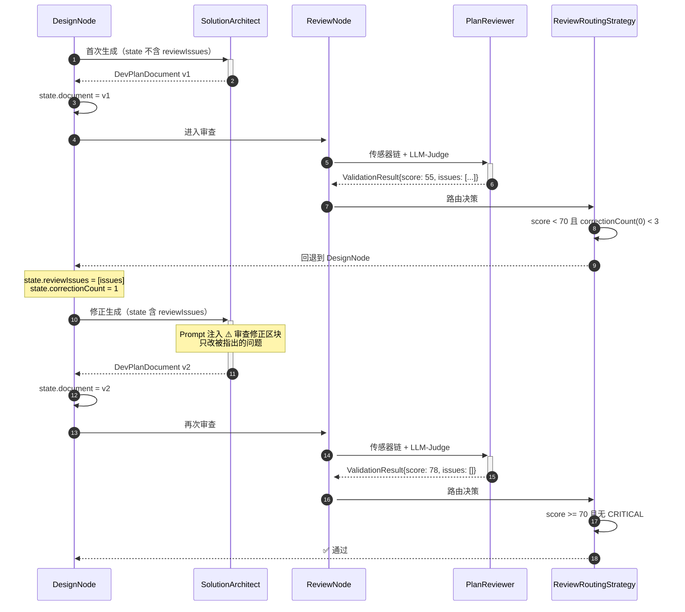

# SolutionArchitect Agent 实现设计

> 本文档是「代码感知智能开发方案智能体 v2」的**子任务实现设计**。
> 父文档：`整体方案设计-20260406-v2.md`
> 前序文档：`Tool层与Agent初始化器实现/Tool层与Agent初始化器实现-20260407-v2.md`
> 同级文档：`需求分析智能体实现/需求分析智能体实现-20260408-v1.md`
> 聚焦范围：SolutionArchitect Agent 的完整实现链路 — Prompt / Tool / 模板 / 修正循环 / 记忆

## 变更记录

| 版本 | 日期       | 修改人    | 变更内容摘要 |
|------|------------|-----------|--------------|
| v1   | 2026-04-08 | zhangkai  | 初始版本：Agent 完整设计 + 模板体系 + 修正循环机制 |

---

## 1. 技术选型决策（本 Agent 适用）

### 1.1 选型矩阵

| 能力需求 | 技术选型 | 理由 |
|---------|---------|------|
| 架构契约、编码规范、设计模式 | **Prompt**（系统提示词） | 稳定的专家知识，不变或极少变，直接注入上下文最高效 |
| 文档结构约束 | **Prompt** + **TemplateRenderTool** | Prompt 定义规则，Tool 渲染骨架 |
| 查找可复用组件 | **向量库**（CodeSearchTool） | 需要语义搜索，全文匹配不够 |
| 参考现有实现风格 | **向量库**（CodeSearchTool） | 从现有代码中搜索类似的 UseCase/Controller 写法 |
| 需求影响分析 | **State 传递** | ImpactAnalysis 由 RequirementAnalyzer 已生成 |
| 项目画像 + 架构拓扑 | **State 传递** | ProjectProfile / ArchTopology 由 ScanNode 已提取 |
| 修正反馈 | **State 传递** | reviewIssues 由 PlanReviewer 写入 state |
| 历史优秀方案参考 | **结构化记忆（MySQL）** + **向量库** | 二期扩展，一期先跑通基本链路 |
| 远程模板仓库 | **二期 MCP** | 一期模板内置 Java 常量，二期可从远程拉取 |

### 1.2 关键设计决策

**Q: 模板放在哪？Prompt 里 vs Tool 里 vs 数据库？**

```
一期方案：TemplateRenderTool 内置 Java 常量
  ✅ 简单直接，无外部依赖
  ✅ 模板和渲染逻辑在一起
  ⚠️ 修改模板需要改代码重新部署

二期演进：prompt_template 表 → TemplateRenderTool 从 DB 读取
  ✅ 运行时可更新模板
  ✅ 支持多租户不同模板

三期演进：template-store-mcp-server → 从远程模板仓库拉取
  ✅ 跨项目共享最佳实践模板
```

**Q: 架构契约放在 Prompt 还是 Tool？**

```
✅ Prompt — 正确选择
  架构契约是"规则"（如何判断对错），不是"数据"（需要提取的原始信息）
  规则应该内化为 Agent 的知识，不是运行时获取的外部数据
  Prompt 中的契约直接约束 LLM 的推理方向

❌ Tool — 不合适
  Tool 是"眼睛/手"，用于获取数据和执行操作
  架构契约不需要"获取"，它是固定的专家知识
```

---

## 2. 角色定位

```
┌────────────────────────────────────────────────────────────┐
│  SolutionArchitect — 资深架构师                              │
│                                                            │
│  输入：需求 + ProjectProfile + ArchTopology + ImpactAnalysis │
│       + reviewIssues（修正循环时注入）                       │
│                                                            │
│  职责：                                                     │
│  ① 架构决策 — 选择合适的设计模式和技术方案                    │
│  ② 类设计 — 按 DDD 分层输出完整类清单（全类名）              │
│  ③ 接口设计 — REST API + 请求/响应参数                       │
│  ④ 数据库设计 — 表结构 + 索引                                │
│  ⑤ 文档生成 — 按模板逐章节生成完整设计文档                    │
│                                                            │
│  输出：DevPlanDocument（完整 Markdown 设计文档）              │
└────────────────────────────────────────────────────────────┘
```

---

## 3. 执行流程（ReAct 循环）

```
DesignNode.execute(state)
  → agentRouter.route(SOLUTION_ARCHITECT, state)
    → SolutionArchitectAgent ReAct 循环：

    ╔═══════════════════════════════════════════════════════════╗
    ║  Thought 1: 分析 ImpactAnalysis，确定设计范围              ║
    ║  → 纯 LLM 推理                                           ║
    ║  → 如果是修正循环，先分析 reviewIssues 定位修正点           ║
    ╠═══════════════════════════════════════════════════════════╣
    ║  Thought 2: 查找可复用的现有组件细节                       ║
    ║  Action: CodeSearchTool("BaseController 通用响应")         ║
    ║  → 查找项目中的通用基类、工具类                             ║
    ║  Observation: [BaseResponse, PageResult, ...]              ║
    ╠═══════════════════════════════════════════════════════════╣
    ║  Thought 3: 获取文档模板骨架                               ║
    ║  Action: TemplateRenderTool("STANDARD", {变量})            ║
    ║  → 渲染出文档骨架，包含所有章节标题和占位符                  ║
    ║  Observation: [Markdown 模板骨架]                          ║
    ╠═══════════════════════════════════════════════════════════╣
    ║  Thought 4: 搜索类似功能的现有实现作为参考                  ║
    ║  Action: CodeSearchTool("UseCase 用例编排 事务")            ║
    ║  → 参考现有 UseCase 的写法，保持风格一致                    ║
    ╠═══════════════════════════════════════════════════════════╣
    ║  Thought 5: 逐章节生成设计文档                             ║
    ║  → LLM 综合所有信息，按模板填充各章节                       ║
    ║  → 严格遵守架构契约和命名规范                               ║
    ║  → 输出：完整 Markdown 设计文档                            ║
    ╚═══════════════════════════════════════════════════════════╝
```

---

## 4. 工具集

| Tool | 来源 | 用途 | 调用时机 |
|------|------|------|----------|
| **CodeSearchTool** | 向量库封装（Tool层文档 3.2.1） | 查找可复用组件、参考现有实现风格 | 搜索基类、工具类、类似功能的实现，通常 2-3 次 |
| **TemplateRenderTool** | 本地模板渲染（Tool层文档 3.3.1） | 生成文档骨架 | 生成文档前调用 1 次 |

---

## 5. 模板体系设计

### 5.1 STANDARD 模板结构

```markdown
# 功能设计文档

## 变更记录
| 版本 | 日期 | 修改人 | 变更内容摘要 |
|------|------|--------|--------------|
| v1 | {{date}} | {{author}} | 初始版本 |

## 1. 基本信息
- 功能名称：{{featureName}}
- 所属模块：{{modules}}
- 需求来源：{{requirementSummary}}

## 2. 背景与目标
### 背景
{{background}}
### 目标
{{goals}}

## 3. 功能范围
### 3.1 功能列表
{{featureList}}
### 3.2 设计边界
{{designBoundary}}

## 4. 业务流程设计
### 4.1 正常流程
{{normalFlow — Mermaid sequenceDiagram}}
### 4.2 异常流程
{{exceptionFlow}}

## 5. 接口设计
### 5.1 接口清单
{{apiList}}
### 5.2 请求/响应参数
{{apiDetail}}
### 5.3 错误码设计
{{errorCodes}}

## 6. 类设计
### 6.1 分层设计
{{layerDesign}}
### 6.2 核心类清单
{{classList — 必须全类名}}
### 6.3 类调用关系
{{callChain}}

## 7. 数据库设计
### 7.1 表设计
{{tableDesign}}
### 7.2 索引设计
{{indexDesign}}

## 8. 核心业务规则
{{businessRules}}

## 9. 异常处理设计
{{exceptionHandling}}

## 10. 测试要点
{{testPoints}}
```

### 5.2 LIGHTWEIGHT 模板结构（简化版）

```markdown
# {{featureName}} — 轻量设计

## 需求概述
{{requirementSummary}}

## 类清单
{{classList}}

## 接口设计
{{apiDetail}}

## 关键决策
{{decisions}}
```

### 5.3 模板变量来源

| 模板变量 | 数据来源 | 说明 |
|----------|---------|------|
| `date` | `java.time.LocalDate.now()` | TemplateRenderTool 自动填充 |
| `author` | 系统配置或 state 参数 | 默认 "AI-Generated" |
| `featureName` | state.impactAnalysis.requirementSummary | LLM 已在 AnalyzeNode 提取 |
| `modules` | state.impactAnalysis.affectedModules | 影响的模块列表 |
| `requirementSummary` | state.impactAnalysis.requirementSummary | 需求摘要 |
| 其余章节 | **LLM 生成** | Agent 按模板骨架逐章节填充 |

---

## 6. System Prompt 设计

```
你是资深 Java 架构师，正在为一个 Spring Boot + DDD-lite 项目生成功能设计文档。

## 核心架构契约（违反任何一条都会导致审查不通过）
1. 分层依赖：api → application → domain ← infrastructure，禁止反向
2. 基础包：com.exceptioncoder.llm，所有类名必须是全类名（含完整包路径）
3. 命名强制后缀：
   - API 层：XxxController
   - 应用层：XxxUseCase
   - 领域层：XxxService（接口）、XxxServiceImpl（实现放 infrastructure）
   - 仓储层：XxxRepository（接口在 domain）、JpaXxxRepository（实现在 infrastructure）
   - DTO：XxxRequest / XxxResponse
   - Entity：XxxEntity
4. Controller 只做协议处理，不写业务逻辑
5. 复用优先：优先使用项目中已有的基类、工具类、通用组件
6. 不要过度设计：只设计需求要求的功能，不添加"可能用到"的扩展

## 已知项目画像
{state.projectProfile}

## 已知架构拓扑
{state.archTopology}

## 需求影响分析
{state.impactAnalysis}

## 用户原始需求
{state.requirement}

{{#if state.reviewIssues}}
## ⚠️ 审查修正（第 {state.correctionCount} 次）
上一版方案被审查发现以下问题，请针对性修正：
{state.reviewIssues}

注意：
- 只修正被指出的问题，不要大改已通过的部分
- 在文档中标注修正内容（如：`[修正] xxx`）
{{/if}}

## 你可以使用的工具
1. CodeSearchTool — 搜索项目代码，查找可复用的组件和现有实现风格
   - 建议搜索：基类（Base*）、通用响应体、已有的类似功能实现
2. TemplateRenderTool — 渲染设计文档模板骨架
   - 先调用获取模板骨架，再按章节填充内容

## 输出要求
1. 按模板结构逐章节输出完整的 Markdown 设计文档
2. 类设计必须包含全类名（com.exceptioncoder.llm.xxx.YyyClass）
3. 接口设计必须包含请求/响应 JSON 示例
4. 数据库设计必须包含字段类型和约束
5. 业务流程必须包含 Mermaid 时序图
6. 异常处理必须覆盖所有可预见场景
```

---

## 7. 修正循环机制

### 7.1 流程



### 7.2 修正策略

| 原则 | 说明 |
|------|------|
| **成功静默** | 审查通过的部分不反馈给 SolutionArchitect（避免噪音干扰） |
| **失败响亮** | 只将失败的 issues 注入修正上下文，每个 issue 带 severity |
| **最小修改** | Prompt 明确要求"只修正被指出的问题，不大改已通过的部分" |
| **标注修正** | 修正内容在文档中以 `[修正]` 前缀标注，便于追溯 |
| **次数上限** | 最多 3 次修正循环，超过标记 `approved_with_issues` |

### 7.3 修正上下文注入

```java
// DesignNode 在修正循环时构造 Agent 输入
if (state.reviewIssues() != null && !state.reviewIssues().isEmpty()) {
    // 只注入失败信息，不注入已通过的评审结果
    String issuesContext = state.reviewIssues().stream()
        .map(issue -> String.format("- [%s] %s", issue.severity(), issue.description()))
        .collect(Collectors.joining("\n"));
    
    // 注入 state，Prompt 模板中的 {{#if}} 会自动展示修正区块
    state.setReviewIssuesText(issuesContext);
    state.incrementCorrectionCount();
}
```

---

## 8. 记忆体系交互

| 记忆级别 | 读/写 | 内容 | 时机 |
|----------|-------|------|------|
| 短期记忆（Redis） | 读 | 修正循环时的历史上下文（上一版文档 + issues） | 修正循环时保持上下文连续性 |
| 长期记忆（向量库） | 读 | 通过 CodeSearchTool 搜索可复用组件 | ReAct 中按需搜索 |
| 结构化记忆（MySQL） | 写 | 生成完成后，文档摘要存入 dev_plan_record | DesignNode 完成后由 FlowEngine 触发 |

---

## 9. State 交互

### 9.1 输入

| State 字段 | 类型 | 来源 |
|-----------|------|------|
| `state.requirement` | String | 用户原始需求 |
| `state.projectProfile` | JSON | ScanNode |
| `state.archTopology` | JSON | ScanNode |
| `state.impactAnalysis` | JSON | AnalyzeNode |
| `state.reviewIssues` | List\<Issue\> | ReviewNode（修正循环时） |
| `state.correctionCount` | int | ReviewNode（修正循环时） |

### 9.2 输出

```
DesignNode.execute(state):
  agentOutput = agentRouter.route(SOLUTION_ARCHITECT, state)

  // 写入 State
  state.document = agentOutput.content()  // 完整 Markdown 文档
  state.stage = "DESIGNING → REVIEWING"
```

---

## 10. Agent 定义注册

```java
AgentDefinition.builder()
    .id("devplan-solution-architect")
    .name("方案设计架构师")
    .description("按模板生成完整功能设计文档")
    .systemPrompt(SOLUTION_ARCHITECT_PROMPT)
    .toolIds(List.of("devplan_code_search", "devplan_template_render"))
    .modelConfig(ModelConfig.of("qwen-max"))  // 最强模型，文档生成质量优先
    .maxTokens(8192)  // 文档生成需要较大输出空间
    .temperature(0.5)  // 适中温度，兼顾创造性和准确性
    .build();
```

**模型选择理由：** `qwen-max` — 方案生成是整个流程中质量要求最高的环节，需要最强推理能力来保证文档质量。maxTokens 设为 8192 确保长文档不被截断。

---

## 11. 类清单

| 全类名 | 类型 | 说明 | 操作 |
|--------|------|------|------|
| `c.e.l.infrastructure.devplan.agent.SolutionArchitectAgent` | Agent | 方案生成 ReAct 执行体 | 新建 |
| `c.e.l.application.devplan.node.DesignNode` | Node 编排 | 调用 AgentRouter → 写入 state.document | 新建 |
| `c.e.l.infrastructure.devplan.template.DesignDocTemplate` | 常量类 | STANDARD / LIGHTWEIGHT 模板定义 | 新建 |

> `c.e.l` = `com.exceptioncoder.llm`
>
> 复用类：CodeSearchTool、TemplateRenderTool（已在 Tool层文档 设计）

---

## 12. 核心业务规则

| # | 规则 | 说明 |
|---|------|------|
| R1 | **输出所有类名必须是全类名** | `com.exceptioncoder.llm.xxx.YyyClass` 格式 |
| R2 | **按模板结构逐章节输出** | 不跳过章节，不自创章节 |
| R3 | **复用优先** | 搜索现有组件后优先复用，而非重新设计 |
| R4 | **修正循环只改 issues** | 不大改已通过的部分 |
| R5 | **修正标注** | 修正内容用 `[修正]` 前缀标识 |
| R6 | **Mermaid 图必须可渲染** | 时序图语法正确 |

---

## 13. 异常处理

| 场景 | 处理方式 |
|------|----------|
| 向量库不可用 | 降级为纯 LLM 推理，不搜索可复用组件，文档标注降级 |
| 输出超过 maxTokens 被截断 | 进入 ReviewNode 后必然被打低分（完整性不足），触发修正循环 |
| TemplateRenderTool 模板不存在 | 回退到 STANDARD 模板 |
| 修正 3 次仍不通过 | ReviewRoutingStrategy 标记 `approved_with_issues`，输出最后一版 + 问题清单 |
| Agent 输出非 Markdown 格式 | DesignNode 重试 1 次，仍失败则 FAILED |

---

## 14. 测试要点

| 测试项 | 类型 | 说明 |
|--------|------|------|
| 输出包含 STANDARD 模板所有章节 | 单元测试 | 验证文档结构完整性 |
| 所有类名为全类名格式 | 单元测试 | 正则验证 `^com\.exceptioncoder\.llm\.\w+` |
| 修正循环只改 issues | 集成测试 | 注入 reviewIssues，对比前后差异率 < 30% |
| TemplateRenderTool 正确渲染 | 单元测试 | 验证变量替换和骨架生成 |
| Mermaid 图语法正确 | 单元测试 | 正则提取 Mermaid 块，验证可解析 |
| maxTokens 截断场景 | 集成测试 | 设置小 maxTokens，验证进入修正循环 |
