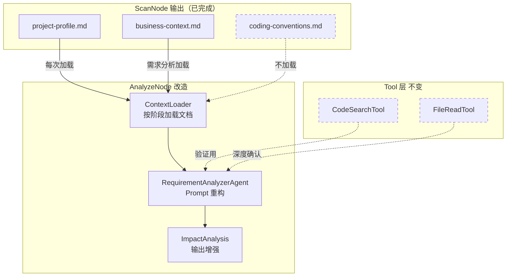
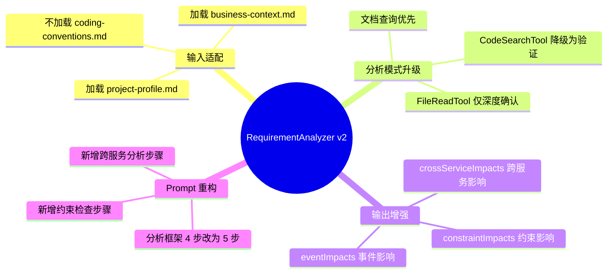
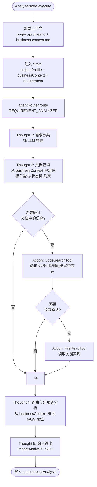
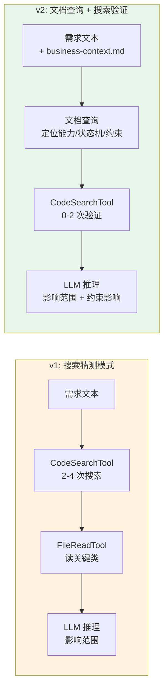
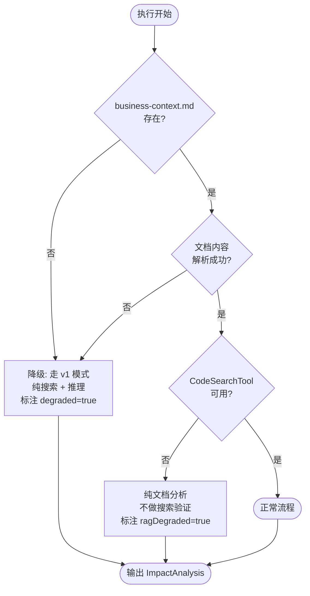
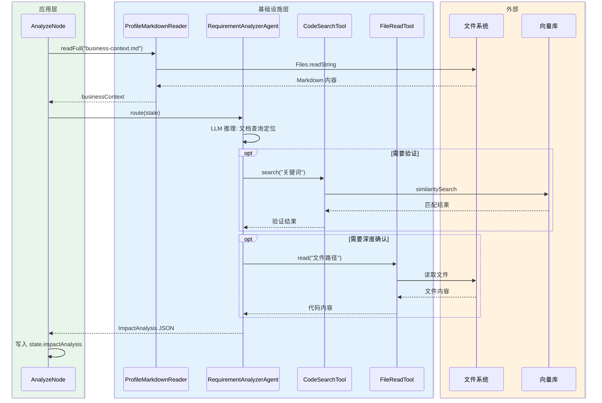
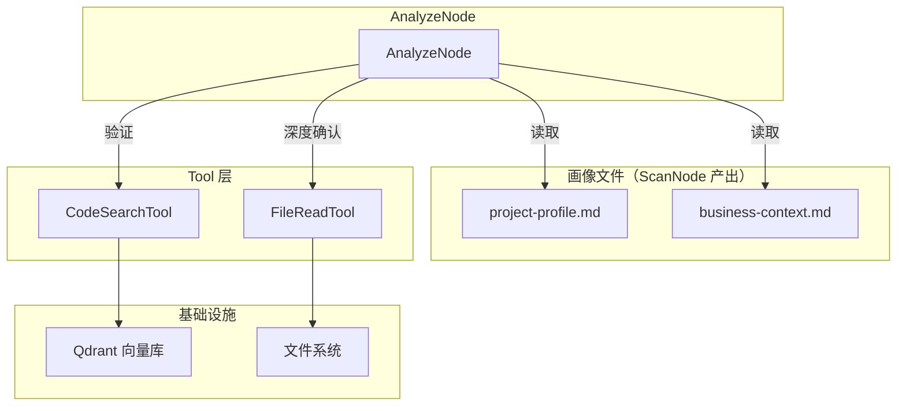

# RequirementAnalyzer Agent 实现设计

> 本文档是「代码感知智能开发方案智能体 v2」的**子任务实现设计**。
> 父文档：`整体方案设计-20260406-v2.md`
> 前序文档：`需求分析智能体实现-20260408-v1.md`
> 关联文档：`代码感知智能体实现-20260412-v3.md`（画像拆文件设计）

## 变更记录

| 版本 | 日期 | 修改人 | 变更内容摘要 |
|------|------|--------|--------------|
| v1 | 2026-04-08 | zhangkai | 初始版本：Agent 完整设计 + 技术选型决策 |
| v2 | 2026-04-12 | zhangkai | **适配画像 3 文件拆分**：State 输入从 JSON 改为 Markdown 文档；执行模式从"搜索猜测"改为"文档查询 + 搜索验证"；System Prompt 重构 |

---

## 1. 基本信息

| 项目 | 内容 |
|------|------|
| 功能名称 | 需求分析智能体实现（适配画像 3 文件拆分） |
| 所属系统 | llm-orchestration-platform |
| 所属模块 | application.devplan.node / infrastructure.devplan.agent |
| 需求来源 | 代码感知层从单文件 JSON 改为 3 文件 Markdown，RequirementAnalyzer 需适配新输入格式并利用更丰富的业务上下文 |
| 负责人 | zhangkai |
| 版本号 | v2 |

---

## 2. 背景与目标

### 2.1 v1 回顾

v1 RequirementAnalyzer 的执行模式：

```text
输入：state.projectProfile (JSON) + state.archTopology (JSON) + state.requirement
         ↓
执行：CodeSearchTool 搜索 2-4 次 → FileReadTool 读关键类 → LLM 推理影响范围
         ↓
输出：ImpactAnalysis JSON
```

### 2.2 v1 的问题

| 问题 | 影响 | 根因 |
|------|------|------|
| **靠搜索猜测影响范围** | 向量检索 top5 不一定准，遗漏或误报率高 | 画像只有概览级信息，Agent 不知道具体有什么业务能力 |
| **不知道实体状态机** | 退货需求不知道订单有哪些状态，猜测"应该加 REFUNDING 状态" | v1 画像无状态机维度 |
| **不知道服务调用关系** | 不知道 order-service 调了 payment-service，遗漏跨服务影响 | v1 外部依赖只列中间件，不列微服务互调 |
| **不知道约束和守卫** | 不知道"PAID 后不可直接取消"，方案可能违反现有守卫 | v1 画像无约束维度 |
| **不知道事件契约** | 不知道已有哪些事件，可能重复定义或命名不一致 | v1 画像无事件维度 |
| **编码约定干扰** | `Result<T>` 包装等信息混在上下文里，可能被"创造性关联" | 单文件塞所有维度，信噪比低 |

### 2.3 v2 目标

| 目标 | 衡量标准 |
|------|---------|
| 基于文档查询而非搜索猜测 | 影响范围分析的 affectedClasses 来源从"CodeSearchTool 结果"变为"business-context.md 中的能力清单 + CodeSearchTool 验证" |
| 只加载需要的上下文 | Agent 不加载 coding-conventions.md，杜绝编码约定引发的幻觉 |
| 输出更准确的约束分析 | ImpactAnalysis 新增 constraintImpacts 字段，列出受影响的事务边界/幂等点/状态守卫 |
| 输出更准确的跨服务影响 | ImpactAnalysis 新增 crossServiceImpacts 字段，列出需要改动的下游服务和事件 |

### 2.4 技术决策：为什么拆两步而不是一步做完

业界很多 AI 编码助手（Cursor / Copilot Workspace）是一步到位：输入需求 → 直接输出代码方案。我们拆成 RequirementAnalyzer（需求分析）→ SolutionArchitect（方案生成）两步，这是一个有意识的取舍。

#### 方案 A：一步到位（分析 + 方案合并）

```text
需求文本 + 业务上下文 → 单个 Agent → 输出完整设计方案（含影响分析 + 类设计 + 接口设计）
```

| 优势 | 劣势 |
|------|------|
| 端到端延迟低，少一轮 LLM 调用 | Prompt 职责过重，一个 Agent 又要分析又要设计，容易顾此失彼 |
| 实现简单，状态传递少 | 分析错了设计也跟着错，无法在中间拦截和修正 |
| 适合简单 CRUD 需求 | 复杂需求（跨服务/状态机变更）容易遗漏约束，方案直接踩坑 |
| Token 消耗可能更少（单次调用） | 单次上下文窗口塞太多，信噪比下降，幻觉概率上升 |

#### 方案 B：拆两步（分析 → 方案）— 当前选择

```text
需求文本 + 业务上下文 → RequirementAnalyzer → ImpactAnalysis JSON → SolutionArchitect → 设计方案
```

| 优势 | 劣势 |
|------|------|
| **职责单一**：分析只管"改什么碰什么"，设计只管"怎么改" | 多一轮 LLM 调用，延迟增加 ~5-15 秒 |
| **中间产物可审查**：ImpactAnalysis 是结构化 JSON，人或自动化可以在此拦截错误 | State 传递增加复杂度 |
| **上下文精准**：分析阶段只吃业务上下文，设计阶段再追加编码规范，每阶段信噪比高 | 两个 Agent 的 Prompt 需要协调一致 |
| **可独立演进**：分析能力和设计能力可以独立优化、独立换模型 | |
| **适合复杂需求**：跨服务/状态机变更等场景，先把影响范围理清再设计，避免"边分析边设计"导致的思路混乱 | |

**选择 B 的核心原因：**

1. **中间拦截点**。ImpactAnalysis 是一个硬检查点——如果分析结果说"影响 3 个服务、碰 2 个状态守卫"，但用户说"不对，这个需求不该碰支付"，可以在此纠正，不用等到整个方案生成完才发现跑偏
2. **减少幻觉放大**。一步做时，分析错误会直接放大到方案层面（比如分析阶段幻觉出一个不存在的 RefundService，设计阶段就围绕它画类图）。拆两步后，分析产物是结构化 JSON，下游消费时是确定性的字段引用，不会二次放大
3. **上下文窗口管理**。需求分析只需要 business-context.md（~3-5K token），方案生成需要追加 coding-conventions.md（~1-2K token）+ ImpactAnalysis（~1K token）。分开加载，每个 Agent 的上下文都保持高信噪比

**什么时候适合一步做：**

- 需求确定是简单 CRUD（加一个增删改查页面）
- 项目小、服务少、无跨服务调用
- 对延迟极度敏感，愿意牺牲准确性换速度

> 后续可以考虑：对于 `requirementType = CRUD` 的简单需求，跳过 AnalyzeNode 直接进 DesignNode，实现"简单需求快通道"。

---

### 2.5 设计边界

- **本次只改造 AnalyzeNode 的输入消费方式和 System Prompt**
- 不改 ProfileGenerator / ScanNode 的输出逻辑（已在代码感知 v3 中完成）
- CodeSearchTool / FileReadTool 接口不变
- Agent 注册方式不变

---

## 3. 功能范围

### 3.1 功能模块总览图



### 3.2 能力分解图



### 3.3 功能范围说明

- **本次包含**：AnalyzeNode 输入加载改造、RequirementAnalyzer System Prompt 重构、ImpactAnalysis 输出结构增强
- **本次不包含**：ScanNode 改造（已在代码感知 v3 完成）、Tool 层改造、Agent 注册方式变更
- **后续扩展**：二期 MCP 接入（Confluence/Jira），跨服务画像联合分析

---

## 4. 业务流程设计

### 4.1 正常流程（v2 新模式）



### 4.2 v1 vs v2 执行模式对比



### 4.3 异常流程



---

## 5. 接口设计

v2 不新增 HTTP 接口。内部 State 字段变更见第 7 节。

---

## 6. 类设计

### 6.1 分层设计

| 层 | 包路径前缀 | 本次变更 |
|----|-----------|---------|
| Application | `c.e.l.application.devplan.node` | 改造 AnalyzeNode 输入加载 |
| Infrastructure | `c.e.l.infrastructure.devplan.agent` | 改造 RequirementAnalyzerAgent Prompt |
| Domain | `c.e.l.domain.devplan.model` | 扩展 ImpactAnalysis / DevPlanState |

> `c.e.l` = `com.exceptioncoder.llm`

### 6.2 核心类清单

| 全路径 | 类型 | 变更 | 一句话职责 |
|--------|------|------|-----------|
| `c.e.l.application.devplan.node.AnalyzeNode` | Node | **修改** | 加载 project-profile.md + business-context.md 注入 State，不加载 coding-conventions.md |
| `c.e.l.infrastructure.devplan.agent.RequirementAnalyzerAgent` | Agent | **修改** | System Prompt 重构：从"搜索猜测"改为"文档查询 + 搜索验证"，新增约束/跨服务分析步骤 |
| `c.e.l.infrastructure.devplan.agent.DevPlanAgentConfig` | Config | **修改** | REQUIREMENT_ANALYZER prompt 常量更新 |
| `c.e.l.domain.devplan.model.ImpactAnalysis` | Model | **修改** | 新增 constraintImpacts / crossServiceImpacts / eventImpacts 字段 |
| `c.e.l.domain.devplan.model.DevPlanState` | Model | **修改** | `archTopology` 替换为 `businessContext: String`（business-context.md 原文） |
| **保留不变** | | | |
| `c.e.l.infrastructure.devplan.tool.CodeSearchTool` | Tool | 不变 | 语义检索，v2 中降级为验证手段 |
| `c.e.l.infrastructure.devplan.tool.FileReadTool` | Tool | 不变 | 文件读取，v2 中仅深度确认使用 |
| `c.e.l.infrastructure.devplan.profile.ProfileMarkdownReader` | Reader | 不变 | 读取 Markdown 文件 |

### 6.3 类调用关系



---

## 7. 数据库设计

v2 不涉及数据库变更。

---

## 8. 核心业务规则

保留 v1 全部规则（R1-R4），变更和新增：

| 规则 | 说明 |
|------|------|
| **R1 修改** | affectedClasses 必须优先从 business-context.md 维度 4（业务能力清单）中定位，CodeSearchTool 用于**验证**而非**发现** |
| **R5（新增）** | AnalyzeNode 只加载 project-profile.md + business-context.md，**禁止加载 coding-conventions.md**，避免编码约定干扰需求分析 |
| **R6（新增）** | business-context.md 不存在时降级为 v1 模式（纯搜索），输出中标注 `degraded: true` |
| **R7（新增）** | 约束影响分析必须基于 business-context.md 维度 6（关键约束与扩展点），不凭空推测事务边界和幂等要求 |
| **R8（新增）** | 跨服务影响分析必须基于 business-context.md 维度 8（对外调用服务）和维度 9（事件契约），不猜测服务间关系 |

---

## 9. 事务与并发控制

不变，沿用 v1。

---

## 10. 缓存设计

不变。business-context.md 的缓存由 ScanNode 层管理。

---

## 11. 消息与异步设计

不变。

---

## 12. 下游依赖设计



---

## 13. 安全设计

不变。

---

## 14. 日志与监控设计

新增日志点：

| 日志 | 级别 | 说明 |
|------|------|------|
| `business-context.md loaded, {} chars` | INFO | 文档加载成功 |
| `business-context.md not found, degrading to v1 mode` | WARN | 降级 |
| `CodeSearchTool calls: {} (v1 avg: 3, v2 target: 0-2)` | INFO | 监控搜索次数是否下降 |

---

## 15. 异常处理设计

| 场景 | 处理 |
|------|------|
| business-context.md 不存在 | 降级为 v1 纯搜索模式，输出标注 `degraded: true` |
| business-context.md 格式异常 | 同上，降级 |
| CodeSearchTool 不可用（向量库挂了） | 纯文档分析，不搜索验证，标注 `ragDegraded: true` |
| Agent 输出非法 JSON | 重试 1 次，仍失败标记 FAILED |
| FileReadTool 路径不存在 | Agent 在 ReAct 中观察到错误，尝试搜索正确路径 |

---

## 16. 测试要点

| 测试项 | 类型 | 说明 |
|--------|------|------|
| 正确加载 business-context.md | 单元测试 | 验证 AnalyzeNode 读取到 businessContext 字段 |
| 不加载 coding-conventions.md | 单元测试 | 验证 State 中无编码约定信息 |
| 降级为 v1 模式 | 单元测试 | business-context.md 不存在时走搜索模式 |
| 约束影响输出 | 集成测试 | 退货需求场景，验证 constraintImpacts 包含状态守卫和事务边界 |
| 跨服务影响输出 | 集成测试 | 退货需求场景，验证 crossServiceImpacts 包含 payment-service 和 inventory-service |
| 事件影响输出 | 集成测试 | 退货需求场景，验证 eventImpacts 包含需新增的 ORDER_REFUNDED 事件 |
| CodeSearchTool 调用次数下降 | 集成测试 | v2 搜索次数应 <= 2（v1 平均 3-4 次） |

---

## 17. 上线与回滚方案

- **前置条件**：代码感知 v3 已上线（画像输出为 3 文件）
- **回滚**：AnalyzeNode 中 business-context.md 不存在时自动降级为 v1 模式，无需回滚代码

---

## 18. 风险点与待确认事项

| 风险 | 概率 | 影响 | 缓解 |
|------|------|------|------|
| business-context.md 内容太长超过上下文窗口 | 低 | Agent 截断丢失信息 | 大项目控制在 5K token 内，超长时按维度分片加载 |
| LLM 过度依赖文档，不做搜索验证 | 中 | 文档过期时分析失误 | Prompt 中强制要求"对关键判断用 CodeSearchTool 验证" |
| ImpactAnalysis 新增字段导致下游 DesignNode 不兼容 | 低 | 方案生成报错 | 新字段设为 Optional，DesignNode 按需消费 |
