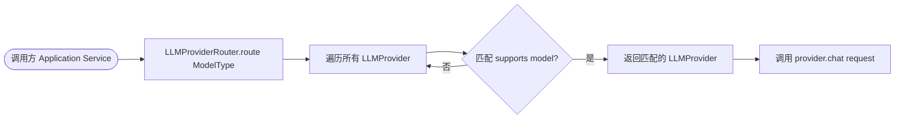
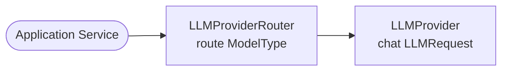

# 功能设计文档

## 变更记录

| 版本 | 日期 | 修改人 | 变更内容摘要 |
|------|------|--------|-------------- |
| v1 | 2026-03-31 | | 初始版本 |

---

## 1. 基本信息
- 功能名称：多平台模型路由层
- 所属系统：llm-orchestration-platform
- 所属模块：llm-infrastructure / llm-domain
- 需求来源：支持多 LLM 平台统一接入，上层调用不感知底层 Provider
- 版本号：v1

## 2. 背景与目标
- 背景：现有 `QwenProvider` 使用 `@Primary` 作为默认实现，`OllamaProvider` 通过 `supports()` 匹配模型名，路由逻辑分散无统一管控
- 问题：上层代码直接注入 `LLMProvider`，无法动态切换平台；新增 Provider 需修改调用方代码
- 目标：新增 `ModelType` 枚举 + `LLMProviderRouter`，上层统一通过 Router 路由，不直接依赖具体 Provider
- 设计边界：仅改造路由层，不改变 `LLMProvider` 接口及其实现内部逻辑

## 3. 功能范围
- 本次包含：
  - 新增 `ModelType` 枚举（domain 层）
  - 新增 `LLMProviderRouter`（infrastructure 层）
  - 去掉 `QwenProvider` 的 `@Primary`
  - 调用方（Application Service）改为注入 Router
- 本次不包含：fallback 降级策略、负载均衡、成本路由
- 后续扩展：可在 Router 中添加降级、AB 测试、能力路由（多模态）

## 4. 业务流程设计

### 4.1 正常流程

### 4.2 异常流程

- 没有任何 Provider 支持该模型 → 抛出 `IllegalArgumentException("No provider supports model: xxx")`
- `ModelType` 为 null → fallback 到默认 Provider（`llm.defaultProvider` 配置）

### 4.3 状态流转
无状态设计，每次调用独立路由。

## 5. 接口设计

### 5.1 接口清单
无新增 REST 接口，仅内部 Bean 调用。

## 6. 类设计

### 6.1 分层设计
- Domain 层（新增枚举）：`com.exceptioncoder.llm.domain.model`
- Infrastructure 层（新增 Router）：`com.exceptioncoder.llm.infrastructure.provider`

### 6.2 核心类清单

| 全类名 | 类型 | 职责说明 | 是否新建 |
|--------|------|----------|----------|
| `com.exceptioncoder.llm.domain.model.ModelType` | Enum | 模型平台类型枚举（ALI / OLLAMA / OPENAI 等） | 是 |
| `com.exceptioncoder.llm.infrastructure.provider.LLMProviderRouter` | Component | 统一路由，按 ModelType 或 model 字符串选择 LLMProvider | 是 |
| `com.exceptioncoder.llm.infrastructure.provider.QwenProvider` | Component | 阿里云百炼 Provider | 否（去掉 @Primary） |
| `com.exceptioncoder.llm.infrastructure.provider.OllamaProvider` | Component | Ollama 本地模型 Provider | 否（不变） |

### 6.3 类职责说明

- `com.exceptioncoder.llm.domain.model.ModelType`：枚举值包含 `ALI`、`OLLAMA`，每个枚举值携带 `providerName` 字符串，与 `LLMProvider#getProviderName()` 对应
- `com.exceptioncoder.llm.infrastructure.provider.LLMProviderRouter`：
  - 构造注入 `List<LLMProvider>`，自动收集所有 Spring Bean
  - `route(ModelType type)`：按 `type.getProviderName()` 匹配 `provider.getProviderName()`
  - `route(String model)`：按 `provider.supports(model)` 匹配，找不到抛异常
  - `getDefault()`：返回配置中 `llm.defaultProvider` 对应的 Provider

### 6.4 类调用关系

## 7. 数据库设计
无数据库变更。

## 8. 核心业务规则

1. `LLMProviderRouter` 通过 `List<LLMProvider>` 构造注入，新增 Provider 只需加 `@Component`，Router 无需修改（开闭原则）
2. 按 `ModelType` 路由优先级高于按 model 字符串匹配
3. 无匹配时抛出明确异常，不静默 fallback
4. `QwenProvider` 去掉 `@Primary`，默认 Provider 由配置 `llm.defaultProvider` 决定

## 9. 事务与并发控制
无事务。Router 无状态，线程安全。

## 15. 异常处理设计
- `IllegalArgumentException`：未找到匹配 Provider 时抛出，携带 model 名称
- 上层 GlobalExceptionHandler 已处理，返回 400

## 16. 测试要点
- `LLMProviderRouter` 单元测试：验证按 `ModelType` 路由正确；验证找不到时抛异常
- 集成测试：验证多 Provider Bean 同时存在时路由不冲突
