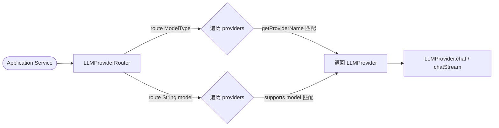
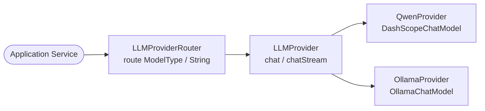

# 功能设计文档 · 终版（持续更新）

> 本文档为当前实现的终版方案，随代码演进持续更新，无需保留历史版本。
> 历史变更版本见同目录下 `多平台模型路由层-YYYYMMDD-vN.md`。

最后更新：2026-03-31

---

## 1. 基本信息

- 功能名称：多平台模型路由层
- 所属系统：llm-orchestration-platform
- 所属模块：llm-infrastructure / llm-domain
- 需求来源：支持多 LLM 平台统一接入，上层调用不感知底层 Provider

---

## 2. 背景与目标

- **背景**：系统需要同时支持阿里云百炼（通义千问）和本地 Ollama 模型，上层业务不应直接耦合具体 Provider 实现
- **问题**：原有方案通过 `@Primary` 指定默认 Provider，无法动态切换；新增 Provider 需修改调用方代码
- **目标**：通过 `LLMProviderRouter` 统一路由，上层只依赖 Router，不直接注入 Provider
- **设计边界**：仅改造路由层，不修改 `LLMProvider` 接口及各 Provider 内部实现逻辑

---

## 3. 功能范围

- **本次包含**：`ModelType` 枚举、`LLMProviderRouter`、去掉 `QwenProvider` 的 `@Primary`
- **本次不包含**：fallback 降级策略、负载均衡、成本路由
- **后续扩展**：可在 Router 中添加降级、AB 测试、多模态能力路由

---

## 4. 业务流程设计

### 4.1 正常流程

### 4.2 异常流程

- 按 `ModelType` 路由：无匹配 Provider → `IllegalArgumentException("No provider found for ModelType: xxx")`
- 按 model 字符串路由：无匹配 Provider → `IllegalArgumentException("No provider supports model: xxx")`

### 4.3 状态流转

无状态设计，每次路由调用独立，Router 线程安全。

---

## 5. 接口设计

无 REST 接口，仅内部 Bean 调用。

---

## 6. 类设计

### 6.1 分层设计

- Domain 层：`com.exceptioncoder.llm.domain.model`（枚举）、`com.exceptioncoder.llm.domain.service`（接口）
- Infrastructure 层：`com.exceptioncoder.llm.infrastructure.provider`（Router + Provider 实现）

### 6.2 核心类清单

| 全类名 | 类型 | 职责说明 | 状态 |
|--------|------|----------|------|
| `com.exceptioncoder.llm.domain.model.ModelType` | Enum | 模型平台类型枚举，携带 providerName | 已存在 |
| `com.exceptioncoder.llm.domain.service.LLMProvider` | Interface | LLM 提供商抽象接口 | 已存在 |
| `com.exceptioncoder.llm.infrastructure.provider.LLMProviderRouter` | Component | 统一路由，构造注入 List<LLMProvider> | 已存在 |
| `com.exceptioncoder.llm.infrastructure.provider.QwenProvider` | Component | 阿里云百炼 Provider，基于 Spring AI Alibaba DashScope | 已存在 |
| `com.exceptioncoder.llm.infrastructure.provider.OllamaProvider` | Component | Ollama 本地模型 Provider，基于 Spring AI OllamaChatModel | 已存在 |

### 6.3 类职责说明

- `com.exceptioncoder.llm.domain.model.ModelType`：枚举值 `ALI("alibaba")`、`OLLAMA("ollama")`，通过 `getProviderName()` 与 Provider 关联
- `com.exceptioncoder.llm.domain.service.LLMProvider`：定义 `chat(LLMRequest)`、`chatStream(LLMRequest)`、`getProviderName()`、`supports(String model)` 四个方法
- `com.exceptioncoder.llm.infrastructure.provider.LLMProviderRouter`：
  - `route(ModelType type)`：按 `type.getProviderName()` 匹配 `provider.getProviderName()`
  - `route(String model)`：按 `provider.supports(model)` 匹配
  - 无匹配时抛出 `IllegalArgumentException`
- `com.exceptioncoder.llm.infrastructure.provider.QwenProvider`：封装 `DashScopeChatModel`，支持 `qwen-*`、`deepseek-*` 等模型，`getProviderName()` 返回 `"alibaba"`
- `com.exceptioncoder.llm.infrastructure.provider.OllamaProvider`：封装 `OllamaChatModel`，支持 `llama*` 等本地模型，`getProviderName()` 返回 `"ollama"`

### 6.4 类调用关系

---

## 7. 数据库设计

无数据库变更。

---

## 8. 核心业务规则

1. Router 通过 `List<LLMProvider>` 构造注入，新增 Provider 只需加 `@Component`，Router 无需修改（开闭原则）
2. 按 `ModelType` 路由：匹配 `type.getProviderName() == provider.getProviderName()`
3. 按 model 字符串路由：调用 `provider.supports(model)` 匹配
4. 无匹配时抛出明确异常，禁止静默 fallback
5. `QwenProvider` 不加 `@Primary`，无默认 Provider，调用方须显式指定路由

---

## 9. 事务与并发控制

无事务。Router 无状态，线程安全。

---

## 15. 异常处理设计

- `IllegalArgumentException`：无匹配 Provider 时抛出，携带 model/ModelType 名称
- 上层 GlobalExceptionHandler 已处理，返回 HTTP 400
- Provider 调用失败：各 Provider 内部捕获后包装为 `RuntimeException` 向上抛出，并记录 error 日志

---

## 16. 测试要点

- `LLMProviderRouterTest`：按 ModelType 路由正确、按 model 字符串路由正确、无匹配时抛异常（单元测试，已覆盖）
- 集成测试：多 Provider Bean 同时注册时路由不冲突
