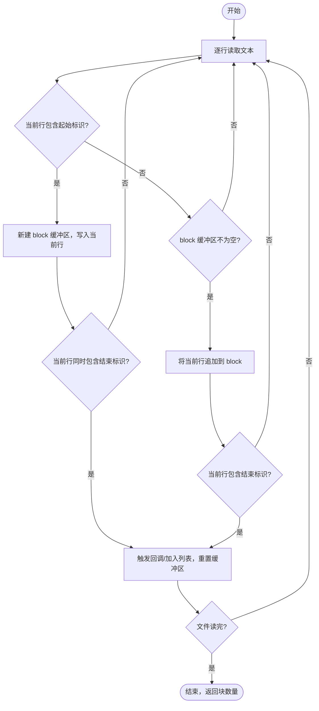

# 功能设计文档

## 变更记录

| 版本 | 日期 | 修改人 | 变更内容摘要 |
|------|------|--------|--------------|
| v1 | 2026-04-02 | 张凯 | 初始版本 |

---

## 1. 基本信息
- 功能名称：大文本块提取工具
- 所属系统：llm-orchestration-platform
- 所属模块：llm-infrastructure
- 需求来源：本地日志文件（300MB+）不便直接查看，需按关键字截取目标内容段
- 负责人：张凯
- 版本号：v1

## 2. 背景与目标
- 背景：生产或测试环境产生的日志文件体积较大（如 300MB），直接打开编辑器或 grep 全量扫描效率低，难以定位目标内容。
- 问题：需要从大日志中提取"以某行为起始、以某行为结束"的完整文本块（如一次完整的 HTTP 响应体），提取后单独查看或进一步处理。
- 目标：提供一个轻量工具类，支持配置起止标识，流式扫描大文本文件，逐块提取匹配内容。
- 设计边界：纯文本提取工具，不做 JSON 解析、不做业务逻辑，调用方决定如何处理提取结果。

## 3. 功能范围
- 本次包含：
  - 从文件路径流式提取文本块（适合超大文件，内存占用低）
  - 从字符串提取文本块，返回列表（适合内存中的文本）
  - 起止标识均为"行内包含"匹配（contains 语义）
- 本次不包含：
  - 正则表达式匹配
  - 多线程并行提取
  - 结果写出到文件（调用方自行处理）
- 后续扩展：可考虑支持正则匹配、结果写文件等；以下 3 项当前硬编码，后续通过配置参数开放：
  - 未关闭 block 的处理策略（当前：丢弃）
  - 文件编码（当前：固定 UTF-8）
  - 嵌套块处理（当前：新起始标识覆盖旧 block）

## 4. 业务流程设计

### 4.1 正常流程



### 4.2 异常流程

- 扫描到文件末尾时 block 缓冲区仍有内容（只有起始标识、未出现结束标识）：**丢弃，不触发回调**，以 DEBUG 日志记录丢弃行数。
- 文件不存在或无读取权限：向调用方抛出 `IOException`，不在工具类内部捕获。

### 4.3 状态流转

不涉及状态机。

## 5. 接口设计

不涉及 HTTP 接口，仅为工具类静态方法，见第 6 节。

## 6. 类设计

### 6.1 分层设计

工具类，无分层，包路径：`com.exceptioncoder.llm.infrastructure.util`

### 6.2 核心类清单

| 全类名 | 类型 | 职责说明 | 是否新建 |
|--------|------|----------|----------|
| `com.exceptioncoder.llm.infrastructure.util.TextBlockExtractor` | 工具类 | 大文本块流式提取，提供文件和字符串两种入口 | 是 |

### 6.3 类职责说明

- `com.exceptioncoder.llm.infrastructure.util.TextBlockExtractor#extractFromFile(Path, String, String, Consumer<String>)`  
  从文件流式提取，每匹配到完整块调用一次 handler，返回总块数。适合 100MB+ 大文件。

- `com.exceptioncoder.llm.infrastructure.util.TextBlockExtractor#extractFromText(String, String, String)`  
  从字符串中提取所有匹配块，返回 `List<String>`。适合已在内存中的文本。

- `com.exceptioncoder.llm.infrastructure.util.TextBlockExtractor#doExtract(BufferedReader, String, String, Consumer<String>)`  
  私有核心方法，被以上两个方法复用，执行实际的逐行扫描和块收集逻辑。

### 6.4 类调用关系

```
调用方 → TextBlockExtractor#extractFromFile → doExtract → Consumer<String>（调用方实现）
调用方 → TextBlockExtractor#extractFromText → doExtract → List::add
```

## 7. 数据库设计

不涉及。

## 8. 核心业务规则

1. **起始标识匹配**：某行 `line.contains(startMarker)` 为 true 时，新建缓冲区并将该行写入，之前尚未关闭的 block 丢弃（不支持嵌套块）。
2. **结束标识匹配**：某行 `line.contains(endMarker)` 为 true 时，将该行追加后触发回调并重置缓冲区。
3. **文件末尾未关闭的 block**：丢弃，记录 DEBUG 日志，不抛出异常。
4. **编码**：固定使用 UTF-8，不支持其他编码（当前需求无需）。
5. **行分隔符**：统一在每行末尾追加 `'\n'`，与原始文件换行符无关。

## 9. 事务与并发控制

不涉及。工具类无状态，线程安全（无共享可变状态）。

## 10. 缓存设计

不涉及。

## 11. 消息与异步设计

不涉及。

## 12. 下游依赖设计

无外部依赖，仅使用 JDK 标准库（`java.nio.file`、`java.io`）和 SLF4J。

## 13. 安全设计

- 文件路径由调用方传入，工具类不校验路径合法性，调用方须确保路径来源可信（防目录遍历）。

## 14. 日志与监控设计

- `DEBUG`：提取完成后输出总块数。
- `DEBUG`：文件末尾存在未关闭 block 时输出丢弃提示。

## 15. 异常处理设计

- `extractFromFile` 声明 `throws IOException`，由调用方决定如何处理。
- `extractFromText` 内部捕获 `IOException`（StringReader 不会实际抛出），以 `log.error` 记录并返回空列表。

## 16. 测试要点

- 正常：包含多个完整块，全部提取
- 边界：起始标识和结束标识在同一行
- 边界：文件末尾 block 未关闭，丢弃不报错
- 边界：文件无任何匹配，返回空列表/块数为 0
- 边界：空文件

## 17. 上线与回滚方案

纯工具类，无数据库变更，无需上线方案。删除类文件即可回滚。

## 18. 风险点与待确认事项

- 单个 block 体积过大（如数十 MB）时 StringBuilder 可能占用较多堆内存，当前版本不做限制，调用方需注意。
