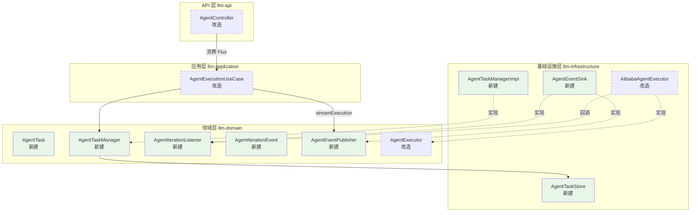
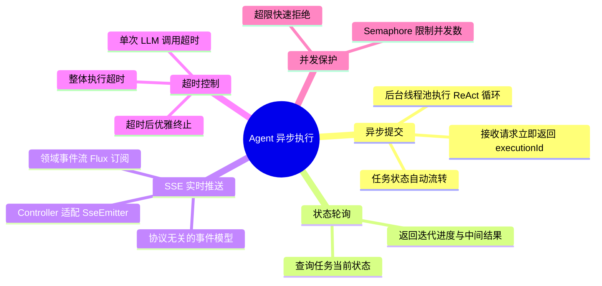
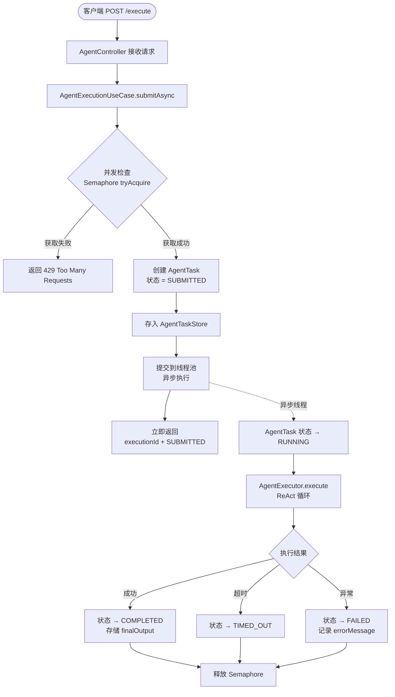
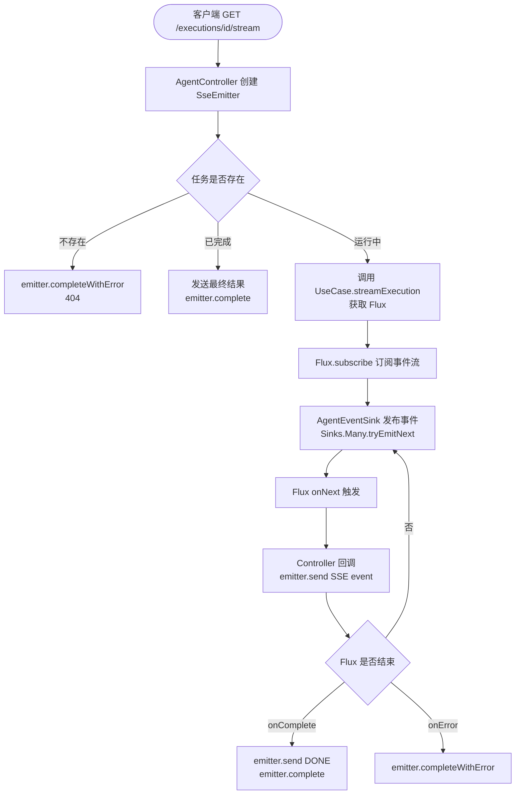
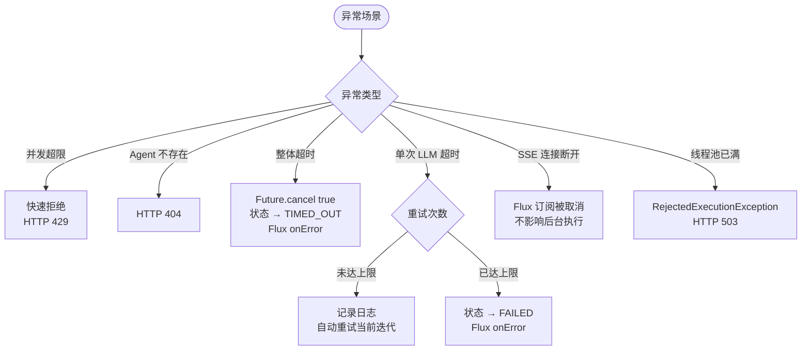
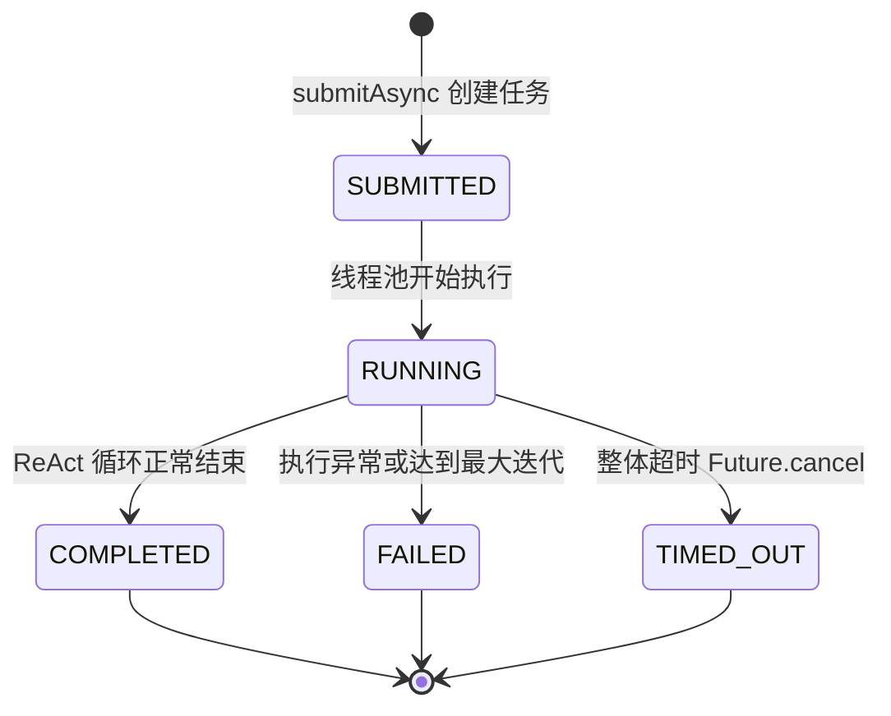
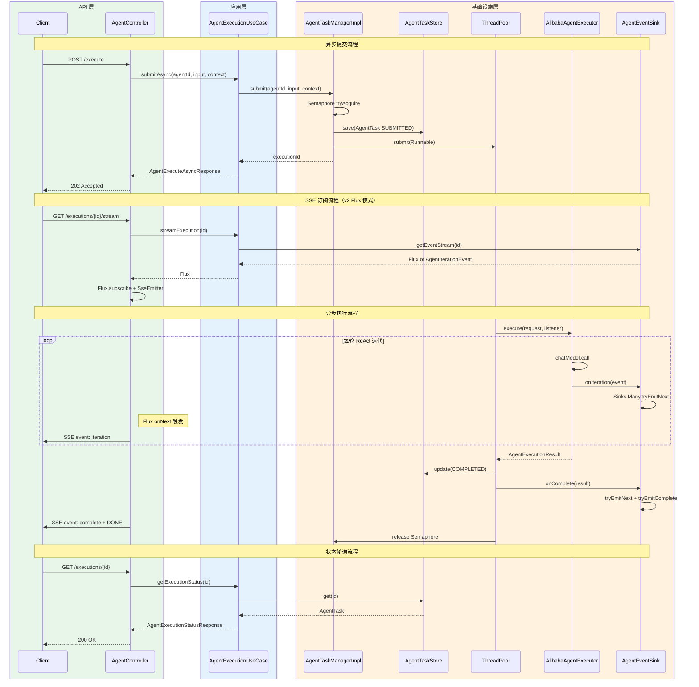
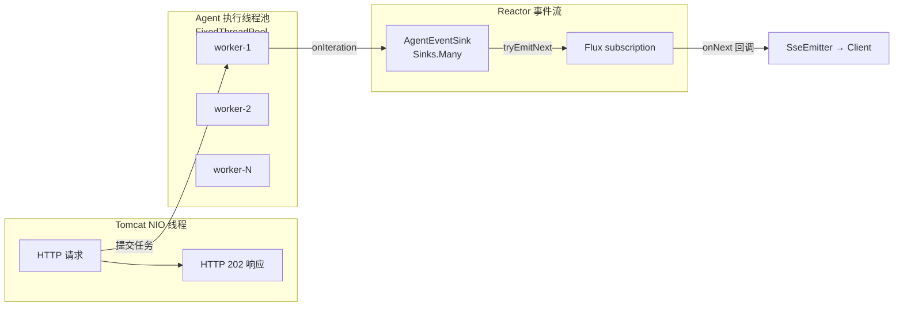
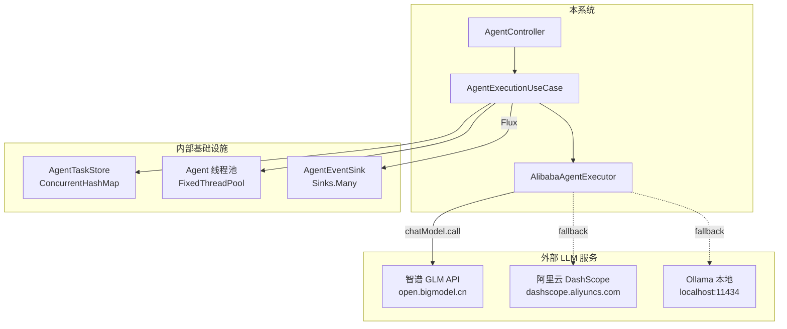

# 功能设计文档

## 变更记录

| 版本 | 日期 | 修改人 | 变更内容摘要 |
|------|------|--------|--------------|
| v1 | 2026-04-12 | zhangkai | 初始版本，Agent 执行从同步阻塞改为异步提交 + 状态轮询 / SSE 推送 |
| v2 | 2026-04-13 | zhangkai | SSE 推送分层重构：AgentSseManager（方案 A）→ AgentEventSink + Flux（方案 B），修正跨层依赖 |

---

## 1. 基本信息

- 功能名称：Agent 异步执行机制（Async Agent Execution）
- 所属系统：llm-orchestration-platform
- 所属模块：llm-domain / llm-application / llm-infrastructure / llm-api
- 需求来源：Agent 执行（特别是需求分析等复杂 ReAct 多轮迭代场景）调用智谱 GLM API 时，10 轮迭代同步阻塞导致 Netty ReadTimeoutException，HTTP 线程长时间占用
- 负责人：zhangkai
- 版本号：v2

---

## 2. 背景与目标

### 背景

当前 Agent 执行链路为**全程同步阻塞**：

```
HTTP 请求线程 → AgentController.execute()
             → AgentExecutionUseCase.execute()
             → AlibabaAgentExecutor.execute()
                └─ while 循环最多 maxIterations 轮（默认 10）
                    └─ 每轮 chatModel.call() 阻塞等待 LLM 响应
```

一次 HTTP 请求的阻塞时长 = 迭代轮数 x 单次 LLM 调用耗时。以需求分析 Agent 为例：10 轮迭代 x 30~60 秒/轮 = 最长 **10 分钟**阻塞。

### 问题

1. **HTTP 超时**：Netty 默认 read timeout 远低于 Agent 执行总时长，导致 `ReadTimeoutException`（已复现）
2. **线程资源浪费**：Tomcat NIO 工作线程（默认 200）被长时间占用，高并发时可耗尽
3. **用户体验差**：前端无进度反馈，只能 "转圈等待" 或超时报错
4. **异常处理缺陷**：非最终轮迭代的异常被静默吞掉（`AlibabaAgentExecutor:109-124`），网络超时后立即发起下一次调用，形成连锁失败
5. **配置不生效**：`llm.common.timeout: 60000` 未实际传递给 Spring AI 底层 HTTP 客户端

### 目标

1. **立即响应**：`POST /execute` 立即返回 `executionId` + 初始状态，释放 HTTP 线程
2. **进度可观测**：支持轮询查询和 SSE 实时推送两种方式获取执行进度（迭代轮次、当前思考、工具调用）
3. **超时可控**：单次 LLM 调用和整体执行分别有超时控制
4. **并发保护**：限制同时执行的 Agent 数量，防止资源耗尽
5. **复用架构**：复用 DevPlan 模块已验证的 TaskManager + ConcurrencyControl + TimeoutControl 模式
6. **分层正确**：SSE 推送不引入跨层依赖，API 层不直接引用 Infrastructure 类（v2 新增目标）

### 设计边界

- **本次包含**：Agent 执行异步化、状态轮询、SSE 推送、超时控制、并发控制
- **本次不包含**：WebSocket 双向通信、执行结果持久化到数据库（一期内存存储）、Agent 执行队列优先级调度
- **后续扩展**：执行结果落库、执行队列（Redis/RabbitMQ）、分布式 Agent 调度

---

## 3. 功能范围

### 3.1 功能模块总览图



> **v2 变更：** Domain 层新增 `AgentIterationEvent`（事件模型）和 `AgentEventPublisher`（Flux 流接口）；
> Infrastructure 层的 `AgentSseManager` 替换为 `AgentEventSink`（不再直接持有 SseEmitter）；
> UseCase 通过 `AgentEventPublisher` 暴露 Flux 流，Controller 消费后自行适配 SseEmitter。

### 3.2 能力分解图



### 3.3 功能范围说明

- **本次包含**：异步提交、状态轮询、SSE 推送（Flux 模式）、超时控制、并发控制、迭代级事件回调
- **本次不包含**：执行结果数据库持久化（一期内存 ConcurrentHashMap）、任务优先级队列、重试机制
- **后续扩展**：Redis 存储执行状态（多实例共享）、MQ 任务队列、执行回放、WebSocket 推送（消费同一 Flux）

---

## 4. 业务流程设计

### 4.1 正常流程 — 异步提交



### 4.2 正常流程 — SSE 实时推送（v2 Flux 模式）



> **v2 变更：** 不再 "注册 SseEmitter 到 AgentSseManager"，改为 Controller 订阅 UseCase 返回的 `Flux<AgentIterationEvent>`，在回调中自行向 SseEmitter 发送事件。Infrastructure 层完全不感知 SseEmitter。

### 4.3 异常流程



### 4.4 状态流转



---

## 5. 接口设计

### 5.1 接口清单

| 方法 | 路径 | 说明 | 变更 |
|------|------|------|------|
| POST | `/api/v1/agents/{agentId}/execute` | 异步提交 Agent 执行 | 改造（同步 → 异步） |
| GET | `/api/v1/agents/executions/{executionId}` | 查询执行状态 | 新增 |
| GET | `/api/v1/agents/executions/{executionId}/stream` | SSE 实时推送执行过程 | 新增 |

### 5.2 异步提交 — POST /api/v1/agents/{agentId}/execute

**请求参数（不变）：**

| 字段 | 类型 | 必填 | 说明 |
|------|------|------|------|
| input | String | 是 | 用户输入 |
| context | Map | 否 | 上下文变量 |

**返回参数（改造）：**

| 字段 | 类型 | 说明 |
|------|------|------|
| executionId | String | 执行唯一标识 |
| agentId | String | Agent ID |
| status | String | 初始状态（SUBMITTED） |

### 5.3 查询执行状态 — GET /api/v1/agents/executions/{executionId}

**返回参数：**

| 字段 | 类型 | 说明 |
|------|------|------|
| executionId | String | 执行唯一标识 |
| agentId | String | Agent ID |
| status | String | SUBMITTED / RUNNING / COMPLETED / FAILED / TIMED_OUT |
| currentIteration | int | 当前迭代轮次 |
| maxIterations | int | 最大迭代轮次 |
| finalOutput | String | 最终输出（仅 COMPLETED 时有值） |
| errorMessage | String | 错误信息（仅 FAILED / TIMED_OUT 时有值） |
| thoughtHistory | List | 思考历史 |
| toolCalls | List | 工具调用记录 |
| elapsedMs | long | 已耗时（毫秒） |

### 5.4 SSE 实时推送 — GET /api/v1/agents/executions/{executionId}/stream

**SSE 事件格式：**

| event 类型 | data 结构 | 触发时机 |
|-----------|-----------|---------|
| `iteration` | `{"iteration":N, "thought":"...", "toolCall":null}` | 每轮迭代 LLM 返回后 |
| `tool_result` | `{"iteration":N, "toolName":"...", "output":"..."}` | 工具执行完成后 |
| `complete` | `{"executionId":"...", "finalOutput":"...", "iterations":N}` | 执行正常结束 |
| `error` | `{"executionId":"...", "errorMessage":"...", "status":"FAILED"}` | 执行异常 |

### 5.5 请求示例

**异步提交：**

```http
POST /api/v1/agents/devplan-requirement-analyzer/execute
Content-Type: application/json

{
  "input": "分析用户权限管理模块的需求影响范围",
  "context": {
    "projectPath": "/Users/zhangkai/IdeaProjects/llm-orchestration-platform",
    "requirement": "新增 RBAC 角色权限管理"
  }
}
```

**响应示例（成功）：**

```json
{
  "executionId": "exec-20260412-001",
  "agentId": "devplan-requirement-analyzer",
  "status": "SUBMITTED"
}
```

**查询执行状态：**

```http
GET /api/v1/agents/executions/exec-20260412-001
```

```json
{
  "executionId": "exec-20260412-001",
  "agentId": "devplan-requirement-analyzer",
  "status": "RUNNING",
  "currentIteration": 3,
  "maxIterations": 10,
  "finalOutput": null,
  "errorMessage": null,
  "thoughtHistory": [
    "思考: 需要先了解项目结构...",
    "思考: 找到 UserService 和相关类..."
  ],
  "toolCalls": [
    {"toolName": "CodeSearchTool", "input": "{...}", "output": "..."}
  ],
  "elapsedMs": 45200
}
```

**SSE 推送：**

```http
GET /api/v1/agents/executions/exec-20260412-001/stream
Accept: text/event-stream
```

```
event: iteration
data: {"iteration":1,"thought":"需要先了解项目结构...","toolCall":{"toolName":"CodeSearchTool","input":"{}"}}

event: tool_result
data: {"iteration":1,"toolName":"CodeSearchTool","output":"找到 15 个相关类文件"}

event: iteration
data: {"iteration":2,"thought":"分析 UserService 的依赖关系...","toolCall":null}

event: complete
data: {"executionId":"exec-20260412-001","finalOutput":"分析完成...","iterations":2}
```

### 5.6 错误码设计

| HTTP 状态码 | 场景 | 响应体 |
|------------|------|--------|
| 202 Accepted | 异步提交成功 | `AgentExecuteAsyncResponse` |
| 404 Not Found | Agent 不存在 / 执行记录不存在 | `{"error":"Agent 不存在: xxx"}` |
| 429 Too Many Requests | 并发超限 | `{"error":"Agent 执行并发数已达上限"}` |
| 503 Service Unavailable | 线程池已满 | `{"error":"执行资源不足，请稍后重试"}` |

---

## 6. 类设计

### 6.1 分层设计

| 层 | 包路径前缀 | 职责 |
|---|-----------|------|
| API | `c.e.l.api.controller.management` | 协议处理，消费 Flux 适配 SseEmitter，DTO 转换 |
| Application | `c.e.l.application.usecase` | 异步编排，任务提交、状态查询、暴露事件流 |
| Domain | `c.e.l.domain.model` | AgentTask 模型，AgentTaskManager 接口 |
| Domain | `c.e.l.domain.executor` | AgentExecutor、AgentIterationListener、AgentIterationEvent、AgentEventPublisher |
| Infrastructure | `c.e.l.infrastructure.agent.task` | TaskManager 实现、TaskStore、EventSink、AsyncConfig |
| Infrastructure | `c.e.l.infrastructure.agent.executor` | AlibabaAgentExecutor 改造 |

> 注：`c.e.l` = `com.exceptioncoder.llm`

### 6.2 核心类清单

| 全路径 | 类型 | 变更 | 一句话职责 |
|--------|------|------|-----------|
| `c.e.l.domain.model.AgentTask` | Domain Model | 新建 | Agent 执行任务生命周期模型，含状态流转和迭代进度 |
| `c.e.l.domain.model.AgentTaskManager` | Domain Interface | 新建 | 任务生命周期管理接口：提交、查询、完成、失败 |
| `c.e.l.domain.executor.AgentIterationListener` | Domain Interface | 新建 | 迭代级事件回调接口（写入端） |
| `c.e.l.domain.executor.AgentIterationEvent` | Domain Record | 新建 | 领域事件模型，描述迭代/工具/完成/错误事件（v2 新增） |
| `c.e.l.domain.executor.AgentEventPublisher` | Domain Interface | 新建 | 事件流发布接口，返回 Flux（v2 新增） |
| `c.e.l.domain.executor.AgentExecutor` | Domain Interface | 改造 | execute 方法新增 listener 参数重载 |
| `c.e.l.infrastructure.agent.task.AgentTaskManagerImpl` | Infrastructure | 新建 | AgentTaskManager 实现，含并发控制 + 超时控制 |
| `c.e.l.infrastructure.agent.task.AgentTaskStore` | Infrastructure | 新建 | 内存任务存储（ConcurrentHashMap），提供 CRUD |
| `c.e.l.infrastructure.agent.task.AgentEventSink` | Infrastructure | 新建 | 同时实现 Listener + Publisher，基于 Sinks.Many 发布-订阅（v2 替代 AgentSseManager） |
| `c.e.l.infrastructure.agent.task.AgentAsyncConfig` | Infrastructure | 新建 | 线程池 + 并发参数 Spring 配置 |
| `c.e.l.infrastructure.agent.executor.AlibabaAgentExecutor` | Infrastructure | 改造 | ReAct 循环中每轮迭代回调 listener，改进异常处理 |
| `c.e.l.application.usecase.AgentExecutionUseCase` | Application | 改造 | 新增 submitAsync / getExecutionStatus / streamExecution（v2 新增） |
| `c.e.l.api.controller.management.AgentController` | Controller | 改造 | execute 改为 202，新增状态查询和 SSE 端点（v2：消费 Flux 而非注入 SseManager） |

### 6.3 类调用关系



---

## 7. 数据库设计

本期不涉及数据库，AgentTask 使用内存存储（`ConcurrentHashMap`）。

后续扩展：可落库到 `agent_execution` 表或使用 Redis 存储（多实例共享场景）。

---

## 8. 核心业务规则

| 编号 | 规则 | 说明 |
|------|------|------|
| R1 | 异步提交立即返回 | `POST /execute` 必须在 50ms 内响应，不得阻塞等待 LLM 调用 |
| R2 | 并发上限保护 | 同时执行的 Agent 数量不超过配置上限（默认 5），超限返回 429 |
| R3 | 整体超时控制 | 单次执行总时长不超过 `AgentDefinition.timeoutSeconds`（默认 120s），超时后 `Future.cancel(true)` |
| R4 | 单次 LLM 调用超时重试 | 单次 `chatModel.call()` 超时后最多重试 2 次，3 次均失败则标记当前迭代失败 |
| R5 | 连续失败熔断 | 连续 3 轮迭代均因 LLM 超时失败，直接终止执行，状态 → FAILED |
| R6 | 事件流断开不影响执行 | Flux 订阅者取消或 SSE 连接断开后，后台 Agent 执行继续，结果保留在 AgentTaskStore |
| R7 | 任务自动清理 | 已完成/失败的任务在 AgentTaskStore 中保留 30 分钟后自动清除 |
| R8 | executionId 全局唯一 | 格式：`exec-{yyyyMMdd}-{自增序号}`，与 DevPlan 的 `dp-` 前缀区分 |
| R9 | 分层依赖正确 | API 层不直接引用 Infrastructure 类，事件流通过 Domain 层 Flux 接口传递（v2 新增） |

---

## 9. 事务与并发控制

### 并发控制

| 机制 | 说明 |
|------|------|
| Semaphore | 非阻塞 `tryAcquire()`，控制同时执行的 Agent 任务数（可配置，默认 5） |
| ThreadPool | 固定大小线程池（`coreSize` = `maxConcurrent`），防止线程无限膨胀 |
| ConcurrentHashMap | AgentTaskStore 和 AgentEventSink 的底层存储，线程安全 |

### 超时控制

| 层级 | 机制 | 默认值 |
|------|------|--------|
| 整体执行 | `Future.get(timeout, TimeUnit.SECONDS)` + `future.cancel(true)` | `AgentDefinition.timeoutSeconds`（120s） |
| 单次 LLM | Spring AI `OpenAiApi` 的 HTTP client timeout 配置 | 90s |

---

## 10. 缓存设计

不涉及。

---

## 11. 消息与异步设计

### 线程模型



### 异步执行配置

```yaml
agent:
  async:
    max-concurrent: 5          # 最大并发执行数（Semaphore permits）
    thread-pool-size: 5        # 线程池核心/最大大小（= max-concurrent）
    execution-timeout: 120     # 默认执行超时（秒），可被 AgentDefinition.timeoutSeconds 覆盖
    task-retain-minutes: 30    # 已完成任务保留时长（分钟）
    sse-timeout: 600000        # SSE 连接超时（毫秒，10 分钟）
```

### 事件流生命周期（v2 Flux 模式）

1. `AgentEventSink` 在首次 `getEventStream(executionId)` 时创建 `Sinks.Many`（multicast + backpressure buffer）
2. `AlibabaAgentExecutor` 每轮迭代通过 `AgentIterationListener.onIteration()` 回调 `AgentEventSink`
3. `AgentEventSink.onIteration()` 将领域事件 `AgentIterationEvent` 通过 `Sinks.Many.tryEmitNext()` 发布
4. `AgentExecutionUseCase.streamExecution()` 返回 `Flux<AgentIterationEvent>`，Controller 订阅
5. Controller 的 `Flux.subscribe()` 回调中执行 `emitter.send(SseEmitter.event()...)`
6. 执行完成 → `AgentEventSink.onComplete()` → `tryEmitComplete()` → Flux 触发 `onComplete` 回调 → `emitter.complete()`
7. SSE 连接断开 → Flux 订阅被取消 → 不影响后台执行（`AgentEventSink` 中的 Sinks.Many 继续工作）

---

## 12. 下游依赖设计



---

## 13. 安全设计

不涉及新增安全机制。并发限制（Semaphore）本身可视为一种资源保护。

---

## 14. 日志与监控设计

| 事件 | 日志级别 | 内容 |
|------|---------|------|
| 任务提交 | INFO | `Agent 任务已提交: executionId={}, agentId={}` |
| 并发拒绝 | WARN | `Agent 并发超限，拒绝执行: agentId={}, current={}` |
| 迭代完成 | INFO | `Agent 迭代完成: executionId={}, iteration={}, hasToolCall={}, elapsed={}ms` |
| LLM 调用超时 | WARN | `LLM 调用超时: executionId={}, iteration={}, retryCount={}` |
| 执行完成 | INFO | `Agent 执行完成: executionId={}, status={}, iterations={}, totalElapsed={}ms` |
| 执行失败 | ERROR | `Agent 执行失败: executionId={}, error={}` |
| 事件发送失败 | DEBUG | `事件发送失败: executionId={}, result={}` |
| SSE 发送失败 | DEBUG | `SSE 发送失败: executionId={}` |

---

## 15. 异常处理设计

| 异常场景 | 处理方式 | 对外表现 |
|---------|---------|---------|
| Agent 不存在 | 抛出 `IllegalArgumentException` | 404 Not Found |
| 并发超限 | Semaphore `tryAcquire` 返回 false | 429 Too Many Requests |
| 线程池拒绝 | 捕获 `RejectedExecutionException`，释放 Semaphore | 503 Service Unavailable |
| 整体执行超时 | `Future.get` 抛出 `TimeoutException`，`future.cancel(true)` | 任务状态 → TIMED_OUT，Flux onError |
| 单次 LLM 超时 | 捕获 `ResourceAccessException`，重试最多 2 次 | 日志 WARN，不影响其他迭代 |
| 连续 LLM 失败 | 连续 3 轮迭代失败触发熔断 | 任务状态 → FAILED，Flux onError |
| Sinks 发送失败 | `tryEmitNext` 返回 failure | 日志 DEBUG，不影响后台执行 |
| SSE 发送失败 | Controller 中捕获 `IOException` | 日志 DEBUG，不影响后台执行 |
| 执行结果未找到 | `AgentTaskStore.get()` 返回空 | 404 Not Found |

---

## 16. 测试要点

| 测试类型 | 测试内容 | 验证要点 |
|---------|---------|---------|
| 单元测试 | AgentTaskManagerImpl 并发控制 | Semaphore 达上限后返回 null / 抛异常 |
| 单元测试 | AgentTaskStore 过期清理 | 超过 30 分钟的任务自动移除 |
| 单元测试 | AgentTask 状态流转 | 只允许合法的状态转换（SUBMITTED→RUNNING→COMPLETED） |
| 单元测试 | AgentEventSink 事件发布 | onIteration → Flux.subscribe 收到 ITERATION 事件 |
| 集成测试 | 异步提交 → 轮询获取结果 | 提交后立即返回 202，轮询直到 COMPLETED |
| 集成测试 | SSE 推送（Flux 模式） | 订阅 Flux，收到 iteration 事件，最终收到 complete 事件 |
| 集成测试 | 超时控制 | 设置 5 秒超时，验证任务状态变为 TIMED_OUT |
| 集成测试 | 分层验证 | AgentController 中无 `infrastructure.*` import |
| 压力测试 | 并发 10 请求，maxConcurrent=5 | 5 个执行，5 个返回 429 |

---

## 17. 上线与回滚方案

### 上线

1. 配置 `agent.async.*` 参数（可使用默认值）
2. 前端适配：`POST /execute` 响应从完整结果改为 `executionId`，需轮询或接 SSE
3. 灰度：可通过配置开关 `agent.async.enabled`（默认 true）控制，false 时走原同步逻辑

### 回滚

- 设置 `agent.async.enabled=false`，回退到同步执行模式
- 无数据库变更，无需回滚数据

---

## 18. 风险点与待确认事项

| 风险 | 影响 | 缓解措施 |
|------|------|---------|
| 内存存储丢失 | 服务重启后执行中的任务丢失 | 一期接受，二期引入 Redis 持久化 |
| Sinks.Many 内存占用 | 大量并发执行时 backpressure buffer 可能膨胀 | 执行完成后 Sink 自动移除；并发上限保护 |
| 前端兼容性 | 原同步接口的调用方需改造 | 提供 `agent.async.enabled` 开关，支持灰度切换 |
| LLM 限流叠加 | 多个并发 Agent 同时调用 GLM，触发 429 | 复用已有 LLMProviderRouter 的限速 + Fallback 机制 |

---

## 附录：v1 → v2 方案扭转说明

详见 [`docs/developer-guide/ddd-practice-sse-layer-decision.md`](../../developer-guide/ddd-practice-sse-layer-decision.md)，记录了三轮方案（A/C/B）的完整决策过程。
