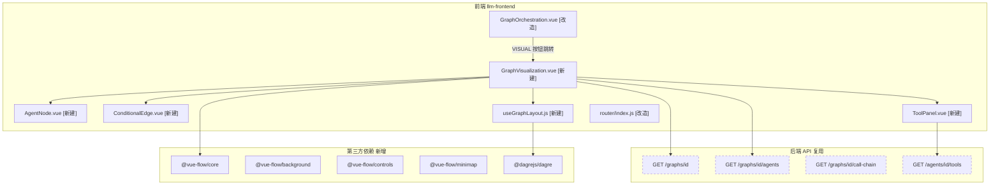
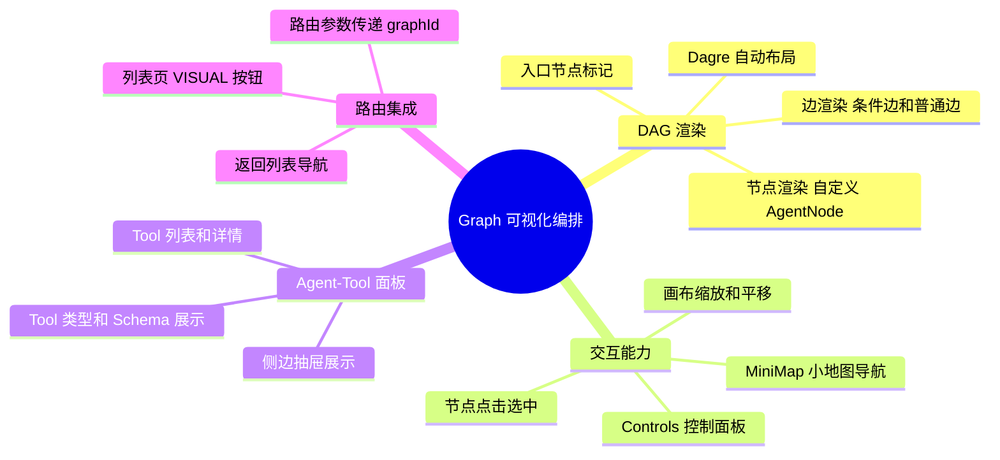
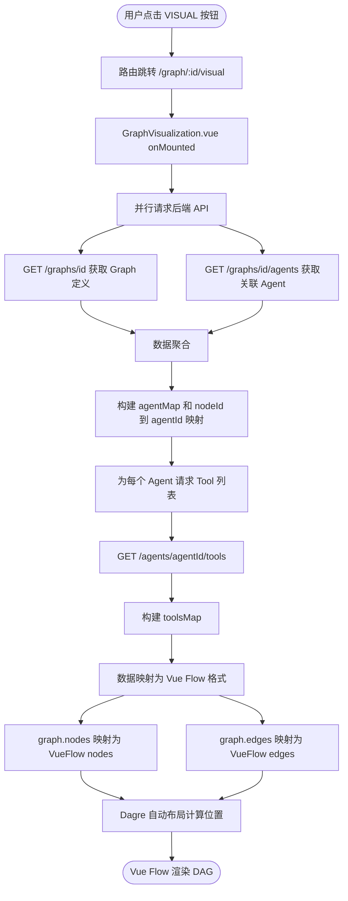
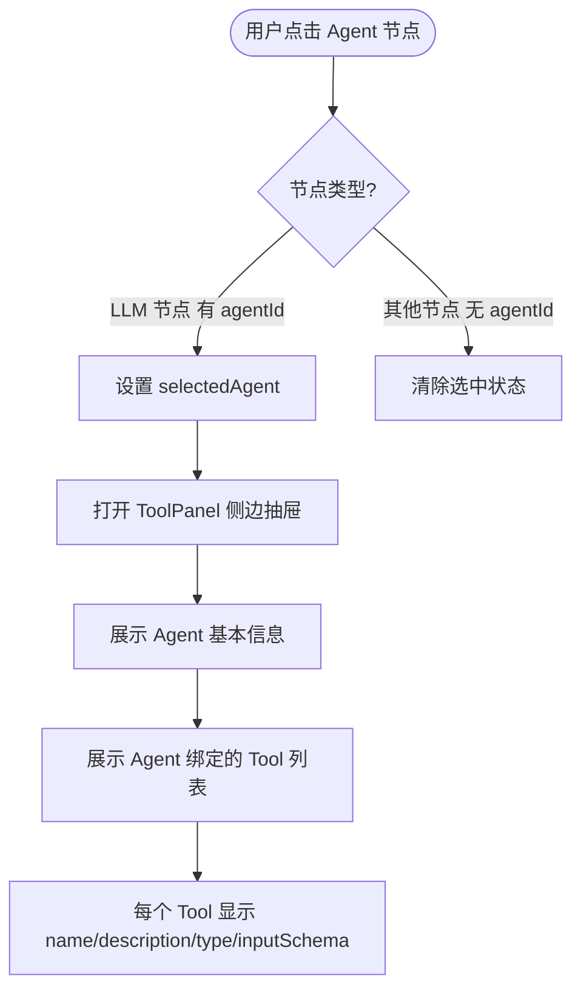
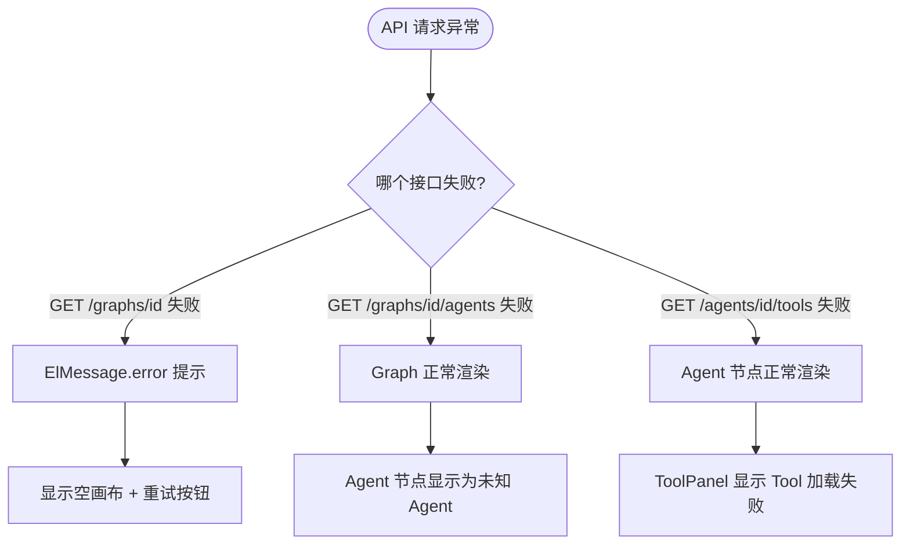
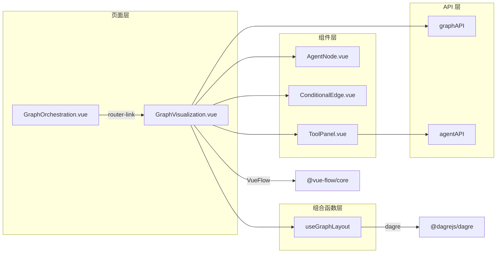
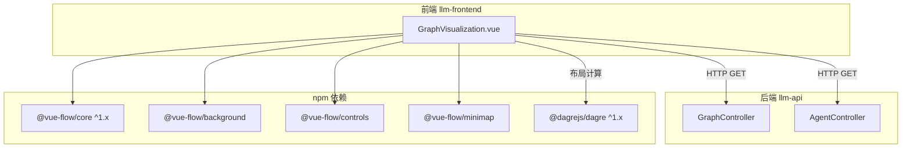

# 功能设计文档

## 变更记录

| 版本 | 日期 | 修改人 | 变更内容摘要 |
|------|------|--------|--------------|
| v1 | 2026-04-12 | zhangkai | 初始版本，Graph 可视化编排前端功能设计 |

---

## 1. 基本信息

- 功能名称：Graph 可视化编排
- 所属系统：llm-orchestration-platform
- 所属模块：llm-frontend
- 需求来源：现有 GraphOrchestration 页面仅以列表/卡片展示 Graph 元数据（节点数、边数、入口节点），无法直观呈现 Agent 调度关系和 Agent-Tool 绑定关系，影响编排理解与调试效率
- 负责人：zhangkai
- 版本号：v1

---

## 2. 背景与目标

### 背景

平台已具备完整的 Graph 编排后端能力（StateGraph 流程编排、多 Agent 协作、Tool 标准协议层），且「平台管理接口补全」已提供了关联查询 API：

| API | 能力 |
|-----|------|
| `GET /graphs/{id}` | 获取 Graph 完整定义（nodes + edges + entryNodeId） |
| `GET /graphs/{id}/agents` | 获取 Graph 下关联的 Agent 列表 |
| `GET /graphs/{id}/call-chain` | 获取按拓扑顺序解析的调用链 |
| `GET /agents/{id}/tools` | 获取 Agent 绑定的 Tool 详情列表 |

但前端 `GraphOrchestration.vue` 当前仅以卡片列表展示 Graph，调用链弹窗也仅为纯文本步骤列表，缺乏可视化 DAG 流程图。

### 问题

1. **无法直观理解编排结构**：nodes/edges 数量只是数字，无法看到实际的 DAG 拓扑
2. **Agent-Tool 关系不透明**：只能看到关联的 Agent 名称列表，不知道每个 Agent 绑定了哪些 Tool
3. **条件路由不可见**：edges 上的 condition（如"审查不通过"回退到方案设计）在列表视图中完全丢失
4. **调试效率低**：排查编排问题时需要在多个页面间跳转，无法一屏总览

### 目标

在前端新增 Graph 可视化页面，以交互式 DAG 流程图展示：

1. **Agent 调度关系**：Graph 中 Node 之间的有向连接、条件路由标签、入口节点标记
2. **Agent-Tool 绑定**：点击 Agent 节点展开侧边面板，显示该 Agent 的 Tool 列表及详情
3. **自动布局**：使用 Dagre 算法自动计算节点位置，无需手动排列
4. **交互能力**：缩放、平移、MiniMap 导航、节点点击交互

### 设计边界

**本次包含（P1 只读可视化）：**

- 可视化 DAG 流程图渲染（Vue Flow + Dagre 自动布局）
- 自定义 Agent 节点组件（融合 Neomorphic 风格）
- 自定义条件边组件（带 condition 标签）
- Agent Tool 侧边面板（点击节点展开）
- MiniMap + Controls 控件
- 路由集成（从 GraphOrchestration 列表页跳转）

**本次不包含：**

- 拖拽编排（在画布上创建/连接节点并持久化）
- 运行态可视化（Graph 执行时实时高亮当前节点）
- Trace Span 叠加展示
- 节点配置编辑

**后续扩展：**

| 阶段 | 能力 |
|------|------|
| P2 | 拖拽编排：在画布上拖拽创建、连接节点，保存为 Graph |
| P3 | 运行态可视化：Graph 执行时实时高亮当前节点，展示 Trace Span |
| P4 | Supervisor 模式可视化：动态展示 Agent 间 Handoff 路径 |

---

## 3. 功能范围

### 3.1 功能模块总览图

> 实线边框 = 本次新建/改造 | 虚线边框 = 复用现有，不修改

### 3.2 能力分解图

### 3.3 功能范围说明

- **本次包含：** 5 个新建前端文件 + 2 个改造文件 + 5 个 npm 依赖
- **本次不包含：** 后端接口变更、拖拽编排、运行态高亮、节点配置编辑
- **后续扩展：** P2 拖拽编排、P3 运行态可视化、P4 Supervisor 模式可视化

---

## 4. 业务流程设计

### 4.1 正常流程

#### 4.1.1 页面初始化流程

#### 4.1.2 节点点击交互流程

### 4.2 异常流程

### 4.3 状态流转

不涉及持久化状态变化。页面级状态为纯前端 reactive 状态，无需状态图。

---

## 5. 接口设计

本次无新增接口，全部复用现有 API。

### 5.1 接口清单（复用）

| 方法 | 路径 | 来源 | 用途 |
|------|------|------|------|
| GET | `/api/v1/graphs/{graphId}` | graphAPI.getById | 获取 Graph 完整定义 |
| GET | `/api/v1/graphs/{graphId}/agents` | graphAPI.getAgents | 获取关联 Agent 列表 |
| GET | `/api/v1/agents/{agentId}/tools` | agentAPI.getTools | 获取 Agent 的 Tool 列表 |

### 5.2 后端数据模型（参考）

**GraphDefinition：**

| 字段 | 类型 | 说明 |
|------|------|------|
| id | String | 唯一标识 |
| name | String | 显示名称 |
| description | String | 描述 |
| nodes | List of GraphNode | 节点列表 |
| edges | List of GraphEdge | 边列表 |
| entryNodeId | String | 入口节点 ID |

**GraphNode：**

| 字段 | 类型 | 说明 |
|------|------|------|
| id | String | 节点 ID |
| type | NodeType | 类型枚举：LLM / TOOL / CONDITION / MERGE / PARALLEL / LOOP / OUTPUT |
| name | String | 显示名称 |
| config | Map | 配置项，LLM 节点含 agentId |

**GraphEdge：**

| 字段 | 类型 | 说明 |
|------|------|------|
| from | String | 源节点 ID |
| to | String | 目标节点 ID |
| condition | String | 条件表达式（可选） |

**AgentDefinition：**

| 字段 | 类型 | 说明 |
|------|------|------|
| id | String | 唯一标识 |
| name | String | Agent 名称 |
| description | String | 描述 |
| toolIds | List of String | 绑定的 Tool ID 列表 |
| llmProvider | String | 模型平台 |
| llmModel | String | 模型名称 |
| maxIterations | Integer | 最大迭代次数 |
| timeoutSeconds | Integer | 超时秒数 |
| enabled | boolean | 是否启用 |

**ToolDefinition：**

| 字段 | 类型 | 说明 |
|------|------|------|
| id | String | 唯一标识 |
| name | String | Tool 名称 |
| description | String | 描述 |
| inputSchema | String | JSON Schema |
| type | ToolType | 类型枚举：FUNCTION / CODE_INTERPRETER / RETRIEVER / WEB_SEARCH / CALCULATOR / CUSTOM |
| isAsync | boolean | 是否异步 |

---

## 6. 类设计

> 本功能为纯前端功能，"类"对应 Vue 组件、composable、配置文件。

### 6.1 分层设计

| 层 | 目录路径 | 职责 |
|----|---------|------|
| 页面视图 | `src/views/` | 页面级组件，路由入口 |
| 业务组件 | `src/components/graph/` | Graph 可视化专用组件 |
| 组合函数 | `src/composables/` | 布局计算等可复用逻辑 |
| API | `src/api/index.js` | 已有，不修改 |
| 路由 | `src/router/index.js` | 新增路由条目 |

### 6.2 核心类清单

| 全路径 | 类型 | 变更 | 一句话职责 |
|--------|------|------|-----------|
| `src/views/GraphVisualization.vue` | Page | 新建 | 可视化页面主视图，加载数据、映射 Vue Flow 格式、渲染 DAG |
| `src/components/graph/AgentNode.vue` | Component | 新建 | 自定义 Agent 节点，展示名称、类型、Tool 标签，提供 Handle 连接点 |
| `src/components/graph/ConditionalEdge.vue` | Component | 新建 | 自定义条件边，渲染带 condition 标签的有向连线 |
| `src/components/graph/ToolPanel.vue` | Component | 新建 | Agent Tool 侧边抽屉，展示选中 Agent 的 Tool 详情列表 |
| `src/composables/useGraphLayout.js` | Composable | 新建 | 封装 Dagre 自动布局算法，输入 nodes+edges 输出带坐标的 nodes |
| `src/views/GraphOrchestration.vue` | Page | 改造 | 每个 Graph 卡片新增 VISUAL 按钮，跳转可视化页面 |
| `src/router/index.js` | Config | 改造 | 新增 `/graph/:id/visual` 路由条目 |

### 6.3 类调用关系

---

## 7. 数据库设计

不涉及数据库变更。

---

## 8. 核心业务规则

1. **数据映射规则**：GraphNode 映射为 Vue Flow Node 时，`type` 字段决定自定义节点类型；LLM 类型节点从 `config.agentId` 关联 Agent 信息；非 LLM 节点使用默认节点样式
2. **边映射规则**：GraphEdge 映射为 Vue Flow Edge 时，`from` 对应 `source`，`to` 对应 `target`；有 `condition` 字段的边使用 ConditionalEdge 自定义组件，无条件的边使用默认动画边
3. **Dagre 布局规则**：使用 TB（top-bottom）方向布局；节点间垂直间距 120px，水平间距 80px；节点默认宽度 200px、高度 100px
4. **入口节点标记规则**：与 `entryNodeId` 匹配的节点添加视觉区分（如边框高亮或入口图标）
5. **Tool 加载规则**：Agent 的 Tool 列表在页面初始化时批量加载（非懒加载），构建 `toolsMap[agentId] = Tool[]`；加载失败的 Agent 静默跳过，不影响整体渲染
6. **节点点击规则**：仅 LLM 类型且有 agentId 的节点可点击打开 ToolPanel；其他类型节点点击仅高亮选中
7. **画布交互规则**：默认 fitView 展示全部节点；支持滚轮缩放、拖拽平移；MiniMap 提供全局缩略导航

---

## 9. 事务与并发控制

不涉及（纯前端只读页面）。

---

## 10. 缓存设计

不涉及持久化缓存。页面级 reactive 状态在组件卸载时自动释放。

---

## 11. 消息与异步设计

不涉及 WebSocket 或 SSE。所有数据通过 REST API 一次性加载。

---

## 12. 下游依赖设计

| 依赖 | 版本 | 用途 | 大小 |
|------|------|------|------|
| @vue-flow/core | ^1.x | Vue 3 流程图核心库 | ~50KB gzipped |
| @vue-flow/background | ^1.x | 画布背景网格 | ~2KB |
| @vue-flow/controls | ^1.x | 缩放/居中控制面板 | ~3KB |
| @vue-flow/minimap | ^1.x | 小地图导航 | ~5KB |
| @dagrejs/dagre | ^1.x | DAG 自动布局算法 | ~30KB |

---

## 13. 安全设计

不涉及敏感数据。所有数据来自已有后端 API，复用现有鉴权机制。

---

## 14. 日志与监控设计

- API 请求失败时 `console.error` 记录错误详情
- 用户操作（点击节点、打开面板）不记录日志

---

## 15. 异常处理设计

| 场景 | 处理方式 |
|------|---------|
| Graph 数据加载失败 | ElMessage.error 提示 + 显示空画布 + 重试按钮 |
| Agent 列表加载失败 | 节点正常渲染，Agent 信息显示为"未知" |
| 单个 Agent 的 Tool 加载失败 | 静默跳过，ToolPanel 中提示"Tool 加载失败" |
| Graph 无节点 | 显示空状态提示 |
| graphId 路由参数缺失 | 重定向回列表页 |

---

## 16. 测试要点

| 测试点 | 验证内容 |
|--------|---------|
| DAG 渲染 | 节点数量与 Graph 定义一致；边连接正确 |
| 条件边 | condition 标签正确显示 |
| 入口节点 | entryNodeId 节点有视觉区分 |
| 自动布局 | 节点不重叠、边不交叉 |
| 节点点击 | LLM 节点点击打开 ToolPanel，非 LLM 节点不打开 |
| ToolPanel | 显示正确的 Tool 名称、类型、描述 |
| 空 Graph | 无节点时显示空状态 |
| API 异常 | 各接口失败时的降级展示 |
| 响应式 | 画布缩放、平移流畅 |

---

## 17. 上线与回滚方案

- **上线**：新增前端页面和组件，不影响现有页面；npm install 新依赖后正常构建部署
- **回滚**：删除新增路由条目和 VISUAL 按钮即可，不影响任何现有功能

---

## 18. 风险点与待确认事项

| 风险点 | 说明 | 状态 |
|--------|------|------|
| Vue Flow 与 TailwindCSS v4 兼容性 | Vue Flow 的默认样式可能与 Tailwind reset 冲突 | 需验证 |
| 大量节点性能 | 节点数超过 100 时 Dagre 布局和 Vue Flow 渲染性能 | 预计不超过 50 节点，低风险 |
| NodeType 完整覆盖 | 当前仅重点处理 LLM 类型节点，其他类型（CONDITION/MERGE/PARALLEL 等）需要独立的节点样式 | P1 使用默认样式，P2 扩展 |
