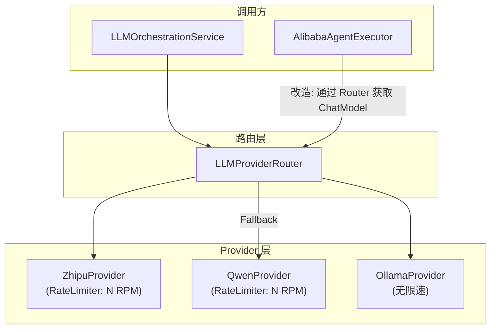
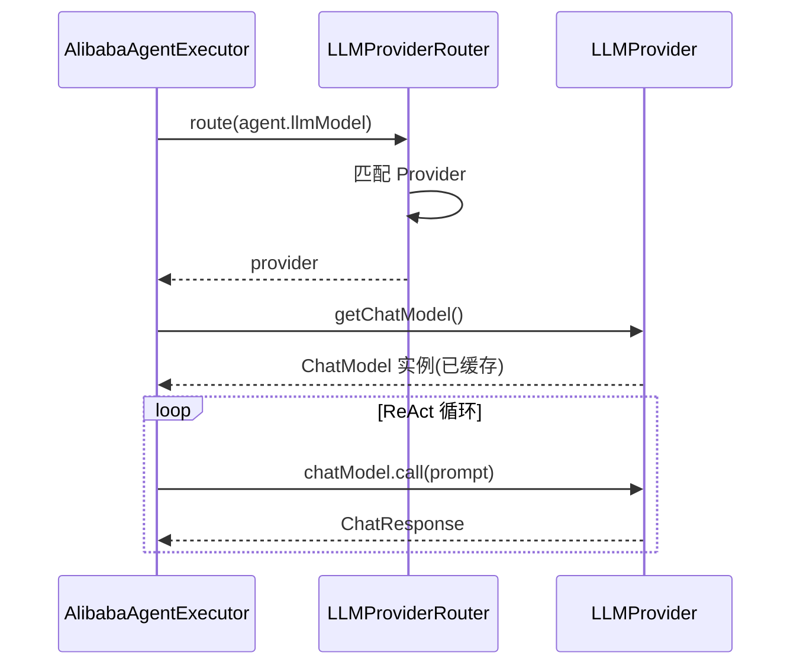
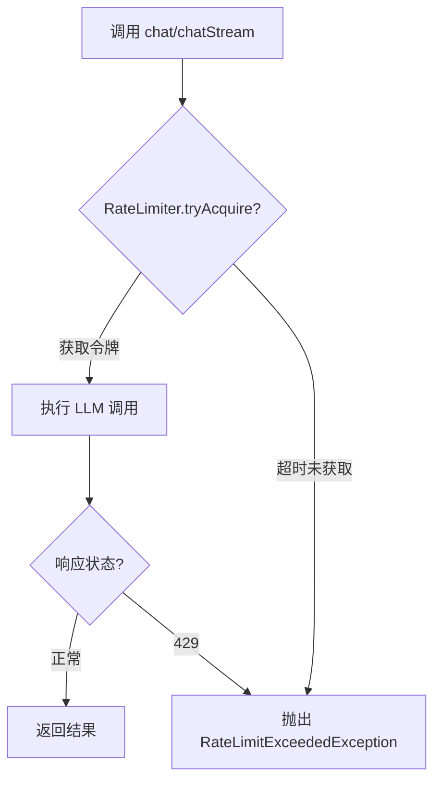
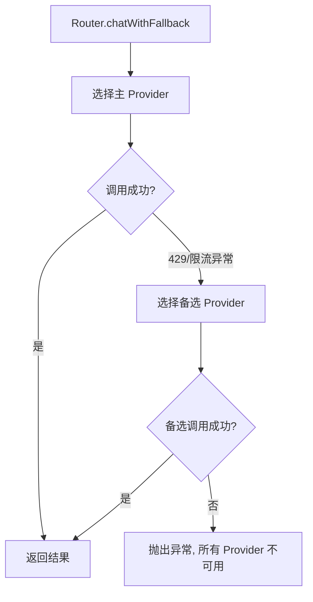
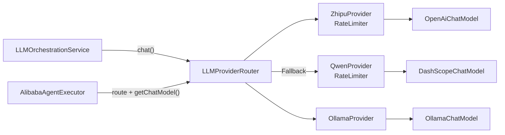

# 功能设计文档

## 变更记录

| 版本 | 日期 | 修改人 | 变更内容摘要 |
|------|------|--------|-------------- |
| v1 | 2026-04-09 | 张凯 | 初始版本 |

---

## 1. 基本信息

| 项目 | 内容 |
|------|------|
| 功能名称 | ChatModel 统一获取与限速降级 |
| 所属系统 | llm-orchestration-platform |
| 所属模块 | llm-domain / llm-infrastructure |
| 需求来源 | Agent 执行器绕开 Router 自建 ChatModel，导致重复代码、无法统一限速；智谱 429 频繁触发 |
| 版本号 | v1 |

## 2. 背景与目标

### 2.1 背景

多平台模型路由层 v1 已实现 `LLMProviderRouter`，上层通过 Router 获取 `LLMProvider` 进行 `chat(LLMRequest)` 调用。但 `AlibabaAgentExecutor` 未接入 Router，而是自行构建 `ChatModel`：

- `buildDashScopeChatModel()`（第 167-183 行）与 `QwenProvider.getChatModel()` 逻辑完全重复
- `buildZhipuChatModel()`（第 185-202 行）与 `ZhipuProvider.getChatModel()` 逻辑完全重复
- `buildChatModel()`（第 159-165 行）用 `if ("zhipu")` 硬编码路由，是简化版的 Router

### 2.2 问题

| 问题 | 影响 |
|------|------|
| ChatModel 构建逻辑散落两处 | 改配置或构建参数需改两处，容易遗漏 |
| 每次 `execute()` 都 new ChatModel | 无实例复用，浪费连接资源 |
| 绕开 Router | 后续限速、Fallback、多 Key 轮换对 Agent 不生效 |
| 无主动限速 | Agent ReAct 循环连续调用 LLM（单次可达 5-20 轮），叠加多用户并发极易触发 429 |
| 429 后无降级 | 主力平台限流后直接失败，无自动切换备选平台的能力 |

### 2.3 目标

1. **消除重复**：`LLMProvider` 暴露 `getChatModel()` 方法，AgentExecutor 通过 Router 获取，删除自建逻辑
2. **主动限速**：在 Provider 层按平台配置 RPM 限制，调用前令牌桶排队
3. **429 降级**：Router 层捕获限流异常，自动 Fallback 到备选 Provider

### 2.4 设计边界

- 本次包含：
  - `LLMProvider` 接口新增 `getChatModel()` 方法
  - 三个 Provider 实现该方法（返回已缓存的实例）
  - `AlibabaAgentExecutor` 改为通过 Router 获取 ChatModel，删除 build 方法
  - Provider 层增加 Guava RateLimiter 主动限速
  - Router 层增加 Fallback 降级逻辑
- 本次不包含：
  - 多 Key 轮换
  - 请求队列 / 异步排队
  - Token 预算管控（TPM 限制）
- 后续扩展：多 Key 池、按租户配额、TPM 限制

## 3. 功能范围

### 3.1 模块总览



### 3.2 三个改造点

**改造点 1：Provider 暴露 ChatModel**

`LLMProvider` 接口新增 `getChatModel()` 方法，各 Provider 返回内部已缓存的 Spring AI ChatModel 实例。AgentExecutor 需要直接操作 ChatModel 来管控 ReAct 循环的消息列表，因此不能只走 `chat(LLMRequest)`。

**改造点 2：主动限速**

每个 Provider 内部持有一个 Guava `RateLimiter`，在 `chat()` / `chatStream()` / `getChatModel()` 返回的 model 调用前进行令牌获取。RPM 通过 YAML 配置，按平台独立设置。

**改造点 3：Fallback 降级**

Router 新增 `routeWithFallback()` 方法，当主 Provider 调用抛出 429 或限速等待超时时，自动尝试备选 Provider。

## 4. 业务流程设计

### 4.1 AgentExecutor 通过 Router 获取 ChatModel



### 4.2 限速流程



### 4.3 Fallback 降级流程



### 4.4 异常流程

| 场景 | 处理方式 |
|------|----------|
| 主 Provider 429 且有备选 | 自动 Fallback，日志记录切换 |
| 所有 Provider 均 429 | 抛出异常，上层返回 "服务繁忙请稍后重试" |
| RateLimiter 等待超时 | 不实际发请求，直接尝试 Fallback |
| Agent ReAct 中途限流 | 当次迭代失败，下次迭代自动等待令牌后重试 |

## 5. 接口设计

### 5.1 接口清单

无新增 REST 接口，仅内部 Bean 调用变更。

### 5.2 配置接口

YAML 新增限速配置：

```yaml
llm:
  zhipu:
    rate-limit:
      rpm: 50          # 每分钟最大请求数，留 10 余量
  alibaba:
    rate-limit:
      rpm: 50
  ollama:
    rate-limit:
      rpm: 0           # 0 表示不限速
  fallback-order:       # 降级顺序
    - zhipu
    - alibaba
```

## 6. 类设计

### 6.1 分层设计

- Domain 层（接口变更）：`LLMProvider` 新增方法
- Infrastructure 层（实现变更）：三个 Provider + Router + AgentExecutor + 配置类

### 6.2 核心类清单

| 全类名 | 类型 | 变更类型 | 职责说明 |
|--------|------|----------|----------|
| `c.e.l.domain.service.LLMProvider` | Interface | **修改** | 新增 `getChatModel()` 方法 |
| `c.e.l.domain.exception.RateLimitExceededException` | Exception | **新建** | 限流异常，携带 provider 名称 |
| `c.e.l.infrastructure.provider.ZhipuProvider` | Component | **修改** | 实现 `getChatModel()`；`chat()`/`chatStream()` 前加限速 |
| `c.e.l.infrastructure.provider.QwenProvider` | Component | **修改** | 同上 |
| `c.e.l.infrastructure.provider.OllamaProvider` | Component | **修改** | 实现 `getChatModel()`；本地不限速 |
| `c.e.l.infrastructure.provider.LLMProviderRouter` | Component | **修改** | 新增 `routeWithFallback()` 方法 |
| `c.e.l.infrastructure.agent.executor.AlibabaAgentExecutor` | Class | **修改** | 注入 Router 替代 LLMConfiguration；删除 3 个 build 方法 |
| `c.e.l.infrastructure.config.AgentConfiguration` | Configuration | **修改** | Bean 工厂方法参数改为注入 Router |
| `c.e.l.infrastructure.config.LLMConfiguration` | Configuration | **修改** | 各 Provider Config 新增 `RateLimitConfig` 内部类 |

### 6.3 关键类变更详情

#### LLMProvider 接口变更

```java
public interface LLMProvider {
    LLMResponse chat(LLMRequest request);
    Flux<String> chatStream(LLMRequest request);
    String getProviderName();
    boolean supports(String model);

    // 新增：暴露底层 ChatModel，供 AgentExecutor 等需要直接操作消息列表的场景使用
    ChatModel getChatModel();
}
```

> 说明：`ChatModel` 是 Spring AI 的 `org.springframework.ai.chat.model.ChatModel`。domain 层已依赖 `reactor.core.publisher.Flux`（Spring 生态），新增 `ChatModel` 依赖在同一生态内，可接受。

#### LLMConfiguration 配置变更

```java
@Data
public static class RateLimitConfig {
    private int rpm = 0;  // 0 表示不限速
}

// 各 Provider Config 新增字段
@Data
public static class ZhipuConfig {
    // ... 已有字段
    private RateLimitConfig rateLimit = new RateLimitConfig();
}
```

#### Provider 限速实现（以 ZhipuProvider 为例）

```java
public class ZhipuProvider implements LLMProvider {
    private RateLimiter rateLimiter;  // Guava RateLimiter

    @Override
    public ChatModel getChatModel() {
        return getOrCreateChatModel();  // 返回已缓存实例
    }

    @Override
    public LLMResponse chat(LLMRequest request) {
        acquirePermit();  // 限速
        // ... 原有逻辑
    }

    private void acquirePermit() {
        if (rateLimiter != null && !rateLimiter.tryAcquire(5, TimeUnit.SECONDS)) {
            throw new RateLimitExceededException("zhipu");
        }
    }
}
```

#### LLMProviderRouter Fallback 变更

```java
public class LLMProviderRouter {
    private List<String> fallbackOrder;  // 从配置读取

    // 新增：带降级的调用
    public LLMResponse chatWithFallback(LLMRequest request, String preferredProvider) {
        List<LLMProvider> candidates = resolveCandidates(preferredProvider);
        for (LLMProvider provider : candidates) {
            try {
                return provider.chat(request);
            } catch (RateLimitExceededException e) {
                log.warn("Provider {} 限流，尝试降级", provider.getProviderName());
            }
        }
        throw new RuntimeException("所有 Provider 不可用");
    }
}
```

#### AlibabaAgentExecutor 改造

```java
public class AlibabaAgentExecutor implements AgentExecutor {
    private final LLMProviderRouter providerRouter;  // 替代 LLMConfiguration
    // ... 其他依赖不变

    // 删除: buildChatModel(), buildDashScopeChatModel(), buildZhipuChatModel()

    @Override
    public AgentExecutionResult execute(AgentExecutionRequest request) {
        AgentDefinition agent = ...;
        // 通过 Router 获取 ChatModel
        LLMProvider provider = providerRouter.route(agent.llmModel());
        ChatModel chatModel = provider.getChatModel();
        // ... ReAct 循环逻辑不变
    }
}
```

### 6.4 改造前后对比

```
改造前:
  AgentExecutor → LLMConfiguration → 自己 new ChatModel → 直接调 API
                                     (重复代码, 无缓存, 无限速)

改造后:
  AgentExecutor → LLMProviderRouter → Provider → getChatModel() (已缓存, 有限速)
                                        ↓ (429时)
                                   Fallback Provider
```

### 6.5 类调用关系



## 7. 数据库设计

无数据库变更。

## 8. 核心业务规则

1. **ChatModel 单例复用**：每个 Provider 的 ChatModel 只创建一次（已有的 synchronized lazy init），`getChatModel()` 返回同一实例
2. **限速令牌桶**：使用 Guava `RateLimiter.create(rpm / 60.0)`，将 RPM 转换为每秒许可数
3. **限速等待超时**：`tryAcquire` 最多等待 5 秒，超时抛 `RateLimitExceededException`
4. **降级顺序可配置**：`llm.fallback-order` 列表决定尝试顺序，主 Provider 优先
5. **Ollama 不限速**：本地模型 rpm=0 时跳过限速逻辑
6. **AgentExecutor 限速时机**：Agent ReAct 循环中每次 `chatModel.call()` 前由 Provider 内部限速，对 AgentExecutor 透明
7. **Guava 零新依赖**：项目已有 Guava（Caffeine 传递依赖），无需新增 POM 依赖

## 9. 事务与并发控制

- RateLimiter 本身线程安全
- ChatModel 实例由 synchronized 保护，创建后只读
- Router 无状态，Fallback 遍历无副作用

## 10. 异常处理设计

| 异常类型 | 触发条件 | 处理方式 |
|----------|----------|----------|
| `RateLimitExceededException` | 限速等待超时 | Router Fallback 或上层返回 429 |
| `NonTransientAiException(429)` | 平台返回 429 | Provider catch 后包装为 `RateLimitExceededException`，触发 Fallback |
| `IllegalArgumentException` | 无匹配 Provider | 不变，直接抛出 |

## 11. 测试要点

| 测试场景 | 验证点 |
|----------|--------|
| Provider.getChatModel() 多次调用 | 返回同一实例 |
| RateLimiter 超限 | 抛出 RateLimitExceededException |
| Router Fallback | 主 Provider 限流后自动切到备选 |
| AgentExecutor 通过 Router 获取 ChatModel | 不再自建，实例与 Provider 一致 |
| 配置 rpm=0 | 跳过限速 |

## 12. 变更文件清单

| 文件 | 变更类型 | 说明 |
|------|----------|------|
| `llm-domain/.../service/LLMProvider.java` | 修改 | 新增 `getChatModel()` |
| `llm-domain/.../exception/RateLimitExceededException.java` | 新建 | 限流异常 |
| `llm-infrastructure/.../provider/ZhipuProvider.java` | 修改 | 实现 getChatModel + 限速 |
| `llm-infrastructure/.../provider/QwenProvider.java` | 修改 | 同上 |
| `llm-infrastructure/.../provider/OllamaProvider.java` | 修改 | 实现 getChatModel（不限速） |
| `llm-infrastructure/.../provider/LLMProviderRouter.java` | 修改 | 新增 Fallback 方法 |
| `llm-infrastructure/.../executor/AlibabaAgentExecutor.java` | 修改 | 注入 Router，删除 3 个 build 方法 |
| `llm-infrastructure/.../config/AgentConfiguration.java` | 修改 | Bean 参数改为 Router |
| `llm-infrastructure/.../config/LLMConfiguration.java` | 修改 | 新增 RateLimitConfig |
| `llm-starter/.../config/dev/spring-ai.yml` | 修改 | 新增限速配置 |
| `llm-starter/.../config/prod/spring-ai.yml` | 修改 | 新增限速配置 |
