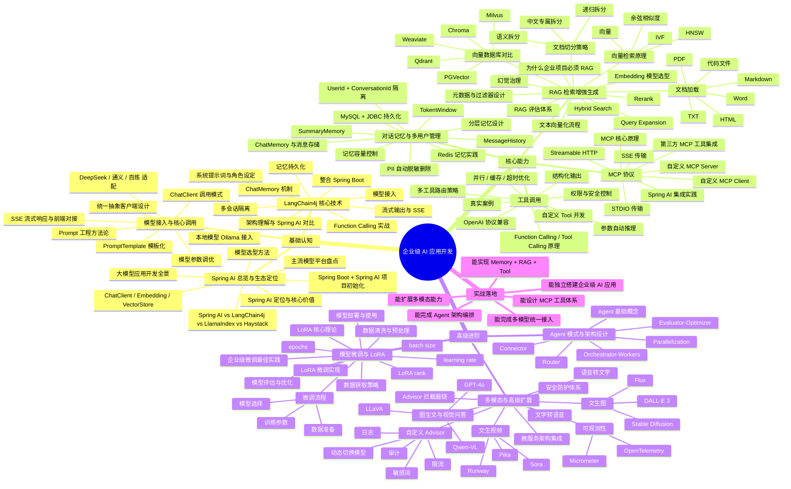
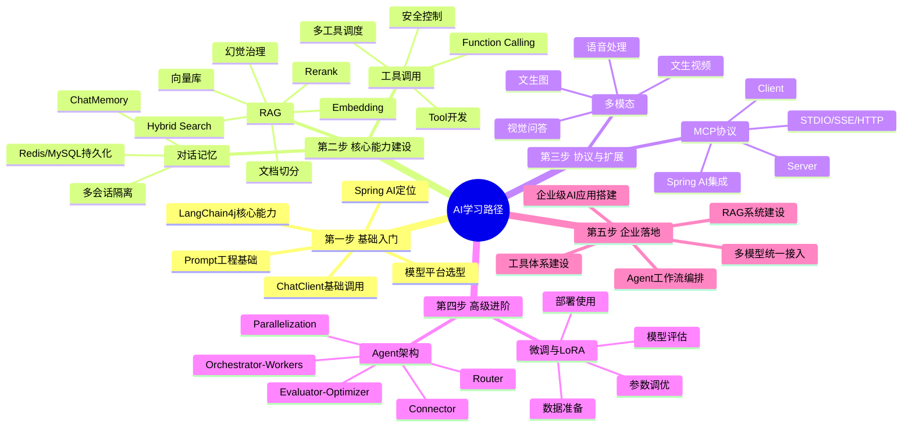
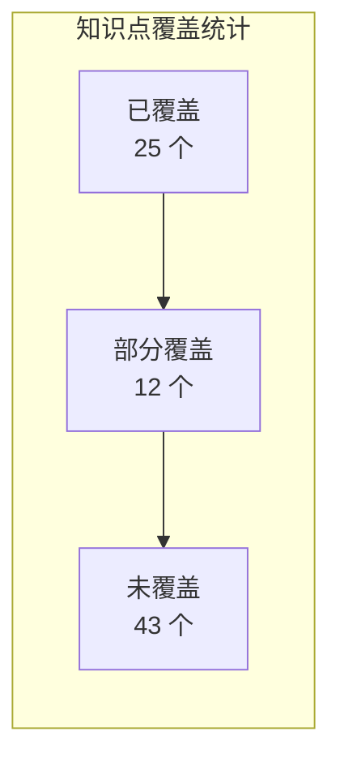
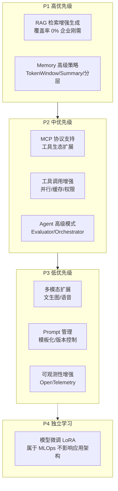

# 企业级 AI 应用开发学习路线图

> 本文档梳理大模型应用开发的完整知识体系，并标注各知识点在「通用智能体架构」及其子模块中的覆盖情况。
>
> 最后更新：2026-04-05

---

## 1. 学习路线全景图

```mermaid
graph LR
    ROOT(企业级AI应用开发)

    ROOT --> A(基础认知)
    A --> A1(Spring AI总览)
    A --> A2(LangChain4j核心)
    A --> A3(模型接入与调用)
    A1 --- A1a[大模型应用开发全景]
    A1 --- A1b[Spring AI定位]
    A1 --- A1c[框架对比]
    A1 --- A1d[ChatClient Embedding VectorStore]
    A1 --- A1f[模型平台盘点与选型]
    A2 --- A2a[模型接入与Spring Boot整合]
    A2 --- A2d[流式输出与SSE]
    A2 --- A2e[ChatMemory与多会话隔离]
    A2 --- A2g[记忆持久化]
    A2 --- A2h[Function Calling]
    A2 --- A2i[系统提示词与角色设定]
    A3 --- A3a[统一抽象客户端]
    A3 --- A3c[Ollama DeepSeek 通义适配]
    A3 --- A3e[SSE流式响应]
    A3 --- A3f[模型参数调优]
    A3 --- A3g[Prompt工程与模板化]

    ROOT --> B(核心能力)
    B --> B1(对话记忆)
    B --> B2(RAG检索增强)
    B --> B3(工具调用)
    B --> B4(MCP协议)
    B1 --- B1a[MessageHistory TokenWindow SummaryMemory]
    B1 --- B1e[Redis MySQL持久化]
    B1 --- B1f[UserId ConversationId隔离]
    B1 --- B1h[分层记忆与容量控制]
    B1 --- B1i[PII自动脱敏]
    B2 --- B2a[向量检索原理与Embedding]
    B2 --- B2c[向量数据库选型]
    B2 --- B2d[文档加载与切分策略]
    B2 --- B2f[Hybrid Search与Rerank]
    B2 --- B2h[幻觉治理与评估体系]
    B3 --- B3a[Function Calling原理]
    B3 --- B3c[自定义Tool开发]
    B3 --- B3d[多工具路由与安全控制]
    B3 --- B3f[并行缓存超时优化]
    B4 --- B4a[MCP核心原理]
    B4 --- B4b[STDIO SSE HTTP传输]
    B4 --- B4c[自定义Server Client]
    B4 --- B4e[Spring AI集成]

    ROOT --> C(高级进阶)
    C --> C1(多模态扩展)
    C --> C2(模型微调LoRA)
    C --> C3(Agent架构设计)
    C1 --- C1a[文生图 文生视频]
    C1 --- C1c[图生文与视觉问答]
    C1 --- C1d[语音处理]
    C1 --- C1e[Advisor拦截器链]
    C1 --- C1g[可观测性与安全防护]
    C2 --- C2a[LoRA核心理论]
    C2 --- C2b[微调流程与数据准备]
    C2 --- C2d[训练参数调优]
    C2 --- C2e[模型评估与部署]
    C3 --- C3a[Agent基础概念]
    C3 --- C3b[Evaluator Optimizer]
    C3 --- C3d[Router Orchestrator Workers]
    C3 --- C3f[Connector Parallelization]

    ROOT --> D(实战落地)
    D --- D1[企业级AI应用搭建]
    D --- D2[多模型统一接入]
    D --- D3[Memory RAG Tool集成]
    D --- D4[MCP工具体系]
    D --- D5[多模态扩展]
    D --- D6[Agent架构编排]
```

> 上图为 graph 版本（兼容 Mermaid 8.x），下方为 mindmap 版本（需 Mermaid 9.3+）。

### 路线推进版

---

## 2. 知识点与架构映射分析

下表将学习路线中的每个知识点映射到当前项目的设计文档，标注覆盖状态：

- **已覆盖** = 当前设计文档中已有对应的接口/实现/流程设计
- **部分覆盖** = 仅定义了接口或提及了概念，但未落地具体实现
- **未覆盖** = 当前设计文档中完全未涉及，属于后续建设方向

### 2.1 基础认知

#### Spring AI 总览与生态定位

| 知识点 | 覆盖状态 | 映射位置 |
|--------|---------|---------|
| 大模型应用开发全景 | 已覆盖 | 通用智能体架构 7 环节即全景抽象 |
| Spring AI 定位与核心价值 | 未覆盖 | 项目未使用 Spring AI，自建抽象层 |
| Spring AI vs LangChain4j 对比 | 未覆盖 | 参考意义，项目采用自建架构 |
| ChatClient / Embedding / VectorStore | 部分覆盖 | LLMProvider 对应 ChatClient 概念，Embedding/VectorStore 未涉及 |
| 项目初始化 | 已覆盖 | Spring Boot + DDD 分层已就绪 |
| 主流模型平台盘点 | 已覆盖 | 多平台模型路由层文档已涵盖 |
| 模型选型方法 | 部分覆盖 | ModelType 枚举定义了支持的模型，但无选型决策逻辑 |

#### LangChain4j 核心技术

| 知识点 | 覆盖状态 | 映射位置 |
|--------|---------|---------|
| 架构理解 | 已覆盖 | 通用智能体架构本身就是等价抽象 |
| 模型接入 | 已覆盖 | LLMProvider 接口 + 多平台路由层 |
| 整合 Spring Boot | 已覆盖 | AgentLoopConfiguration |
| 流式输出与 SSE | 已覆盖 | AgentLoop.executeStream / Flux |
| ChatMemory 机制 | 已覆盖 | Memory 接口 + ConversationMemory |
| 多会话隔离 | 已覆盖 | conversationId 隔离 |
| 记忆持久化 | 部分覆盖 | Memory 接口已定义，ConversationMemoryRepository 已有，但一期不实现新存储 |
| Function Calling 实战 | 已覆盖 | ToolSelector + ToolExecutor + ToolRegistry |
| 系统提示词与角色设定 | 已覆盖 | AgentConfig.systemPrompt |

#### 模型接入与核心调用

| 知识点 | 覆盖状态 | 映射位置 |
|--------|---------|---------|
| 统一抽象客户端设计 | 已覆盖 | LLMProvider 接口 + LLMProviderRouter |
| ChatClient 调用模式 | 已覆盖 | LLMProvider.chat() |
| 本地模型 Ollama 接入 | 已覆盖 | OllamaProvider（多平台路由层） |
| DeepSeek/通义/百炼适配 | 已覆盖 | QwenProvider + ModelType 枚举 |
| SSE 流式响应与前端对接 | 已覆盖 | Flux + SSE OutputFormatter |
| 模型参数调优 | 部分覆盖 | AgentConfig 有 llmModel，但无 temperature/topP 等细粒度参数 |
| Prompt 工程方法论 | 未覆盖 | 无 Prompt 管理模块 |
| PromptTemplate 模板化 | 未覆盖 | 无模板引擎设计 |

### 2.2 核心能力

#### 对话记忆与多用户管理

| 知识点 | 覆盖状态 | 映射位置 |
|--------|---------|---------|
| MessageHistory | 已覆盖 | Memory.loadContext() |
| TokenWindow | 未覆盖 | 无 Token 窗口截断策略 |
| SummaryMemory | 未覆盖 | 无摘要记忆策略 |
| ChatMemory 与消息存储 | 已覆盖 | ConversationMemory + ConversationMemoryRepository |
| Redis 记忆实践 | 未覆盖 | 一期不实现 |
| MySQL + JDBC 持久化 | 部分覆盖 | ConversationMemoryRepository 已有，但未在新架构中扩展 |
| UserId + ConversationId 隔离 | 部分覆盖 | conversationId 已有，UserId 维度未体现 |
| 记忆容量控制 | 未覆盖 | 无 maxTokens/maxMessages 控制 |
| 分层记忆设计 | 未覆盖 | Memory 接口单层，无短期/长期分层 |
| PII 自动脱敏删除 | 未覆盖 | 无隐私数据处理 |

#### RAG 检索增强生成

| 知识点 | 覆盖状态 | 映射位置 |
|--------|---------|---------|
| 为什么企业项目必须 RAG | 未覆盖 | 无 RAG 模块 |
| 向量检索原理 | 未覆盖 | - |
| Embedding 模型选型 | 未覆盖 | - |
| 文本向量化流程 | 未覆盖 | - |
| 向量数据库对比 | 未覆盖 | - |
| 文档加载 | 未覆盖 | - |
| 文档切分策略 | 未覆盖 | - |
| 元数据与过滤器设计 | 未覆盖 | - |
| Hybrid Search | 未覆盖 | - |
| Query Expansion | 未覆盖 | - |
| Rerank | 未覆盖 | - |
| 幻觉治理 | 未覆盖 | - |
| RAG 评估体系 | 未覆盖 | - |

> RAG 是当前架构最大的空白区域，建议作为独立子模块规划。

#### 工具调用

| 知识点 | 覆盖状态 | 映射位置 |
|--------|---------|---------|
| Function Calling / Tool Calling 原理 | 已覆盖 | 第 4.1 节环节 5-6，ToolSelector + ToolExecutor |
| 结构化输出 | 部分覆盖 | OutputFormatter 定义了格式化，但无 JSON Schema 约束输出 |
| OpenAI 协议兼容 | 部分覆盖 | 通过 LLMProvider 抽象，但未显式定义协议兼容层 |
| 自定义 Tool 开发 | 已覆盖 | ToolRegistry 扫描注册机制 |
| 参数自动推理 | 未覆盖 | 依赖 LLM 的 Function Calling 能力，无额外推理 |
| 多工具路由策略 | 已覆盖 | ToolSelector 接口支持多工具选择 |
| 权限与安全控制 | 部分覆盖 | 第 13 节提到参数校验，但无 Tool 级别权限控制 |
| 并行/缓存/超时优化 | 部分覆盖 | 超时有 timeoutSeconds，但无并行执行和结果缓存 |
| 真实案例 | 已覆盖 | 智能助手文档（日程/待办/笔记工具） |

#### MCP 协议

| 知识点 | 覆盖状态 | 映射位置 |
|--------|---------|---------|
| MCP 核心原理 | 未覆盖 | 无 MCP 模块 |
| STDIO / SSE / Streamable HTTP 传输 | 未覆盖 | - |
| 自定义 MCP Server/Client | 未覆盖 | - |
| 第三方 MCP 工具集成 | 未覆盖 | - |
| Spring AI 集成实践 | 未覆盖 | - |

> MCP 可作为 ToolExecutor 的一种实现策略扩展。

### 2.3 高级进阶

#### 多模态与高级扩展

| 知识点 | 覆盖状态 | 映射位置 |
|--------|---------|---------|
| 文生图 | 未覆盖 | - |
| 文生视频 | 未覆盖 | - |
| 图生文与视觉问答 | 未覆盖 | - |
| 语音转文字 / 文字转语音 | 未覆盖 | - |
| Advisor 拦截器链 | 未覆盖 | 无 Advisor 模式 |
| 自定义 Advisor | 未覆盖 | - |
| 安全防护体系 | 部分覆盖 | 第 13 节有基础安全设计，无敏感词/限流/审计 |
| 可观测性 Micrometer | 已覆盖 | 第 14 节明确使用 Micrometer 埋点 |
| 可观测性 OpenTelemetry | 未覆盖 | 仅 Micrometer，无 OpenTelemetry |
| 微服务架构集成 | 未覆盖 | 当前单体架构 |

#### 模型微调与 LoRA

| 知识点 | 覆盖状态 | 映射位置 |
|--------|---------|---------|
| LoRA 核心理论 | 未覆盖 | 属于模型训练领域，不在应用架构范围 |
| 微调流程 | 未覆盖 | - |
| 数据获取/清洗 | 未覆盖 | - |
| 训练参数调优 | 未覆盖 | - |
| 模型评估/部署 | 未覆盖 | - |

> 模型微调属于 MLOps 领域，与应用架构正交，可作为独立知识模块学习。

#### Agent 模式与架构设计

| 知识点 | 覆盖状态 | 映射位置 |
|--------|---------|---------|
| Agent 基础概念 | 已覆盖 | 整篇设计文档的核心 |
| Evaluator-Optimizer | 未覆盖 | 后续扩展（Reflexion 策略） |
| Router | 已覆盖 | LLMProviderRouter（多平台路由层） |
| Orchestrator-Workers | 未覆盖 | 后续扩展（Multi-Agent） |
| Connector | 未覆盖 | - |
| Parallelization | 未覆盖 | 无并行执行策略 |

### 2.4 实战落地

| 能力目标 | 覆盖状态 | 说明 |
|---------|---------|------|
| 能独立搭建企业级 AI 应用 | 已覆盖 | 整体架构已具备 |
| 能完成多模型统一接入 | 已覆盖 | 多平台模型路由层 |
| 能实现 Memory + RAG + Tool | 部分覆盖 | Memory + Tool 已有，RAG 缺失 |
| 能设计 MCP 工具体系 | 未覆盖 | 无 MCP 模块 |
| 能扩展多模态能力 | 未覆盖 | 无多模态支持 |
| 能完成 Agent 架构编排 | 已覆盖 | AgentLoop + 策略模式 |

---

## 3. 覆盖率统计

| 分类 | 已覆盖 | 部分覆盖 | 未覆盖 | 覆盖率 |
|------|--------|---------|--------|--------|
| 基础认知 | 15 | 4 | 3 | 86% |
| 核心能力 - 记忆 | 3 | 3 | 4 | 60% |
| 核心能力 - RAG | 0 | 0 | 13 | 0% |
| 核心能力 - 工具 | 4 | 3 | 2 | 78% |
| 核心能力 - MCP | 0 | 0 | 5 | 0% |
| 高级进阶 - 多模态 | 1 | 1 | 9 | 18% |
| 高级进阶 - 微调 | 0 | 0 | 5 | 0% |
| 高级进阶 - Agent | 2 | 0 | 4 | 33% |
| 实战落地 | 3 | 1 | 2 | 67% |
| **合计** | **28** | **12** | **47** | **46%** |

---

## 4. 建设优先级建议

基于覆盖率分析和企业应用价值，建议按以下优先级补齐：

### 各优先级说明

| 优先级 | 模块 | 原因 | 建议文档位置 |
|--------|------|------|------------|
| P1 | RAG | 企业应用必备能力，当前完全空白 | `docs/design/通用智能体架构/RAG检索增强/` |
| P1 | Memory 高级策略 | Token 窗口和摘要记忆对长对话至关重要 | 扩展通用智能体架构 Memory 章节 |
| P2 | MCP | 工具生态标准化趋势，可作为 ToolExecutor 扩展 | `docs/design/通用智能体架构/MCP协议支持/` |
| P2 | 工具调用增强 | 并行执行和缓存对性能影响大 | 扩展通用智能体架构 ToolExecutor 章节 |
| P2 | Agent 高级模式 | Evaluator-Optimizer/Multi-Agent 是后续扩展方向 | 扩展通用智能体架构 PlanningStrategy 章节 |
| P3 | 多模态 | 业务需求驱动，非通用架构必须 | `docs/design/通用智能体架构/多模态扩展/` |
| P3 | Prompt 管理 | 提升开发效率，但不影响核心架构 | `docs/design/Prompt管理/` |
| P4 | 模型微调 | MLOps 领域，与应用架构正交 | 独立学习，不纳入设计文档 |
