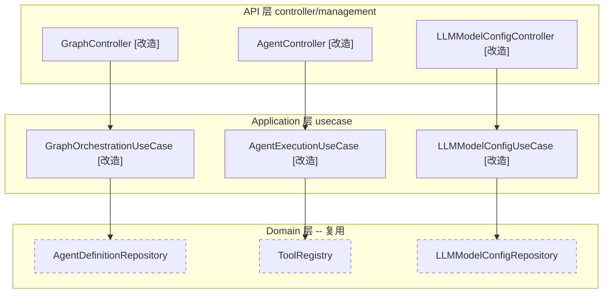
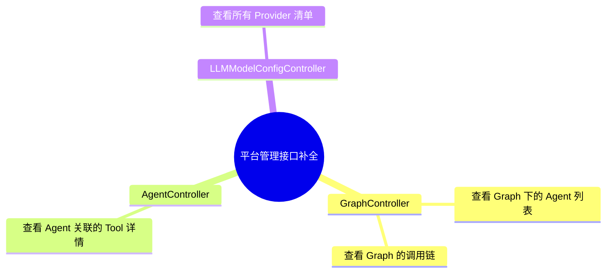
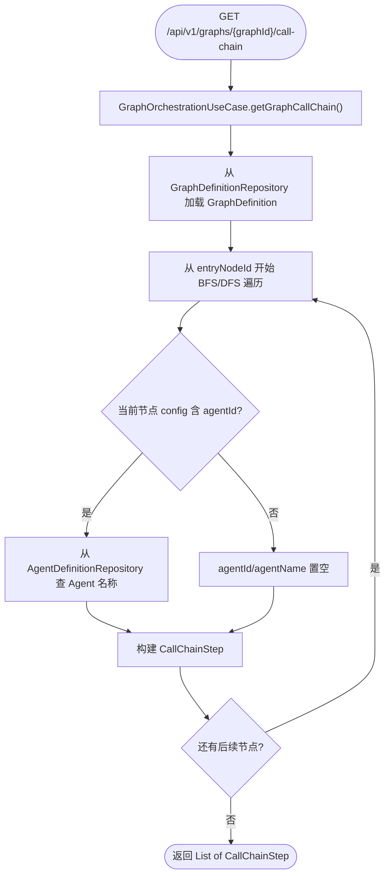
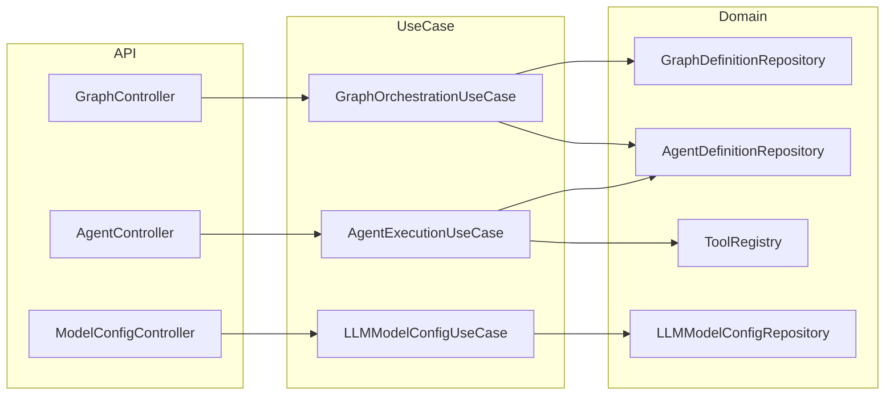

# 功能设计文档

## 变更记录

| 版本 | 日期 | 修改人 | 变更内容摘要 |
|------|------|--------|--------------|
| v1 | 2026-04-09 | 张凯 | 初始版本，补全平台级 5 大管理对象的查看接口 |

---

## 1. 基本信息

- 功能名称：平台管理接口补全
- 所属系统：llm-orchestration-platform
- 所属模块：llm-api / llm-application
- 需求来源：现有管理接口仅提供单对象 CRUD，缺少关联关系查询能力（Graph 下的 Agent 列表、Agent 下的 Tool 详情、调用链视图、模型平台清单）
- 负责人：张凯
- 版本号：v1

## 2. 背景与目标

### 背景

项目定位为智能体开发脚手架，已具备完整的领域模型层（AgentDefinition、GraphDefinition、ToolDefinition、LLMModelConfig），但管理接口仅提供了各对象独立的 CRUD 操作，未暴露对象间的关联关系查询。对于脚手架使用者来说，无法通过 API 完成以下关键操作：

1. **查看智能体（Graph）下有哪些 Agent**：Graph 的 nodes 中虽包含 agentId 配置，但前端需要自行逐个调用 Agent 接口拼装
2. **查看 Agent 间的调用链**：Graph 的 edges 定义了调用顺序，但缺少按拓扑顺序解析后的结构化视图
3. **查看 Agent 关联的 Tool 详情**：Agent 仅返回 `toolIds` 字符串列表，无法直接获取 Tool 的名称、描述、类型等信息
4. **查看模型平台清单**：只能按 provider 名称过滤模型，但无法获取系统中有哪些 provider 可选

### 目标

为 5 大管理对象补全关联查询接口，使前端或 API 消费者能够通过单次请求获取完整的关联数据：

| 管理对象 | 目标接口能力 |
|---------|------------|
| 智能体（Graph） | 查看 Graph 下关联的 Agent 列表 |
| 调用链 | 查看 Graph 按拓扑顺序解析的调用链步骤 |
| Agent 下的 Tool | 查看 Agent 关联的 Tool 完整定义 |
| 模型平台 | 查看所有 Provider 清单及各平台模型数量 |

### 设计边界

- 本次仅新增**只读查询接口**，不涉及写操作
- 不修改领域模型层（domain），仅扩展 application UseCase 和 api Controller
- 不涉及数据库变更
- 不涉及前端改造

---

## 3. 功能范围

### 3.1 功能模块总览图



> 实线边框 = 本次改造 | 虚线边框 = 复用现有，不修改

### 3.2 能力分解图



### 3.3 功能范围说明

- **本次包含：** 4 个新增只读 GET 接口 + UseCase 层对应的查询方法
- **本次不包含：** Graph/Agent/Tool/Model 的写操作扩展、前端页面改造、权限控制
- **后续扩展：** Graph 拓扑可视化数据（含坐标信息）、Agent 执行历史查询、模型健康状态探测

---

## 4. 业务流程设计

### 4.1 正常流程

本次均为纯查询接口，流程简单直接。以"查看 Graph 调用链"为例（最复杂的一个）：



### 4.2 异常流程

| 场景 | 处理 |
|------|------|
| graphId/agentId 不存在 | 抛出 IllegalArgumentException，由 GlobalExceptionHandler 返回 400 |
| Agent 的 toolIds 中包含已注销的 toolId | 跳过该 tool，不报错（ToolRegistry 返回 Optional.empty） |
| Graph 中 agentId 指向的 Agent 已删除 | agentName 返回 null，不中断调用链 |

### 4.3 状态流转

不涉及状态变化。

---

## 5. 接口设计

### 5.1 接口清单

| 方法 | 路径 | 所属 Controller | 说明 |
|------|------|----------------|------|
| GET | `/api/v1/graphs/{graphId}/agents` | GraphController | 获取 Graph 下关联的 Agent 列表 |
| GET | `/api/v1/graphs/{graphId}/call-chain` | GraphController | 获取 Graph 的调用链（拓扑顺序） |
| GET | `/api/v1/agents/{agentId}/tools` | AgentController | 获取 Agent 关联的 Tool 详情列表 |
| GET | `/api/v1/model-config/providers` | LLMModelConfigController | 获取所有模型平台清单 |

### 5.2 请求参数

所有接口均为 GET 请求，参数通过路径变量传递，无 Request Body。

### 5.3 返回参数

**GET /api/v1/graphs/{graphId}/agents**

返回 `List<AgentDefinition>`，结构与现有 `GET /api/v1/agents/{agentId}` 响应一致。

**GET /api/v1/graphs/{graphId}/call-chain**

```json
[
  {
    "order": 1,
    "nodeId": "scan-node",
    "nodeName": "代码扫描",
    "nodeType": "LLM",
    "agentId": "code-awareness-agent",
    "agentName": "代码感知智能体",
    "nextNodeIds": ["analyze-node"]
  },
  {
    "order": 2,
    "nodeId": "analyze-node",
    "nodeName": "需求分析",
    "nodeType": "LLM",
    "agentId": "requirement-analyzer",
    "agentName": "需求分析智能体",
    "nextNodeIds": ["design-node"]
  }
]
```

**GET /api/v1/agents/{agentId}/tools**

返回 `List<ToolDefinition>`，结构与现有 `GET /api/v1/tools/{toolId}` 响应一致。

**GET /api/v1/model-config/providers**

```json
[
  { "provider": "openai", "modelCount": 3 },
  { "provider": "ollama", "modelCount": 2 },
  { "provider": "dashscope", "modelCount": 4 }
]
```

### 5.4 错误码设计

复用现有 GlobalExceptionHandler 处理，不新增错误码：

| 场景 | HTTP Status | 说明 |
|------|-------------|------|
| graphId/agentId 不存在 | 400 | IllegalArgumentException |
| 无关联数据 | 200 | 返回空列表 `[]` |

### 5.5 请求示例

**获取 Graph 下的 Agent 列表：**

```http
GET /api/v1/graphs/dev-plan-graph/agents
```

```json
[
  {
    "id": "code-awareness-agent",
    "name": "代码感知智能体",
    "description": "扫描项目结构，提取架构拓扑",
    "toolIds": ["file-tree-tool", "module-scanner-tool"],
    "llmProvider": "dashscope",
    "llmModel": "qwen-max",
    "maxIterations": 10,
    "timeoutSeconds": 120,
    "enabled": true
  }
]
```

**获取 Agent 关联的 Tool 详情：**

```http
GET /api/v1/agents/code-awareness-agent/tools
```

```json
[
  {
    "id": "file-tree-tool",
    "name": "文件树提取工具",
    "description": "递归扫描指定目录，返回文件树结构",
    "inputSchema": "{\"type\":\"object\",\"properties\":{\"path\":{\"type\":\"string\"}}}",
    "type": "FUNCTION",
    "isAsync": false
  }
]
```

---

## 6. 类设计

### 6.1 分层设计

| 层 | 包路径前缀 | 本次变更 |
|----|-----------|---------|
| API | `com.exceptioncoder.llm.api.controller.management` | 3 个 Controller 新增端点 |
| Application | `com.exceptioncoder.llm.application.usecase` | 3 个 UseCase 新增查询方法 |
| Domain | `com.exceptioncoder.llm.domain.*` | 不修改 |

### 6.2 核心类清单

| 全路径 | 类型 | 变更 | 一句话职责 |
|--------|------|------|-----------|
| `c.e.l.api.controller.management.GraphController` | Controller | 改造 | 新增 `/agents`、`/call-chain` 两个 GET 端点 |
| `c.e.l.api.controller.management.AgentController` | Controller | 改造 | 新增 `/{agentId}/tools` GET 端点 |
| `c.e.l.api.controller.management.LLMModelConfigController` | Controller | 改造 | 新增 `/providers` GET 端点 |
| `c.e.l.application.usecase.GraphOrchestrationUseCase` | UseCase | 改造 | 新增 `getGraphAgents()`、`getGraphCallChain()` 方法 |
| `c.e.l.application.usecase.GraphOrchestrationUseCase.CallChainStep` | Record | 新增 | 调用链步骤 VO |
| `c.e.l.application.usecase.AgentExecutionUseCase` | UseCase | 改造 | 新增 `getAgentTools()` 方法，注入 ToolRegistry |
| `c.e.l.application.usecase.LLMModelConfigUseCase` | UseCase | 改造 | 新增 `getAllProviders()` 方法 |
| `c.e.l.application.usecase.LLMModelConfigUseCase.ProviderInfo` | Record | 新增 | 平台信息 VO |
| `c.e.l.domain.repository.AgentDefinitionRepository` | Interface | 不变 | 复用 findById |
| `c.e.l.domain.registry.ToolRegistry` | Interface | 不变 | 复用 getDefinition |
| `c.e.l.domain.repository.LLMModelConfigRepository` | Interface | 不变 | 复用 findAllEnabled |

> `c.e.l` = `com.exceptioncoder.llm`

### 6.3 类调用关系



---

## 7. 数据库设计

不涉及数据库变更。所有数据来自现有 Repository/Registry 的已有查询方法。

---

## 8. 核心业务规则

1. **Graph 下 Agent 提取规则**：遍历 Graph 的所有 nodes，提取 `config.agentId` 不为空的节点，去重后查询 AgentDefinition；已删除的 Agent 静默跳过
2. **调用链遍历规则**：从 `entryNodeId` 出发，按深度优先遍历 edges，已访问节点不重复遍历（防止环路），每步构建 CallChainStep
3. **Agent Tool 解析规则**：将 Agent 的 `toolIds` 列表逐个从 ToolRegistry 查询，不存在的 toolId 静默跳过（不报错）
4. **Provider 聚合规则**：从所有已启用模型中按 `provider` 字段分组计数

---

## 9~18. 其他章节

事务与并发控制、缓存设计、消息与异步设计、下游依赖设计、安全设计、日志与监控设计、异常处理设计、测试要点、上线与回滚方案、风险点 — 本次均为纯查询接口，无额外设计需求。

---

## 风险点与待确认事项

| 风险点 | 说明 | 状态 |
|--------|------|------|
| Graph 节点 config 中 agentId 的约定 | 当前假设 LLM 类型节点通过 `config.agentId` 关联 Agent，需确认所有 Graph 均遵循此约定 | 待确认 |
| 大量节点的 Graph 遍历性能 | 调用链遍历为内存操作，节点数预计不超过 50，无性能风险 | 已知 |
