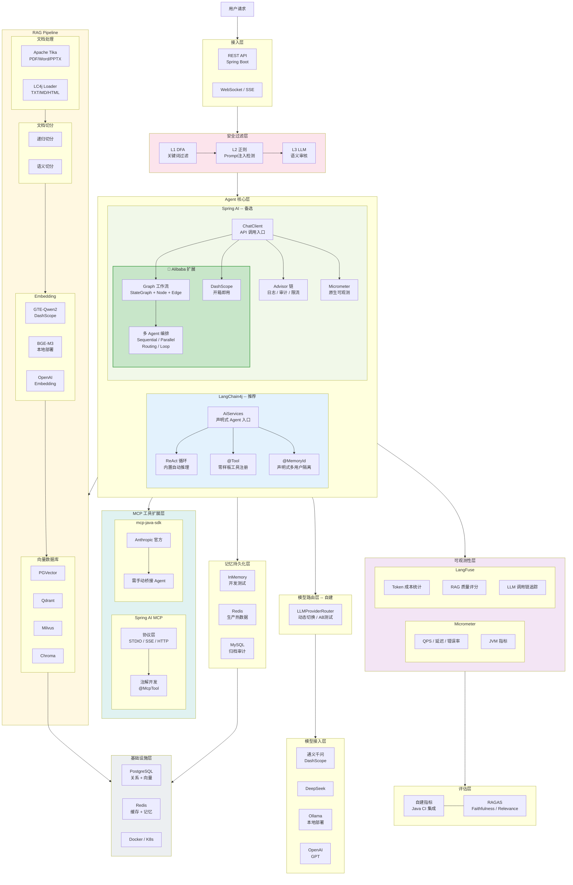

# Java 大模型应用开发组件全景图

> 一张图总览 Java 生态中构建企业级 AI 应用涉及的所有组件层次、候选技术、优缺点及分支选择。
>
> 最后更新：2026-04-05 v2

---

## 全景图

---

## 关键组件对比分析

### 1. Agent 框架：LangChain4j vs Spring AI

| 维度 | LangChain4j | Spring AI 阵营 | 胜出 |
|------|------------|----------------|------|
| 开发效率 | 5 行代码 = 完整 Agent | 需手动编排循环 | **LC4j** |
| Agent 循环 | 内置 ReAct 自动循环 | 原生无内置；🔸 Alibaba Graph 补齐（StateGraph + 条件路由） | **LC4j**（原生）/ 持平（+Alibaba） |
| 工作流编排 | 无（需自建） | 🔸 Alibaba Graph：SequentialAgent / ParallelAgent / RoutingAgent / LoopAgent | **Spring AI**（+Alibaba） |
| 多 Agent 协作 | 无内置 | 🔸 Alibaba Graph：多 Agent DAG 编排 + 全局状态管理（OverAllState） | **Spring AI**（+Alibaba） |
| 多用户隔离 | `@MemoryId` 声明式 | 无等价物，需手动管理 | **LC4j** |
| 工具注册 | `@Tool` 零样板 | 样板代码多 | **LC4j** |
| 可观测性 | 需自建 | Micrometer 原生集成 | **Spring AI** |
| 拦截器链 | 无 | Advisor 链（日志/审计/限流） | **Spring AI** |
| 中文云生态 | 一般 | 🔸 spring-ai-alibaba 官方支持 | **Spring AI**（+Alibaba） |
| 社区活跃度 | GitHub 4k+ star，迭代快 | Spring 官方背书，生态完整 | 持平 |

> 🔸 标记的能力来自 **Spring AI Alibaba** 扩展，非 Spring AI 原生能力。
>
> **选型建议**：
> - 简单 Agent、快速交付 → **LangChain4j**（开箱即用）
> - 复杂工作流、多 Agent 编排 → **Spring AI + Alibaba Graph**（DAG 编排 + 条件路由 + 并行执行）
> - Spring 全家桶、精细治理 → **Spring AI** 阵营整体优势更大

---

### 2. Spring AI vs Spring AI Alibaba

| 维度 | Spring AI | Spring AI Alibaba |
|------|----------|-------------------|
| 定位 | 通用 AI 应用框架（Spring 官方） | Spring AI 的阿里云增强发行版 |
| 维护方 | Pivotal / VMware | 阿里云（官方共建） |
| 模型支持 | OpenAI / Azure / Ollama / 多厂商 | 通义千问全系列 / 百炼平台优先适配 |
| DashScope 集成 | 需手动配置 | 开箱即用（自动装配） |
| Prompt 模板 | 基础模板引擎 | 增强：Prompt 模板市场 + 多轮对话模板 |
| **Agent 工作流（Graph）** | **无内置** | **Graph 模块：StateGraph + Node + Edge + OverAllState，Java 版 LangGraph** |
| **多 Agent 编排** | **无内置** | **内置 SequentialAgent / ParallelAgent / RoutingAgent / LoopAgent** |
| RAG 增强 | 标准 RAG Pipeline | DocumentTransformer 增强 + 阿里云搜索增强 |
| 函数调用 | 标准 Function Calling | 增强：通义原生工具调用 + MCP 适配 |
| 可观测性 | Micrometer 基础指标 | 增强：百炼平台监控 + Token 统计 |
| 对话记忆 | ChatMemory 接口 | 增强：多 session 管理 + Redis/MySQL 开箱即用 |
| 多模态 | 图片 / 音频（基础） | 通义万相（文生图）/ Paraformer（语音）深度集成 |
| 部署适配 | 通用 | 阿里云 ECS / ACK / FC 一键部署 |
| 学习曲线 | 中等 | 低（中文文档完善、示例丰富） |
| 社区生态 | 国际化、英文为主 | 中文社区活跃、钉钉群答疑 |
| 版本跟进 | 源头版本 | 跟随 Spring AI 版本 + 额外增强 |

> **选型建议**：
> - 纯阿里云技术栈（通义 + 百炼 + DashScope）→ 直接用 **Spring AI Alibaba**，开箱即用省配置
> - 需要复杂 Agent 工作流编排 → **必须用 Spring AI Alibaba**（Graph 是其独有能力，Spring AI 原生没有）
> - 多云 / 多模型厂商混合 → 用 **Spring AI** 原版，保持厂商中立
> - 两者 API 兼容，后期可平滑迁移

---

### 3. 模型接入：通义千问 vs DeepSeek vs Ollama vs OpenAI GPT

| 维度 | 通义千问 | DeepSeek | Ollama 本地 | OpenAI GPT |
|------|---------|----------|------------|-----------|
| 中文能力 | ★★★★★ | ★★★★ | ★★★ | ★★★★ |
| 综合能力 | ★★★★ | ★★★★ | ★★★ | ★★★★★ |
| 性价比 | ★★★★（免费额度） | ★★★★★ | 免费（硬件自担） | ★★（成本高） |
| 稳定性 | ★★★★ | ★★★（高峰波动） | ★★★★（本地可控） | ★★★★★ |
| 数据安全 | 境内（阿里云） | 境内 | 完全本地 | 境外（需翻墙） |
| 协议兼容 | DashScope 私有 | OpenAI 协议兼容 | OpenAI 协议兼容 | 原生 |

> **选型建议**：生产首选通义千问（中文强 + 境内合规）；降本备选 DeepSeek；数据合规严格选 Ollama 本地；追求能力天花板选 GPT

---

### 4. 向量数据库：PGVector vs Qdrant vs Milvus vs Chroma

| 维度 | PGVector | Qdrant | Milvus | Chroma |
|------|----------|--------|--------|--------|
| 部署难度 | ★（复用 PG） | ★★（单二进制） | ★★★★（etcd + minio） | ★（嵌入式） |
| 百万级性能 | ★★★ | ★★★★★ | ★★★★★ | ★★ |
| 亿级扩展 | 不支持 | 有限 | 原生分布式 | 不支持 |
| 混合检索 | SQL 原生联合查询 | 标量过滤器 | 标量过滤器 | 基础过滤 |
| 运维成本 | 极低（复用现有 PG） | 低 | 高（多组件） | 零 |
| 生产就绪 | ✓ | ✓ | ✓ | ✗（仅 PoC） |
| Java SDK | ✓ | ✓ | ✓ | ✓ |

> **选型建议**：< 100 万条 → PGVector（零额外运维）；百万级 → Qdrant（性能 + 易运维）；亿级分布式 → Milvus；快速验证 → Chroma

---

### 5. Embedding 模型：GTE-Qwen2 vs BGE-M3 vs OpenAI Embedding

| 维度 | GTE-Qwen2 (DashScope) | BGE-M3 (本地) | OpenAI Embedding |
|------|----------------------|--------------|-----------------|
| 中文效果 | MTEB 中文前列 | 中文最强 | 良好 |
| 多语言 | 中英为主 | 100+ 语言 | 全语言 |
| 部署方式 | API 调用 | 本地 GPU 部署 | API 调用 |
| 向量维度 | 1024 / 1536 | 1024 | 1536 / 3072 |
| 数据安全 | 阿里云境内 | 完全本地，数据不出境 | 境外 |
| 成本 | 低（免费额度充足） | 硬件成本（无 API 费） | 高 |
| 接入难度 | 零配置（已集成 DashScope） | 需 GPU + 模型服务部署 | 零配置 |

> **选型建议**：快速接入 → GTE-Qwen2（已集成零配置）；数据敏感 / 离线场景 → BGE-M3 本地部署；多语言通用 → OpenAI

---

### 6. 记忆持久化：InMemory vs Redis vs MySQL

| 维度 | InMemory | Redis | MySQL |
|------|----------|-------|-------|
| 读写速度 | 纳秒级 | 毫秒级 | 10ms+ |
| 持久化 | ✗（重启丢失） | 可选（AOF / RDB） | ✓（永久） |
| 多实例共享 | ✗ | ✓ | ✓ |
| 自动过期 | ✗ | ✓（TTL 原生） | 需定时任务清理 |
| 审计查询 | ✗ | 弱 | SQL 强（可按用户/时间检索） |
| 适用场景 | 开发测试 | 生产热数据 | 归档审计 |

> **选型建议**：生产环境用 Redis（毫秒级 + TTL 自动过期）；需审计归档加 MySQL 双写；开发阶段用 InMemory 快速迭代

---

### 7. 可观测性：Micrometer vs LangFuse

| 维度 | Micrometer | LangFuse |
|------|-----------|----------|
| 接入成本 | 零配置（Spring Boot Actuator） | 需额外部署服务 |
| 通用指标 | QPS / 延迟 / 错误率 / JVM | ✗ |
| Token 统计 | ✗ | ✓（自动统计 input/output token） |
| 成本核算 | ✗ | ✓（按模型计费自动汇总） |
| RAG 质量评估 | ✗ | ✓（Faithfulness / Relevance） |
| Trace 追踪 | Zipkin / Jaeger 集成 | 内置 LLM 调用链追踪 |
| 数据面板 | Grafana | 自带 Web UI |
| 私有化部署 | N/A（库级别） | ✓（Docker 自部署） |

> **选型建议**：两者互补，非二选一。Micrometer 负责基础设施指标 + LangFuse 负责 LLM 专项可观测

---

## 图例说明

| 层次 | 职责 | 关键决策点 |
|------|------|-----------|
| 接入层 | REST / WebSocket / SSE | Spring Boot 标配 |
| 安全过滤层 | 输入输出过滤 | 自建 3 层过滤（DFA → 正则 → LLM） |
| Agent 核心层 | 推理循环 / 工具调用 / 记忆 / RAG | **LangChain4j AiServices（推荐）** vs Spring AI ChatClient |
| 模型路由层 | 多模型动态切换 | 自建（两大框架均无内置） |
| 模型接入层 | LLM API 调用 | 通义 / DeepSeek / Ollama / OpenAI |
| RAG Pipeline | 文档解析 → 切分 → 向量化 → 检索 | Tika + LangChain4j Splitter + GTE-Qwen2 + PGVector |
| 记忆持久化层 | 对话历史存储 | Redis（生产）/ MySQL（归档） |
| MCP 扩展层 | 外部工具集成 | Spring AI MCP + 适配器桥接 |
| 可观测性层 | 监控 / 追踪 / 成本 | Micrometer（基础）+ LangFuse（LLM 专项） |
| 评估层 | 质量指标 | 自建 + RAGAS 辅助 |
| 基础设施层 | 数据库 / 缓存 / 容器 | PostgreSQL + Redis + Docker |

---

## 变更记录

| 版本 | 日期 | 变更内容 |
|------|------|---------|
| v2 | 2026-04-05 | mermaid 图保持原版清爽；新增 7 组独立对比分析表格（Agent框架/Spring AI vs Alibaba/模型/向量库/Embedding/记忆存储/可观测性） |
| v1 | 2026-04-05 | 初始版本，11 层全景 + 优缺点标注 |
