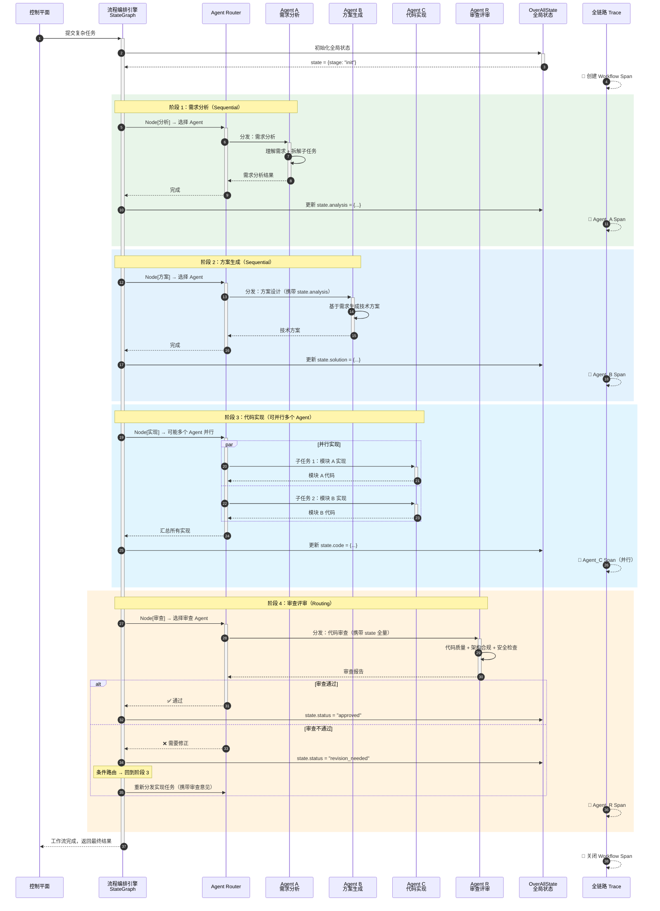
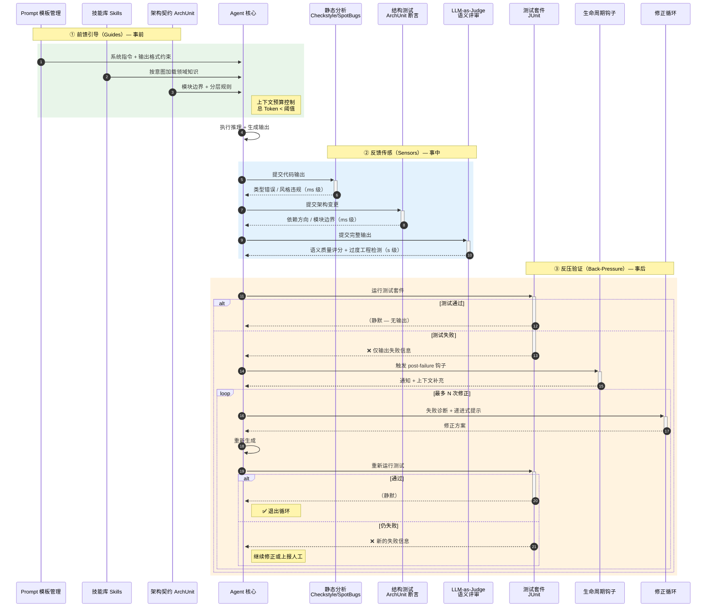
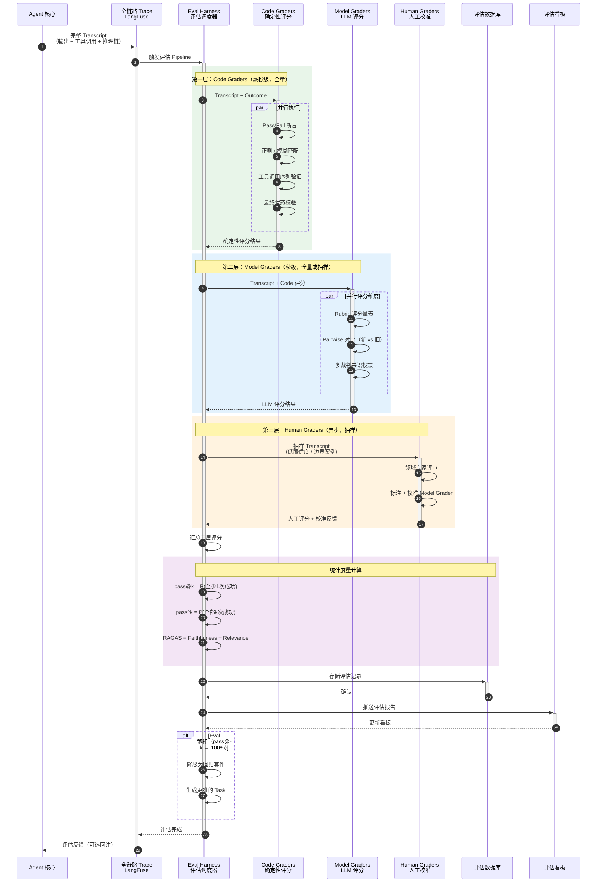

# Java 大模型应用开发组件全景图

> 一张图总览 Java 生态中构建企业级 AI 应用涉及的所有组件层次、候选技术、优缺点及分支选择。
>
> v4 新增：**控制平面（Control Plane）**、**流程编排引擎（Flow Engine）**、**多 Agent 编排层**、
> **Tool 标准协议层（Tool Registry / Router）**；重构记忆层为 **三级记忆体系**；
> 可观测性升级为 **全链路 Trace 贯穿**。
>
> 最后更新：2026-04-06 v4

---

## 全景图

```mermaid
graph TD
    USER["用户请求"] --> GW

    subgraph GW["接入层"]
        direction LR
        REST["REST API\nSpring Boot"]
        WS["WebSocket / SSE"]
    end

    GW --> SAFE

    subgraph SAFE["安全过滤层"]
        direction LR
        L1["L1 DFA\n关键词过滤"]
        L2["L2 正则\nPrompt注入检测"]
        L3["L3 LLM\n语义审核"]
        L1 --> L2 --> L3
    end

    SAFE --> CTRL

    subgraph CTRL["🆕 控制平面 -- 自建"]
        direction LR
        CTRL_TASK["任务管理\n创建 / 优先级 / 排队"]
        CTRL_CONC["并发控制\n限流 / 信号量"]
        CTRL_TIMEOUT["超时 / 中断\n熔断 / 降级"]
        CTRL_HUMAN["人工介入\n审批 / 接管"]
        CTRL_TASK --> CTRL_CONC --> CTRL_TIMEOUT --> CTRL_HUMAN
    end

    CTRL --> FLOW

    subgraph FLOW["🆕 流程编排引擎 -- Spring AI Alibaba Graph / 自建"]
        direction LR
        FLOW_SM["状态机\nStateGraph"]
        FLOW_DAG["DAG 执行\nNode + Edge"]
        FLOW_COND["条件路由\nConditional Edge"]
        FLOW_SM --- FLOW_DAG --- FLOW_COND
    end

    FLOW --> MULTI_AGENT

    subgraph MULTI_AGENT["🆕 多 Agent 编排层"]
        direction LR
        AGENT_ROUTER["Agent Router\n意图分发"]
        subgraph AGENTS["Agent 池"]
            direction TB
            AG_1["Agent A\n角色 A"]
            AG_2["Agent B\n角色 B"]
            AG_N["Agent N\n角色 N"]
        end
        AGENT_COORD["协作协议\nSequential / Parallel\nRouting / Supervisor"]
        AGENT_ROUTER --> AGENTS --> AGENT_COORD
    end

    MULTI_AGENT --> AGENT

    subgraph AGENT["Agent 核心层（Runtime）"]
        direction LR

        subgraph LC4J_PATH["LangChain4j -- 推荐"]
            direction TB
            LC_CORE["AiServices\n声明式 Agent 入口"]
            LC_REACT["ReAct 循环\n内置自动推理"]
            LC_TOOL["@Tool\n零样板工具注册"]
            LC_MEM["@MemoryId\n声明式多用户隔离"]
            LC_CORE --> LC_REACT
            LC_CORE --> LC_TOOL
            LC_CORE --> LC_MEM
        end

        subgraph SAI_PATH["Spring AI -- 备选"]
            direction TB
            SAI_CORE["ChatClient\nAPI 调用入口"]
            SAI_ADV["Advisor 链\n日志 / 审计 / 限流"]
            SAI_OBS["Micrometer\n原生可观测"]
            SAI_CORE --> SAI_ADV
            SAI_CORE --> SAI_OBS

            subgraph SAI_ALI["🔸 Alibaba 扩展"]
                direction TB
                ALI_GRAPH["Graph 工作流\nStateGraph + Node + Edge"]
                ALI_MULTI["多 Agent 编排\nSequential / Parallel\nRouting / Loop"]
                ALI_DASH["DashScope\n开箱即用"]
                ALI_GRAPH --> ALI_MULTI
            end

            SAI_CORE --> ALI_GRAPH
            SAI_CORE --> ALI_DASH
        end
    end

    AGENT --> HARNESS

    subgraph HARNESS["驭疆工程层 -- 自建"]
        direction LR

        subgraph GUIDE["前馈引导 Guides"]
            direction TB
            G_PROMPT["Prompt 工程\n系统指令 / 约束模板"]
            G_SKILL["技能库 Skills\n按需加载领域知识"]
            G_ARCH["架构契约\n模块边界 / 编码规范"]
            G_PROMPT --> G_SKILL --> G_ARCH
        end

        subgraph SENSOR["反馈传感 Sensors"]
            direction TB
            S_STATIC["静态分析\n类型检查 / Lint"]
            S_STRUCT["结构测试\n模块边界 / 依赖方向"]
            S_LLM["LLM-as-Judge\n语义审查 / 质量评分"]
            S_STATIC --> S_STRUCT --> S_LLM
        end

        subgraph BACKP["反压验证 Back-Pressure"]
            direction TB
            BP_TEST["测试套件\n单元 / 集成 / E2E"]
            BP_HOOK["生命周期钩子\n预提交 / 后集成"]
            BP_LOOP["修正循环\n失败→诊断→重试"]
            BP_TEST --> BP_HOOK --> BP_LOOP
        end
    end

    AGENT --> MODEL_ROUTE

    subgraph MODEL_ROUTE["模型路由层 -- 自建"]
        ROUTER["LLMProviderRouter\n动态切换 / AB测试"]
    end

    MODEL_ROUTE --> MODELS

    subgraph MODELS["模型接入层"]
        direction LR
        QWEN["通义千问\nDashScope"]
        DEEPSEEK["DeepSeek"]
        OLLAMA["Ollama\n本地部署"]
        OPENAI["OpenAI\nGPT"]
    end

    AGENT --> TOOL_STD

    subgraph TOOL_STD["🆕 Tool 标准协议层"]
        direction LR
        TOOL_REG["Tool Registry\n工具注册表"]
        TOOL_SCHEMA["Tool Schema\nJSON Schema 描述"]
        TOOL_ROUTER["Tool Router\n路由 + 权限"]
        TOOL_REG --> TOOL_SCHEMA --> TOOL_ROUTER
    end

    TOOL_STD --> MCP_LAYER

    subgraph MCP_LAYER["MCP 工具扩展层"]
        direction LR
        subgraph MCP_SA_SUB["Spring AI MCP"]
            direction TB
            MCP_PROTO["协议层\nSTDIO / SSE / HTTP"]
            MCP_ANN["注解开发\n@McpTool"]
            MCP_PROTO --> MCP_ANN
        end
        subgraph MCP_SDK_SUB["mcp-java-sdk"]
            direction TB
            MCP_OFFICIAL["Anthropic 官方"]
            MCP_BRIDGE["需手动桥接 Agent"]
            MCP_OFFICIAL --> MCP_BRIDGE
        end
    end

    AGENT --> RAG_PIPE

    subgraph RAG_PIPE["RAG Pipeline"]
        direction LR

        subgraph DOC_LOAD["文档处理"]
            TIKA["Apache Tika\nPDF/Word/PPTX"]
            LC_LOAD["LC4j Loader\nTXT/MD/HTML"]
        end

        subgraph DOC_SPLIT["文档切分"]
            REC_SPLIT["递归切分"]
            SEM_SPLIT["语义切分"]
        end

        subgraph EMBED["Embedding"]
            GTE["GTE-Qwen2\nDashScope"]
            BGE["BGE-M3\n本地部署"]
            OAI_EMB["OpenAI\nEmbedding"]
        end

        subgraph VDB["向量数据库"]
            PGV["PGVector"]
            QDR["Qdrant"]
            MIL["Milvus"]
            CHR["Chroma"]
        end

        DOC_LOAD --> DOC_SPLIT --> EMBED --> VDB
    end

    AGENT --> MEM_STORE

    subgraph MEM_STORE["🆕 三级记忆体系"]
        direction LR

        subgraph STM["短期记忆\nShort-Term"]
            direction TB
            STM_CTX["对话上下文\n当前会话"]
            STM_SLIDE["滑动窗口\n最近 N 轮"]
        end

        subgraph LTM["长期记忆\nLong-Term"]
            direction TB
            LTM_VEC["向量记忆\nEmbedding + 语义检索"]
            LTM_SUM["摘要记忆\n对话压缩归档"]
        end

        subgraph STRUCT_MEM["结构化记忆\nStructured"]
            direction TB
            SM_FACT["事实库\n用户画像 / 偏好"]
            SM_KG["知识图谱\n实体关系"]
        end
    end

    AGENT --> OBS_LAYER

    subgraph OBS_LAYER["🆕 全链路可观测性层"]
        direction LR
        subgraph TRACE_SUB["分布式 Trace"]
            direction TB
            TRACE_SPAN["Span 追踪\n每步操作链路"]
            TRACE_CTX["Trace Context\n全链路贯穿"]
        end
        subgraph MICRO_SUB["Micrometer"]
            direction TB
            MICRO_QPS["QPS / 延迟 / 错误率"]
            MICRO_JVM["JVM 指标"]
        end
        subgraph LANGF_SUB["LangFuse"]
            direction TB
            LANGF_TOKEN["Token 成本统计"]
            LANGF_RAG["RAG 质量评分"]
            LANGF_TRACE["LLM 调用链追踪"]
        end
    end

    OBS_LAYER --> EVAL_LAYER
    HARNESS --> EVAL_LAYER

    subgraph EVAL_LAYER["评估层（三层评分体系）-- 自建"]
        direction LR

        subgraph CODE_GRADE["Code Graders\n确定性评分"]
            direction TB
            CG_PASS["Pass/Fail 断言"]
            CG_REGEX["正则 / 模糊匹配"]
            CG_TOOL["工具调用验证"]
            CG_STATE["最终状态校验"]
        end

        subgraph MODEL_GRADE["Model Graders\nLLM 评分"]
            direction TB
            MG_RUBRIC["评分量表 Rubric"]
            MG_PAIR["Pairwise 对比"]
            MG_MULTI["多裁判共识"]
        end

        subgraph HUMAN_GRADE["Human Graders\n人工校准"]
            direction TB
            HG_SME["领域专家评审"]
            HG_SPOT["抽样校准"]
            HG_AB["A/B 测试"]
        end

        subgraph EVAL_METRIC["统计度量"]
            direction TB
            EM_PASSK["pass@k\n至少一次成功率"]
            EM_PASSKK["pass^k\n全部成功率"]
            EM_RAGAS["RAGAS\nFaithfulness/Relevance"]
        end
    end

    MEM_STORE --> INFRA
    VDB --> INFRA

    subgraph INFRA["基础设施层"]
        direction LR
        PG_DB["PostgreSQL\n关系 + 向量"]
        REDIS_I["Redis\n缓存 + 记忆"]
        K8S["Docker / K8s"]
    end

    style CTRL fill:#e8eaf6,stroke:#283593,stroke-width:2px
    style FLOW fill:#e8eaf6,stroke:#283593,stroke-width:2px
    style MULTI_AGENT fill:#e8eaf6,stroke:#283593,stroke-width:2px
    style TOOL_STD fill:#e8eaf6,stroke:#283593,stroke-width:2px
    style LC4J_PATH fill:#e3f2fd
    style SAI_PATH fill:#f1f8e9
    style SAI_ALI fill:#c8e6c9,stroke:#43a047,stroke-width:2px
    style RAG_PIPE fill:#fff8e1
    style SAFE fill:#fce4ec
    style OBS_LAYER fill:#f3e5f5,stroke:#6a1b9a,stroke-width:2px
    style MCP_LAYER fill:#e0f2f1
    style INFRA fill:#eceff1
    style HARNESS fill:#fff3e0,stroke:#e65100,stroke-width:2px
    style EVAL_LAYER fill:#fce4ec,stroke:#c62828,stroke-width:2px
    style MEM_STORE fill:#e0f7fa,stroke:#00838f,stroke-width:2px
```



---

## 交互流程图

### 时序图 1：用户请求端到端处理流程

> 展示一次用户请求从入口到最终响应经过的所有层次交互。
> v4 新增：控制平面、流程编排引擎、多 Agent 路由、Tool 标准协议层、三级记忆体系、全链路 Trace。

```mermaid
sequenceDiagram
    autonumber
    actor User as 用户

    participant GW as 接入层<br/>REST / SSE
    participant SAFE as 安全过滤层
    participant CTRL as 🆕 控制平面
    participant FLOW as 🆕 流程编排引擎
    participant AR as 🆕 Agent Router
    participant AGENT as Agent Runtime
    participant HARNESS as 驭疆工程层
    participant ROUTER as 模型路由层
    participant LLM as 模型接入层<br/>千问/DeepSeek/GPT
    participant RAG as RAG Pipeline
    participant MEM as 🆕 三级记忆体系
    participant TOOL as 🆕 Tool 标准协议层
    participant MCP as MCP 工具层
    participant OBS as 🆕 全链路 Trace
    participant EVAL as 评估层

    User ->>+ GW: HTTP / WebSocket 请求
    OBS -->> OBS: 🔵 创建 Root Span（TraceID）

    GW ->>+ SAFE: 原始输入

    rect rgb(252, 228, 236)
        Note over SAFE: 三层过滤
        SAFE ->> SAFE: L1 DFA 关键词过滤
        SAFE ->> SAFE: L2 正则 Prompt 注入检测
        SAFE ->> SAFE: L3 LLM 语义审核
        OBS -->> OBS: 🔵 记录 SafeFilter Span
    end

    alt 过滤命中
        SAFE -->> GW: 拒绝（违规原因）
        GW -->> User: 400 / 拒绝响应
    else 过滤通过
        SAFE ->>- CTRL: 安全输入
    end

    rect rgb(232, 234, 246)
        Note over CTRL: 🆕 控制平面介入
        CTRL ->> CTRL: 创建 Task（TaskID + 优先级）
        CTRL ->> CTRL: 并发检查（信号量 / 限流）
        CTRL ->> CTRL: 设置超时策略（Timeout + 熔断）
        OBS -->> OBS: 🔵 记录 ControlPlane Span

        alt 超过并发限制
            CTRL -->> GW: 429 Too Many Requests
            GW -->> User: 排队 / 拒绝
        else 允许执行
            CTRL ->>+ FLOW: 提交任务到编排引擎
        end
    end

    rect rgb(232, 234, 246)
        Note over FLOW: 🆕 流程编排引擎
        FLOW ->> FLOW: 加载工作流定义（StateGraph / DAG）
        FLOW ->> FLOW: 初始化状态（OverAllState）
        OBS -->> OBS: 🔵 记录 FlowEngine Span
    end

    rect rgb(232, 234, 246)
        Note over FLOW, AR: 🆕 多 Agent 路由
        FLOW ->>+ AR: 当前节点需要 Agent 执行
        AR ->> AR: 意图识别 → 选择 Agent 角色
        AR ->>- AGENT: 分发到对应 Agent
        OBS -->> OBS: 🔵 记录 AgentRouter Span
    end

    rect rgb(255, 243, 224)
        Note over AGENT, HARNESS: 驭疆工程 — 前馈引导
        AGENT ->>+ HARNESS: 请求前馈引导
        HARNESS -->>- AGENT: Prompt 约束 + 技能注入 + 架构契约
    end

    rect rgb(224, 247, 250)
        Note over AGENT, MEM: 🆕 三级记忆加载
        AGENT ->>+ MEM: 加载短期记忆（当前会话上下文）
        MEM -->> AGENT: 滑动窗口 N 轮对话
        AGENT ->> MEM: 检索长期记忆（语义相关历史）
        MEM -->> AGENT: 向量检索匹配片段
        AGENT ->> MEM: 查询结构化记忆（用户画像/偏好）
        MEM -->>- AGENT: 用户事实 + 偏好
        OBS -->> OBS: 🔵 记录 MemoryLoad Span
    end

    opt 需要 RAG 增强
        AGENT ->>+ RAG: 检索请求
        RAG ->> RAG: 文档切分 → Embedding → 向量检索
        RAG -->>- AGENT: 相关文档片段
        OBS -->> OBS: 🔵 记录 RAG Span（检索耗时 + 命中数）
    end

    rect rgb(225, 245, 254)
        Note over AGENT, LLM: ReAct 推理循环（可能多轮）
        loop ReAct 循环
            AGENT ->>+ ROUTER: 推理请求
            ROUTER ->> ROUTER: 选择模型（路由策略/AB测试）
            ROUTER ->>+ LLM: API 调用
            OBS -->> OBS: 🔵 记录 LLM Span（模型 + Token + 延迟）
            LLM -->>- ROUTER: 模型响应
            ROUTER -->>- AGENT: 推理结果

            opt 模型决定调用工具
                rect rgb(232, 234, 246)
                    Note over AGENT, MCP: 🆕 Tool 标准协议
                    AGENT ->>+ TOOL: 工具调用请求
                    TOOL ->> TOOL: Registry 查找 + Schema 校验 + 权限检查
                    TOOL ->>+ MCP: 转发到 MCP 执行
                    MCP -->>- TOOL: 执行结果
                    TOOL -->>- AGENT: 标准化输出
                    OBS -->> OBS: 🔵 记录 ToolCall Span（工具名 + 耗时 + 结果）
                end
            end

            opt 需要继续推理
                AGENT ->> AGENT: 组装下一轮输入
            end
        end
    end

    rect rgb(255, 243, 224)
        Note over AGENT, HARNESS: 驭疆工程 — 反馈传感
        AGENT ->> HARNESS: 提交 Agent 输出
        HARNESS ->> HARNESS: 静态分析 + 结构测试
        HARNESS ->> HARNESS: LLM-as-Judge 语义审查
        OBS -->> OBS: 🔵 记录 Sensor Span

        alt 传感器检测到偏差
            rect rgb(255, 205, 210)
                Note over HARNESS, AGENT: 反压验证 — 修正循环
                HARNESS -->> AGENT: 错误信息（静默成功，响亮失败）
                AGENT ->> AGENT: 诊断 → 修正 → 重新执行
                AGENT ->> HARNESS: 重新提交
                HARNESS -->> AGENT: ✅ 通过
                OBS -->> OBS: 🔵 记录 CorrectionLoop Span（重试次数）
            end
        else 传感器通过
            HARNESS -->> AGENT: ✅ 通过
        end
    end

    AGENT -->> FLOW: 返回 Agent 执行结果

    rect rgb(232, 234, 246)
        Note over FLOW: 🆕 流程编排 — 状态流转
        FLOW ->> FLOW: 更新 OverAllState
        alt 还有后续节点
            FLOW ->> FLOW: 条件路由 → 下一个 Node
            Note right of FLOW: 可能触发另一个 Agent<br/>或并行分支
            FLOW ->> AR: 分发下一个 Agent 任务
        else 工作流完成
            FLOW ->> FLOW: 汇总最终结果
        end
    end

    rect rgb(224, 247, 250)
        Note over AGENT, MEM: 🆕 三级记忆持久化
        FLOW ->>+ MEM: 持久化短期记忆（当前对话）
        MEM -->> MEM: Redis 写入会话
        FLOW ->> MEM: 更新长期记忆（新知识 Embedding）
        MEM -->> MEM: 向量库写入
        FLOW ->> MEM: 更新结构化记忆（新事实提取）
        MEM -->>- MEM: MySQL 写入
    end

    FLOW ->>+ SAFE: 输出过滤
    SAFE -->>- FLOW: 安全输出

    rect rgb(232, 234, 246)
        Note over CTRL: 🆕 控制平面 — 任务完成
        FLOW -->> CTRL: 报告任务完成
        CTRL ->> CTRL: 释放并发槽位
        CTRL ->> CTRL: 记录任务耗时 + 状态
    end

    CTRL -->> GW: 最终响应
    GW -->>- User: HTTP / SSE 响应流
    OBS -->> OBS: 🔵 关闭 Root Span（总耗时 + 状态）

    par 异步评估
        OBS ->>+ EVAL: 推送完整 Trace + Transcript
        EVAL ->> EVAL: Code Graders 断言
        EVAL ->> EVAL: Model Graders 评分
        EVAL -->>- OBS: 评估报告
    end

    opt 🆕 人工介入（控制平面触发）
        CTRL -->> User: 需要人工审批/确认
        User -->> CTRL: 审批通过/拒绝
        CTRL -->> FLOW: 继续/终止工作流
    end
```



---

### 时序图 2：多 Agent 编排流程

> **v4 新增**。展示流程编排引擎如何协调多个 Agent 角色协作完成复杂任务。



---

### 时序图 3：驭疆工程三维控制循环

> 聚焦展示 Guides → Agent 执行 → Sensors → Back-Pressure 的完整控制回路。



---

### 时序图 4：评估层三层评分流程

> 展示一次 Agent 执行完成后，评估层如何通过 Code / Model / Human 三层 Grader 逐步评分。



---

### 流程图 5：Agent 请求全链路决策流程

> 以流程图视角展示请求处理中的所有分支判断。v4 新增控制平面、编排引擎、多 Agent 路由、Tool 协议层。

```mermaid
flowchart TD
    START(["用户请求到达"]) --> GW["接入层接收<br/>REST / SSE / WebSocket"]
    GW --> L1{"L1 DFA<br/>关键词命中？"}
    L1 -->|命中| REJECT["拒绝请求<br/>返回违规原因"]
    L1 -->|通过| L2{"L2 正则<br/>Prompt 注入？"}
    L2 -->|命中| REJECT
    L2 -->|通过| L3{"L3 LLM<br/>语义违规？"}
    L3 -->|命中| REJECT
    L3 -->|通过| CTRL_TASK

    subgraph CTRL_BOX["🆕 控制平面"]
        CTRL_TASK["创建 Task<br/>分配 TaskID + 优先级"]
        CTRL_TASK --> CTRL_CONC{"并发<br/>超限？"}
        CTRL_CONC -->|是| QUEUE["排队等待 / 429"]
        CTRL_CONC -->|否| CTRL_TIME["设置超时策略"]
    end

    CTRL_TIME --> FLOW_INIT

    subgraph FLOW_BOX["🆕 流程编排引擎"]
        FLOW_INIT["加载工作流定义<br/>StateGraph / DAG"]
        FLOW_INIT --> FLOW_NODE["执行当前 Node"]
    end

    FLOW_NODE --> AGENT_ROUTE{"🆕 Agent<br/>路由"}
    AGENT_ROUTE --> AGENT_SELECT["选择 Agent 角色<br/>意图识别 / 条件路由"]

    AGENT_SELECT --> GUIDE["前馈引导<br/>注入 Prompt 约束 + 技能 + 契约"]

    GUIDE --> MEM_LOAD

    subgraph MEM_BOX["🆕 三级记忆加载"]
        MEM_LOAD["短期记忆：会话上下文"]
        MEM_LOAD --> MEM_LONG["长期记忆：向量语义检索"]
        MEM_LONG --> MEM_STRUCT["结构化记忆：用户画像/偏好"]
    end

    MEM_STRUCT --> RAG_CHECK{"需要 RAG<br/>增强？"}
    RAG_CHECK -->|是| RAG["RAG Pipeline<br/>切分→Embedding→检索"]
    RAG_CHECK -->|否| REACT
    RAG --> REACT

    REACT["进入 ReAct 循环"] --> ROUTE["模型路由<br/>选择最优模型"]
    ROUTE --> LLM_CALL["调用 LLM<br/>千问/DeepSeek/Ollama/GPT"]
    LLM_CALL --> OBS_LOG["🔵 Trace 记录<br/>Token + 延迟 + Span"]
    OBS_LOG --> TOOL_CHECK{"模型要求<br/>调用工具？"}

    TOOL_CHECK -->|是| TOOL_REG

    subgraph TOOL_BOX["🆕 Tool 标准协议"]
        TOOL_REG["Tool Registry 查找"]
        TOOL_REG --> TOOL_SCHEMA["Schema 校验 + 权限检查"]
        TOOL_SCHEMA --> TOOL_EXEC["MCP 工具执行"]
    end

    TOOL_EXEC --> CONTINUE{"继续<br/>推理？"}
    TOOL_CHECK -->|否| CONTINUE
    CONTINUE -->|是| REACT
    CONTINUE -->|否| SENSOR

    SENSOR["反馈传感<br/>静态分析 + 结构测试 + LLM-Judge"] --> SENSOR_OK{"传感器<br/>通过？"}
    SENSOR_OK -->|否| RETRY{"修正次数<br/>< N ？"}
    RETRY -->|是| BACKP["反压修正<br/>诊断→修正→重试"]
    BACKP --> REACT
    RETRY -->|否| ESCALATE["上报人工介入<br/>（控制平面触发）"]
    ESCALATE --> HUMAN_CHECK{"人工<br/>决策"}
    HUMAN_CHECK -->|通过| OUTPUT_FILTER
    HUMAN_CHECK -->|拒绝| REJECT_TASK["终止任务"]

    SENSOR_OK -->|是| FLOW_NEXT

    subgraph FLOW_NEXT_BOX["🆕 流程编排 — 状态流转"]
        FLOW_NEXT{"还有<br/>后续 Node？"}
        FLOW_NEXT -->|是| FLOW_NODE
        FLOW_NEXT -->|否| FLOW_MERGE["汇总最终结果"]
    end

    FLOW_MERGE --> OUTPUT_FILTER["输出安全过滤<br/>L1 + L2 + L3"]
    OUTPUT_FILTER --> OUT_OK{"输出<br/>过滤通过？"}
    OUT_OK -->|否| SANITIZE["内容脱敏/改写"]
    SANITIZE --> RESPONSE
    OUT_OK -->|是| RESPONSE

    RESPONSE["返回响应"] --> MEM_SAVE

    subgraph MEM_SAVE_BOX["🆕 三级记忆持久化"]
        MEM_SAVE["短期记忆 → Redis"]
        MEM_SAVE --> MEM_SAVE_LONG["长期记忆 → 向量库"]
        MEM_SAVE_LONG --> MEM_SAVE_STRUCT["结构化记忆 → MySQL"]
    end

    MEM_SAVE_STRUCT --> CTRL_DONE["🆕 控制平面<br/>释放并发槽 + 记录"]
    CTRL_DONE --> SSE["SSE / HTTP 响应流"]
    SSE --> END(["用户收到响应"])

    SSE -.->|异步| EVAL["评估层<br/>Code → Model → Human Graders"]
    EVAL -.-> EVAL_DB["评估数据存储 + 看板"]

    style REJECT fill:#ffcdd2
    style REJECT_TASK fill:#ffcdd2
    style GUIDE fill:#fff3e0,stroke:#e65100
    style SENSOR fill:#fff3e0,stroke:#e65100
    style BACKP fill:#fff3e0,stroke:#e65100
    style EVAL fill:#fce4ec,stroke:#c62828
    style ESCALATE fill:#ffecb3
    style CTRL_BOX fill:#e8eaf6,stroke:#283593,stroke-width:2px
    style FLOW_BOX fill:#e8eaf6,stroke:#283593,stroke-width:2px
    style FLOW_NEXT_BOX fill:#e8eaf6,stroke:#283593,stroke-width:2px
    style TOOL_BOX fill:#e8eaf6,stroke:#283593,stroke-width:2px
    style MEM_BOX fill:#e0f7fa,stroke:#00838f,stroke-width:2px
    style MEM_SAVE_BOX fill:#e0f7fa,stroke:#00838f,stroke-width:2px
```



---

## 🆕 控制平面详解（Control Plane）

> **控制平面**是企业级 Agent 系统的"大脑"——它不执行具体任务，而是**管理任务的生命周期**。
>
> 核心洞察：**"Agent 自己跑流程 ≠ 可控。控制平面让 Agent 从'自由奔跑'变为'受控执行'。"**

### 控制平面职责矩阵

| 职责 | 说明 | Java 实现方案 | 需自建 |
|------|------|-------------|--------|
| **任务管理** | 创建、排队、优先级排序、状态跟踪 | TaskManager + Priority Queue（Redis ZSET） | ✅ |
| **并发控制** | 限制同时执行的 Agent 数量 | Semaphore / Redis 分布式锁 / Resilience4j RateLimiter | ✅ |
| **超时与熔断** | 任务级超时、Agent 级超时、全局熔断 | Resilience4j CircuitBreaker + TimeLimiter | ✅ |
| **人工介入** | 高风险操作审批、Agent 异常接管 | 审批工作流（WebSocket 推送 + 人工确认） | ✅ |
| **任务生命周期** | Created → Queued → Running → Completed/Failed/Cancelled | 状态机（Spring Statemachine / 自建） | ✅ |
| **优雅降级** | 模型不可用时降级、Token 预算耗尽时止损 | Fallback 策略链 | ✅ |

### 任务状态流转

```
Created → Queued → Running → Completed
                      ↓          ↓
                  TimedOut     Failed
                      ↓          ↓
                  Cancelled   Escalated（人工介入）
```

---

## 🆕 流程编排引擎详解（Flow Engine）

> **核心问题**：纯依赖 LLM 决定流程 = 不可预测 + 不稳定 + 不可复现。
>
> **解决方案**：**确定性流程（Workflow Engine）+ 非确定性能力（LLM）** 分离。

### 为什么需要 Flow Engine？

| 问题 | 纯 LLM 控制流 | Flow Engine + LLM |
|------|-------------|-------------------|
| 可预测性 | ❌ 每次路径不同 | ✅ 确定性流程骨架 |
| 可复现性 | ❌ 同输入不同输出 | ✅ 流程可回放 |
| 可调试性 | ❌ 黑盒 | ✅ 每个 Node 可断点 |
| 可扩展性 | ❌ Prompt 越来越长 | ✅ 加 Node 即可 |
| 并行能力 | ❌ 串行推理 | ✅ 并行 Node 原生支持 |

### Java 生态 Flow Engine 选型

| 方案 | 类型 | 特点 | 推荐场景 |
|------|------|------|---------|
| **Spring AI Alibaba Graph** | StateGraph | Java 版 LangGraph，Node + Edge + OverAllState | **首选**：Agent 工作流编排 |
| **Spring Statemachine** | 状态机 | Spring 官方，事件驱动，持久化支持 | 简单线性流程 |
| **自建 DAG Engine** | DAG | 完全可控，轻量级 | 需要极致定制 |
| **Camunda / Flowable** | BPMN | 重量级，企业 BPM | 已有 BPM 基础设施 |

### Flow Engine 核心概念

```
StateGraph {
    Node[]      -- 执行单元（调用 Agent / 工具 / 服务）
    Edge[]      -- 节点间连线（顺序 / 条件 / 并行）
    OverAllState -- 全局状态对象（跨节点共享）
    START / END  -- 入口和出口
}
```

---

## 🆕 多 Agent 编排层详解

> **单 Agent 不可能胜任所有角色**——需要按职责拆分，通过编排协作完成复杂任务。

### 多 Agent 编排模式

| 模式 | 说明 | 适用场景 | Spring AI Alibaba 支持 |
|------|------|---------|----------------------|
| **Sequential** | 串行执行，前一个的输出作为后一个的输入 | 流水线式处理 | ✅ SequentialAgent |
| **Parallel** | 并行执行，汇总结果 | 独立子任务 | ✅ ParallelAgent |
| **Routing** | 根据条件分发到不同 Agent | 意图分发 | ✅ RoutingAgent |
| **Supervisor** | 一个管理者 Agent 协调多个工作者 | 复杂多步任务 | 需自建 |
| **Loop** | 循环执行直到满足条件 | 迭代优化 | ✅ LoopAgent |
| **Handoff** | Agent 之间主动移交控制权 | 对话场景角色切换 | 需自建 |

### 典型 Agent 角色拆分（以代码生成为例）

| Agent 角色 | 职责 | 工具集 |
|-----------|------|--------|
| **Requirement Analyzer** | 理解需求、拆解子任务 | RAG（需求文档检索） |
| **Solution Architect** | 技术方案设计、架构决策 | 架构知识库、模板库 |
| **Code Generator** | 代码实现 | 代码生成、文件读写 |
| **Code Reviewer** | 代码审查、质量把关 | 静态分析、ArchUnit |
| **Test Engineer** | 测试用例生成与执行 | JUnit、测试框架 |

---

## 🆕 Tool 标准协议层详解

> **问题**：工具数量膨胀后，直接调用导致权限混乱、参数不一致、难以管理。
>
> **解决方案**：引入标准协议层，统一工具的注册、发现、校验、路由。

### Tool 标准协议三层架构

```
Agent → Tool Router → Tool Registry → Tool Executor（MCP / 直接调用）
              ↓              ↓
        权限检查        Schema 校验
```

| 组件 | 职责 | Java 实现方案 | 需自建 |
|------|------|-------------|--------|
| **Tool Registry** | 工具注册表：名称、描述、所属领域 | ConcurrentHashMap + 动态注册 | ✅ |
| **Tool Schema** | 输入/输出的 JSON Schema 定义 | Jackson JsonSchema / 自定义注解生成 | ✅ |
| **Tool Router** | 按 Agent 角色/意图路由到合适工具集 | 策略模式 + Agent → ToolSet 映射 | ✅ |
| **Tool Permission** | 工具级权限控制（谁能调什么） | RBAC + 注解 @ToolPermission | ✅ |
| **Tool Validator** | 调用前参数校验、调用后结果校验 | Bean Validation + 自定义 Validator | ✅ |

### 工具描述标准格式

```json
{
  "name": "search_code",
  "description": "在代码仓库中搜索匹配的代码片段",
  "domain": "code_analysis",
  "input_schema": {
    "type": "object",
    "properties": {
      "query": { "type": "string", "description": "搜索关键词" },
      "language": { "type": "string", "enum": ["java", "python", "go"] }
    },
    "required": ["query"]
  },
  "output_schema": {
    "type": "object",
    "properties": {
      "results": { "type": "array", "items": { "$ref": "#/definitions/CodeSnippet" } }
    }
  },
  "permissions": ["code_reader"],
  "timeout_ms": 5000
}
```

---

## 🆕 三级记忆体系详解

> **问题**：短期/长期/结构化记忆混在一起 → 上下文爆炸 + 检索低效。
>
> **解决方案**：按时效性和结构化程度拆分为三级。

### 三级记忆对比

| 维度 | 短期记忆（Working Memory） | 长期记忆（Episodic Memory） | 结构化记忆（Semantic Memory） |
|------|--------------------------|---------------------------|----------------------------|
| **类比** | 人的工作记忆 | 人的经历记忆 | 人的知识记忆 |
| **内容** | 当前会话上下文 | 历史对话、经验 | 用户画像、实体关系 |
| **存储** | InMemory / Redis | 向量数据库（Embedding） | MySQL / PostgreSQL |
| **时效** | 会话级（分钟~小时） | 永久（需过期策略） | 永久（主动更新） |
| **检索** | 滑动窗口（最近 N 轮） | 语义相似度检索 | SQL 精确查询 |
| **大小** | 有限（Token 预算内） | 无限增长 | 结构化，可控 |
| **Java 实现** | ChatMemory（滑动窗口） | VectorStore + Embedding | JPA Entity + Repository |

### 记忆管理策略

```
短期记忆：滑动窗口（保留最近 N 轮）+ 摘要压缩（超过阈值时压缩旧对话）
长期记忆：Embedding → 向量库存储 → 语义检索 Top-K → 注入上下文
结构化记忆：对话中提取事实 → 存入关系表 → 精确查询 → 注入上下文
```

---

## 🆕 全链路可观测性升级

> v3 的可观测性层只做记录，v4 升级为**全链路 Trace 贯穿**——每个层、每个操作都生成 Span，串联为完整调用链。

### Trace 结构示例

```
Root Span: UserRequest [traceId=abc123, 总耗时=3200ms]
├── SafeFilter Span [120ms]
│   ├── L1_DFA [2ms]
│   ├── L2_Regex [5ms]
│   └── L3_LLM [113ms]
├── ControlPlane Span [15ms]
│   ├── TaskCreate [3ms]
│   └── ConcurrencyCheck [12ms]
├── FlowEngine Span [2800ms]
│   ├── Node_Analysis [800ms]
│   │   └── Agent_A Span [780ms]
│   │       ├── MemoryLoad [50ms]
│   │       ├── LLM_Call [600ms, model=qwen-max, tokens=1200]
│   │       └── ToolCall [130ms, tool=search_code]
│   ├── Node_Solution [900ms]
│   │   └── Agent_B Span [...]
│   └── Node_Review [600ms]
│       └── Agent_R Span [...]
├── MemoryPersist Span [45ms]
└── OutputFilter Span [20ms]
```

### 全链路追踪实现方案

| 组件 | 职责 | Java 实现 |
|------|------|----------|
| **TraceContext** | 贯穿全链路的上下文（TraceID + SpanID） | MDC + ThreadLocal / Micrometer Observation |
| **SpanRecorder** | 每个操作自动记录 Span | AOP 切面 + 注解 @Traced |
| **LLM Span** | 模型调用专项记录（模型、Token、延迟、Prompt） | LangFuse SDK / 自建 Interceptor |
| **Tool Span** | 工具调用记录（工具名、参数、结果、耗时） | Tool Router AOP |
| **Export** | 导出到可视化平台 | LangFuse（LLM 专项）+ Zipkin/Jaeger（通用） |

---

## 驭疆工程层详解（Harness Engineering）

> **驭疆工程**（Harness Engineering）是 2025-2026 年 AI 工程领域的新兴学科，由 OpenAI Codex 团队率先实践、Anthropic 和 Martin Fowler 等人深入阐述。其核心洞察：
>
> **"Agent 失败的根因往往不是模型能力不足，而是驾驭体系缺失。"**
>
> Agent = 模型 + 驭疆体系（Harness）。模型是引擎，驭疆体系是方向盘、刹车和仪表盘。

### 驭疆工程三维控制模型

```
                    ┌──────────────────────────┐
                    │      Agent 核心层         │
                    └────────┬─────────────────┘
                             │
        ┌────────────────────┼────────────────────┐
        │                    │                    │
   ┌────▼─────┐       ┌─────▼──────┐      ┌─────▼──────┐
   │  Guides  │       │  Sensors   │      │Back-Pressure│
   │ 前馈引导  │       │  反馈传感   │      │  反压验证   │
   │ ───────  │       │  ────────  │      │  ────────  │
   │ 预防偏差  │       │ 检测偏差   │      │  修正偏差   │
   └──────────┘       └────────────┘      └────────────┘
   事前：告诉 Agent    事中：监控 Agent    事后：驱动 Agent
   该怎么做            做得对不对          自我修正
```

### 1. 前馈引导（Guides / Feedforward Controls）

在 Agent 执行**之前**注入约束与知识，预防偏差发生。

| 组件 | 职责 | Java 实现方案 | 需自建 |
|------|------|-------------|--------|
| **Prompt 约束模板** | 系统指令、角色设定、输出格式约束 | 模板引擎（Mustache / FreeMarker）+ 版本化管理 | ✅ |
| **技能库（Skills）** | 按需加载领域特定知识，避免上下文污染 | 领域知识 Markdown → 按意图检索注入 | ✅ |
| **架构契约（Arch Contracts）** | 编码规范、模块边界、分层依赖规则 | ArchUnit 规则 + 自定义 DSL | ✅ |
| **渐进式披露（Progressive Disclosure）** | 初始只给最小工具集，按需扩展 | 工具注册表 + 动态 @Tool 启用 | ✅ |
| **上下文预算管理** | 控制系统提示 + 工具描述的 Token 消耗 | Token 计数器 + 工具描述精简策略 | ✅ |

> **关键实践**：ETH Zurich 研究表明，精心手写的指令文件比 LLM 自动生成的效果更好。保持 Prompt 文件简洁（< 60 行），避免"以防万一"的过度配置。

### 2. 反馈传感（Sensors / Feedback Controls）

在 Agent 执行**过程中和之后**检测输出质量，发现偏差。

| 组件 | 类型 | 检测目标 | Java 实现方案 | 需自建 |
|------|------|---------|-------------|--------|
| **静态分析** | 计算型（ms级） | 类型错误、风格违规 | Checkstyle / SpotBugs / PMD | 集成 |
| **结构测试** | 计算型（ms级） | 模块边界、依赖方向 | ArchUnit 断言 | ✅ |
| **变异测试** | 计算型（s级） | 测试套件有效性 | PIT Mutation Testing | 集成 |
| **LLM-as-Judge** | 推理型（s级） | 代码语义质量、过度工程 | 专用评审 Agent（可用低成本模型） | ✅ |
| **RAG 质量传感** | 推理型（s级） | 检索相关性、答案忠实度 | RAGAS 指标 Java 封装 | ✅ |

> **关键实践**：**计算型传感器前置，推理型传感器后置**。静态分析 / 类型检查在预提交阶段运行，LLM 评审在集成后运行——兼顾速度与深度。

### 3. 反压验证（Back-Pressure / Verification Loop）

当传感器检测到偏差时，**驱动 Agent 自我修正**而非直接失败。

| 组件 | 职责 | Java 实现方案 | 需自建 |
|------|------|-------------|--------|
| **测试套件反压** | 运行测试、只回传失败信息 | JUnit + 自定义 Reporter（静默成功，仅输出失败） | ✅ |
| **生命周期钩子（Hooks）** | 在 Agent 关键节点插入校验 | 自定义 AgentLifecycleHook 接口 | ✅ |
| **修正循环（Correction Loop）** | 失败 → 诊断 → 修正 → 重新验证 | 最大重试次数 + 递进式提示策略 | ✅ |
| **子 Agent 隔离** | 用独立上下文执行子任务，防止噪声累积 | 子 Agent 线程池 + 独立 ChatMemory | ✅ |

> **关键原则**：**成功必须静默，失败必须响亮**。只将错误信息反馈给 Agent，避免成功输出消耗上下文窗口预算。

---

## 评估层详解（三层评分体系）

> 参考 Anthropic《Demystifying Evals for AI Agents》提出的评估框架。
>
> 核心洞察：**"好的评估让团队更自信地发布 AI Agent。没有评估，就只能在生产环境中被动救火。"**

### 评估术语表

| 术语 | 定义 |
|------|------|
| **Task** | 单个测试用例，包含输入和成功标准 |
| **Trial** | 对同一 Task 的一次尝试（因非确定性需多次） |
| **Grader** | 评分逻辑，一个 Task 可有多个 Grader |
| **Transcript** | 完整执行记录：输出、工具调用、推理链、中间状态 |
| **Outcome** | 最终环境状态（非 Agent 声称的结果，而是实际系统变更） |
| **Eval Harness** | 端到端运行评估的基础设施 |
| **Eval Suite** | 衡量特定能力的 Task 集合 |

### 三层 Grader 对比

| 维度 | Code Graders | Model Graders | Human Graders |
|------|-------------|---------------|---------------|
| **方法** | 字符串匹配、正则、Pass/Fail 断言、工具调用验证、最终状态校验 | 评分量表（Rubric）、Pairwise 对比、多裁判共识、参考答案对照 | 领域专家评审、众包、抽样校准、A/B 测试 |
| **速度** | 毫秒级 | 秒级 | 小时~天级 |
| **成本** | 极低 | 中（消耗 Token） | 高 |
| **确定性** | ✅ 完全确定 | ❌ 非确定性 | ❌ 主观 |
| **适用场景** | 有明确正确答案的任务 | 开放式、主观性任务 | 校准 Model Grader、建立基准 |
| **Java 实现** | JUnit 断言 + 自定义 Grader 接口 | 调用评审模型（可用低成本模型） | Web 标注平台 + 评分表单 |
| **需自建** | ✅ | ✅ | ✅ |

### 非确定性度量指标

Agent 输出具有不确定性，单次评估会产生误导，需引入统计度量：

| 指标 | 公式 | 含义 | 适用场景 |
|------|------|------|---------|
| **pass@k** | P(至少 1 次成功 in k 次) | 乐观指标：k 次机会中至少成功一次的概率 | 探索性任务（"多试几次能否搞定"） |
| **pass^k** | P(全部 k 次都成功) = p^k | 悲观指标：连续 k 次全部成功的概率 | 生产可靠性（"每次都能稳定输出吗"） |

> **示例**：单次成功率 75%，k=3 时：
> - pass@3 = 1 - (0.25)³ ≈ **98.4%**（几乎总能成功）
> - pass^3 = (0.75)³ ≈ **42.2%**（不到一半的概率全部稳定）
>
> 两者差距随 k 增大而**急剧发散**，这是 Agent 可靠性工程的核心矛盾。

### 按 Agent 类型的评估策略

| Agent 类型 | 主要 Grader | 关键指标 | 参考基准 |
|-----------|------------|---------|---------|
| **编码 Agent** | 测试通过率 + 静态分析 + 状态校验 | pass@k、Token 消耗、延迟 | SWE-bench Verified |
| **对话 Agent** | 状态检查 + 评分量表 + 共情评估 | 任务完成率、轮次限制、沟通质量 | τ-Bench |
| **研究 Agent** | 事实性检查 + 覆盖率验证 + 来源权威性 | 准确率、召回率、引用质量 | BrowseComp |
| **Computer Use Agent** | URL/页面状态 + 后端状态 + 文件系统检查 | 任务完成率、Token 效率 | WebArena / OSWorld |

### 评估体系落地路线（Zero to One）

```
Step 1 ─→ Step 2 ─→ Step 3 ─→ Step 4 ─→ Step 5
从失败案例    转化手动      构建隔离       三层 Grader     监控饱和度
收集 20-50   测试为自动    评估环境       逐步完善        持续加难度
个 Task      化 Eval     （每次干净状态）                 ↓
                                                    饱和 Eval → 回归套件
                                                    新 Eval → 能力边界
```

| 阶段 | 目标 | 关键动作 |
|------|------|---------|
| **Step 1** | 从 0 到 1 | 从实际失败案例收集 20-50 个 Task，不追求完美 |
| **Step 2** | 复用存量 | 将已有的手动测试、用户反馈转化为自动化 Eval |
| **Step 3** | 环境隔离 | 每次 Trial 从干净状态启动，无共享状态 |
| **Step 4** | 多层评分 | 优先 Code Grader → 补充 Model Grader → 人工校准 |
| **Step 5** | 活的制品 | 饱和的 Eval 降级为回归套件，持续添加更难的 Task |

> **核心原则**：**评估驱动开发（Eval-Driven Development）**—— 先写 Eval，再建 Agent 能力，类比 TDD。

---

## 关键组件对比分析

### 1. Agent 框架：LangChain4j vs Spring AI

| 维度 | LangChain4j | Spring AI 阵营 | 胜出 |
|------|------------|----------------|------|
| 开发效率 | 5 行代码 = 完整 Agent | 需手动编排循环 | **LC4j** |
| Agent 循环 | 内置 ReAct 自动循环 | 原生无内置；🔸 Alibaba Graph 补齐（StateGraph + 条件路由） | **LC4j**（原生）/ 持平（+Alibaba） |
| 工作流编排 | 无（需自建） | 🔸 Alibaba Graph：SequentialAgent / ParallelAgent / RoutingAgent / LoopAgent | **Spring AI**（+Alibaba） |
| 多 Agent 协作 | 无内置 | 🔸 Alibaba Graph：多 Agent DAG 编排 + 全局状态管理（OverAllState） | **Spring AI**（+Alibaba） |
| 多用户隔离 | `@MemoryId` 声明式 | 无等价物，需手动管理 | **LC4j** |
| 工具注册 | `@Tool` 零样板 | 样板代码多 | **LC4j** |
| 可观测性 | 需自建 | Micrometer 原生集成 | **Spring AI** |
| 拦截器链 | 无 | Advisor 链（日志/审计/限流） | **Spring AI** |
| 驭疆工程适配 | @Tool 动态注册便于渐进披露 | Advisor 链天然适配 Sensor 注入 | 持平（各有优势） |
| 🆕 Flow Engine | ❌ 无 | ✅ Alibaba Graph（StateGraph） | **Spring AI**（+Alibaba） |
| 🆕 多 Agent 编排 | ❌ 无 | ✅ Alibaba Graph（多模式编排） | **Spring AI**（+Alibaba） |
| 中文云生态 | 一般 | 🔸 spring-ai-alibaba 官方支持 | **Spring AI**（+Alibaba） |

> 🔸 标记的能力来自 **Spring AI Alibaba** 扩展，非 Spring AI 原生能力。
>
> **选型建议**：
> - 简单 Agent、快速交付 → **LangChain4j**（开箱即用）
> - 复杂工作流、多 Agent 编排 → **Spring AI + Alibaba Graph**（DAG 编排 + 条件路由 + 并行执行）
> - Spring 全家桶、精细治理 → **Spring AI** 阵营整体优势更大
> - **v4 新增建议**：如果目标是 L3+ 级别（多 Agent 可控系统），Spring AI + Alibaba Graph 是 Java 生态唯一成熟选择

---

### 2. Spring AI vs Spring AI Alibaba

| 维度 | Spring AI | Spring AI Alibaba |
|------|----------|-------------------|
| 定位 | 通用 AI 应用框架（Spring 官方） | Spring AI 的阿里云增强发行版 |
| 维护方 | Pivotal / VMware | 阿里云（官方共建） |
| 模型支持 | OpenAI / Azure / Ollama / 多厂商 | 通义千问全系列 / 百炼平台优先适配 |
| DashScope 集成 | 需手动配置 | 开箱即用（自动装配） |
| Prompt 模板 | 基础模板引擎 | 增强：Prompt 模板市场 + 多轮对话模板 |
| **Agent 工作流（Graph）** | **无内置** | **Graph 模块：StateGraph + Node + Edge + OverAllState，Java 版 LangGraph** |
| **多 Agent 编排** | **无内置** | **内置 SequentialAgent / ParallelAgent / RoutingAgent / LoopAgent** |
| RAG 增强 | 标准 RAG Pipeline | DocumentTransformer 增强 + 阿里云搜索增强 |
| 函数调用 | 标准 Function Calling | 增强：通义原生工具调用 + MCP 适配 |
| 可观测性 | Micrometer 基础指标 | 增强：百炼平台监控 + Token 统计 |
| 对话记忆 | ChatMemory 接口 | 增强：多 session 管理 + Redis/MySQL 开箱即用 |
| 多模态 | 图片 / 音频（基础） | 通义万相（文生图）/ Paraformer（语音）深度集成 |
| 部署适配 | 通用 | 阿里云 ECS / ACK / FC 一键部署 |
| 学习曲线 | 中等 | 低（中文文档完善、示例丰富） |
| 社区生态 | 国际化、英文为主 | 中文社区活跃、钉钉群答疑 |
| 版本跟进 | 源头版本 | 跟随 Spring AI 版本 + 额外增强 |

> **选型建议**：
> - 纯阿里云技术栈（通义 + 百炼 + DashScope）→ 直接用 **Spring AI Alibaba**，开箱即用省配置
> - 需要复杂 Agent 工作流编排 → **必须用 Spring AI Alibaba**（Graph 是其独有能力，Spring AI 原生没有）
> - 多云 / 多模型厂商混合 → 用 **Spring AI** 原版，保持厂商中立
> - 两者 API 兼容，后期可平滑迁移

---

### 3. 模型接入：通义千问 vs DeepSeek vs Ollama vs OpenAI GPT

| 维度 | 通义千问 | DeepSeek | Ollama 本地 | OpenAI GPT |
|------|---------|----------|------------|-----------|
| 中文能力 | ★★★★★ | ★★★★ | ★★★ | ★★★★ |
| 综合能力 | ★★★★ | ★★★★ | ★★★ | ★★★★★ |
| 性价比 | ★★★★（免费额度） | ★★★★★ | 免费（硬件自担） | ★★（成本高） |
| 稳定性 | ★★★★ | ★★★（高峰波动） | ★★★★（本地可控） | ★★★★★ |
| 数据安全 | 境内（阿里云） | 境内 | 完全本地 | 境外（需翻墙） |
| 协议兼容 | DashScope 私有 | OpenAI 协议兼容 | OpenAI 协议兼容 | 原生 |

> **选型建议**：生产首选通义千问（中文强 + 境内合规）；降本备选 DeepSeek；数据合规严格选 Ollama 本地；追求能力天花板选 GPT

---

### 4. 向量数据库：PGVector vs Qdrant vs Milvus vs Chroma

| 维度 | PGVector | Qdrant | Milvus | Chroma |
|------|----------|--------|--------|--------|
| 部署难度 | ★（复用 PG） | ★★（单二进制） | ★★★★（etcd + minio） | ★（嵌入式） |
| 百万级性能 | ★★★ | ★★★★★ | ★★★★★ | ★★ |
| 亿级扩展 | 不支持 | 有限 | 原生分布式 | 不支持 |
| 混合检索 | SQL 原生联合查询 | 标量过滤器 | 标量过滤器 | 基础过滤 |
| 运维成本 | 极低（复用现有 PG） | 低 | 高（多组件） | 零 |
| 生产就绪 | ✓ | ✓ | ✓ | ✗（仅 PoC） |
| Java SDK | ✓ | ✓ | ✓ | ✓ |

> **选型建议**：< 100 万条 → PGVector（零额外运维）；百万级 → Qdrant（性能 + 易运维）；亿级分布式 → Milvus；快速验证 → Chroma

---

### 5. Embedding 模型：GTE-Qwen2 vs BGE-M3 vs OpenAI Embedding

| 维度 | GTE-Qwen2 (DashScope) | BGE-M3 (本地) | OpenAI Embedding |
|------|----------------------|--------------|-----------------|
| 中文效果 | MTEB 中文前列 | 中文最强 | 良好 |
| 多语言 | 中英为主 | 100+ 语言 | 全语言 |
| 部署方式 | API 调用 | 本地 GPU 部署 | API 调用 |
| 向量维度 | 1024 / 1536 | 1024 | 1536 / 3072 |
| 数据安全 | 阿里云境内 | 完全本地，数据不出境 | 境外 |
| 成本 | 低（免费额度充足） | 硬件成本（无 API 费） | 高 |
| 接入难度 | 零配置（已集成 DashScope） | 需 GPU + 模型服务部署 | 零配置 |

> **选型建议**：快速接入 → GTE-Qwen2（已集成零配置）；数据敏感 / 离线场景 → BGE-M3 本地部署；多语言通用 → OpenAI

---

### 6. 记忆持久化：InMemory vs Redis vs MySQL

| 维度 | InMemory | Redis | MySQL |
|------|----------|-------|-------|
| 读写速度 | 纳秒级 | 毫秒级 | 10ms+ |
| 持久化 | ✗（重启丢失） | 可选（AOF / RDB） | ✓（永久） |
| 多实例共享 | ✗ | ✓ | ✓ |
| 自动过期 | ✗ | ✓（TTL 原生） | 需定时任务清理 |
| 审计查询 | ✗ | 弱 | SQL 强（可按用户/时间检索） |
| 适用场景 | 开发测试 | 生产热数据 | 归档审计 |

> **选型建议**：生产环境用 Redis（毫秒级 + TTL 自动过期）；需审计归档加 MySQL 双写；开发阶段用 InMemory 快速迭代

---

### 7. 可观测性：Micrometer vs LangFuse

| 维度 | Micrometer | LangFuse |
|------|-----------|----------|
| 接入成本 | 零配置（Spring Boot Actuator） | 需额外部署服务 |
| 通用指标 | QPS / 延迟 / 错误率 / JVM | ✗ |
| Token 统计 | ✗ | ✓（自动统计 input/output token） |
| 成本核算 | ✗ | ✓（按模型计费自动汇总） |
| RAG 质量评估 | ✗ | ✓（Faithfulness / Relevance） |
| Trace 追踪 | Zipkin / Jaeger 集成 | 内置 LLM 调用链追踪 |
| 数据面板 | Grafana | 自带 Web UI |
| 私有化部署 | N/A（库级别） | ✓（Docker 自部署） |

> **选型建议**：两者互补，非二选一。Micrometer 负责基础设施指标 + LangFuse 负责 LLM 专项可观测

---

### 8. 自建组件清单与优先级（v4 更新）

> 以下组件在现有开源框架中**均无现成方案或需深度定制**，需根据项目阶段逐步自建。

| 优先级 | 组件 | 难度 | 价值 | 建议阶段 | v4 变更 |
|--------|------|------|------|---------|---------|
| **P0** | 🆕 控制平面（Task 管理 + 并发 + 超时） | ★★ | ★★★★★ | MVP | **新增** |
| **P0** | Prompt 约束模板管理 | ★ | ★★★★★ | MVP | — |
| **P0** | 测试套件反压（静默成功/响亮失败） | ★★ | ★★★★★ | MVP | — |
| **P1** | 🆕 Tool Registry + Schema + Router | ★★ | ★★★★★ | Alpha | **新增** |
| **P1** | 架构契约（ArchUnit 规则） | ★★ | ★★★★ | Alpha | — |
| **P1** | 生命周期钩子（AgentLifecycleHook） | ★★★ | ★★★★ | Alpha | — |
| **P1** | Code Graders（基础 Eval 框架） | ★★ | ★★★★ | Alpha | — |
| **P1** | 🆕 三级记忆体系 | ★★★ | ★★★★ | Alpha | **新增** |
| **P2** | 🆕 多 Agent 路由 + 协作协议 | ★★★ | ★★★★★ | Beta | **新增** |
| **P2** | 技能库 + 渐进式披露 | ★★★ | ★★★★ | Beta | — |
| **P2** | 子 Agent 上下文隔离 | ★★★ | ★★★ | Beta | — |
| **P2** | Model Graders（LLM-as-Judge） | ★★★ | ★★★★ | Beta | — |
| **P2** | 修正循环（Correction Loop） | ★★★ | ★★★★ | Beta | — |
| **P2** | 🆕 全链路 Trace（Span 贯穿） | ★★★ | ★★★★ | Beta | **新增** |
| **P3** | 上下文预算管理 | ★★★ | ★★★ | GA | — |
| **P3** | 人工校准平台 | ★★★★ | ★★★ | GA | — |
| **P3** | pass@k / pass^k 统计引擎 | ★★ | ★★★ | GA | — |
| **P3** | 🆕 人工介入工作流（审批/接管） | ★★★ | ★★★ | GA | **新增** |

---

### 9. 评估工具生态

| 工具 | 类型 | 特点 | 适用场景 |
|------|------|------|---------|
| **LangFuse** | 开源自部署 | LLM 调用链追踪 + Token 统计 + 评分 | 生产可观测 + 离线评估 |
| **RAGAS** | Python 库 | Faithfulness / Relevance / Context Precision | RAG 质量评估（Java 需封装调用） |
| **Braintrust** | SaaS | 离线评估 + 生产监控 + 实验管理 | 快速搭建评估平台 |
| **Harbor** | 开源 | 容器化 Agent 评估 + 云端并行执行 | 大规模 Eval 运行 |
| **自建 Java Eval** | 自建 | 与 CI/CD 深度集成 + 三层 Grader | 企业定制化需求 |

> **选型建议**：
> - 起步阶段 → LangFuse（可观测）+ 自建 Code Graders（JUnit 集成）
> - 有 RAG → 加入 RAGAS（Python sidecar 或 HTTP 调用）
> - 规模化 → 自建 Java Eval 框架 + Harbor 并行执行

---

## 架构成熟度模型

> v4 新增：参考专家评级，定义清晰的架构演进路线。

| 级别 | 名称 | 描述 | 关键能力 | 本架构覆盖 |
|------|------|------|---------|-----------|
| **L1** | Demo 玩具 | 单次 LLM 调用，无循环无工具 | Prompt → Response | ✅ |
| **L2** | 单 Agent 系统 | ReAct 循环 + 工具调用 + 记忆 + 自反思 | Agent Runtime 闭环 | ✅（v3） |
| **L3** | 多 Agent 系统 | 多角色协作 + Agent 路由 + 流程编排 | Multi-Agent + Flow Engine | ✅（v4 新增） |
| **L4** | 可控 AI 工程系统 | 控制平面 + 全链路 Trace + 人工介入 + 评估驱动 | Control Plane + Observability | ✅（v4 新增） |
| **L5** | AI 平台级 | 多租户 + 动态工作流市场 + 自动扩缩容 | Platform Engineering | 🔜 Future |

> **当前定位**：v4 架构覆盖 **L1 ~ L4**，从"单 Agent 能跑"演进到"多 Agent 可控"。

---

## 图例说明

| 层次 | 职责 | 关键决策点 | v4 变更 |
|------|------|-----------|---------|
| 接入层 | REST / WebSocket / SSE | Spring Boot 标配 | — |
| 安全过滤层 | 输入输出过滤 | 自建 3 层过滤（DFA → 正则 → LLM） | — |
| 🆕 **控制平面** | **任务管理 / 并发 / 超时 / 人工介入** | **自建：TaskManager + Resilience4j** | **新增** |
| 🆕 **流程编排引擎** | **确定性工作流 + 状态管理** | **Spring AI Alibaba Graph / 自建状态机** | **新增** |
| 🆕 **多 Agent 编排层** | **Agent 路由 + 多角色协作** | **Agent Router + 协作协议** | **新增** |
| Agent 核心层 | 推理循环 / 工具调用 / 记忆 / RAG | **LangChain4j AiServices（推荐）** vs Spring AI ChatClient | — |
| 驭疆工程层 | 前馈引导 / 反馈传感 / 反压验证 | 全部自建：Prompt模板 + ArchUnit + 钩子 + 修正循环 | — |
| 模型路由层 | 多模型动态切换 | 自建（两大框架均无内置） | — |
| 模型接入层 | LLM API 调用 | 通义 / DeepSeek / Ollama / OpenAI | — |
| RAG Pipeline | 文档解析 → 切分 → 向量化 → 检索 | Tika + LangChain4j Splitter + GTE-Qwen2 + PGVector | — |
| 🆕 **三级记忆体系** | **短期 / 长期 / 结构化记忆分离** | **Redis + VectorDB + MySQL 三层** | **重构** |
| 🆕 **Tool 标准协议层** | **工具注册 / Schema / 路由 / 权限** | **自建 Registry + Router** | **新增** |
| MCP 扩展层 | 外部工具集成 | Spring AI MCP + 适配器桥接 | — |
| 🆕 **全链路可观测性层** | **分布式 Trace 贯穿 + LLM 专项** | **Micrometer + LangFuse + Span 追踪** | **升级** |
| 评估层 | 三层评分 + 统计度量 | Code/Model/Human Graders + pass@k/pass^k | — |
| 基础设施层 | 数据库 / 缓存 / 容器 | PostgreSQL + Redis + Docker | — |

---

## 参考资料

- [Anthropic - Demystifying Evals for AI Agents](https://www.anthropic.com/engineering/demystifying-evals-for-ai-agents)
- [OpenAI - Harness Engineering](https://openai.com/index/harness-engineering/)
- [Martin Fowler - Harness Engineering for Coding Agent Users](https://martinfowler.com/articles/exploring-gen-ai/harness-engineering.html)
- [HumanLayer - Skill Issue: Harness Engineering for Coding Agents](https://www.humanlayer.dev/blog/skill-issue-harness-engineering-for-coding-agents)
- [Spring AI Alibaba - Graph Workflow](https://github.com/alibaba/spring-ai-alibaba)
- [LangGraph - Multi-Agent Orchestration](https://langchain-ai.github.io/langgraph/)

---

## 变更记录

| 版本 | 日期 | 变更内容 |
|------|------|---------|
| v4 | 2026-04-06 | 新增「控制平面」（任务管理/并发控制/超时熔断/人工介入）；新增「流程编排引擎」（StateGraph/DAG，确定性流程+非确定性LLM分离）；新增「多Agent编排层」（Agent Router + Sequential/Parallel/Routing/Supervisor协作模式）；新增「Tool标准协议层」（Registry/Schema/Router/Permission）；重构记忆层为「三级记忆体系」（短期/长期/结构化）；可观测性升级为「全链路Trace贯穿」（每层每操作生成Span）；新增「架构成熟度模型」（L1~L5评级）；时序图全面升级，新增多Agent编排时序图 |
| v3 | 2026-04-06 | 新增「驭疆工程层」（前馈引导 / 反馈传感 / 反压验证三维控制模型）；重构「评估层」为三层评分体系（Code / Model / Human Graders）+ 统计度量（pass@k / pass^k）；新增自建组件优先级清单与评估工具生态对比 |
| v2 | 2026-04-05 | mermaid 图保持原版清爽；新增 7 组独立对比分析表格（Agent框架/Spring AI vs Alibaba/模型/向量库/Embedding/记忆存储/可观测性） |
| v1 | 2026-04-05 | 初始版本，11 层全景 + 优缺点标注 |
