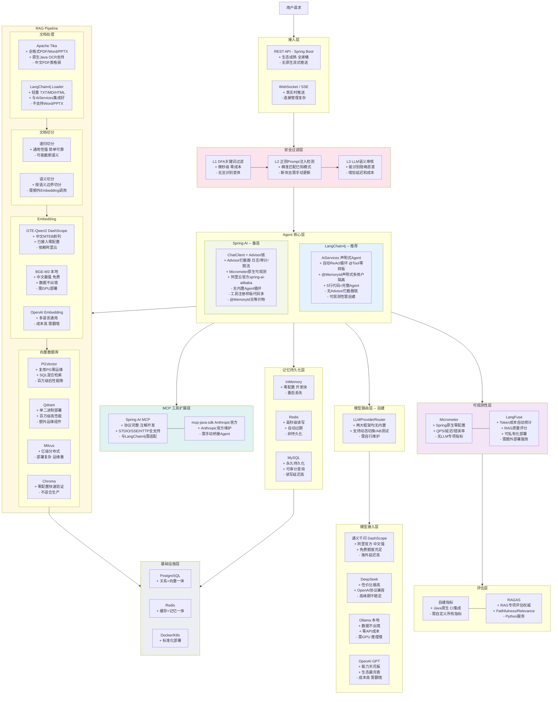

# Java 大模型应用开发组件全景图

> 一张图总览 Java 生态中构建企业级 AI 应用涉及的所有组件层次、候选技术、优缺点及分支选择。
>
> 最后更新：2026-04-05 v1

---

## 全景图

---

## 图例说明

| 层次 | 职责 | 关键决策点 |
|------|------|-----------|
| 接入层 | REST / WebSocket / SSE | Spring Boot 标配 |
| 安全过滤层 | 输入输出过滤 | 自建 3 层过滤（DFA → 正则 → LLM） |
| Agent 核心层 | 推理循环 / 工具调用 / 记忆 / RAG | **LangChain4j AiServices（推荐）** vs Spring AI ChatClient |
| 模型路由层 | 多模型动态切换 | 自建（两大框架均无内置） |
| 模型接入层 | LLM API 调用 | 通义 / DeepSeek / Ollama / OpenAI |
| RAG Pipeline | 文档解析 → 切分 → 向量化 → 检索 | Tika + LangChain4j Splitter + GTE-Qwen2 + PGVector |
| 记忆持久化层 | 对话历史存储 | Redis（生产）/ MySQL（归档） |
| MCP 扩展层 | 外部工具集成 | Spring AI MCP + 适配器桥接 |
| 可观测性层 | 监控 / 追踪 / 成本 | Micrometer（基础）+ LangFuse（LLM 专项） |
| 评估层 | 质量指标 | 自建 + RAGAS 辅助 |
| 基础设施层 | 数据库 / 缓存 / 容器 | PostgreSQL + Redis + Docker |

---

## 变更记录

| 版本 | 日期 | 变更内容 |
|------|------|---------|
| v1 | 2026-04-05 | 初始版本，11 层全景 + 优缺点标注 |
