# 企业级智能体架构框架选型分析

> 本文档从「构建企业级 Agent 架构」的技术选型角度，完整覆盖两大核心框架对比 + 周边组件选型。
>
> 最后更新：2026-04-05

---

## 0. Java 大模型应用开发组件全景图

> 独立文档：[Java大模型应用组件全景图.md](Java大模型应用组件全景图.md)
>
> 包含 11 层完整架构 + 每个组件的优缺点标注，可独立迭代版本。

### 选型维度速查

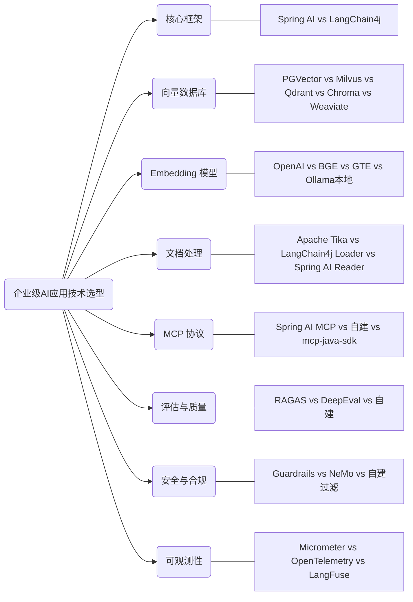

---

## 1. 核心框架对比：Spring AI vs LangChain4j

### 1.0 选型维度总览

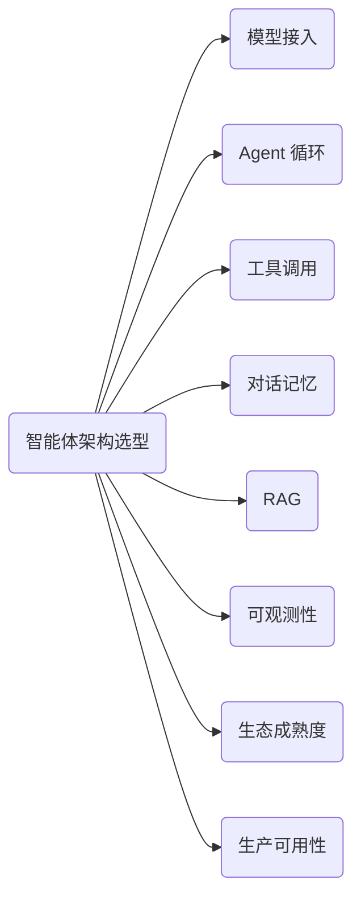

---

### 1.1 逐维度硬核对比

#### 模型接入

| 维度 | Spring AI | LangChain4j |
|------|-----------|-------------|
| 接口抽象 | `ChatModel` 单接口 | `ChatLanguageModel` + `StreamingChatLanguageModel` 分离 |
| 阿里云通义 | `spring-ai-alibaba` 官方维护 | 社区适配，非官方 |
| OpenAI | 官方支持 | 官方支持 |
| Ollama | 官方支持 | 官方支持 |
| Azure OpenAI | 官方支持 | 官方支持 |
| DeepSeek | 通过 OpenAI 兼容协议 | 通过 OpenAI 兼容协议 |
| 模型路由 | 无内置，需自建 | 无内置，需自建 |
| 流式输出 | `Flux<ChatResponse>` Reactor | `StreamingResponseHandler` 回调 |

**结论：** 接入能力相当。Spring AI 走 Reactor 响应式更现代；LangChain4j 回调式更传统但也够用。**阿里云生态 Spring AI 占优**（官方维护 spring-ai-alibaba）。

#### Agent 循环（核心差距）

| 维度 | Spring AI | LangChain4j |
|------|-----------|-------------|
| ReAct 循环 | **无内置 Agent 循环** — 需要用 `ChatClient` + Function Calling 自动迭代，或自建循环 | **`AiServices` 内置自动循环** — 检测到 tool_call 自动执行、注入结果、再调 LLM |
| 循环控制 | 无 maxIterations / timeout 控制 | 无内置，需自建 |
| Agent 抽象 | 无 `Agent` 概念 — 你得自己组合 ChatClient + Advisor + Memory | `AiServices` 就是 Agent — 声明接口 + 注解即可 |
| Plan-and-Execute | 无 | 无（两者都需自建） |
| Multi-Agent | 无 | 无（两者都需自建） |

**关键区别：**

```java
// === LangChain4j：5 行代码 = 一个完整 Agent ===
interface Assistant {
    String chat(@MemoryId String memoryId, @UserMessage String message);
}

Assistant agent = AiServices.builder(Assistant.class)
    .chatLanguageModel(model)
    .chatMemory(MessageWindowChatMemory.withMaxMessages(20))
    .tools(new WebSearchTool(), new CalculatorTool())  // 自动 ReAct 循环
    .build();

String answer = agent.chat("user-1", "北京今天天气怎么样");
// LLM 自动调工具 → 拿到结果 → 再推理 → 返回最终回答
```

```java
// === Spring AI：需要更多手动编排 ===
ChatClient client = ChatClient.builder(chatModel)
    .defaultAdvisors(
        new MessageChatMemoryAdvisor(chatMemory),
        new QuestionAnswerAdvisor(vectorStore)  // RAG
    )
    .defaultFunctions("webSearch", "calculator")
    .build();

// Function Calling 自动循环是有的，但 Agent 抽象需自建
// 没有 @MemoryId 这种声明式隔离
// 没有 maxIterations 控制
```

**结论：LangChain4j 的 Agent 抽象显著领先。** `AiServices` 一行代码 = 模型 + 记忆 + 工具 + 自动循环，是目前 Java 生态最完整的 Agent 开箱即用方案。

#### 工具调用

| 维度 | Spring AI | LangChain4j |
|------|-----------|-------------|
| 工具注册 | `@Bean FunctionCallback` 或 `java.util.function.Function` | `@Tool` 注解在方法上，自动扫描 |
| 参数描述 | `@Description` 注解 | `@P("描述")` 注解 |
| JSON Schema | 自动生成 | 自动生成 |
| 多工具 | 支持 | 支持 |
| 工具选择 | LLM 原生 tool_calls | LLM 原生 tool_calls |
| 工具权限 | 无 | 无 |
| 并行调用 | 支持（OpenAI parallel tool calls） | 支持 |

**LangChain4j 的工具注册更直觉：**

```java
// LangChain4j — 直接标注方法
class WeatherTool {
    @Tool("查询指定城市的天气")
    String getWeather(@P("城市名称") String city) {
        return weatherApi.query(city);
    }
}
// 传给 AiServices.tools(new WeatherTool()) 即可

// Spring AI — 需要包装成 FunctionCallback
@Bean
FunctionCallback weatherFunction() {
    return FunctionCallback.builder()
        .function("getWeather", request -> weatherApi.query(request.city()))
        .description("查询指定城市的天气")
        .inputType(WeatherRequest.class)
        .build();
}
```

**结论：** LangChain4j 的 `@Tool` + `@P` 更简洁直觉，Spring AI 需要更多样板代码。

#### 对话记忆

| 维度 | Spring AI | LangChain4j |
|------|-----------|-------------|
| 接口 | `ChatMemory` | `ChatMemory` |
| 内存实现 | `InMemoryChatMemory` | `MessageWindowChatMemory` |
| Token 窗口 | `MessageWindowChatMemory`（按消息数） | `MessageWindowChatMemory`（按消息数） |
| Token 计数窗口 | 无 | `TokenWindowChatMemory`（按 Token 数精确控制） |
| 摘要记忆 | 无 | 无内置（需自建） |
| 多会话隔离 | 手动传 `conversationId` | `@MemoryId` 声明式隔离 |
| 持久化 | 需自建 | 需自建（提供 `ChatMemoryStore` 接口） |

**LangChain4j 的 `@MemoryId` 是杀手锏：**

```java
// LangChain4j — 声明式多用户隔离
interface Assistant {
    String chat(@MemoryId String visitorId, @UserMessage String msg);
}
// 框架自动按 visitorId 隔离记忆，零代码

// Spring AI — 手动管理
advisor = new MessageChatMemoryAdvisor(chatMemory, conversationId, 20);
// 每次调用都要手动传 conversationId
```

**结论：** LangChain4j 的 `TokenWindowChatMemory` + `@MemoryId` 更成熟。

#### RAG

| 维度 | Spring AI | LangChain4j |
|------|-----------|-------------|
| 文档加载 | `DocumentReader`（PDF / TXT / MD / HTML） | `DocumentLoader`（PDF / TXT / MD / HTML / PPTX / XLSX） |
| 文档切分 | `TextSplitter` / `TokenTextSplitter` | `DocumentSplitter`（递归 / 按句 / 按段） |
| Embedding | `EmbeddingModel` 统一接口 | `EmbeddingModel` 统一接口 |
| 向量库 | Qdrant / PGVector / Milvus / Chroma / Redis 等 | Qdrant / PGVector / Milvus / Chroma / Redis 等 |
| ETL Pipeline | `ETL Pipeline`（Reader → Transformer → Writer） | `EmbeddingStoreIngestor`（Loader → Splitter → Store） |
| 检索 | `VectorStore.similaritySearch()` | `EmbeddingStoreContentRetriever` |
| Rerank | 无内置 | 无内置 |
| RAG 集成 | `QuestionAnswerAdvisor` 一行接入 | `ContentRetriever` 注入 `AiServices` |

**两者 RAG 能力相当**，但集成方式不同：

```java
// Spring AI — Advisor 模式
ChatClient.builder(chatModel)
    .defaultAdvisors(new QuestionAnswerAdvisor(vectorStore))
    .build();

// LangChain4j — ContentRetriever 模式
AiServices.builder(Assistant.class)
    .chatLanguageModel(model)
    .contentRetriever(EmbeddingStoreContentRetriever.from(embeddingStore))
    .build();
```

**结论：** 能力打平。Spring AI 的 `Advisor` 模式扩展性更强（可叠加多个 Advisor）；LangChain4j 集成到 AiServices 更自然。

#### Advisor / 拦截器

| 维度 | Spring AI | LangChain4j |
|------|-----------|-------------|
| 拦截器 | `Advisor` 链 — 请求前 / 响应后拦截 | 无内置拦截器体系 |
| 日志 | 自建 Advisor | 自建 Listener |
| 审计 | 自建 Advisor | 需自建 |
| 限流 | 自建 Advisor | 需自建 |
| 敏感词 | 自建 Advisor | 需自建 |

**结论：Spring AI 的 Advisor 链是独有优势**，类似 Spring MVC 的 `HandlerInterceptor`，企业级场景非常需要。LangChain4j 在这方面是空白。

#### 可观测性

| 维度 | Spring AI | LangChain4j |
|------|-----------|-------------|
| Micrometer | 原生集成 | 需自建 |
| OpenTelemetry | 通过 Micrometer Bridge | 需自建 |
| Token 统计 | `ChatResponse.getMetadata().getUsage()` | `TokenUsage` 类 |
| 调用追踪 | Spring Boot Actuator | 无 |

**结论：Spring AI 完胜。** 天然融入 Spring Boot 可观测体系。

#### 生态与社区

| 维度 | Spring AI | LangChain4j |
|------|-----------|-------------|
| 背后公司 | VMware / Broadcom（Spring 团队） | 独立开源（Dmytro Liubarskyi） |
| GitHub Stars（2026 Q1） | ~3.5k | ~5.5k |
| 发版频率 | 月更 | 周更 |
| 稳定版 | 1.0.0-M4（仍在 Milestone） | 1.0.0-beta（也未 GA） |
| Spring 生态融合 | 原生 | 有 `langchain4j-spring-boot-starter` |
| 文档质量 | 官方文档较薄 | 官方文档详尽 + 大量示例 |
| 中国社区 | spring-ai-alibaba 活跃 | 社区翻译，非官方 |

**结论：** LangChain4j 社区更活跃、文档更好、迭代更快。Spring AI 有 Spring 团队背书，但成熟度稍逊。

---

### 1.2 全维度打分

| 维度 | Spring AI | LangChain4j | 胜出 |
|------|-----------|-------------|------|
| 模型接入 | 8 | 8 | 平 |
| Agent 循环 | 4 | 9 | **LangChain4j** |
| 工具调用 | 7 | 9 | **LangChain4j** |
| 对话记忆 | 6 | 8 | **LangChain4j** |
| RAG | 8 | 8 | 平 |
| Advisor 拦截器 | 9 | 2 | **Spring AI** |
| 可观测性 | 9 | 3 | **Spring AI** |
| 生产就绪度 | 6 | 7 | **LangChain4j** |
| Spring 生态融合 | 10 | 7 | **Spring AI** |
| 文档与社区 | 6 | 8 | **LangChain4j** |
| **总分** | **73** | **69** | - |

---

### 1.3 选型结论

**总分接近，但侧重点完全不同：**

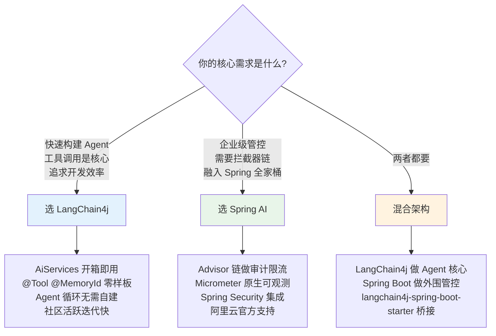

#### 建议：LangChain4j 做核心 + Spring Boot 做外围

**理由：**

1. **Agent 是你的核心能力** — 你的项目叫 `llm-orchestration-platform`，编排是核心。LangChain4j 的 `AiServices` 在 Agent 抽象上领先 Spring AI 一个身位，这是最重要的维度。

2. **Spring AI 的强项你可以补** — Advisor 拦截器可以用 Spring AOP / HandlerInterceptor 替代；可观测性用 Micrometer 手动埋点即可。但 LangChain4j 的 `AiServices` 自动循环 + `@Tool` + `@MemoryId` **你补不了**，这是框架级能力。

3. **混合并不冲突** — `langchain4j-spring-boot-starter` 官方支持，完美融入 Spring Boot：

```xml
<dependency>
    <groupId>dev.langchain4j</groupId>
    <artifactId>langchain4j-spring-boot-starter</artifactId>
</dependency>
<dependency>
    <groupId>dev.langchain4j</groupId>
    <artifactId>langchain4j-community-dashscope-spring-boot-starter</artifactId>
</dependency>
```

4. **RAG 两者都行** — 向量库、文档切分能力打平，用谁都可以。

#### 混合架构全景

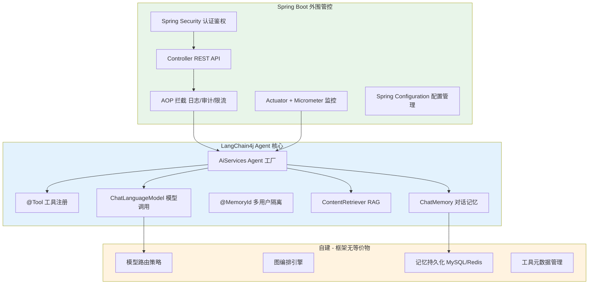

---

### 1.4 迁移路径

如果从当前架构迁移到 LangChain4j：

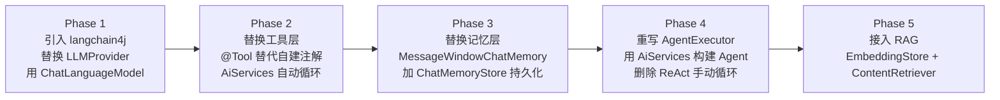

#### 各 Phase 代码量变化预估

| Phase | 删除 | 新增 | 净变化 |
|-------|------|------|--------|
| 1 替换模型层 | ~300 行（LLMProvider + Qwen/Ollama Provider） | ~50 行（配置 ChatLanguageModel Bean） | **-250 行** |
| 2 替换工具层 | ~180 行（ToolExecutor 反射 + 手动解析） | ~30 行（@Tool 注解迁移） | **-150 行** |
| 3 替换记忆层 | ~80 行（InMemoryRepository） | ~40 行（ChatMemoryStore 适配器） | **-40 行** |
| 4 重写 Agent | ~280 行（AlibabaAgentExecutor） | ~30 行（AiServices 构建） | **-250 行** |
| 5 新增 RAG | 0 | ~100 行（新功能） | **+100 行** |
| **总计** | **~840 行** | **~250 行** | **净减 ~590 行** |

#### 迁移后的 AlibabaAgentExecutor 等价代码

```java
// 迁移前：280 行 AlibabaAgentExecutor.java
// 迁移后：

@Configuration
public class AgentConfiguration {

    @Bean
    Assistant secretaryAgent(
            ChatLanguageModel model,
            ChatMemoryStore memoryStore,
            ContentRetriever retriever,
            WebSearchTool webSearch,
            ScheduleTool schedule,
            TodoTool todo
    ) {
        return AiServices.builder(Assistant.class)
                .chatLanguageModel(model)
                .chatMemoryProvider(userId ->
                    MessageWindowChatMemory.builder()
                        .chatMemoryStore(memoryStore)
                        .maxMessages(20)
                        .id(userId)
                        .build())
                .contentRetriever(retriever)
                .tools(webSearch, schedule, todo)
                .build();
    }
}

// 调用
String answer = secretaryAgent.chat(userId, userMessage);
// 自动完成：记忆加载 → LLM推理 → 工具调用 → 结果观察 → 循环 → 最终回答
```

**280 行 → 25 行，功能完全等价，且支持真流式、原生 Function Calling、自动记忆隔离。**

---

## 2. 向量数据库选型

### 2.1 候选对比

| 维度 | PGVector | Milvus | Qdrant | Chroma | Weaviate |
|------|----------|--------|--------|--------|----------|
| **定位** | PostgreSQL 扩展 | 专业向量库 | 专业向量库 | 轻量嵌入式 | 全功能向量库 |
| **部署复杂度** | 低（加个扩展） | 高（分布式） | 中（单二进制） | 极低（Python 包） | 中 |
| **Java 客户端** | JDBC 直连 | 官方 SDK | 官方 SDK | REST API | 官方 SDK |
| **Spring AI 支持** | 官方 Starter | 官方 Starter | 官方 Starter | 官方 Starter | 官方 Starter |
| **LangChain4j 支持** | 官方模块 | 官方模块 | 官方模块 | 官方模块 | 官方模块 |
| **性能（百万级）** | 中 | 高 | 高 | 低 | 中高 |
| **混合检索** | 全文+向量（原生 SQL） | 支持 | 支持 | 不支持 | 支持（BM25+向量） |
| **过滤查询** | SQL WHERE 天然支持 | 表达式过滤 | JSON 过滤 | 基础过滤 | GraphQL 过滤 |
| **运维成本** | 极低（复用 PG） | 高 | 低 | 极低 | 中 |
| **生产案例** | Supabase / Neon | 知乎 / Shopee | 大量 AI 创业公司 | 原型/demo | Weaviate Cloud |

### 2.2 选型决策树

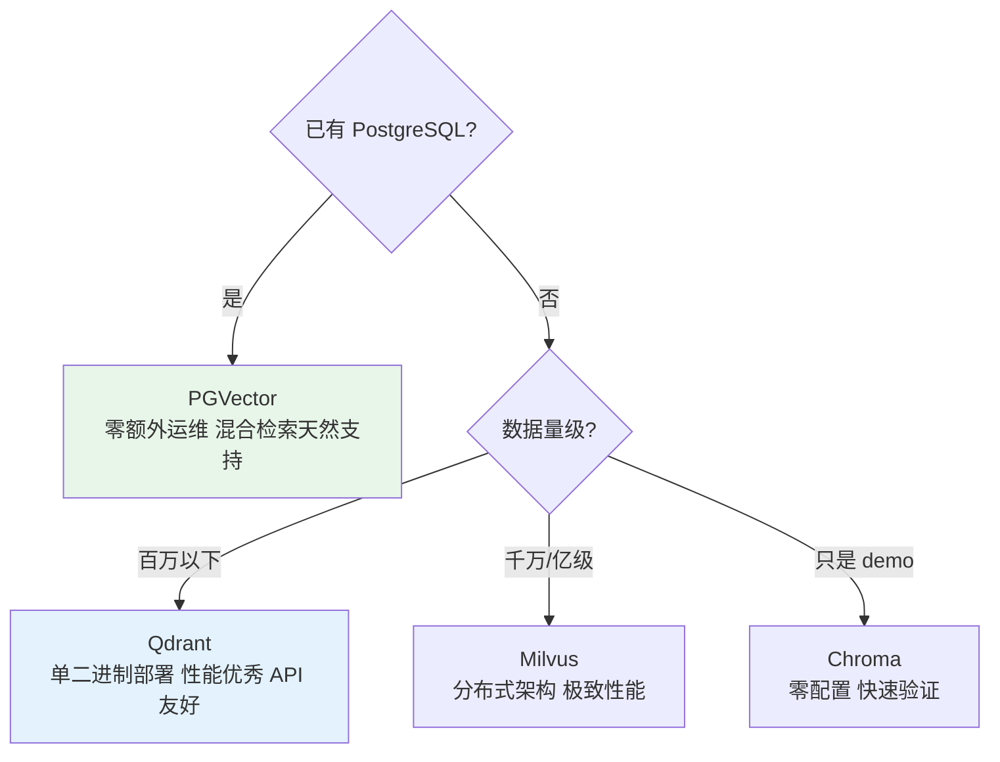

### 2.3 建议

**推荐 PGVector（首选） + Qdrant（备选）：**

- 你的项目大概率已有 PostgreSQL — PGVector 只需 `CREATE EXTENSION vector`，零运维增量
- 混合检索用 SQL 就能做（`WHERE category = 'xxx' ORDER BY embedding <=> query_vec`）
- 数据量不够大时，PGVector 性能完全够用
- 扩展到百万级再考虑迁移 Qdrant（你已引入 `spring-ai-qdrant-store`，备选已就位）

---

## 3. Embedding 模型选型

### 3.1 候选对比

| 模型 | 维度 | 中文能力 | 部署方式 | 成本 | 适用场景 |
|------|------|---------|---------|------|---------|
| **OpenAI text-embedding-3-small** | 1536 | 良好 | API 调用 | $0.02/1M tokens | 通用场景 快速接入 |
| **OpenAI text-embedding-3-large** | 3072 | 良好 | API 调用 | $0.13/1M tokens | 高精度需求 |
| **BGE-M3（BAAI）** | 1024 | 极强 | 本地/API | 免费（本地） | 中文为主 企业内部 |
| **GTE-Qwen2（阿里）** | 1024 | 极强 | DashScope API / 本地 | 低/免费 | 阿里生态 中文场景 |
| **Ollama 本地模型** | 可变 | 取决于模型 | 本地 Ollama | 免费 | 离线场景 数据敏感 |

### 3.2 选型决策树

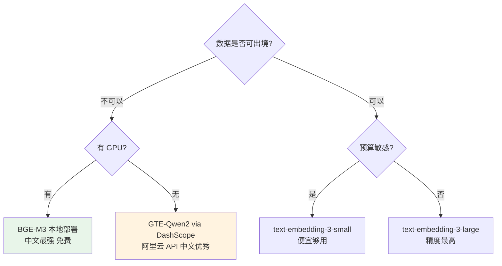

### 3.3 建议

**推荐 GTE-Qwen2 via DashScope（首选）：**

- 你已接入阿里云 DashScope — Embedding 调用零额外配置
- 中文向量化质量在 MTEB 中文排行榜前列
- Spring AI / LangChain4j 均有 DashScope Embedding 支持
- 成本极低（DashScope 免费额度覆盖大部分开发测试场景）

---

## 4. 文档处理选型

### 4.1 候选对比

| 维度 | Apache Tika | LangChain4j DocumentLoader | Spring AI DocumentReader | Unstructured.io |
|------|-------------|---------------------------|--------------------------|-----------------|
| PDF 解析 | 优秀（Apache PDFBox） | 基础 | 基础 | 优秀 |
| Word/PPTX/XLSX | 全支持（Apache POI） | 部分支持 | 不支持 | 全支持 |
| HTML | 支持 | 支持（Jsoup） | 支持 | 支持 |
| Markdown | 支持 | 支持 | 支持 | 支持 |
| 代码文件 | 支持 | 支持 | 支持 | 支持 |
| OCR | 支持（Tesseract） | 不支持 | 不支持 | 支持 |
| 表格提取 | 支持 | 不支持 | 不支持 | 优秀 |
| 中文 PDF | 中等 | 弱 | 弱 | 优秀 |
| Java 集成 | 原生 Java | 原生 Java | 原生 Java | REST API（Python） |
| 文档切分 | 无（仅提取） | 内置 DocumentSplitter | 内置 TextSplitter | 内置 |

### 4.2 建议

**推荐分层组合：**

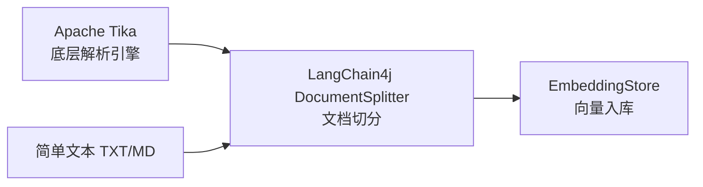

- **Tika 做底层解析**（PDF / Word / PPTX 全格式覆盖）
- **LangChain4j DocumentSplitter 做切分**（递归切分 / 语义切分）
- 简单格式（TXT / MD）直接用 LangChain4j Loader，不经 Tika
- **不推荐 Unstructured.io** — Python 服务，增加架构复杂度

---

## 5. MCP 协议选型

### 5.1 候选对比

| 维度 | Spring AI MCP | mcp-java-sdk（Anthropic 官方） | 自建 MCP |
|------|---------------|-------------------------------|---------|
| 协议完整度 | 完整（STDIO + SSE + Streamable HTTP） | 完整 | 需自行实现 |
| 传输层 | Spring WebFlux 原生 | Reactor Netty | 自选 |
| Server 开发 | `@McpServer` 注解 | Builder API | 手写协议 |
| Client 开发 | `McpClient` 自动发现 | `McpClient` Builder | 手写协议 |
| 与 Agent 集成 | 作为 Tool 自动注入 | 需手动桥接 | 需手动桥接 |
| Spring 生态 | 原生 | 需适配 | 需适配 |
| LangChain4j 集成 | 不直接支持 | 不直接支持 | - |

### 5.2 建议

**推荐 Spring AI MCP：**

- MCP 是工具扩展层，与 Agent 核心解耦 — 用 Spring AI MCP 不影响 LangChain4j 做 Agent 核心
- MCP Server 开发后，通过适配器桥接到 LangChain4j `@Tool`

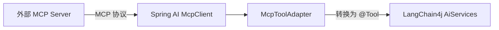

---

## 6. 评估与质量体系选型

### 6.1 候选对比

| 维度 | RAGAS | DeepEval | 自建评估 |
|------|-------|---------|---------|
| 语言 | Python | Python | Java |
| RAG 评估 | 专业（Faithfulness / Relevance / Recall） | 支持 | 需自建指标 |
| Agent 评估 | 基础 | 支持 | 需自建 |
| Java 集成 | REST API 调用 | REST API 调用 | 原生 |
| 自动化 | CI/CD 集成 | CI/CD 集成 | CI/CD 集成 |
| 中文支持 | 支持 | 支持 | 取决于实现 |

### 6.2 建议

**推荐自建评估 + RAGAS 辅助：**

- 核心指标（回答准确率 / 工具调用成功率 / 延迟 / Token 消耗）用 Java 自建，集成到 CI
- RAG 专项评估（Faithfulness / Context Relevance）用 RAGAS Python 服务，定期跑批
- 不需要在早期引入复杂评估框架 — 先跑通再优化

---

## 7. 安全与合规选型

### 7.1 候选对比

| 维度 | NVIDIA NeMo Guardrails | Guardrails AI | 自建过滤 |
|------|----------------------|---------------|---------|
| 语言 | Python | Python | Java |
| 输入过滤 | Colang 规则引擎 | Pydantic 校验 | 正则 + 词表 + LLM |
| 输出过滤 | 支持 | 支持 | 支持 |
| 敏感词 | 支持 | 基础 | DFA/AC 自动机 |
| 合规审计 | 日志级 | 基础 | 自建 |
| Java 集成 | REST API | REST API | 原生 |
| Prompt 注入防护 | 支持 | 支持 | 需自建 |

### 7.2 建议

**推荐自建过滤（分层）：**

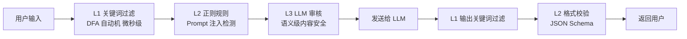

- **L1 关键词**：DFA 自动机 + 敏感词词表，微秒级，零成本
- **L2 正则**：Prompt 注入模式检测（`ignore previous instructions` 等）
- **L3 LLM 审核**：对高风险输入用独立 LLM 做语义审核（可选，延迟换安全）
- NeMo / Guardrails AI 都是 Python — 在 Java 项目中引入 Python 服务增加复杂度，不推荐早期引入

---

## 8. 可观测性选型

### 8.1 候选对比

| 维度 | Micrometer | OpenTelemetry | LangFuse | LangSmith |
|------|-----------|---------------|----------|-----------|
| 定位 | 应用指标 | 分布式追踪 | LLM 专项观测 | LLM 专项观测 |
| 指标采集 | Counter / Timer / Gauge | Traces / Metrics / Logs | Trace / Score / Cost | Trace / Score / Cost |
| Token 统计 | 手动埋点 | 手动埋点 | 自动采集 | 自动采集 |
| 调用链追踪 | 不支持 | 原生支持 | 原生支持（LLM 粒度） | 原生支持 |
| 成本分析 | 手动计算 | 手动计算 | 自动（按模型定价） | 自动 |
| RAG 质量追踪 | 不支持 | 不支持 | 支持 | 支持 |
| Java SDK | 原生 | 官方 SDK | 官方 Java SDK | REST API |
| Spring 集成 | 原生 | OpenTelemetry Bridge | 手动集成 | 手动集成 |
| 私有化部署 | N/A（嵌入式） | 自建 Collector | 支持自部署 | SaaS only |
| 成本 | 免费 | 免费 | 开源免费 | $39/月起 |

### 8.2 建议

**推荐 Micrometer（基础） + LangFuse（LLM 专项）：**

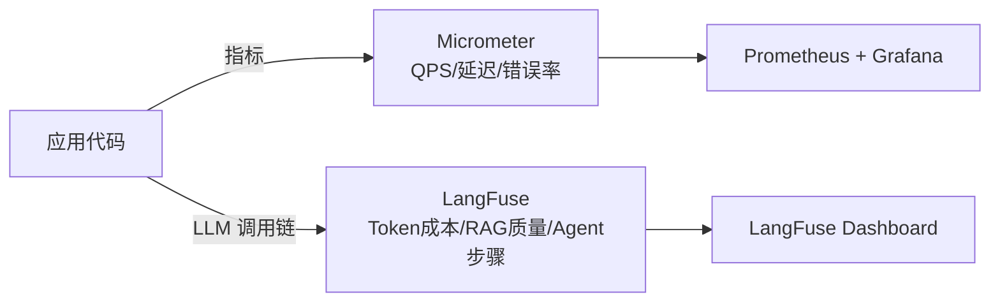

- **Micrometer** 做基础监控（Spring Boot 原生，零配置）
- **LangFuse** 做 LLM 专项观测（Token 成本追踪、RAG 质量评分、Agent 推理步骤回放）
- LangFuse 支持私有化部署，数据不出境
- LangSmith 功能更强但 SaaS only + 收费，不适合国内企业

---

## 9. 全组件选型决策总表

| 组件类别 | 推荐方案 | 备选方案 | 理由 |
|---------|---------|---------|------|
| **Agent 核心** | LangChain4j AiServices | Spring AI ChatClient | Agent 抽象领先，开发效率高 |
| **应用框架** | Spring Boot | - | 企业标配，安全/配置/监控生态 |
| **模型接入** | LangChain4j ChatLanguageModel | Spring AI ChatModel | 跟随 Agent 核心统一 |
| **模型路由** | 自建 Router | - | 两大框架均无内置 |
| **工具调用** | LangChain4j @Tool | Spring AI FunctionCallback | 更简洁，与 AiServices 天然集成 |
| **对话记忆** | LangChain4j MessageWindowChatMemory | 自建（持久化层） | @MemoryId + TokenWindow |
| **RAG** | LangChain4j EmbeddingStore Pipeline | Spring AI RAG Pipeline | 跟随 Agent 核心统一 |
| **向量数据库** | PGVector | Qdrant | 复用已有 PG，零运维增量 |
| **Embedding** | GTE-Qwen2 via DashScope | BGE-M3 本地 | 阿里生态已接入，中文优秀 |
| **文档处理** | Apache Tika + LangChain4j Splitter | - | Tika 全格式，Splitter 切分好 |
| **MCP** | Spring AI MCP + 适配器 | mcp-java-sdk | Spring MCP 成熟度更高 |
| **安全过滤** | 自建分层过滤 | NeMo Guardrails（远期） | 避免引入 Python 依赖 |
| **基础监控** | Micrometer + Prometheus | - | Spring Boot 原生 |
| **LLM 观测** | LangFuse（自部署） | - | Token 成本 + RAG 质量 + 私有化 |
| **评估体系** | 自建 + RAGAS 辅助 | DeepEval | 核心指标 Java 自建，RAG 用 RAGAS |

### 技术栈全景架构

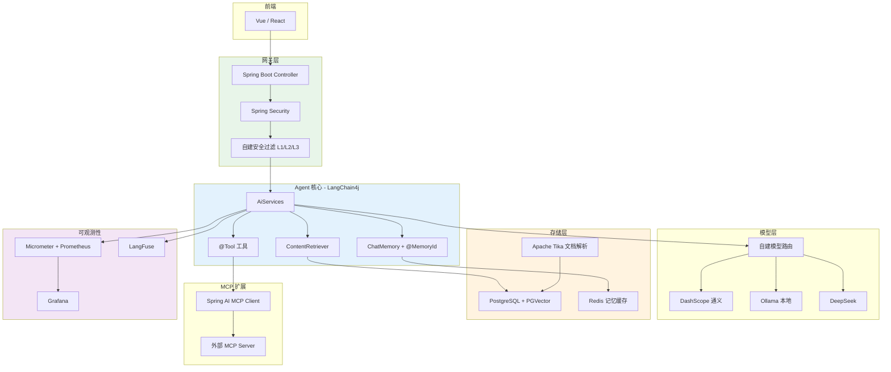
