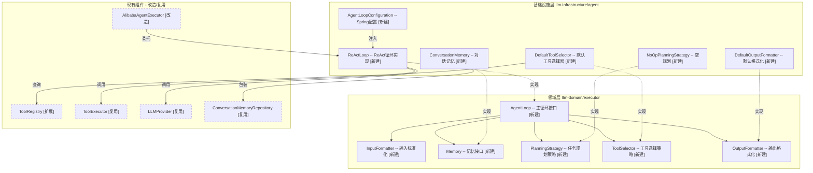
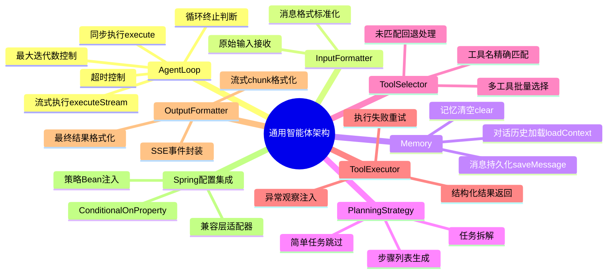
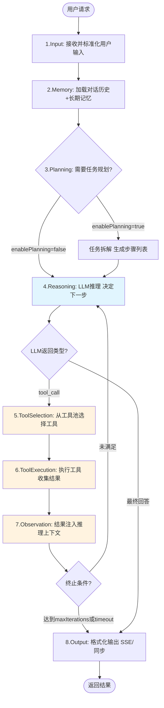
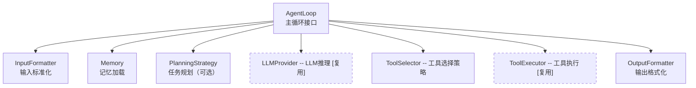
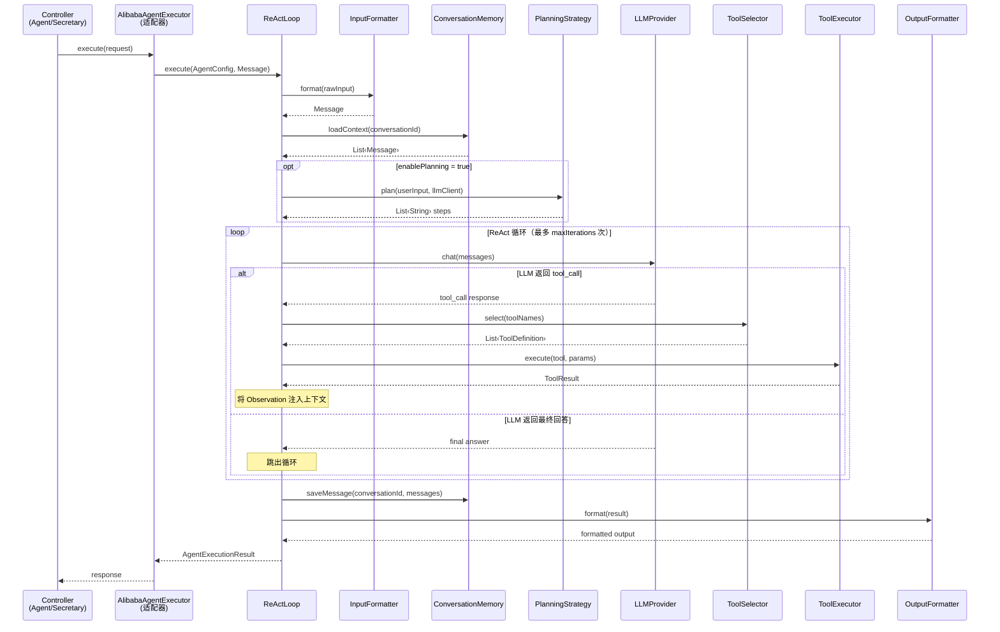
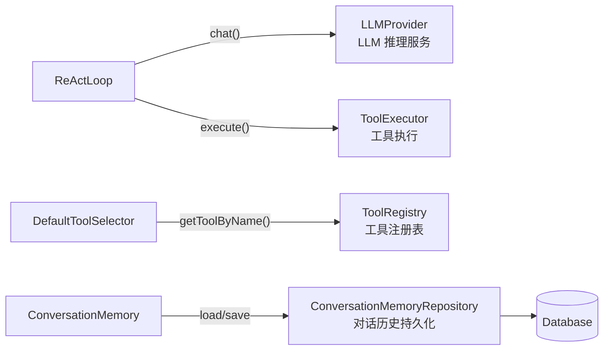

# 功能设计文档

## 变更记录

| 版本 | 日期 | 修改人 | 变更内容摘要 |
|------|------|--------|--------------|
| v1 | 2026-04-04 | | 初始版本，定义通用智能体架构 7 核心环节 |

---

## 1. 基本信息

- 功能名称：通用智能体架构（Generic Agent Architecture）
- 所属系统：llm-orchestration-platform
- 所属模块：llm-domain / llm-infrastructure
- 需求来源：当前 Agent 体系缺乏统一抽象，ReAct 循环硬编码在 AlibabaAgentExecutor 中，难以扩展新策略（Planning、Multi-Agent）
- 负责人：
- 版本号：v1

---

## 2. 背景与目标

### 背景

当前项目 Agent 体系以 ReAct（Reasoning + Acting）循环为核心，执行逻辑硬编码在 `AlibabaAgentExecutor` 中。随着业务场景扩展（任务规划、多智能体协作、分层执行），现有架构存在以下问题：

1. **循环逻辑耦合**：ReAct 循环的执行策略（何时停止、如何选择工具、如何观察）与 AgentExecutor 实现紧耦合
2. **缺少 Planning 阶段**：复杂任务缺乏任务拆解、步骤规划能力，只能靠 LLM 自发规划
3. **工具选择策略单一**：工具选择策略（Function Calling、语义匹配、规则匹配）无法灵活切换
4. **Memory 接口不完善**：现有 ConversationMemoryRepository 仅支持会话级记忆，缺乏结构化长期记忆

### 目标

设计一套**可插拔、策略化**的通用智能体架构，支持：

- 核心 7 环节的**清晰抽象**，各环节可独立替换策略
- 与现有 DDD 分层完美融合，不破坏现有模块依赖规则
- 支持多种 Agent 策略（ReAct、Plan-and-Execute、Reflexion 等）
- 为 Multi-Agent 协作预留扩展点

### 设计边界

- 本次一期仅实现核心抽象层 + ReAct 策略实现（对齐现有 AlibabaAgentExecutor）
- 不包含 Multi-Agent 协作、Reflexion 自反思等高级策略
- Memory 层仅定义接口，不实现具体存储

---

## 3. 功能范围

### 3.1 功能模块总览图



> 实线边框 = 新建模块 | 虚线边框 = 现有模块（改造/复用） | 虚线箭头 = 接口实现 | 实线箭头 = 调用/依赖

### 3.2 能力分解图



### 3.3 功能范围说明

**本次包含：**

1. **通用 Agent 核心 7 环节定义**（见 4.1）
2. **AgentLoop 抽象接口**（`llm-domain/executor/AgentLoop.java`）
3. **5 个核心策略接口**：PlanningStrategy、ToolSelector、ToolExecutor、Memory、OutputFormatter
4. **ReActLoop 实现**：将现有 AlibabaAgentExecutor 逻辑迁移到新架构
5. **与现有 llm-domain/executor/AgentExecutor 接口的兼容层**
6. **ToolRegistry 扩展**：支持工具分类、工具描述标准化

**本次不包含：**

- Multi-Agent 协作框架
- Planning 策略的具体实现（如 CoT、ToT）
- Memory 的具体持久化实现
- Agent 状态机（运行中/暂停/终止）的完整生命周期管理

**后续扩展：**

- Plan-and-Execute 策略（先规划再执行）
- Reflexion 自反思策略
- Multi-Agent 消息路由
- Agent 监控指标采集

---

## 4. 业务流程设计

### 4.1 通用 Agent 执行流程 — 7 核心环节



#### 各环节职责

| 环节 | 名称 | 职责 | 策略接口 |
|------|------|------|----------|
| 1 | Input | 接收并标准化用户输入，构建初始消息列表 | InputFormatter |
| 2 | Memory | 加载对话历史 + 结构化长期记忆，构建上下文 | Memory |
| 3 | Planning | 任务拆解，生成步骤列表（SimpleTask 时可跳过） | PlanningStrategy |
| 4 | Reasoning | LLM 生成下一步行动（回答 / 工具调用） | LLMProvider（复用现有） |
| 5 | Tool Selection | 从注册工具中选择匹配的工具 | ToolSelector |
| 6 | Tool Execution | 执行工具，返回结构化结果 | ToolExecutor（复用现有） |
| 7 | Observation | 格式化工具结果，注入上下文 | OutputFormatter |
| 8 | Output | 将最终结果返回用户，支持流式 | OutputFormatter |

#### 终止条件

- LLM 返回最终回答（非 tool_call）
- 达到最大迭代次数（`maxIterations`）
- 执行超时（`timeoutSeconds`）
- 吞掉异常，返回错误结果

### 4.2 各环节的抽象接口定义



> 虚线边框 = 复用现有实现，实线边框 = 新建接口

### 4.3 与现有组件的集成关系

| 现有组件 | 在新架构中的角色 |
|----------|----------------|
| `AgentExecutor` | 被 `AgentLoop` 替代，保留兼容接口 |
| `AlibabaAgentExecutor` | 变为 `ReActLoop` 实现（实现 `AgentLoop`） |
| `ToolRegistry` | 被 `ToolSelector` 组合使用 |
| `ToolExecutor` | 被 `AgentLoop` 组合使用 |
| `ConversationMemoryRepository` | 实现 `Memory` 接口 |
| `LLMProvider`（领域服务） | 被 `AgentLoop` 直接调用 |

### 4.4 异常流程

- **工具执行失败**：记录异常观察结果，重试一次，失败则终止循环
- **LLM 超时**：触发 Agent 执行超时异常
- **循环次数耗尽**：返回部分结果 + `maxIterationsReached` 标志
- **工具选择失败**（无匹配工具）：LLM 直接生成文字回答

---

## 5. 接口设计

### 5.1 接口清单

| 接口全类名 | 所在模块 | 职责 | 备注 |
|-----------|---------|------|------|
| `com.exceptioncoder.llm.domain.executor.AgentLoop` | llm-domain | Agent 主循环抽象 | 核心接口 |
| `com.exceptioncoder.llm.domain.executor.InputFormatter` | llm-domain | 输入标准化 | 新建 |
| `com.exceptioncoder.llm.domain.executor.Memory` | llm-domain | 记忆接口 | 现有 Repository 升级 |
| `com.exceptioncoder.llm.domain.executor.PlanningStrategy` | llm-domain | 任务规划策略 | 新建 |
| `com.exceptioncoder.llm.domain.executor.ToolSelector` | llm-domain | 工具选择策略 | 新建 |
| `com.exceptioncoder.llm.domain.executor.OutputFormatter` | llm-domain | 输出格式化 | 新建 |
| `com.exceptioncoder.llm.domain.model.AgentExecutionResult` | llm-domain | 执行结果模型 | 已有，扩展 |
| `com.exceptioncoder.llm.domain.model.AgentConfig` | llm-domain | Agent 配置模型 | 新建 |
| `com.exceptioncoder.llm.infrastructure.agent.loop.ReActLoop` | llm-infrastructure | ReAct 循环实现 | 迁移现有逻辑 |
| `com.exceptioncoder.llm.infrastructure.agent.loop.DefaultToolSelector` | llm-infrastructure | 默认工具选择器 | 新建 |
| `com.exceptioncoder.llm.infrastructure.agent.loop.DefaultOutputFormatter` | llm-infrastructure | 默认输出格式化 | 新建 |
| `com.exceptioncoder.llm.infrastructure.agent.loop.ConversationMemory` | llm-infrastructure | 对话记忆实现 | 包装现有 Repository |

### 5.2 核心接口签名

```java
// AgentLoop.java — 主循环接口
package com.exceptioncoder.llm.domain.executor;

import com.exceptioncoder.llm.domain.model.AgentConfig;
import com.exceptioncoder.llm.domain.model.AgentExecutionResult;
import com.exceptioncoder.llm.domain.model.Message;
import reactor.core.publisher.Flux;

public interface AgentLoop {

    /**
     * 同步执行 Agent 主循环
     */
    AgentExecutionResult execute(AgentConfig config, Message userMessage);

    /**
     * 流式执行 Agent 主循环（支持 SSE）
     */
    Flux<String> executeStream(AgentConfig config, Message userMessage);
}
```

```java
// PlanningStrategy.java — 任务规划策略
package com.exceptioncoder.llm.domain.executor;

import java.util.List;

public interface PlanningStrategy {

    /**
     * 对输入进行任务规划，返回步骤列表
     * @return 空列表表示不需要规划，直接执行
     */
    List<String> plan(String userInput, Object llmClient);
}
```

```java
// ToolSelector.java — 工具选择策略
package com.exceptioncoder.llm.domain.executor;

import com.exceptioncoder.llm.domain.model.ToolDefinition;

import java.util.List;

public interface ToolSelector {

    /**
     * 根据 LLM 的 tool_call 请求选择一个或多个工具
     * @param toolNames LLM 请求的工具名列表
     * @return 匹配的工具定义列表
     */
    List<ToolDefinition> select(List<String> toolNames);
}
```

```java
// Memory.java — 记忆接口
package com.exceptioncoder.llm.domain.executor;

import com.exceptioncoder.llm.domain.model.Message;

import java.util.List;

public interface Memory {

    /**
     * 加载对话上下文
     */
    List<Message> loadContext(String conversationId);

    /**
     * 保存消息到记忆
     */
    void saveMessage(String conversationId, Message message);

    /**
     * 清空对话记忆
     */
    void clear(String conversationId);
}
```

```java
// InputFormatter.java — 输入标准化
package com.exceptioncoder.llm.domain.executor;

import com.exceptioncoder.llm.domain.model.Message;

public interface InputFormatter {

    /**
     * 将原始输入转换为标准消息格式
     */
    Message format(Object rawInput);
}
```

```java
// OutputFormatter.java — 输出格式化
package com.exceptioncoder.llm.domain.executor;

import com.exceptioncoder.llm.domain.model.AgentExecutionResult;

public interface OutputFormatter {

    /**
     * 将 Agent 执行结果格式化为最终输出
     */
    String format(AgentExecutionResult result);

    /**
     * 流式输出格式化（单段）
     */
    String formatChunk(String chunk);
}
```

```java
// AgentConfig.java — Agent 配置
package com.exceptioncoder.llm.domain.model;

public record AgentConfig(
    String agentId,
    String name,
    String systemPrompt,
    String llmProvider,
    String llmModel,
    int maxIterations,
    int timeoutSeconds,
    boolean enablePlanning,
    boolean streamOutput
) {}
```

### 5.3 AgentExecutionResult 扩展

在现有 `AgentExecutionResult` 上扩展字段：

| 字段 | 类型 | 说明 |
|------|------|------|
| `reasoningTrace` | `List<String>` | 推理过程追踪（可选，用于调试/展示） |
| `toolCalls` | `List<ToolCall>` | 本次执行调用的工具列表 |
| `maxIterationsReached` | `boolean` | 是否达到最大迭代次数 |
| `executionSteps` | `int` | 实际执行步数 |

---

## 6. 类设计

### 6.1 分层设计

| 层 | 包路径前缀 | 职责 |
|----|-----------|------|
| Domain | `com.exceptioncoder.llm.domain.executor` | 接口定义、领域模型 |
| Infrastructure | `com.exceptioncoder.llm.infrastructure.agent.loop` | 策略实现、Loop 实现 |

> Domain 层不引入任何外部依赖（无 Spring、Lombok 之外的依赖）

### 6.2 核心类清单

| 全类名 | 类型 | 职责说明 | 是否新建 |
|--------|------|----------|---------|
| `com.exceptioncoder.llm.domain.executor.AgentLoop` | Interface | Agent 主循环抽象接口 | 新建 |
| `com.exceptioncoder.llm.domain.executor.InputFormatter` | Interface | 输入标准化接口 | 新建 |
| `com.exceptioncoder.llm.domain.executor.Memory` | Interface | 记忆接口（升级自 Repository） | 新建 |
| `com.exceptioncoder.llm.domain.executor.PlanningStrategy` | Interface | 任务规划策略接口 | 新建 |
| `com.exceptioncoder.llm.domain.executor.ToolSelector` | Interface | 工具选择策略接口 | 新建 |
| `com.exceptioncoder.llm.domain.executor.OutputFormatter` | Interface | 输出格式化接口 | 新建 |
| `com.exceptioncoder.llm.domain.model.AgentConfig` | Record | Agent 配置模型 | 新建 |
| `com.exceptioncoder.llm.domain.model.AgentExecutionResult` | Record | 扩展 reasoningTrace 等字段 | 扩展 |
| `com.exceptioncoder.llm.infrastructure.agent.loop.ReActLoop` | Class | ReAct 循环实现 | 新建（迁移自 AlibabaAgentExecutor） |
| `com.exceptioncoder.llm.infrastructure.agent.loop.DefaultToolSelector` | Class | 基于工具名精确匹配的选择器 | 新建 |
| `com.exceptioncoder.llm.infrastructure.agent.loop.DefaultOutputFormatter` | Class | 默认输出格式化 | 新建 |
| `com.exceptioncoder.llm.infrastructure.agent.loop.ConversationMemory` | Class | 基于 ConversationMemoryRepository 的实现 | 新建 |
| `com.exceptioncoder.llm.infrastructure.agent.executor.AlibabaAgentExecutor` | Class | **保留**，作为 ReActLoop 的适配器 | 改写（委托给 ReActLoop） |
| `com.exceptioncoder.llm.infrastructure.agent.loop.NoOpPlanningStrategy` | Class | 空规划策略（直接执行） | 新建 |
| `com.exceptioncoder.llm.infrastructure.config.AgentLoopConfiguration` | Class | Spring 配置，注入各策略实现 | 新建 |

### 6.3 类职责说明

- `AgentLoop#execute()`：组合各策略接口，执行 7 环节主循环
- `ReActLoop`：ReAct 策略实现，循环执行：LLM推理 → 工具选择 → 工具执行 → 观察 → 判断终止
- `AlibabaAgentExecutor`（改写）：内部委托 `ReActLoop` 执行，保持现有 Controller 调用方式不变
- `ConversationMemory#loadContext()`：从 `ConversationMemoryRepository` 加载历史消息

### 6.4 类调用关系



---

## 7. 数据库设计

本次设计不涉及新的数据库表。现有的 `agent_definition`（`AgentDefinitionEntity`）和 `graph_definition` 表已覆盖 Agent 配置持久化。

`AgentConfig` 在内存中由 `AgentDefinitionRepository` 根据 `agentId` 加载。

---

## 8. 核心业务规则

1. **策略可替换原则**：每个环节（Planning/ToolSelection/Output）均可通过 Spring DI 注入不同实现，支持运行时切换
2. **循环终止保证**：无论何种路径，循环必须在 `maxIterations` 或 `timeoutSeconds` 内终止，防止死循环
3. **工具执行原子性**：单次工具执行失败不应导致整个 Agent 失败，应记录错误并继续
4. **记忆作用域**：Memory 接口按 `conversationId` 隔离对话记忆
5. **Planning 可选**：简单任务（`enablePlanning=false`）跳过 Planning 环节，直接进入 Reasoning

---

## 9. 事务与并发控制

- Agent 执行本身无数据库事务，但 Tool 执行可能涉及外部操作，需 Tool 实现方保证
- 同一 `conversationId` 的并发调用：建议前端加锁（对话级串行），后端不控制并发
- 流式输出（`executeStream`）：使用 Project Reactor `Flux`，线程安全

---

## 10. 缓存设计

- `AgentConfig`：缓存在 `AgentDefinitionRepository` 实现中，按 `agentId` 缓存（避免每次从 DB 加载）
- 工具定义（`ToolDefinition`）：由 `ToolRegistry` 管理，应用启动时扫描注册，运行时不变

---

## 11. 消息与异步设计

- 流式响应使用 Spring WebFlux `Flux<String>`，后端异步推送
- 非流式响应使用 `AgentExecutionResult` 同步返回

---

## 12. 下游依赖设计



| 依赖服务 | 接口 | 说明 |
|---------|------|------|
| LLMProvider（领域服务） | `LLMProvider#chat()` | 复用现有，推理阶段调用 |
| ToolRegistry | `ToolRegistry#getToolByName()` | 工具元数据查询 |
| ToolExecutor | `ToolExecutor#execute()` | 工具实际执行 |
| ConversationMemoryRepository | `ConversationMemoryRepository` | 对话历史持久化 |

---

## 13. 安全设计

- Tool 执行需校验参数合法性，防止注入攻击（由各 Tool 实现自行负责）
- System Prompt 长度需在 LLM 输入长度限制内（配置 `maxSystemPromptLength`）

---

## 14. 日志与监控设计

- **执行链路日志**：在 `ReActLoop` 中记录每个推理步骤（INFO 级别）：`step=1, action=tool_call, tool=calculator`
- **关键指标埋点**：通过 Micrometer 记录 `agent.executions.total`、`agent.executions.duration`
- **错误日志**：工具执行失败时记录完整堆栈，包含工具名和参数（脱敏后）

---

## 15. 异常处理设计

| 异常场景 | 处理策略 |
|---------|---------|
| LLM 调用失败 | 重试 1 次，失败则返回 `AgentExecutionResult` 含 `errorMessage` |
| 工具执行失败 | 吞掉异常，将错误信息作为 Observation 注入上下文，继续循环 |
| 超时 | 中断循环，返回已累积的部分结果 + `timeout=true` |
| 无匹配工具 | 跳过工具执行，LLM 直接生成回答 |

自定义异常：
- `AgentExecutionException`：Agent 执行异常（LLM 超时、循环终止）
- `ToolExecutionException`：工具执行异常

---

## 16. 测试要点

1. **ReActLoop 单元测试**：Mock 各策略接口，验证循环次数和终止条件
2. **ToolSelector 测试**：验证工具名匹配、模糊匹配逻辑
3. **Memory 测试**：验证对话上下文加载和保存
4. **集成测试**：完整 ReAct 循环，从 Input 到 Output

---

## 17. 上线与回滚方案

- 上线：新增类不影响现有 `AlibabaAgentExecutor` 行为，灰度切换
- 回滚：删除新增类，恢复 `AlibabaAgentExecutor` 原逻辑
- 配置开关：通过 `@ConditionalOnProperty(name = "agent.loop.type", havingValue = "react")` 控制

---

## 18. 风险点与待确认事项

| 风险点 | 说明 | 状态 |
|--------|------|------|
| LLM 调用超时策略 | 当前无超时控制，需在 LLMProvider 层统一处理 | 待确认 |
| Planning 策略实现 | 一期用 NoOp，后续具体 Planning 策略需另起文档 | 已知 |
| ToolSelector 模糊匹配 | 是否需要语义级工具匹配（而非精确名匹配） | 待确认 |
| 流式输出格式 | SSE 事件格式（`data:` 或 `id:` 分隔） | 需前端对齐 |
| Agent 版本管理 | Agent 定义变更后，运行时配置如何热更新 | 待确认 |
