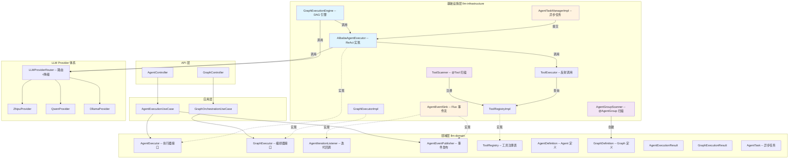
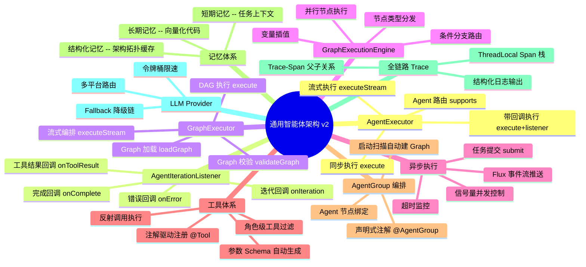
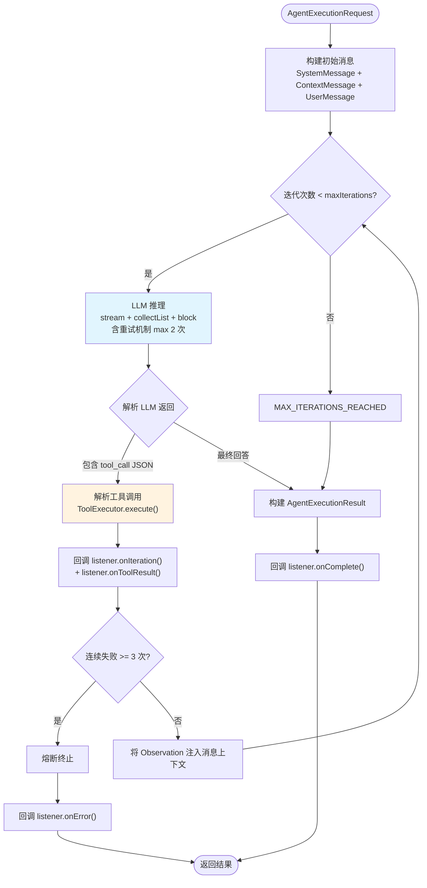
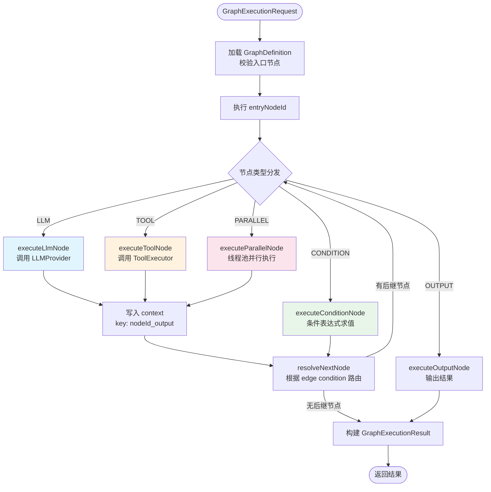
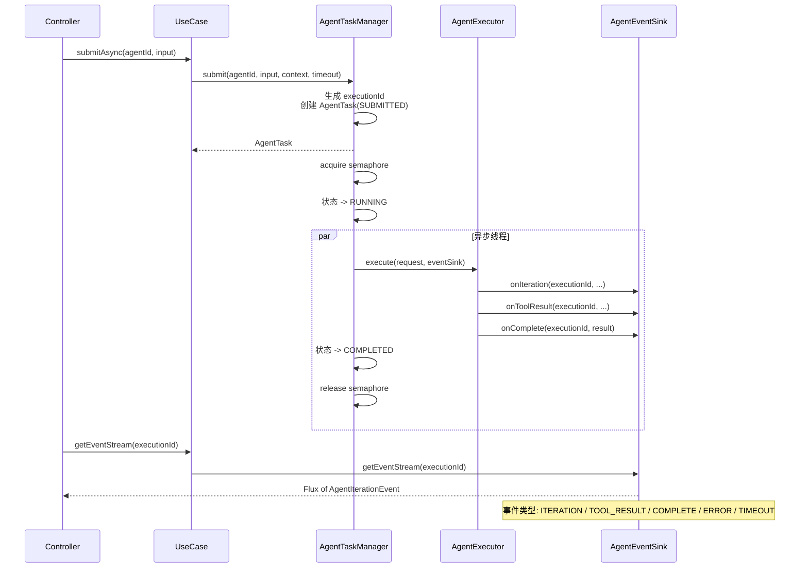
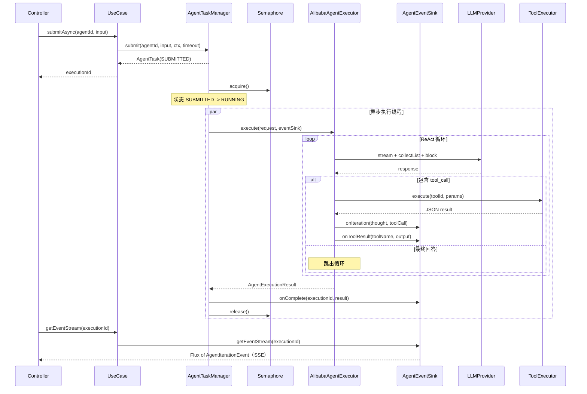
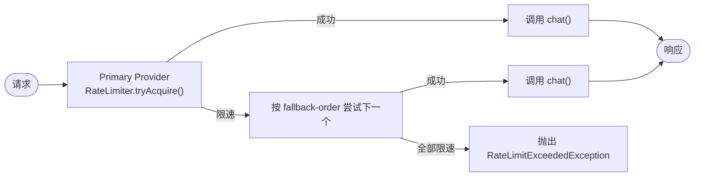

# 功能设计文档

## 变更记录

| 版本 | 日期 | 修改人 | 变更内容摘要 |
|------|------|--------|--------------|
| v1 | 2026-04-04 | | 初始版本，定义通用智能体架构 7 核心环节 |
| v2 | 2026-04-14 | 张凯 | 对齐代码实际实现：AgentExecutor 替代 AgentLoop 设计、新增 AgentIterationListener 回调、Graph DAG 编排引擎、异步执行 + Flux SSE、@Tool 注解驱动注册、AgentGroup 多智能体编排、三级记忆体系、全链路 Trace、LLM Provider 限速降级 |

---

## 1. 基本信息

- 功能名称：通用智能体架构（Generic Agent Architecture）
- 所属系统：llm-orchestration-platform
- 所属模块：llm-domain / llm-infrastructure
- 需求来源：平台需要统一的 Agent 抽象层，支持 ReAct 循环、Graph DAG 编排、异步执行、多智能体协作
- 负责人：张凯
- 版本号：v2

---

## 2. 背景与目标

### 背景

v1 设计提出了 7 核心环节 + 5 个策略接口的蓝图，实际实现过程中架构根据业务需要进行了演进：

1. **AgentExecutor 替代 AgentLoop**：未采用 v1 设计的 AgentLoop + 5 策略接口模式，而是以 `AgentExecutor` 接口 + `AlibabaAgentExecutor` ReAct 实现为核心，配合 `AgentIterationListener` 回调机制
2. **Graph DAG 编排**：新增 `GraphExecutor` + `GraphExecutionEngine`，支持条件分支、并行节点、变量插值
3. **异步执行框架**：`AgentTaskManager` + `AgentEventSink`（Flux 事件流），实现提交-轮询/SSE 推送模式
4. **@Tool 注解驱动**：`ToolScanner` 启动扫描 + `ToolRegistry` 注册，支持角色级工具过滤
5. **AgentGroup 多智能体**：`@AgentGroup` 注解 + `AgentGroupScanner` 自动创建 Graph 并绑定 Agent 节点
6. **三级记忆体系**：短期（任务上下文）、长期（向量化代码）、结构化（架构拓扑缓存），目前结构化记忆已实现

### 目标

- 提供 **Agent 执行 + Graph 编排** 双层执行能力
- 支持 **同步 / 流式 / 异步** 三种执行模式
- **@Tool 注解驱动** 零配置工具注册
- **AgentGroup 声明式** 多智能体编排
- 为记忆体系、Trace、Provider 路由提供统一基础设施

### 与 v1 设计的差异说明

| v1 设计 | v2 实际实现 | 原因 |
|---------|------------|------|
| AgentLoop 主循环接口 | AgentExecutor 接口 | 简化抽象，直接面向执行请求 |
| 5 个策略接口（InputFormatter / Memory / PlanningStrategy / ToolSelector / OutputFormatter） | AgentIterationListener 回调 + ToolRegistry 组合 | 策略拆分粒度过细，实际 ReAct 循环内聚性更好 |
| AlibabaAgentExecutor 委托 ReActLoop | AlibabaAgentExecutor 直接实现 ReAct | 一步到位，无需额外适配器层 |
| 无 Graph 编排 | GraphExecutor + GraphExecutionEngine DAG | 业务需要多 Agent 串行/并行/条件编排 |
| 无异步执行 | AgentTaskManager + AgentEventSink Flux | Agent 执行耗时长，需异步 + SSE 推送 |
| Memory 仅定义接口 | 三级记忆体系（结构化已实现） | DevPlan 场景需要项目画像缓存 |

---

## 3. 功能范围

### 3.1 功能模块总览图



### 3.2 能力分解图



### 3.3 功能范围说明

**已实现：**

1. **AgentExecutor 接口 + AlibabaAgentExecutor ReAct 实现**
2. **AgentIterationListener 迭代回调机制**
3. **GraphExecutor + GraphExecutionEngine DAG 编排**（LLM / TOOL / CONDITION / PARALLEL / MERGE / LOOP / OUTPUT 节点类型）
4. **异步执行框架**：AgentTaskManager 信号量并发 + AgentEventSink Flux 事件流
5. **@Tool 注解驱动注册 + ToolScanner 启动扫描 + ToolExecutor 反射调用**
6. **@AgentGroup 声明式多智能体编排 + AgentGroupScanner 自动建 Graph**
7. **DevPlanTraceRecorder 全链路 Trace**（ThreadLocal Span 栈 + SLF4J 结构化日志）
8. **LLMProviderRouter 限速降级**（Guava RateLimiter + Fallback 链）
9. **三级记忆体系中的结构化记忆**（ProjectArchTopologyRepository）

**未实现 / 待完善：**

- 短期记忆（Redis）和长期记忆（Qdrant 向量检索）
- Planning 策略的具体实现（CoT / ToT）
- Trace 从 DevPlan 专用提升为通用 AgentTraceRecorder
- Agent 监控指标采集（Micrometer）
- Reflexion 自反思策略

---

## 4. 业务流程设计

### 4.1 Agent 执行流程 — ReAct 循环



#### 关键实现细节

| 环节 | 实现方式 | 代码位置 |
|------|---------|---------|
| LLM 调用 | `stream() + collectList() + block()` 消除读超时 | `AlibabaAgentExecutor.callWithRetry()` |
| 工具解析 | JSON 正则提取 tool_call | `AlibabaAgentExecutor.parseAndExecuteTool()` |
| 熔断机制 | 连续 3 次工具执行失败则终止循环 | `AlibabaAgentExecutor.execute()` |
| 重试机制 | LLM 调用失败最多重试 2 次 | `AlibabaAgentExecutor.callWithRetry()` |

### 4.2 Graph DAG 编排流程



#### 节点类型说明

| NodeType | 说明 | 配置项 |
|----------|------|--------|
| LLM | 调用 LLM 推理 | systemPrompt, model, provider |
| TOOL | 执行注册工具 | toolId, input |
| CONDITION | 条件分支，求值后选择 edge | expression |
| PARALLEL | 并行执行多个子节点（线程池 size=4） | childNodes |
| MERGE | 合并并行结果 | - |
| LOOP | 循环节点 | maxIterations, condition |
| OUTPUT | 输出终止节点 | template |

#### 变量插值

节点配置中支持 `${variable}` 和 `{{variable}}` 语法引用上下文变量，前序节点输出以 `{nodeId}_output` 为 key 写入上下文。

### 4.3 异步执行流程



#### 异步配置

| 配置项 | 默认值 | 说明 |
|--------|--------|------|
| `agent.async.maxConcurrent` | 5 | 最大并发 Agent 数（Semaphore） |
| `agent.async.threadPoolSize` | 5 | 线程池大小 |
| `agent.async.executionTimeout` | 120s | 单次执行超时 |
| `agent.async.taskRetainMinutes` | 30 | 任务保留时长 |
| `agent.async.sseTimeout` | 600000ms | SSE 连接超时 |

### 4.4 异常流程

| 异常场景 | 处理策略 | 实现位置 |
|---------|---------|---------|
| LLM 调用失败 | 重试 2 次，失败抛出异常 | `AlibabaAgentExecutor.callWithRetry()` |
| 工具执行失败 | 错误信息作为 Observation 注入上下文，继续循环 | `AlibabaAgentExecutor.parseAndExecuteTool()` |
| 连续工具失败 3 次 | 熔断终止，返回错误结果 | `AlibabaAgentExecutor.execute()` |
| 迭代次数耗尽 | 返回 `MAX_ITERATIONS_REACHED` 状态 | `AlibabaAgentExecutor.execute()` |
| 异步执行超时 | `Future.get(timeout)` 超时，状态设为 `TIMED_OUT` | `AgentTaskManagerImpl` |
| LLM 限速 429 | 抛出 `RateLimitExceededException`，Router 自动 Fallback | `LLMProviderRouter.chatWithFallback()` |

---

## 5. 接口设计

### 5.1 核心接口清单

| 接口全类名 | 所在模块 | 职责 |
|-----------|---------|------|
| `c.e.l.domain.executor.AgentExecutor` | llm-domain | Agent 执行器抽象 |
| `c.e.l.domain.executor.AgentIterationListener` | llm-domain | 迭代事件回调 |
| `c.e.l.domain.executor.GraphExecutor` | llm-domain | Graph 编排执行器 |
| `c.e.l.domain.executor.AgentEventPublisher` | llm-domain | 异步事件发布 |
| `c.e.l.domain.registry.ToolRegistry` | llm-domain | 工具注册表 |
| `c.e.l.domain.service.LLMProvider` | llm-domain | LLM 提供商 |

> `c.e.l` = `com.exceptioncoder.llm`

### 5.2 AgentExecutor 接口

```java
package com.exceptioncoder.llm.domain.executor;

public interface AgentExecutor {

    AgentExecutionResult execute(AgentExecutionRequest request);

    AgentExecutionResult execute(AgentExecutionRequest request,
                                 AgentIterationListener listener);

    Flux<String> executeStream(AgentExecutionRequest request);

    boolean supports(String agentId);
}
```

```java
// 执行请求
public record AgentExecutionRequest(
    String executionId,
    String agentId,
    String userInput,
    Map<String, Object> context,
    boolean stream
) {}
```

### 5.3 AgentIterationListener 接口

```java
package com.exceptioncoder.llm.domain.executor;

public interface AgentIterationListener {

    default void onIteration(String executionId, int iteration,
                             String thought, ToolCall toolCall) {}

    default void onToolResult(String executionId, int iteration,
                              String toolName, String output) {}

    default void onComplete(String executionId,
                            AgentExecutionResult result) {}

    default void onError(String executionId, String errorMessage) {}
}
```

### 5.4 GraphExecutor 接口

```java
package com.exceptioncoder.llm.domain.executor;

public interface GraphExecutor {

    GraphExecutionResult execute(GraphExecutionRequest request);

    Flux<String> executeStream(GraphExecutionRequest request);

    GraphDefinition loadGraph(String graphId);

    void validateGraph(GraphDefinition graph);
}
```

```java
public record GraphExecutionRequest(
    String executionId,
    String graphId,
    Map<String, Object> input,
    boolean stream
) {}
```

### 5.5 AgentEventPublisher 接口

```java
package com.exceptioncoder.llm.domain.executor;

public interface AgentEventPublisher {

    Flux<AgentIterationEvent> getEventStream(String executionId);
}
```

```java
public record AgentIterationEvent(
    String executionId,
    Type type,       // ITERATION, TOOL_RESULT, COMPLETE, ERROR, TIMEOUT
    int iteration,
    String data
) {
    static AgentIterationEvent iteration(...) { ... }
    static AgentIterationEvent toolResult(...) { ... }
    static AgentIterationEvent complete(...) { ... }
    static AgentIterationEvent error(...) { ... }
}
```

### 5.6 ToolRegistry 接口

```java
package com.exceptioncoder.llm.domain.registry;

public interface ToolRegistry {

    void register(ToolDefinition definition, Object implementation);
    void unregister(String toolId);
    Optional<Object> getImplementation(String toolId);
    Optional<ToolDefinition> getDefinition(String toolId);
    List<ToolDefinition> getAllTools();
    List<ToolDefinition> getToolsByType(ToolType type);
    List<ToolDefinition> getToolsByTags(Set<String> tags);
    boolean contains(String toolId);
    int size();
}
```

### 5.7 LLMProvider 接口

```java
package com.exceptioncoder.llm.domain.service;

public interface LLMProvider {

    LLMResponse chat(LLMRequest request);
    Flux<String> chatStream(LLMRequest request);
    String getProviderName();
    boolean supports(String model);
    ChatModel getChatModel();
}
```

---

## 6. 类设计

### 6.1 分层结构

| 层 | 包路径前缀 | 职责 |
|----|-----------|------|
| Domain | `c.e.l.domain.executor` | 执行器 / 编排器 / 回调接口 |
| Domain | `c.e.l.domain.model` | AgentDefinition / GraphDefinition / Result 模型 |
| Domain | `c.e.l.domain.registry` | 工具注册表接口 |
| Domain | `c.e.l.domain.service` | LLMProvider 接口 |
| Infrastructure | `c.e.l.infrastructure.agent.executor` | AlibabaAgentExecutor ReAct 实现 |
| Infrastructure | `c.e.l.infrastructure.agent.graph` | GraphExecutionEngine DAG 引擎 |
| Infrastructure | `c.e.l.infrastructure.agent.tool` | @Tool / ToolScanner / ToolExecutor / ToolRegistryImpl |
| Infrastructure | `c.e.l.infrastructure.agent.task` | AgentTaskManager / AgentEventSink / AgentAsyncConfig |
| Infrastructure | `c.e.l.infrastructure.agent.annotation` | @AgentGroup / AgentGroupScanner |
| Infrastructure | `c.e.l.infrastructure.provider` | LLMProviderRouter / ZhipuProvider / QwenProvider / OllamaProvider |
| Infrastructure | `c.e.l.infrastructure.devplan.trace` | DevPlanTraceRecorder / SpanContext |

### 6.2 核心类清单

| 全类名 | 类型 | 职责说明 |
|--------|------|----------|
| `c.e.l.domain.executor.AgentExecutor` | Interface | Agent 执行器抽象，支持同步/流式/带回调执行 |
| `c.e.l.domain.executor.AgentIterationListener` | Interface | 迭代事件回调（NOOP 默认实现） |
| `c.e.l.domain.executor.GraphExecutor` | Interface | Graph DAG 编排执行器 |
| `c.e.l.domain.executor.AgentEventPublisher` | Interface | 异步事件 Flux 发布 |
| `c.e.l.domain.model.AgentDefinition` | Record | Agent 定义（id/name/systemPrompt/toolIds/provider/model/maxIterations/timeout） |
| `c.e.l.domain.model.AgentExecutionRequest` | Record | 执行请求（executionId/agentId/userInput/context/stream） |
| `c.e.l.domain.model.AgentExecutionResult` | Record | 执行结果（finalOutput/toolCalls/thoughtHistory/iterations/elapsedMs/status） |
| `c.e.l.domain.model.AgentTask` | Record | 异步任务（status: SUBMITTED/RUNNING/COMPLETED/FAILED/TIMED_OUT） |
| `c.e.l.domain.model.AgentIterationEvent` | Record | 迭代事件（type: ITERATION/TOOL_RESULT/COMPLETE/ERROR/TIMEOUT） |
| `c.e.l.domain.model.GraphDefinition` | Record | Graph 定义（nodes/edges/entryNodeId） |
| `c.e.l.domain.model.GraphNode` | Record | 图节点（id/type/name/config） |
| `c.e.l.domain.model.GraphEdge` | Record | 图边（from/to/condition） |
| `c.e.l.domain.model.NodeType` | Enum | LLM/TOOL/CONDITION/MERGE/PARALLEL/LOOP/OUTPUT |
| `c.e.l.domain.model.GraphExecutionResult` | Record | Graph 执行结果（含各节点 NodeExecutionResult） |
| `c.e.l.domain.model.ToolDefinition` | Record | 工具定义（id/name/description/inputSchema/type/roles） |
| `c.e.l.domain.model.ToolCall` | Record | 工具调用记录（toolName/inputJson/output/durationMs/success） |
| `c.e.l.domain.registry.ToolRegistry` | Interface | 工具注册表 |
| `c.e.l.domain.service.LLMProvider` | Interface | LLM 提供商 |
| `c.e.l.infrastructure.agent.executor.AlibabaAgentExecutor` | Class | ReAct 循环实现（stream-collect/重试/熔断） |
| `c.e.l.infrastructure.agent.graph.GraphExecutionEngine` | Class | DAG 执行引擎（节点分发/条件路由/并行执行/变量插值） |
| `c.e.l.infrastructure.agent.graph.GraphExecutorImpl` | Class | GraphExecutor 实现，委托 GraphExecutionEngine |
| `c.e.l.infrastructure.agent.tool.Tool` | Annotation | 工具注解（name/description/tags/roles） |
| `c.e.l.infrastructure.agent.tool.ToolParam` | Annotation | 工具参数注解（description/required/defaultValue） |
| `c.e.l.infrastructure.agent.tool.ToolScanner` | Class | @Order(1)，启动扫描 @Tool 注解方法，自动注册 |
| `c.e.l.infrastructure.agent.tool.ToolExecutor` | Class | 反射调用工具方法，返回 JSON 结果 |
| `c.e.l.infrastructure.agent.tool.ToolRegistryImpl` | Class | ConcurrentHashMap 工具注册表实现 |
| `c.e.l.infrastructure.agent.task.AgentTaskManagerImpl` | Class | 异步任务管理（Semaphore 并发/线程池/超时监控） |
| `c.e.l.infrastructure.agent.task.AgentEventSink` | Class | Flux Sinks.Many 事件流（实现 Listener + Publisher 双接口） |
| `c.e.l.infrastructure.agent.task.AgentAsyncConfig` | Class | 异步配置（maxConcurrent/threadPoolSize/timeout） |
| `c.e.l.infrastructure.agent.annotation.AgentGroup` | Annotation | 智能体组注解（id/name/description） |
| `c.e.l.infrastructure.agent.annotation.AgentGroupScanner` | Class | @Order(200)，扫描 @AgentGroup 自动建 Graph + 绑定 Agent 节点 |
| `c.e.l.infrastructure.provider.LLMProviderRouter` | Class | 多 Provider 路由 + RateLimiter 限速 + Fallback 降级 |
| `c.e.l.infrastructure.provider.ZhipuProvider` | Class | 智谱 AI Provider（OpenAI 兼容协议） |
| `c.e.l.infrastructure.provider.QwenProvider` | Class | 阿里百炼 Provider（DashScope 协议） |
| `c.e.l.infrastructure.provider.OllamaProvider` | Class | Ollama 本地模型 Provider |
| `c.e.l.infrastructure.devplan.trace.DevPlanTraceRecorder` | Class | ThreadLocal Span 栈 + 结构化日志 |
| `c.e.l.infrastructure.devplan.trace.SpanContext` | Record | Trace/Span 上下文（traceId/spanId/parentSpanId/attributes） |

### 6.3 启动顺序

| 顺序 | 组件 | @Order | 说明 |
|------|------|--------|------|
| 1 | ToolScanner | @Order(1) | 扫描 @Tool 注解，注册工具到 ToolRegistry |
| 2 | AgentGroupScanner | @Order(200) | 扫描 @AgentGroup，创建 Graph + 绑定 Agent 节点 |
| 3 | 各 Initializer | @Order(300+) | DevPlanAgentInitializer 等，写入 Agent 定义到数据库 |

### 6.4 Agent 执行时序（带异步 + 回调）



---

## 7. 数据库设计

本架构层复用现有数据库表：

| 表 | 用途 |
|---|------|
| `agent_definition` | Agent 定义持久化（由 Initializer 写入） |
| `graph_definition` | Graph 定义持久化（由 AgentGroupScanner 写入） |
| `execution_trace` | 执行追踪记录 |

`AgentTask` 当前为内存态（ConcurrentHashMap），不持久化。

---

## 8. 核心业务规则

| 编号 | 规则 | 实现方式 |
|------|------|---------|
| R1 | 循环必须在 maxIterations 或 timeout 内终止 | AlibabaAgentExecutor 迭代计数 + AgentTaskManager Future.get(timeout) |
| R2 | 连续 3 次工具执行失败触发熔断 | AlibabaAgentExecutor consecutiveFailures 计数器 |
| R3 | LLM 调用使用 stream-collect 模式消除读超时 | `chatModel.stream().collectList().block()` |
| R4 | LLM 调用失败最多重试 2 次 | `callWithRetry(chatModel, messages, iteration)` |
| R5 | 异步执行并发数受信号量控制 | `Semaphore(maxConcurrent)` |
| R6 | 工具注册在 Agent 初始化之前完成 | ToolScanner @Order(1) < AgentGroupScanner @Order(200) |
| R7 | Graph 节点输出以 nodeId_output 为 key 写入上下文 | GraphExecutionEngine.executeNode() |
| R8 | 条件节点支持字符串相等和布尔值匹配 | GraphExecutionEngine.resolveNextNode() |
| R9 | Provider 限速超限时自动 Fallback 到下一个 Provider | LLMProviderRouter.chatWithFallback() |
| R10 | AgentEventSink 完成后自动清理 Sink 防止内存泄漏 | AgentEventSink.onComplete() / onError() |

---

## 9. LLM Provider 路由与降级

### 9.1 Provider 体系

| Provider | 实现类 | 协议 | 用途 |
|---|---|---|---|
| 智谱 AI（GLM） | ZhipuProvider | OpenAI 兼容 | Chat + Embedding，默认主 Provider |
| 阿里百炼（Qwen/DeepSeek） | QwenProvider | DashScope | Chat，降级备选 |
| Ollama | OllamaProvider | Ollama 原生 | 本地模型 |

### 9.2 限速与降级流程



### 9.3 关键配置

```yaml
llm:
  default-provider: zhipu
  default-model: glm-5.1
  fallback-order: [zhipu, alibaba]
  zhipu:
    rate-limit:
      rpm: 60    # 每分钟请求上限，0 = 无限制
  alibaba:
    rate-limit:
      rpm: 30
```

---

## 10. Trace 与可观测性

### 10.1 当前实现（DevPlanTraceRecorder）

- **ThreadLocal Span 栈**：自动维护父子关系
- **ConcurrentHashMap**：traceId → List of SpanContext
- **SLF4J 结构化日志**：含 traceId / spanId / name / elapsedMs
- **手动清理**：`cleanupTrace(traceId)` 防止内存泄漏

### 10.2 演进方向

- 从 DevPlan 专用提升为通用 `AgentTraceRecorder`
- 预留 OpenTelemetry 适配层
- Micrometer 指标采集：`agent.executions.total` / `agent.executions.duration`

---

## 11. 记忆体系

### 11.1 三级架构

| 层级 | 名称 | 存储 | 状态 |
|------|------|------|------|
| L1 | 短期记忆 | Redis（当前任务上下文） | 未实现（占位） |
| L2 | 长期记忆 | Qdrant 向量检索（代码片段） | 未实现（占位） |
| L3 | 结构化记忆 | PostgreSQL（架构拓扑缓存） | 已实现 |

### 11.2 接口

```java
package com.exceptioncoder.llm.domain.devplan.service;

public interface DevPlanMemoryManager {
    Map<String, Object> loadContext(String taskId, String query);
    void persist(String taskId, DevPlanState state);
    ArchTopology getCachedTopology(String projectPath);
    List<String> searchRelevantCode(String query, int topK);
}
```

---

## 12. 风险点与待确认事项

| 风险点 | 说明 | 状态 |
|--------|------|------|
| Trace 通用化 | DevPlanTraceRecorder 目前仅 devplan 使用，需提升为平台级 | 待实施 |
| 短期/长期记忆 | L1/L2 层仍为占位实现 | 待实施 |
| AgentTask 内存态 | 重启丢失，生产环境需持久化 | 已知 |
| Graph 并行节点线程池 | 固定 4 线程，大规模并行可能瓶颈 | 待评估 |
| Planning 策略 | 仅 NoOp，复杂任务规划能力缺失 | 待实施 |
| Agent 监控指标 | 未接入 Micrometer | 待实施 |
