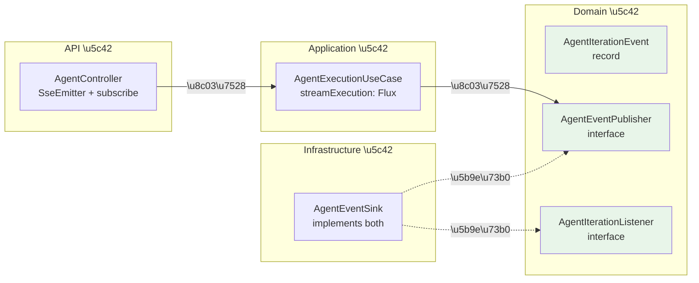

# DDD 实践案例：SSE 推送的分层归属决策

> 一次真实的架构纠偏过程 —— 从"能跑就行"到"分层正确"，
> 记录 Agent 异步执行功能开发中关于 SSE 推送该放在哪一层的三轮决策与最终方案。

---

## 1. 背景

在为 Agent 执行引入异步机制（异步提交 + 状态轮询 + SSE 实时推送）时，遇到一个看似简单的问题：

**Controller 需要把 Agent 每轮迭代的事件推送给前端，SSE 的管理逻辑该放在哪一层？**

项目采用 DDD-lite 分层架构，模块间依赖关系为：

```
llm-api → llm-application → llm-domain ← llm-infrastructure
```

`llm-starter` 在运行时聚合所有模块，但**编译期**各模块只能引用其直接依赖。

---

## 2. 三轮方案演进

### 2.1 方案 A（第一版）—— API 直接依赖 Infrastructure

**做法：** `llm-api` 的 `pom.xml` 新增 `llm-infrastructure` 依赖，Controller 直接注入 `AgentSseManager`（Infrastructure 层类）和 `AgentAsyncConfig`。

```
llm-api → llm-infrastructure  ← 新增的跨层依赖
```

```java
// AgentController.java — 方案 A
public class AgentController {
    private final AgentSseManager agentSseManager;       // infrastructure 类
    private final AgentAsyncConfig agentAsyncConfig;      // infrastructure 类

    @GetMapping("/executions/{id}/stream")
    public SseEmitter stream(@PathVariable String id) {
        SseEmitter emitter = new SseEmitter(agentAsyncConfig.getSseTimeout());
        agentSseManager.register(id, emitter);  // 直接调 infrastructure
        return emitter;
    }
}
```

**问题：**

| 维度 | 分析 |
|------|------|
| 依赖方向 | `api → infrastructure` 打破了 DDD 单向依赖规则 |
| 传播风险 | 一旦开了口子，后续 Controller 都可能随意引用 infrastructure 类 |
| 替换成本 | 如果将来 SSE 换成 WebSocket，需要同时改 infrastructure + api 两层 |

**结论：能跑，但架构不干净。**

---

### 2.2 方案 C（中间探索）—— Domain 层定义 SseEmitter 接口

**做法：** 在 Domain 层定义 `AgentSseRegistry` 接口，方法签名包含 `SseEmitter` 参数。

```java
// 尝试放在 domain 层 —— 编译失败
package com.exceptioncoder.llm.domain.executor;

import org.springframework.web.servlet.mvc.method.annotation.SseEmitter;

public interface AgentSseRegistry {
    void register(String executionId, SseEmitter emitter);
}
```

**立刻失败**：`llm-domain` 没有 `spring-web` 依赖，`SseEmitter` 无法解析。

这暴露了一个更深层的问题：**`SseEmitter` 是传输协议的技术细节，根本不属于领域概念。** 把它放进 Domain 层，等于让领域模型绑定了 HTTP/SSE 这一具体传输方式。

**结论：方向错误，Domain 层不应出现任何传输协议类型。**

---

### 2.3 方案 B（最终方案）—— Domain 定义事件模型 + Flux 流

**核心思想：** 领域层只定义**事件是什么**（`AgentIterationEvent`）和**事件从哪里来**（`AgentEventPublisher`），不关心**事件怎么送达客户端**。

```
Domain 层：定义 AgentIterationEvent（事件模型）+ AgentEventPublisher（Flux 流接口）
Infrastructure 层：AgentEventSink 实现两个接口（Sinks.Many 发布-订阅）
Application 层：AgentExecutionUseCase 暴露 streamExecution() 返回 Flux
API 层：Controller 消费 Flux，自行适配到 SseEmitter
```



**各层代码：**

```java
// Domain 层 —— 事件模型（不依赖任何框架）
public record AgentIterationEvent(
    String executionId,
    Type type,          // ITERATION / TOOL_RESULT / COMPLETE / ERROR
    int iteration,
    String data         // JSON 字符串
) { }

// Domain 层 —— 事件流接口（只依赖 reactor-core）
public interface AgentEventPublisher {
    Flux<AgentIterationEvent> getEventStream(String executionId);
}
```

```java
// Infrastructure 层 —— 同时实现写入端和读取端
@Component
public class AgentEventSink implements AgentIterationListener, AgentEventPublisher {
    private final ConcurrentHashMap<String, Sinks.Many<AgentIterationEvent>> sinks = new ConcurrentHashMap<>();

    @Override
    public Flux<AgentIterationEvent> getEventStream(String executionId) {
        return sinks.computeIfAbsent(executionId,
            k -> Sinks.many().multicast().onBackpressureBuffer()).asFlux();
    }

    @Override
    public void onIteration(String executionId, int iteration, String thought, ToolCall toolCall) {
        emit(executionId, AgentIterationEvent.iteration(executionId, iteration, toJson(...)));
    }
    // ... onComplete, onError 类似
}
```

```java
// Application 层 —— 只暴露 Flux，不知道 SSE/WebSocket
public Flux<AgentIterationEvent> streamExecution(String executionId) {
    return agentEventPublisher.getEventStream(executionId);
}
```

```java
// API 层 —— 消费 Flux，适配到 SseEmitter（纯协议处理）
@GetMapping(value = "/executions/{id}/stream", produces = TEXT_EVENT_STREAM_VALUE)
public SseEmitter stream(@PathVariable String id) {
    SseEmitter emitter = new SseEmitter(sseTimeout);
    agentExecutionUseCase.streamExecution(id)
        .subscribe(
            event -> emitter.send(SseEmitter.event()
                .name(event.type().name().toLowerCase())
                .data(event.data())),
            error -> emitter.completeWithError(error),
            () -> { emitter.send("[DONE]"); emitter.complete(); }
        );
    return emitter;
}
```

---

## 3. 三方案对比

| 维度 | 方案 A（API \u2192 Infra） | 方案 C（Domain + SseEmitter） | 方案 B（Domain Event + Flux） |
|------|--------------------------|------------------------------|-------------------------------|
| **依赖方向** | api \u2192 infrastructure 跨层 | 编译失败 | 严格单向 |
| **Domain 纯净度** | Domain 未被污染 | Domain 引入 spring-web | Domain 只依赖 reactor-core |
| **传输协议耦合** | Controller 与 SSE 管理器强绑定 | - | Controller 自行适配，可随时换 WebSocket |
| **可测试性** | 需 mock infrastructure 类 | - | UseCase 返回 Flux，单测只需验证事件序列 |
| **改动量** | 最少（1 个 pom + 2 个注入） | - | 中等（2 domain + 1 infra + 2 改造） |
| **项目一致性** | 破坏现有分层规则 | - | 与 ChatController 的 Flux 模式一致 |

---

## 4. 决策过程中的关键认知

### 4.1 "能跑" \u2260 "正确"

方案 A 在功能上完全可行。`llm-starter` 在运行时聚合了所有模块，Spring 容器能正确注入 Bean。加一行 pom 依赖就能编译通过。

但 DDD 分层的价值不在于"让代码跑起来"，而在于**通过编译期约束防止架构腐化**。一旦 `api \u2192 infrastructure` 的口子打开，后续开发者没有动力也没有手段阻止更多的跨层引用。

### 4.2 技术细节不是领域概念

方案 C 犯的错误是把传输协议（`SseEmitter`）当成了领域概念。Domain 层的接口签名应该表达**业务意图**：

```
\u2717 void register(String executionId, SseEmitter emitter)    // \u201c注册一个 SSE 连接\u201d —— 技术细节
\u2713 Flux<AgentIterationEvent> getEventStream(String id)     // \u201c获取执行事件流\u201d —— 业务意图
```

### 4.3 Reactor Flux 为什么可以出现在 Domain 层

`reactor-core` 是 **通用的响应式编程库**，提供的是数据流的抽象能力（类似 `java.util.stream.Stream`），不绑定任何 Web 框架或传输协议。项目的 `llm-domain/pom.xml` 已经依赖了 `reactor-core`，且现有 `AgentExecutor` 接口已经在用 `Flux<String>`。

与之对比：
- `SseEmitter` 绑定了 Spring MVC + HTTP/SSE 协议 —— **不该出现在 Domain 层**
- `Flux<T>` 只表达"一个异步数据序列" —— **可以出现在 Domain 层**

### 4.4 分层的实际判断标准

当不确定某个类型该不该出现在某一层时，问自己一个问题：

> **如果我把传输协议从 HTTP/SSE 换成 gRPC/WebSocket，这个接口签名需要改吗？**

- `void register(SseEmitter)` — 需要改 \u2192 不该放在 Domain/Application 层
- `Flux<AgentIterationEvent> getEventStream()` — 不需要改 \u2192 可以放

---

## 5. 项目中的验证

方案 B 最终实现后，`llm-api/pom.xml` **不需要**依赖 `llm-infrastructure`：

```xml
<!-- llm-api/pom.xml —— 只依赖 application -->
<dependency>
    <groupId>com.exceptioncoder</groupId>
    <artifactId>llm-application</artifactId>
</dependency>
```

依赖关系回归正轨：

```
llm-api → llm-application → llm-domain ← llm-infrastructure
```

Controller 中不存在任何 `com.exceptioncoder.llm.infrastructure.*` 的 import。

---

## 6. 总结：DDD 分层实操清单

| 场景 | 正确做法 | 常见误区 |
|------|---------|---------|
| 需要从 Infrastructure 推数据到 API 层 | Domain 定义事件模型 + 流接口，Infra 实现，API 消费 | API 直接注入 Infra Bean |
| Domain 接口需要 Spring Web 类型 | 说明抽象层级不对，用通用类型替代 | 给 Domain 加 spring-web 依赖 |
| "只是加一行 pom 就能解决" | 停下来想：这行 pom 打破了什么约束？ | 加了再说，反正能跑 |
| 不确定类型该放哪一层 | "换传输协议后签名变不变" 判断法 | 凭感觉放 |
| 项目里已有类似模式 | 对齐已有风格（本项目 ChatController 已用 Flux） | 每次发明新模式 |
